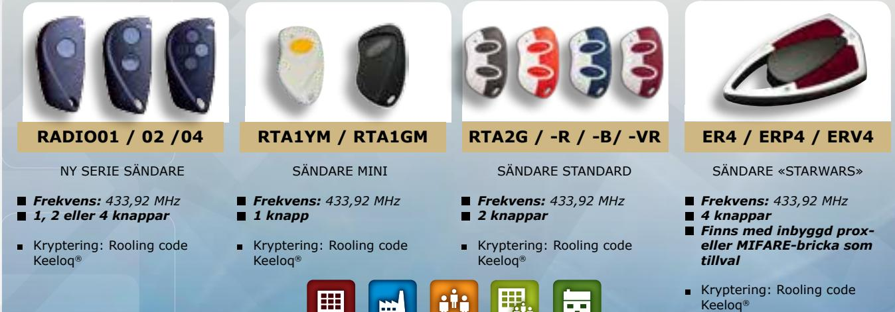

## e l

# RRA100-2XPL

RADIOMOTTAGARE MED LCD-DISPLAY OCH TVÅ RELÄUTGÅNGAR

> The installer's choice cdvi.se

### *UNIK RADIOMOTTAGARE MED LCD-DISPLAY FÖR DÖRRAR, GRINDAR, UTOMHUSBELYSNING, ...*

### **RRA100-2XPL**

- *> Enkel programmering via LCD-display*
- *> Krypterad kommunikation med Keeloq rolling code. Över 18,5 trilijoner kombinationer*
- *> Två reläutgångar, 1 N/O, 1 NO eller NC*
- *> Max belastning 24W eller 24VA*
- *> Kan hantera upp till 100 sändare*
- *> En sändare kan aktivera en eller båda reläerna med en knapptryckning*
- *> Båda reläerna har tre funktioner: pulsfunktion (monostabil) ON/OFF (bistabil/växlande) Tidsstyrning 1 sekund till 25 timmar*
- *> Mått: 105x45x28mm*
- *> 12/24 VAC/DC*

#### *PASSAR RADIOSÄNDARE **

Public Buildnings

Commercial Industrial

Multi-tenant Residential occupancy

**CDVI** Sweden AB Datavägen 12B 43632 ASKIM (GÖTEBORG)

Tel: +46 (0)31 760 19 30

*cdvigroup.com cdvi.se*