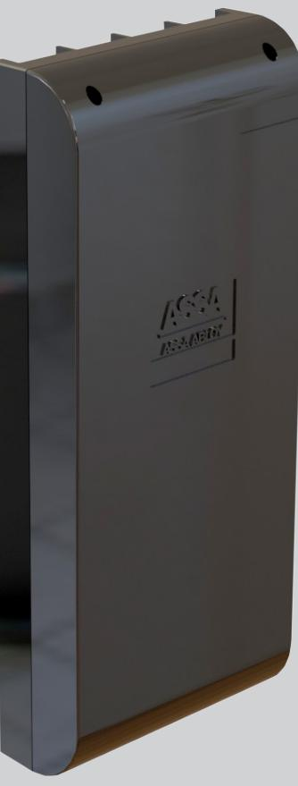
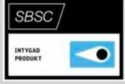
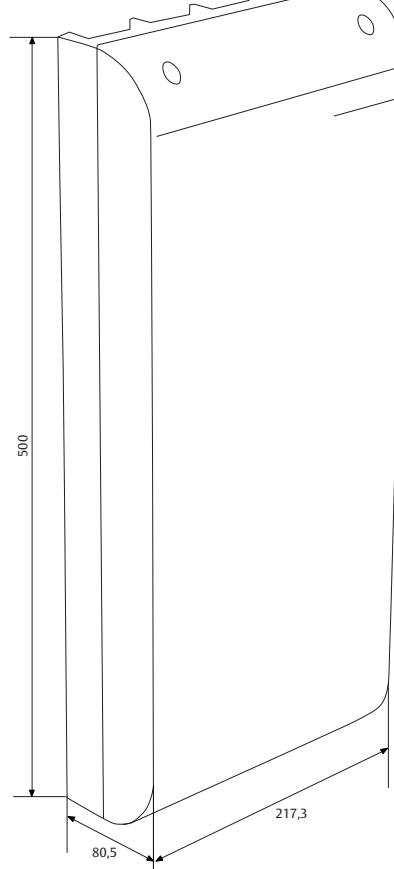

# LCU9016III

ASSA ABLOY, the global leader in door opening solutions

# **LCU9016III i grundutförande för passerkontroll**

LCU9016III är en centralenhet för ASSA ARX-systemet och kan anslutas direkt till befintligt TCP/IP-nätverk. LCU9016III användersig av dynamisk IP-adress, kommunicerar med protokollet SSL/

TLS och byter automatiskt till kundunika kryptonycklar i samband med installation. Centralen har plats för upp till 16 dörrmiljöer. Centralen kan hantera över 100 000 kort och i praktiken obegränsat antal scheman, kalendrar, dagtyper etc. Mer än 30 000 logghändelser kan sparas lokalt innan dessa behöver överföras till ASSA ARX-servern. Centralen arbetar autonomt, det vill säga den fungerar även om nätverket är nere eller servern inte är igång. Programvaran lagras i flashminne och kan uppdateras från ASSA ARX-servern.

I grundutförande är LCU9016III bestyckad med ett loopkort för anslutning av 4 stycken DAC, PCR eller DBL (PCR och DBL är inte godkända larmenheter). Centralen kan enkelt byggas ut med upp till ytterligare tre loopkort. LCU9016III har även en separat logghändelsefil för larmrelaterade händelser. Om sabotageskydd önskas till ett externt system, kan man installera antingen ett sabotagekort eller ett reläsabotagekort till LCU9016III. (Se separta produktblad).

### **LCU9016III för godkänd larmhantering (klass3/4)**

Vid användning av funktionen larm i ARX bestyckas LCU9016III med ARX larmkomponenterna 9016III MIOSlave eller 9016III MIO6-6 samt LCUIII-BS01(för larmklass ¾). Via 9016III MIO6-6- kortet kan slavcentraler, manöverpaneler eller larmenheter kopplas till LCU9016III via ASSA-SIO buss. LCU9016III med monterat masterkort 9016III MIO6-6 kan hantera sex larmsektioner och med larm interface (LIF01) kan även larmöverföring hanteras i klartext via SIA-protokollet till larmsändare. För flera sektioner och larmområden ansluts LCU9016III med MIO-Slave, SIO-enheter och vid behov ASSA Pando Display (som MAP) via SIO-bussen. Upp till 16 SIOenheter (Secure Input/Output) kan anslutas lokalt till en 9016III-central. ASSA Pando Display ansluten till DAC agerar både som MAP och läsare.

ASSA SIO-bus är en för larmsystemet unik AES 128-bitars krypterad buss.

# LCU9016III

ASSA ABLOY, the global leader in door opening solutions

#### **Data**

- Matningsspänning 17 40 V DC
- Programminne 16 Mb
- Strömförbrukning 100mA
- Dataminne 16 Mb
- Vikt 3,0 kg
- Temperaturområde -10°C till +40°C
- Relativ fuktighet 20-70%
- Reläsystemutgång
- 2 USB anslutningar
- Larmgodkänd: SSF 1014,utgåva 4 Larmklass 3/4 För larmklass 3/4 krävs borrskydd LCUIII-BS01
- SBSC-intyg 16-130
- För larmgodkännande krävs LCU9016III i version H eller senare

#### **Artikelnummer**

# **Tillbehör till 9016III utan larmgodkänande**

| • 4014LC S554 014 184 E58 760 23 |
|----------------------------------------|
|----------------------------------------|

- Relä-Sabotagekort S559 017 5160 E58 705 31
- Sabotagekontakt S559 017 4160 E58 705 30

# **Tillbehör till 9016III med larmgodkänande**

| • 9016III MIO6-6    | S559 016 4160 | E58 703 46 |
|---------------------|---------------|------------|
| • 9016III MIO-Slave | S559 016 5162 | E58 703 47 |
| • LCUIII-BS01       | S559 010 1131 | E58 703 88 |

ASSA ABLOY is the global leader in door opening solutions, dedicated to satisfying end-user needs for security, safety and convenience

ASSA AB P.O. Box 371 SE-631 05 Eskilstuna Sweden Phone +46 (0)16 17 70 00

Fax +46 (0)16 17 70 49 Customer support: phone intl. +46 (0)16 17 71 00 Phone nat. 0771-640 640 Fax +46 (0)16 17 73 72 e-mail: helpdesk.marknad@assaabloy.com

www.assa.se

