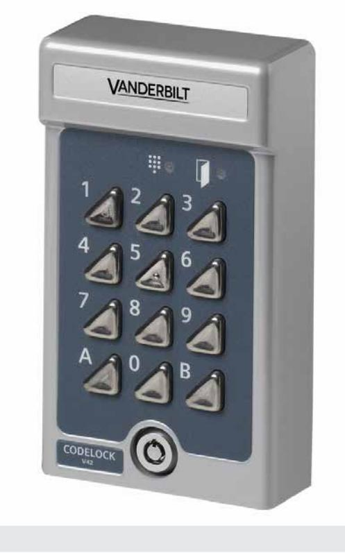
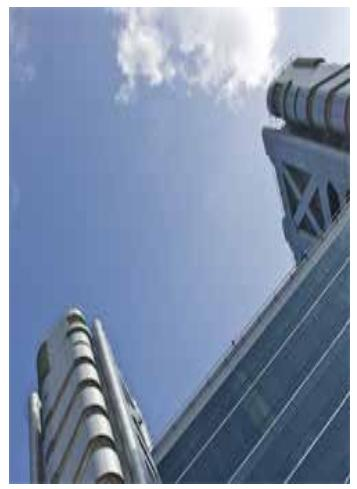

## Codelock

## Access Control

- **One lock with two codes**
- **Sturdy construction for outdoor and indoor use**
- **Best selling codelock in the world**

The V42 is the best-selling codelock in the world. It is compact and easy to use with a modern design that is suitable for either indoor or outdoor mounting. The V42 has a capacity of two four-digit codes. One can be used by residents while the other is used by the property care taker, for example. All settings are made directly in the unit.

## **Technical Data**

|                        | V42                                                                                        |  |  |
|------------------------|--------------------------------------------------------------------------------------------|--|--|
| Operating voltage      | 12 to 24 VAC/DC                                                                            |  |  |
| Current consumption    | 8 mA in standby                                                                            |  |  |
| Inputs                 | Exit button requests with delay. Two separate for code disable.                            |  |  |
| Outputs                | Voltage-free relay contact, max. 1 A, 28 VDC.                                              |  |  |
| Opening time           | 1–30 sec.                                                                                  |  |  |
| Door capacity          | 1                                                                                          |  |  |
| Code capacity          | Two four-digit codes                                                                       |  |  |
| Operating temperature  | -35 to +55 °C                                                                              |  |  |
| Environment            | Indoor or outdoor use (IP54 design). In very exposed locations, use SH2 or SH1 rain cover. |  |  |
| IP rating              | IP54                                                                                       |  |  |
| Housing                | Cast metal with stainless steel buttons and security lock                                  |  |  |
| Colour                 | Grey                                                                                       |  |  |
| Dimensions (W x H x D) | 80 x 140 x 40 mm                                                                           |  |  |

## **Details for ordering**

| Type | Part no         | Designation             | Weight  |
|------|-----------------|-------------------------|---------|
| V42  | V24246-C3552-A1 | Codelock with two codes | 0.72 kg |

The information in this document contains general descriptions of technical options available, which do not always have to be present in individual cases. The required features should therefore be specified in each individual case at the time of closing the contract.

© Vanderbilt International (IRL) Ltd. • Document no. A-100190-1 • Edition: 2015-06-15 • Document version: 1.0

Vanderbilt International (IRL) Ltd. Clonshaugh Business and Technology Park Clonshaugh Dublin 17 Ireland

www.vanderbiltindustries.com