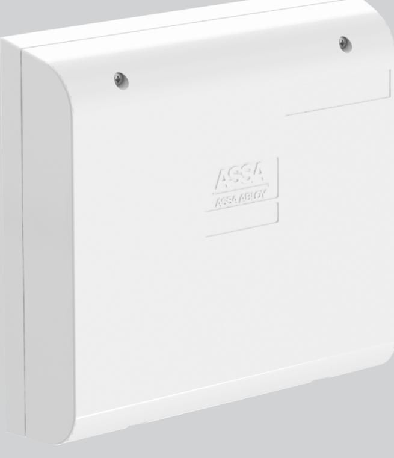
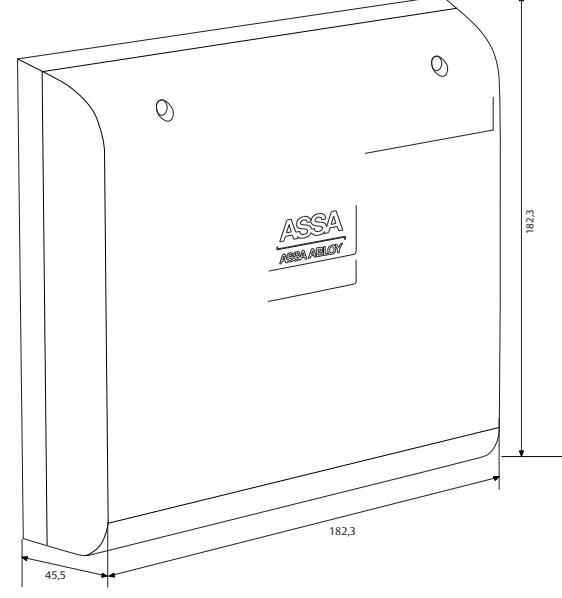

## ASSA DAC564III

ASSA ABLOY, the global leader in door opening solutions

### Dörrkontrollenhet

DAC564III är både en kommunikationsenhet och en intelligent kopplingsplint avsedd att monteras vid varje dörrmiljö. Till varje enhet kan ellås, motorlås, läsare, och öppnaknapp anslutas.

DAC564III är en Hi-O-enhet som kan anslutas till en Hi-Obuss, men den kan även användas som en traditionell DAC och då anslutas till enheter som inte är Hi-O-enheter, som läsare, ellås och öppnaknapp. Hi-O innebär att enheterna har en inbyggd processor och kommunicerar med varandra.

Med hjälp av Hi-O kan varje enhet erbjuda intelligent driftövervakning i realtid. DAC564III har inbyggd motorlåsstyrning för Hi-O-motorlås. DAC564III har tre ingångar som kan användas som dubbelbalanserade ingångar. Dessa kan användas för att kopplas till triggerfunktionen i ASSA ARX, eller användas ihop med ett ASSA ARX-system som är integrerat med Galaxy inbrottslarm.

# ASSA DAC564III

## Dörrkontrollenhet

ASSA ABLOY, the global leader in door opening solutions

### **Kapsling**

- Slagtålig PC/ABS-plast
#### **Reläfunktioner DAC564III**

- Tidsstyrd utgång
- Summer
- Temporär larmförbikoppling
- Dörrautomatik
- Dörrbladets läge
- Elslutbleck
- Temporär larmförbikoppling som inte faller vid dörr öppen för länge
- Sabotage
- Permanent larmförbikoppling
- Förlarm för larmförbikoppling
- Spegla blockeringsingång i zon
- Balanserad UT/SAB
- Balanserad UT/LARM
- Handikappsutgång
- Ovillkorlig summerutgång
- Dörrautomatik med IR/Radar
- Utpassering
- Inpassering
- Ogiltigt kort/kod

#### **Data**

- Matningsspänning: 12-24 V AC/DC
- Maximal strömförbrukning: 12 V DC 55 mA 24 V DC 40 mA Antal ingångar: 6 (3 st fria dubbelbalanserade, 1st för öppnaknapp, 1 st för dörrövervakning, 1st som blockeringsingång) Antal utgångar: 8 (1 st LFK, 1 st ellåsstyrning, 4st konfigurerings bara, 1 st larmstyrning, 1 st schemastyrd)

| • Vikt: | 200 g |
|---------|-------|
|         |       |

• Temperaturområde: +5°C till +40°C

- (ej kondenserande)
#### **Artikelnummer**

- DAC564III S556 656 3085 E58 703 98
#### **Läsarteknologier som hanteras**

- EM4102, Mifare, CL/DATA (Magnet), Wiegand

ASSA AB P.O. Box 371 SE-631 05 Eskilstuna

Sweden

www.assa.se

Phone +46 (0)16 17 70 00 Fax +46 (0)16 17 70 49 Customer support: phone intl. +46 (0)16 17 71 00 Phone nat. 0771-640 640 Fax +46 (0)16 17 73 72

ASSA ABLOY is the global leader in door opening solutions, dedicated to satisfying end-user needs for security, safety and convenience