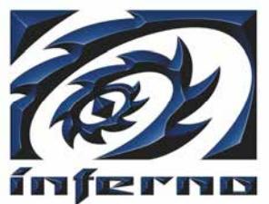
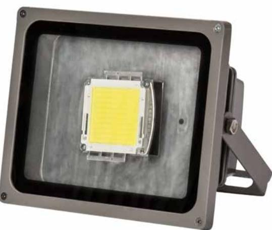

## Inferno Strobocop LED

Ljusbarriär

Inferno Strobocop LED är nästa generations ljuslarm. Den skapar ett förblindande och intensivt blixtljus som gör det omöjligt för inkräktaren att se. Inferno Strobocop LED är utrustat med ett oregelbundet blixtmönster för att chocka och disorientera.

Inferno Strobocop LED kombineras med fördel med Inferno Ljudbarriärer för maximal effekt, men kan även användas som enskild säkerhetsutrustning. Det som tidigare var klart och tydligt blir omedelbart osäkert och otydligt.

Närvaron av en aktiv Inferno Strobocop LED försvårar brottslig aktivitet under de minuter som förlöper mellan utlöst larm och vaktbolagets eller polisens ankomst. Uppgiften är att skydda platsen under denna kritiska tidsperiod.

Det patenterade oregelbundna blixtljuset försämrar avstå nds bedömningen och orienteringsförmågan. I det mörka utrymmet är det svårt att framgångsrikt fullfölja inbrottet.

| Blixtintensitet | 7 - 12 blixtar/s, oregelbundet         |
|-----------------|----------------------------------------|
| Storlek         | B = 225 mm H = 185 mm D = 145 mm |
| Vikt            | 1,5 kg                                 |
| Kraft           | 12 V, 36 W                             |
| IP              | IP 65                                  |

## Indusec AB

Kampementsgatan 30 115 38 Stockholm Tel: 08 4461830, Fax: 08 4461831 E-mail: info@inferno.se www.inferno.se

Indusec är världsledande på högeffektiva och avancerade audio– och ljusprodukter för säkerhetsmarknaden. Inferno Ljudbarriär och Inferno Ljusbarriär installeras på de platser eller objekt där ett högt skydd är önskvärt.

- Intensivt oregelbundet blixtljus
- Svårt att se svårt att ta
- Försvårar orienteringsförmågan
- Kan anslutas till alla fabrikat och typer av larmsystem