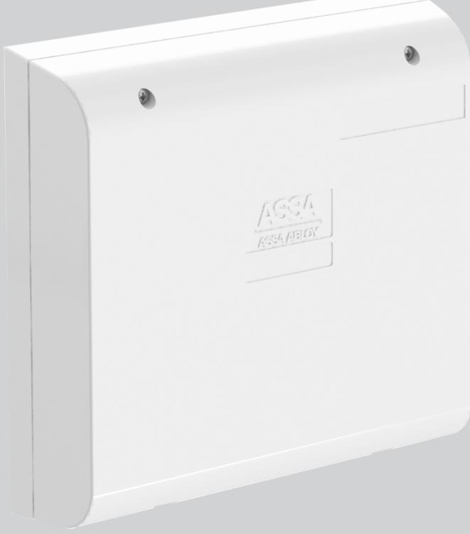
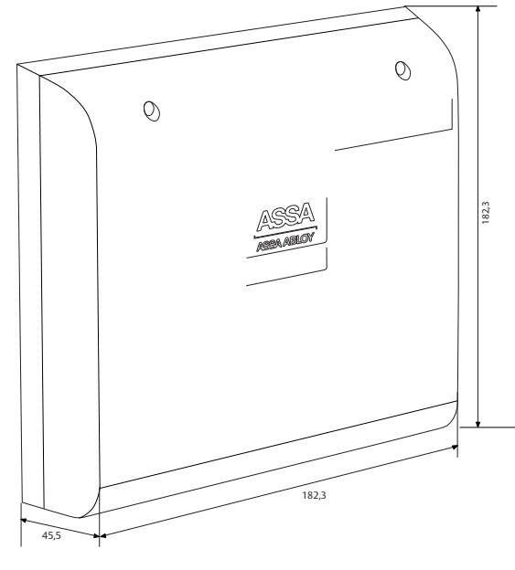
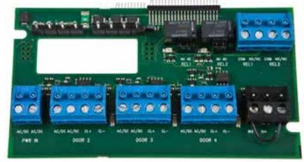
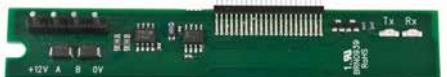
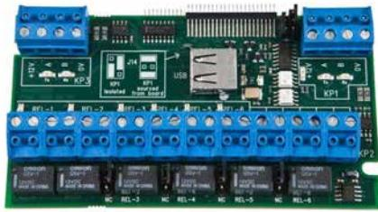

# ASSA LCU9101

## Endörrscentral med möjlighet för utbyggnad av upp till 16 dörrar

ASSA ABLOY, the global leader in door opening solutions

LCU9101 är en centralenhet för ARX-systemet som ansluts direkt till befintligt TCP/IP-nätverk. LCU9101 hanterar läsare för in- respektive utpassage och direktstyrda motorlås ur ASSAs och ABLOYs sortiment.

LCU9101 kan spänningsmatas separat eller direkt via PoE (Power over Ethernet). PoE förenklar installationen eftersom inget separat kablage från strömförsörjningen behöver dras fram till centralenheten. Med PoE-spänning matas centralenheten via Ethernetanslutningen.

I grundutförande är LCU9101 utrustad för att hantera en dörrmiljö inklusive läsarens öppnaknapp, ellås eller motorlås. Till den första dörrmiljön kopplas kortläsare alternativt DBL direkt till centralenheten.

Till centralenhet LCU9101 kan ett tilläggskort 9101D3 anslutas. Detta kort kan hantera ytterligare tre stycken dörrmiljöer via DAC, DBL eller PCR. Vilket innebär max 4 dörrmiljöer på en LCU9101.

Som ett nästa steg i utbyggnaden av en LCU9101 kan ytterligare ett tilläggskort anslutas till 9101D3 - loopkort 9101D3A. Till detta kort kan upp till 15 stycken trådlösa dörrmiljöer med Aperio on line-läsare anslutas. Dock max 16 dörrmiljöer totalt. Anslutning till Galaxy larmcentral är även möjlig via 9101D3A-kortet

Till LCU9101 kan även loopkort 9101RC64 kopplas in om behov av extrareläer för styrning av dörrautomatik, eller om externa Wigandläsare skall anslutas till centralenheten. Till detta kort kan även upp till 15 online Aperiodörrar anslutas eller 4585MF uppdaterare anslutas till Galaxy larmcentral.

Säkerheten är den högsta tänkbara eftersom centralenheten använder sig av ASSAs patenterade kommunikationslösning med PKI-certifikat och SSL-kryptering. Säkerhetslösningen är unik i sättet där centralerna automatiskt konfigureras vid driftsättning. Efter driftsättning kan centralen bara kommunicera med den ARX-server som har samma certifikat, vilket garanterar att ingen kan komma åt centralen för att manipulera data.

Minneskapaciteten är väl utbyggd. Centralenheten kan lokalt hantera över 100 000 kort, 30 000 logghändelser och i princip ett obegränsat antal scheman, kalendrar och dagtyper.

Centralen arbetar autonomt, det vill säga samtliga beslut gällande driftlägen och tillträden tas direkt av centralenheten. Ute vid dörrmiljön fungerar systemet lika oavsett om servern är igång eller ej.

# ASSA LCU9101

## Endörrscentral med möjlighet för utbyggnad av upp till 16 dörrar

ASSA ABLOY, the global leader in door opening solutions

ASSA AB P.O. Box 371 SE-631 05 Eskilstuna

Sweden

www.assa.se

Phone +46 (0)16 17 70 00 Fax +46 (0)16 17 70 49 Customer support: phone intl. +46 (0)16 17 71 00 Phone nat. 0771-640 640 Fax +46 (0)16 17 73 72

ASSA ABLOY is the global leader in door opening solutions, dedicated to satisfying end-user needs for security, safety and convenience

e-mail: helpdesk.marknad@assaabloy.com

## **Indikeringar**

- Power Ok
- Link-ACT
- 100M
- FDx
- WDG
- ARX connect
- Over load
- CL ACT
- Relä aktiverat

#### **Data**

- Matningsspänning: 17-35 V AC eller 24-50 V DC
- PoE (Power over Ethernet) Ja (Se manual för val av lås)
- Strömförbrukning: 100mA vid 24V DC
- Max belastning: 12V ut 0,7 A
- Flash minne 32 MB
- RAM minne 32 MB
- Antal kort 100 000
- Operativsystem Linux
- Ethernet 10/100 Mbit
- Vikt: 200 g
- Volym: 0,0832 m³
- Temperaturområde: +5°C till +40°C
	- (ej kondenserande)

#### **Exempel på reläfunktioner i LCU9101 (ADD ON med reläkort)**

- Tidsstyrd utgång
- Summer
- Temporär larmförbikoppling
- Dörrautomatik
- Dörrbladets läge
- Övervakat läge (motorlås)
- Upplåst läge (motorlås)
- Låst läge (motorlås)
- Elslutbleck
- Temporär larmförbikoppling som inte faller vid dörr öppen för länge

We reserve the right to correct any printing errors and update the information after printing.

- Sabotage
- Permanent larmförbikoppling
- Förlarm för larmförbikoppling
- Balanserad UT/SAB
- Balanserad UT/LARM
- Handikappsutgång
- Utpassering/inpassering
- Ogiltigt kort/kod
- Speglar dag/natt läge utan motorlås
- Daglarm: Reläet drar och förblir draget vid forcerad dörr

- **Kapsling**
- Slagtålig PC/ABS-plast
- Halogen/Halon fri

# ASSA LCU9101

## Endörrscentral med möjlighet för utbyggnad av upp till 16 dörrar

ASSA ABLOY, the global leader in door opening solutions

## **Tilläggskort 9101D3**

- 2 programmerbara reläer
- Blockeringsingång
- Extern larmtillslagsingång
- Anslutning av upp till ytterligare 3 dörrmiljöer via DAC

## **9101D3A**

- 9101D3 tillsammans med 9101D3A möjliggör anslutning av upp till 15 Aperio online-dörrar via hub eller 4585MF uppdateringsläsare
- RS485-port för anslutning av Galaxy larmcentral

## **9101R4850**

- RS485-port för anslutning av upp till 15 Aperio online-dörrar via hub eller 4585MF uppdateringsläsare

## **9101RC64**

- 6 reläer var av 4 programerbara
- Fyra ingångar, larmblockering, externt larmtillslag, dag/natt samt fri
- RS485-port för anslutning av Aperio hub eller 4585MF uppdateringsläsare
- RS485-port för anslutning av Galaxy larmcentral

## **Artikelnummer**

| LCU9101III        | S 559 101 385  |            |
|-------------------|----------------|------------|
| 9101D3            | S559 101 3 160 | E58 762 50 |
| 9101D3A           | S559 101 3 161 | E58 762 51 |
| 9101R4850         | S559 185 160   | E58 762 52 |
| Reläkort 9101RC64 | S559 164 160   | E58 702 02 |
| 500RW22           | S556 652 2 160 | E58 700 87 |
|                   |                |            |

| ADD ON kort till LCU9101   | 9101RC64 | 9101D3 | 9101D3A | 400RC64 | 500RW22 | 9101R4850 |
|----------------------------|----------|--------|---------|---------|---------|-----------|
| Aperio, Updater port       | X        |        | X*      |         |         | X         |
| Galaxy port                | X        |        | X*      |         |         |           |
| DAC portar                 |          | X      |         |         |         |           |
| Relä1                      | X        | X      |         | X       | X       |           |
| Relä2                      | X        | X      |         | X       | X       |           |
| Relä3                      | X        |        |         | X       |         |           |
| Relä4                      | X        |        |         | X       |         |           |
| Relä5                      | X        |        |         | X       |         |           |
| Relä6                      | X        |        |         | X       |         |           |
| Ingång 1 Dag/Natt Motorlås | X        |        |         | X       |         |           |
| Ingång 2                   | X        |        |         | X       |         |           |
| Ingång 3 (Blk)             | X        | X      |         | X       | X       |           |
| Ingång 4 (Till/Från)       | X        | X      |         | X       | X       |           |
| Wiegand port               |          |        |         |         | X       |           |

* 9101D3A kräver anslutning till ett 9101D3 loopkort.

ASSA ABLOY is the global leader in door opening solutions, dedicated to satisfying end-user needs for security, safety and convenience

ASSA AB P.O. Box 371 SE-631 05 Eskilstuna Sweden Phone +46 (0)16 17 70 00 Fax +46 (0)16 17 70 49

Customer support: phone intl. +46 (0)16 17 71 00 Phone nat. 0771-640 640 Fax +46 (0)16 17 73 72 e-mail: helpdesk.marknad@assaabloy.com

www.assa.se