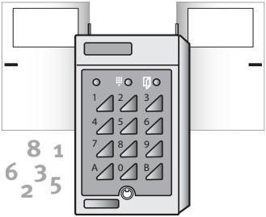

#### **Codelock K44 Duo**

**Installation & User Manual**

**Siemens AB**

| English 3  |  |
|---------------|--|
| Svenska27     |  |
| Deutsch 51 |  |
| Francais79    |  |
| Dansk107      |  |
| Suomi 131  |  |
| Norsk 155  |  |

#### English

Technical specifications and availability subject to change without notice.

© Copyright Siemens AB

We reserve all rights in this document and in the subject thereof. By acceptance of the document the recipient acknowledges these rights and undertakes not to publish the document nor the subject thereof in full or in part, nor to make them available to any third party without our prior express written authorization, nor to use it for any purpose other than for which it was delivered to him.

## *Contents*

| What is K44 Duo?             | 5      |
|---------------------------------|--------|
| Duress or alert                 | 6      |
| Zero opening                 | 6      |
| Unlock the door permanently  | 6      |
| Door bell                    | 6      |
| The keypad                      | 7      |
| Wiring                       | 8      |
| Programming                  | 10     |
| Buzzer and LEDs                 | 10     |
| Choose password                 | 11     |
| Change password                 | 11     |
| Programming commands            |  11 |
| Program codes                   | 12     |
| Erase codes                     | 13     |
| Change codes                 | 14     |
| Set opening time                | 15     |
| Background lighting on/off      | 15     |
| Buzzer on/off                | 16     |
| Toggle function on/off       | 16     |
| Duress or Alert                 | 17     |
| Door monitoring on/off          | 18     |
| Set door held warning time      | 19     |
| Delay on/off                 | 20     |
| Erase the memory                | 20     |
| Using K44 Duo                   | 21     |
| Entrance                        | 21     |
| Unlock the door permanently  | 21     |
| Enter duress code               | 22     |
| Technical data                  | 23     |
|                                 |        |

# *What is K44 Duo?*

K44 Duo is a compact code lock with two relay outputs. This makes K44 Duo capable of controlling two doors – or one door and an optional function, e.g. a light switch. Either a four- or a six-digit code can be used to open connected doors. All programming is done from the keypad.

#### *Open two doors using one code*

The advantage of using two relay outputs is that two functions can be activated at the same time, using only one code. For example, the code can open the lock and turn on a light switch at the same time.

Another setup is to connect the code lock to two doors. One code is programmed to operate both doors, while the other only opens one of the doors.

If the code is programmed to open both doors, you can set K44 Duo so that the other door does not open until the first door has been opened and closed (see the Delay section).

For each code, choose whether to activate both relay outputs, only one or only the other.

#### *Disable the codes whenever needed*

K44 Duo offers the possibility to disable codes at certain times. For example, the cleaning staff's access to the building can be limited to certain hours, while tenants/ staff can have access to the door 24 hours a day.

By connecting two time clocks to K44 Duo, three different time zones can be used to control the codes: one controlled by time clock 1, one controlled by time clock 2 and one that is valid 24 hours a day, i.e. no time control.

#### *Duress or alert*

K44 Duo is equipped with an output that can be activated for one of the following reasons:

- A user enters a duress code OR
- The door held warning time expires or the door is forced open

Choose which alternative to use. Then connect e.g. a burglar alarm or similar to the output.

## *Zero opening*

To make entrance easier, e.g. during office hours, connect an external contact. Then use the contact to activate or deactivate zero opening, i.e. opening the door by pressing the zero button on the keypad. Note that this is only applies to relay output 1.

## *Unlock the door permanently*

If the Toggle function is activated, the code can be used to unlock the door. The door remains open until a valid code is entered once again (see the Toggle on/off section).

## *Door bell*

If needed, a door bell can be connected to K44 Duo. To ring the bell, the visitor presses the button labelled with a bell on the code lock's keypad.

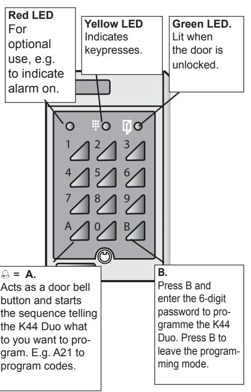

and erasing memory.

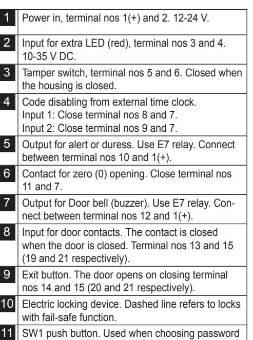

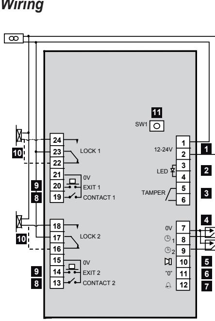

 

## *Programming*

Before you start programming K44 Duo, make a note of the codes to be used, to what timing group they should belong and which relay output they should control. At the back of this manual you will find a chart designed for this purpose. Look at the chart as you program K44 according to the instructions below.

## *Buzzer and LEDs*

During programming you will be guided by the buzzer and the LEDs.

**In programming mode before a function is chosen**: Green and yellow LED flashes.

**During programming:** Yellow LED goes out. Green LED is lit.

**Correct instruction:** Confirmed by a rising signal consisting of two quick beeps.

**Faulty instruction:** Confirmed by a falling signal consisting of two quick beeps.

- *Note!* During programming mode, if a button is not pressed within 20 seconds, the code lock goes back to normal operation.
## *Choose password*

The first thing to do before you can start programming is to choose a password.

- 1 Press and hold the SW1 button on the code lock's circuit board. Both LEDs are lit.
- 2 Enter a 6-digit password.
- 3 Make a note of the new password in the chart at the back of the manual.

## *Change password*

- 1 Press B and enter the current password.
- 2 Enter A27.
- 3 Enter the new password. A warning tone is heard.
- 4 Enter the new password once again.
- 5 Press B to leave programming mode.
- 6 Make a note of the new password in the chart at the back of the manual.

# *Programming commands*

Always press B and the password before any commands are used.

Leaving the programming mode can be done by pressing B.

## *Program codes*

- 1 Press B and enter the current password.
- 2 Enter A21.
- 3 Enter the desired code location using two digits (01-30).
- 4 Enter the code for the current code location (four digits for code location 01-20 or six digits for code location 21-30).

**Note!** The four first digits in a 6-digit code must not be the same as the digits in a 4-digit code and the other way around.

- 5 Choose whether or not the code should be disabled from a time clock.
	- 0 = no time control
	- 1 = code disabled from time clock 1
	- 2 = code disabled from time clock 2
- 6 Choose which relay output to control.
	- 0 = both relay outputs
	- 1 = relay output 1
	- 2 = relay output 2
- 7 Program the next code by continuing from step 3 or press B to exit.

## *Erase codes*

- 1 Press B and enter the current password.
- 2 Enter A22.
- 3 Enter the current code. If it is a 4-digit code, enter A after the last digit. If it is a 4-digit code, enter 0000. If it is a 6-dig-
- it code, enter 000000. 4 Enter 0000 (000000) again.
- 5 Enter 0.
- 6 Enter 0 once again.
- 7 Erase the next code by continuing from step 3 or press B to exit.

#### *Change codes*

- 1 Press B and enter the current password.
- 2 Enter A22.
- 3 Enter the current code. If it is a 4-digit code, enter A after the last digit.
- 4 Enter the new code using four or six digits.
- 5 Enter the new code once again.
- 6 Choose whether or not the code should be disabled from a time clock.
	- 0 = no time control
	- 1 = code disabled from time clock 1
	- 2 = code disabled from time clock 2
- 7 Choose which relay output to control.
	- 0 = both relay outputs
	- 1 = relay output 1
	- 2 = relay output 2
- 8 Change the next code by continuing from step 3 or press B to leave code program

## *Set opening time*

The opening time determines for how long the lock should remain open following a correct entrance code. When K44 Duo is delivered the opening time is 7 seconds for both relays.

- 1 Press B and enter the current password.
- 2 Enter A28.
- 3 Enter the desired opening time (01-99) using two digits, e.g. 09 for 9 seconds.
- 4 Choose which relay output the new opening time applies to:
	- 0 = both
	- 1 = relay output 1
	- 2 = relay output 2

# *Background lighting on/off*

This is how to turn off the keypad's background lighting, if needed.

- 1 Press B and enter the current password
- 2 Enter A60.
- 3 Enter 0.

To reactivate background lighting, press 1 in step 3 instead.

## *Buzzer on/off*

This is how to deactivate the buzzer if sound on keypresses and door opening is not desired. Note that the buzzer will keep sounding during programming.

- 1 Press B and enter the current password.
- 2 Enter A65.
- 3 Enter 0.

To reactivate the buzzer, press 1 in step 3 instead.

## *Toggle function on/off*

To be able to unlock a door permanently, the toggle function has to be activated.

Proceed as follows:

- 1 Press B and enter the current password
- 2 Enter A81.
- 3 Enter 1.
- 4 Choose what relay outputs the toggle function should apply to.
	- 0 = both
	- 1 = relay output 1
	- 2 = relay output 2

To deactivate the toggle function, follow the above steps, only enter 0 in step 3 instead.

In the *Unlock the door permanently* section you will find instructions on how to unlock the door permanently.

## *Duress or Alert*

The K44 Duo allows for either using duress or alert. The same command is used for different function.

#### *Duress*

With the *Duress* function activated, a user can enter a special code if he or she is forced to open the door under threat. It is important to have a plan for what action to take when a duress code is entered.

- *Note!* If *Duress* is activated, make sure you have not programmed codes with consecutive digits. Code 1234 must not exist with codes 1235 and 1233. Code 5679 must not exist with codes 5670 and 5678.
The *Enter duress code* section describes how a user should enter the duress code.

#### *Alert*

When K44 Duo is delivered, the alarm output is set to be activated if the door is open too long or if the door is forced open.

Note that door contacts must be connected and that *Door monitoring* must be activated for this to work.

This is how to choose one of the functions:

- 1 Press B and enter the current password.
- 2 Enter A69.
- 3 Enter **either**:
	- 0 = Door Alert (default).
	- 1 = Duress

## *Door monitoring on/off*

If door contacts are used and this function is activated, a warning signal sounds during the time set as door held warning time, i.e. when the opening time has expired and the door is still open. If the door held warning time expires and the door is still open, the alert output is activated (if the *Alert function* is activated). This also happens if the door is forced open.

This is how to activate *Door monitoring*:

- 1 Press B and enter the current password
- 2 Enter A67.
- 3 Enter 1.

To deactivate *Door monitoring*, press 0 in step 3 instead.

## *Set door held warning time*

If the door is still open when the opening time has expired, a buzzer sounds as to remind the visitor to close the door immediately – or the alarm output will be activated. The buzzer sounds until the door is closed.

Note that door contacts must be connected and that Door control must be activated for this to work.

This is how to change the door held warning time, if needed:

- 1 Press B and enter the current password.
- 2 Enter A29.
- 3 Enter the desired door held warning time (01- 99) with two digits, e.g. 09 for 9 seconds.
- 4 Choose to which relay outputs the new door held warning time should apply:
	- 0 = both
	- 1 = relay output 1
	- 2 = relay output 2

## *Delay on/off*

When this function is activated, the following happens: If a code is programmed to open two doors, lock relay 2 is not activated until door 1 has been opened and closed.

If door 2 is opened with the exit button, door 2 has to be opened and closed before door 1 can be opened.

Note that door contacts must be connected and that Door control must be activated for this to work.

This is how to activate Delay:

- 1 Press B and enter the current password.
- 2 Enter A80.
- 3 Enter 1.

To deactivate Delay, press 0 in step 3 instead.

## *Erase the memory*

This is how to erase all programmed information (including the password):

- 1 Press B and enter the current password.
- 2 Press SW1 on K44 Duo's circuit board.
- 3 Enter 112186.
- 4 Enter 112186 once again. The memory is now erased and K44 Duo goes back to the factory settings.

# *Using K44 Duo*

### *Entrance*

To open the lock, a 4-digit (or 6-digit) code should be entered on the code lock's keypad. K44 Duo is blocked if a visitor performs 12 keypresses without finding the correct code. To release the blockage, enter a correct code twice in succession.

## *Unlock the door permanently*

To unlock the door permanently, proceed as follows:

- 1 Press B.
- 2 Enter the entrance code.
- 3 Enter 1.

The door is now unlocked (green LED is lit). To lock the door, follow the above steps, only enter 0 in step 3 instead.

#### *Enter duress code*

**ENG**

This is how to activate the alarm output when forced to open the door under threat:

Enter the usual entrance code, only add 1 to the last digit in the code.

**Example 1**: If the entrance code is 1234, enter 1235 instead.

**Example 2:** If the code is 1239, enter 1230 instead.

When a duress code is entered, the door will open at the same time as the duress output is activated. It will remain activated until reset by somebody entering programming mode.

# *Technical data*

| Power supply:                            | 8-24 V AC, 10-35 V DC |
|------------------------------------------|-----------------------|
| Power consumption:                       | 75 mA.                |
| Maximum load over the relay contacts: | 2 A 28 V DC           |
| Dimensions (HxWxD) mm:                | 140x80x40             |

Suitable height: 1200-1400 mm from ground to bottom edge.

If needed, complete the installation with flush mounting kit BB3.

|                    | ways start by pressing | B and entering the pass                                                                                          | word.                                 | B. Press Exit:                                                                |                                                                 |                                                                                                                                                 |                      |
|--------------------|------------------------|------------------------------------------------------------------------------------------------------------------|---------------------------------------|-------------------------------------------------------------------------------------|-----------------------------------------------------------------|-------------------------------------------------------------------------------------------------------------------------------------------------|----------------------|
| on                 | Step 1                 | Step 2                                                                                                           | Step 3                                | Step 4                                                                              | Step 5                                                          | Step 6                                                                                                                                          |                      |
| entrance           | Press A21           | ons 21-30 es. e = 6-digit cod e Cod on (2 Enter cod digits). ocati ocati l l | e (4 or 6 digits) Enter cod     | ming p 1 p 2 one 1 = grou 2 = grou Enter ti p 0 = n grou | Enter relay 1 = relay 1 2 = relay 2 0 = both output | back m xit: ode). m- Proceed fro ode: o progra B ( E m p 2. ext c Press g n ste mi N t | Programming overview |
| entrance Change | Press A22           | e. A e + Enter old cod e: 4-digit cod Enter cod                                                | wice) w Enter ne e (t cod | ming p 1 p 2 one 1 = grou 2 = grou Enter ti p 0 = n grou | Enter relay 1 = relay 1 2 = relay 2 0 = both output | ming B (back m Exit: Proceed fro e: m to progra ext cod step 2. e). Press mod N                          |                      |
| entrance Erase  | Press A22           | See above                                                                                                        | Enter 0000 wice) (00) (t        | Press 0                                                                             | Press 0                                                         | See above                                                                                                                                       |                      |

| ways start by pressing Al             | B and entering the pass | Press Exit: word.           | B.                                 |        |        |
|------------------------------------------|-------------------------|-----------------------------------|------------------------------------|--------|--------|
| on Functi                             | Step 1                  | Step 2                            | Step 3                             | Step 4 | Step 5 |
| me Change opening ti                  | A28 Press            | Enter seconds (01-99)             | Enter relay out put (0, 1 or 2) |        |        |
| oor held me Change d warning ti | A29 Press            | Enter seconds (01-99)             | Enter relay out put (0, 1 or 2) |        |        |
| word Change pass                      | A27 Press            | e (6 digits) w cod Enter ne | e w cod Enter ne again    |        |        |
| Background lighting on/off            | A60 Press            | 0 = off 1 = on                 |                                    |        |        |
| Buzzer on/off                            | A65 Press            | 0 = off 1 = on                 |                                    |        |        |
| monitor on/off Door                   | A67 Press            | 0 = off 1 = on                 |                                    |        |        |

| on Functi               | Step 1                 | Step 2                                               | Step 3                           | Step 4                        | Step 5 |
|----------------------------|------------------------|------------------------------------------------------|----------------------------------|-------------------------------|--------|
| Duress Alert/           | A69 Press           | 0 = alert on, duress off 1 = duress on, alert off |                                  |                               |        |
| Delay on/off               | A80 Press           | 0 = off 1 = on                                    |                                  |                               |        |
| on on/off Toggle functi | A81 Press           | 0 = off 1 = on                                    | Enter relay output (0,1 or 2) |                               |        |
| mory me Erase        | K44 Open o Du | W1 S Press                                     | 86 21 Press 11             | 86 21 Press 11 again |        |
|                            |                        |                                                      |                                  |                               |        |

#### Svenska

Tekniska specifikationer och tillgänglighet är föremål för ändringar utan föregående varning.

© Copyright Siemens AB

Alla rättigheter till detta dokument och till föremålet för det förbehålles. Genom att acceptera dokumentet erkänner mottagaren dessa rättigheter och förbinder sig att inte publicera dokumentet, eller föremålet därför, helt eller delvis, att inte göra dem tillgängliga för tredje part utan skriftligt tillstånd från oss, samt att inte använda dem för något annat syfte än det för vilket de levererats.

## *Innehåll*

**SVE**

| Allmänt om K44 Duo            | 29 |
|----------------------------------|----|
| Öppna två dörrar med en kod      | 29 |
| Välj själv när koderna ska gälla | 29 |
| Hotkod eller larm                | 30 |
| Nollöppning                      | 30 |
| Ställa upp dörren             | 30 |
| Ringklocka                       | 30 |
| Knappsatsen                      | 31 |
| Installation                     | 32 |
| Programmering                    | 34 |
| Summer och lysdioder             | 34 |
| Välja programmeringskod          | 35 |
| Ändra vald programmeringskod  | 35 |
| Programmeringskommandon       | 35 |
| Programmera koder                | 36 |
| Radera koder                     | 37 |
| Ändra koder                      | 38 |
| Ställa in öppningstid            | 39 |
| Bakgrundsbelysning av/på      | 39 |
| Summer av/på                  | 40 |
| Bistabil funktion av/på          | 40 |
| Hotkod- eller Dörrlarmsutgång    | 41 |
| Dörrkontroll av/på               | 42 |
| Ställa in dörrlarmstid           | 43 |
| Fördröjning av/på                | 44 |
| Radera minnet                    | 44 |
| Använda K44 Duo                  | 45 |
| Inpassering                      | 45 |
| Ställa upp dörren             | 45 |
| Ange hotkod vid överfall         | 46 |
| Tekniska data                    | 47 |

# *Allmänt om K44 Duo*

K44 Duo är ett kompakt kodlås med två reläutgångar. K44 Duo kan alltså styra upp till två dörrar – eller en dörr och valfri annan funktion, t ex innerbelysning. För inpassering används en fyr- eller sexsiffrig kod. All programmering sker från knappsatsen.

## *Öppna två dörrar med en kod*

Rent praktiskt innebär två reläutgångar möjligheten att med en korrekt kod aktivera två funktioner samtidigt. Koden kan t ex låsa upp dörren och samtidigt tända en belysning.

En annan tillämpning är att koppla kodlåset till två dörrar. En kod kan då programmeras att öppna båda dörrarna, medan en annan endast öppnar en av dörrarna.

Om koden ska öppna båda dörrarna kan du också ställa in K44 Duo så att den andra dörren inte öppnas förrän den första har öppnats och stängts, s k fördröjning.

För varje kod kan du välja mellan att aktivera båda reläutgångarna, bara den ena eller bara den andra.

## *Välj själv när koderna ska gälla*

K44 Duo erbjuder möjligheten att – via ett externt tidur – tidsstyra de koder du har programmerat in. Vissa koder, t ex brevbärarens, kanske bara ska fungera en viss del av dygnet medan de boende ska kunna komma in i porten dygnet runt.

Om du kopplar två tidur till K44 Duo kan du laborera med tre olika tidzoner för tidsstyrning av koderna: en som regleras av tidur 1, en som regleras av tidur 2 och en som gäller dygnet runt, dvs ingen tidsstyrning.

## *Hotkod eller larm*

K44 Duo är utrustat med en utgång som aktiveras i något av följande fall:

- När en inpasserande anger en s k hotkod **ELLER**
• När dörrlarmstiden går ut eller om dörren bryts upp. Du väljer själv vilket av de två alternativen ovan du vill använda. Du kan sedan ansluta exempelvis ett fastighetslarm till utgången.

## *Nollöppning*

Om du vill underlätta för inpasserande att komma in i porten, t ex under kontorstid, kan du ansluta en extern kontakt, med vars hjälp du kan slå på eller av möjligheten att öppna dörren genom att trycka på enbart nollan på knappsatsen. Observera att detta endast kan göras för reläutgång 1.

## *Ställa upp dörren*

Om bistabil funktion är aktiverad kan man med koden låsa upp dörren, som förblir öppen tills man på nytt anger en giltig kod (se avsnittet *Bistabil funktion av/på*).

## *Ringklocka*

Det är också möjligt att ansluta en ringklocka till K44 Duo. Den besökande trycker då på knappen märkt med en ringklocka på kodlåsets knappsats.

**SVE**

## *Knappsatsen*

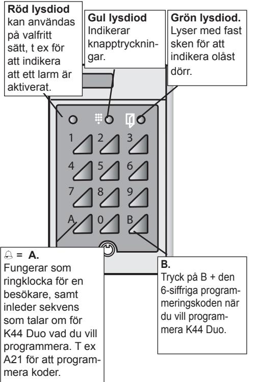

#### **32 K44 Duo Installations- & Användarhandbok**

## *Installation*

**SVE**

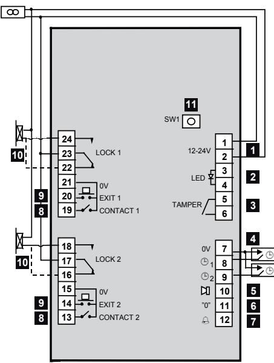

| 1  | Spänningsmatning 12-24 V, plintnr 1(+) och 2.                                                                                                    |
|----|--------------------------------------------------------------------------------------------------------------------------------------------------|
| 2  | Ingång för extra lysdiod (röd), plintnr 3 och 4. 10-35 V DC.                                                                                  |
| 3  | Sabotageswitch, plintnr 5 och 6. Normalt sluten vid stängd kapsling.                                                                          |
| 4  | Tidsstyrning från externt tidur. Ingång 1: Slut plintnr 8 och 7. Ingång 2: Slut plintnr 9 och 7. Sluten ingång = koderna fungerar inte. |
| 5  | Utgång för larm eller hotkod. Använd E7-relä. Kopplas in mellan plintnr 10 och 1(+).                                                          |
| 6  | Kontakt för 0-öppning. Slut plintnr 11 och 7.                                                                                                    |
| 7  | Ringklocka. Utgång för att aktivera en summer eller liknande. Använd E7-relä. Kopplas in mellan plintnr 12 och 1(+).                       |
| 8  | Ingång för dörrkontakter. Kontakten är stängd när dörren är stängd. Plintnr 13 och 15 (respektive 19 och 21).                              |
| 9  | Fjärröppningsknapp. Lås öppnas vid slutning av plintnr 14 och 15 (respektive 20 och 21).                                                      |
| 10 | Elektriskt lås. Streckad linje avser lås med om vänd funktion.                                                                                |
| 11 | SW1 tryckknapp. Används vid val av password och vid tömning av minnet.                                                                        |

**SVE**

# *Programmering*

**SVE**

Innan du börjar programmera K44 Duo kan det vara en god idé att anteckna de koder du ska programmera, till vilken tidsstyrningsgrupp de ska höra samt vilken reläutgång de ska styra. I slutet av handboken finns en lista avsedd för detta. När du programmerar kan du titta på listan samtidigt som du följer instruktionerna nedan.

## *Summer och lysdioder*

**I programmeringsläge innan funktion är vald**: Grön och gul lysdiod blinkar.

**Under programmering:** Gul lysdiod släcks. Grön lysdiod lyser.

**Korrekt instruktion:** Bekräftas med stigande signal bestående av två snabba tonstötar. **Felaktig instruktion**: Bekräftas med fallande

signal bestående av två snabba tonstötar.

- *Obs!* Om du i programmeringsläget inte trycker på någon knapp inom 20 sekunder återgår K44 Duo till normalläge.
## *Välja programmeringskod*

Det första du ska göra innan du kan programmera K44 Duo är att välja en programmeringskod.

- 1 Tryck in knappen SW1 på kodlåsets kretskort. Båda lysdioderna lyser med fast sken.
- 2 Ange en 6-siffrig programmeringskod. Nu kan du programmera kodlåset.
- 3 Anteckna den nya programmeringskoden i listan längst bak i handboken.

## *Ändra vald programmeringskod*

- 1 Tryck B och ange den aktuella programmeringskod.
- 2 Tryck A27.
- 3 Ange ny programmeringskod. En varningston hörs.
- 4 Ange nya programmeringskoden igen.
- 5 Tryck B för att lämna programmeringsläget.
- 6 Anteckna den nya programmeringskoden i listan längst bak i handboken.

# *Programmeringskommandon*

Använd alltid B+programmeringkod innan kommandon anges. Avsluta med B.

#### *Programmera koder*

- 1 Tryck B och ange den aktuella programmeringskod.
- 2 Tryck A21.

**SVE**

- 3 Ange önskad kodplats med två siffror (01-30).
- 4 Ange inpasseringskoden för den kodplats du valt (fyra siffror för kodplats 01-20 eller sex siffror för kodplats 21-30).

**Obs!** De fyra första siffrorna i en sexsiffrig kod får inte vara lika med siffrorna i en fyrsiffrig kod och tvärtom.

- 5 Ange om koden ska kunna kopplas bort vissa tider från ett tidur.
	- 0 = ingen tidsstyrning
	- 1 = koden ska tidsstyras från tidur 1
	- 2 = koden ska tidsstyras från tidur 2
- 6 Ange vilken reläutgång koden ska styra.
	- 0 = båda reläutgångarna
	- 1 = reläutgång 1
	- 2 = reläutgång 2
- 7 Programmera nästa kod genom att fortsätta från steg 3 eller tryck B för att avsluta.

## *Radera koder*

- 1 Tryck B och ange den aktuella programmeringskod.
- 2 Tryck A22.
- 3 Ange den befintliga koden. Om det är en fyrsiffrig kod, tryck A efter sista siffran. Om koden är fyrsiffrig, tryck 0000. Om koden är sexsiffrig, tryck 000000.
- 4 Tryck 0000 (000000) igen.
- 5 Tryck 0.
- 6 Tryck 0 igen.
- 7 Radera nästa kod genom att fortsätta från steg 3 eller tryck B för att avsluta.

## *Ändra koder*

- 1 Tryck B och ange den aktuella programmeringskod.
- 2 Tryck A22.

**SVE**

- 3 Ange den befintliga koden. Om det är en fyrsiffrig kod, tryck A efter sista siffran.
- 4 Ange den nya koden med fyra eller sex siffror.
- 5 Ange den nya koden igen.
- 6 Ange om koden ska kunna kopplas bort vissa tider från ett tidur.
	- 0 = ingen tidsstyrning
	- 1 = koden ska tidsstyras från tidur 1
	- 2 = koden ska tidsstyras från tidur 2
- 7 Ange vilken reläutgång koden ska styra.
	- 0 = båda reläutgångarna
	- 1 = reläutgång 1
	- 2 = reläutgång 2
- 8 Ändra nästa kod genom att fortsätta från steg 3 eller tryck B för att lämna programmeringen av koder.

## *Ställa in öppningstid*

Öppningstiden reglerar hur länge låset står öppet när en korrekt inpasseringskod har angivits. När K44 Duo levereras är öppningstiden 7 sekunder för båda reläerna.

- **SVE**
- 1 Tryck B och ange den aktuella programmeringskod.
- 2 Tryck A28.
- 3 Ange önskad öppningstid (01-99) med två siffror, t ex 09 för 9 sekunder.
- 4 Ange vilken reläutgång öppningstiden avser: 0 = båda
	- 1 = reläutgång 1
	- 2 = reläutgång 2

## *Bakgrundsbelysning av/på*

Så här stänger du vid behov av bakgrundsbelysningen av knappsatsen.

- 1 Tryck B och ange den aktuella programmeringskod.
- 2 Tryck A60.
- 3 Tryck 0.

Om du vill slå på bakgrundsbelysningen igen trycker du på 1 i steg 3 i stället.

#### **40 K44 Duo Installations- & Användarhandbok**

## *Summer av/på*

Om du inte vill att summern ska ljuda vid knapptryckning eller öppning kan du stänga av den.

**SVE** Observera att summern kommer att fortsätta ljuda vid programmering.

- 1 Tryck B och ange den aktuella programmeringskod.
- 2 Tryck A65.
- 3 Tryck 0.

Om du vill slå på summern igen trycker du på 1 i steg 3 i stället.

## *Bistabil funktion av/på*

Om du vill kunna ställa upp en dörr så att den står olåst under en längre tid än öppningstiden ska du aktivera bistabil funktion.

Gör så här:

- 1 Tryck B och ange den aktuella programmeringskod.
- 2 Tryck A81.
- 3 Tryck 1.
- 4 Ange för vilka relän bistabil funktion ska aktiveras.
	- 0 = båda
	- 1 = relä 1
	- 2 = relä 2

Om du vill stänga av bistabil funktion, följ stegen ovan men tryck på 0 i steg 3 i stället. I avsnittet

**K44 Duo Installations- & Användarhandbok 41**

*Ställa upp dörren* beskrivs hur du ställer upp dörren.

## *Hotkod- eller Dörrlarmsutgång*

K44 Duo medger att antingen hotkod **eller** dörrlarm kan användas. Du kan använder samma kommando men väljer olika funktion.

**SVE**

Hotkod

Med funktionen Hotkod aktiverad kan en inpasserande ange en särskild kod om han/hon tvingas öppna dörren under hot. Det är viktigt att man gör en plan över vilka åtgärder som ska vidtas vid användning av hotkod.

- *Obs!* Om Hotkod är aktiverad kan du inte ha koder som följer efter varandra i nummerordning. Kod 1234 får t ex inte finnas tillsammans med koderna 1235 och 1233. Kod 5679 får inte finnas tillsammans med koderna 5670 och 5678.
I avsnittet *Ange hotkod vid överfall* beskrivs hur en inpasserande anger hotkoden.

#### **Dörrlarm**

När K44 Duo levereras är larmutgången inställd så att den aktiveras om dörren står öppen för länge eller om dörren bryts upp.

Observera att dörrkontakter måste vara anslutna samt att funktionen *Dörrkontroll* ska vara aktiverad för att detta ska fungera.

Så här väljer du en av funktionerna:

- 1 Tryck B och ange den aktuella programmeringskod.
- **SVE**
- 2 Tryck A69.
- 3 Tryck antingen
	- 0 = Dörrlarm (fabriksinställning)
	- 1 = Hotkod

## *Dörrkontroll av/på*

Om dörrkontakter används och denna funktion är aktiverad ljuder en varningssignal under den tid som är inställd som dörrlarmstid, dvs när öppningstiden har gått ut och dörren fortfarande är öppen.

I de fall när även dörrlarmstiden gått ut och dörren fortfarande är öppen aktiveras larmutgången. Detta sker också när dörren bryts upp.

Så här aktiverar du *Dörrkontroll*:

- 1 Tryck B och ange den aktuella programmeringskod.
- 2 Tryck A67.
- 3 Tryck 1.

Om du vill stänga av *Dörrkontroll* igen trycker du på 0 i steg 3 i stället.

## *Ställa in dörrlarmstid*

Om dörren fortfarande är öppen när öppningstiden har gått ut ljuder en summer vid dörren. Summern är en påminnelse för den inpasserande att stänga dörren omedelbart – annars aktiveras larmutgången. Summern ljuder tills dörren återställs.

Observera att dörrkontakter måste vara anslutna samt att funktionen Dörrkontroll ska vara aktiverad för att detta ska fungera.

Så här ändrar du dörrlarmstiden om det behövs:

- 1 Tryck B och ange den aktuella programmeringskod.
- 2 Tryck A29.
- 3 Ange önskad dörrlarmstid (01-99) med två siffror, t ex 09 för 9 sekunder.
- 4 Ange vilken reläutgång dörrlarmstiden avser: 0 = båda
	- 1 = reläutgång 1
	- 2 = reläutgång 2

## *Fördröjning av/på*

När denna funktion är aktiverad händer följande: Om en kod är programmerad att öppna två dörrar, aktiveras låsrelä 2 först när dörr 1 har öppnats och stängts.

Om dörr 2 öppnas med fjärröppningsknappen måste dörr 2 öppnas och stängas innan dörr 1 kan öppnas.

Observera att dörrkontakter måste vara anslutna samt att funktionen Dörrkontroll ska vara aktiverad för att detta ska fungera.

Så här aktiverar du *Fördröjning*:

- 1 Tryck A80.
- 2 Tryck 1.

**SVE**

Om du vill stänga av *Fördröjning* igen trycker du på 0 i steg 2 i stället.

## *Radera minnet*

Så här raderar du all inprogrammerad information (även programmeringskoden):

- 1 Tryck B och ange den aktuella programmeringskod.
- 2 Tryck på SW1 på K44 Duo:s kretskort.
- 3 Tryck 112186.
- 4 Tryck 112186 en gång till. Minnet är nu raderat och K44 Duo är återställd till fabriksinställningen.

# *Använda K44 Duo*

## *Inpassering*

För att öppna låset anger man en fyrsiffrig (eller sexsiffrig) kod på kodlåsets knappsats. K44 Duo blockeras efter 12 knapptryckningar som inte resulterat i någon korrekt kod. För att häva blockeringen, ange en korrekt kod två gånger i följd.

## *Ställa upp dörren*

För att kunna ställa upp dörren permanent, gör så här:

- 1 Tryck B.
- 2 Ange inpasseringskoden.
- 3 Tryck 1.

Dörren är nu olåst (grön lysdiod tänds). Om du vill låsa dörren, följ stegen ovan men tryck 0 i steg 3 i stället.

#### *Ange hotkod vid överfall*

**SVE**

Så här gör den inpasserande för att aktivera ett larm om han eller hon tvingas öppna dörren under hot:

Ange den vanliga inpasseringskoden men **addera 1 till den sista siffran** i koden.

**Exempel 1:** Om inpasseringskoden är 1234, tryck 1235 i stället.

**Exempel 2:** Om koden är 1239, tryck 1230 i stället.

När du anger en hotkod öppnas dörren samtidigt som larmutgången aktiveras. Denna kommer att vara aktiverad tills du återställer den genom att gå in i programmeringsläge.

# *Tekniska data*

| Strömförsörjning:                  | 8-24 V AC, 10-35 V DC                    |
|------------------------------------|---------------------------------------------|
| Strömförbrukning:                  | 75 mA.                                      |
| Max last över reläkon takterna: | 2 A 28 V DC                                 |
| Mått (HxBxD) mm:                   | 140x80x40                                   |
| Rekommenderad monteringshöjd:   | 1200-1400 mm från mark till underkant |
|                                    |                                             |

Vid infällning, komplettera med infällningslåda BB3.

|                       |              | Programmeringsöversikt                                                                                                |                                                                                   |                                  |
|-----------------------|--------------|-----------------------------------------------------------------------------------------------------------------------|-----------------------------------------------------------------------------------|----------------------------------|
|                       | Steg 6       | uta: meringsläget). B (åter Fortsätt från Avsl m­ ästa kod: till progra steg 2. Tryck N | m ovan So                                                                      | m ovan. So                    |
| B.                    | Steg 5       | Ange reläut- 1 = relä 1 a 2 = relä 2 0 = båd gång                                                      | Ange reläut 1 = relä 1 a 2 = relä 2 0 = båd gång                   | Tryck 0                          |
| Avbryta: Tryck en. | Steg 4       | Ange tidstyr- pp 1 pp 2 pp 0 = ingen ningsgru 1 = gru 2 = gru                                    | pp styrningsgru pp 1 pp 2 0 = ingen Ange tid 1 = gru 2 = gru | Tryck 0                          |
| meringskod m       | Steg 3       | eller 6 siffror) Ange kod (4                                                                                       | Ange ny kod (2 gånger)                                                         | Tryck 0000 gånger) (00) (2 |
| B och ange progra     | Steg 2       | 30 ger 6-siffriga plats platser 21- (2 siffror). Ange kod er. Kod kod                            | 4-siffrig mla kod: Tryck A en + Ange ga en. kod kod       | m ovan So                     |
| med att trycka        | Steg 1       | Tryck A21                                                                                                          | Tryck A22                                                                      | A22                              |
| Börja alltid          | on Funkti | m- Progra mera kod                                                                                           | Ändra kod                                                                      | era Rad kod                |

| med att trycka Börja alltid      | B och ange progra | en. meringskod m             | B. Avbryta: Tryck              |        |        |
|-------------------------------------|-------------------|------------------------------------|-----------------------------------|--------|--------|
| on Funkti                        | Steg 1            | Steg 2                             | Steg 3                            | Steg 4 | Steg 5 |
| Ändra öppningstid                   | A28 Tryck      | en Ange öppningstid (01-99)  | Ange reläutgång (0, 1 eller 2) |        |        |
| mstid örrlar Ändra d          | A29 Tryck      | er Ange antal sekund (01-99) | Ange reläutgång (0, 1 eller 2) |        |        |
| me m Ändra progra ringskod | A27 Tryck      | Ange ny kod (6 siffror)            | Ange ny kod igen.              |        |        |
| Bakgrundsbelysning på/av         | A60 Tryck      | Av På 0 = 1 =             |                                   |        |        |
| mer på/av m Su                | A65 Tryck      | Av På 0 = 1 =             |                                   |        |        |
| Dörrkontroll av/på                  | A67 Tryck      | Av På 0 = 1 =             |                                   |        |        |
|                                     |                   |                                    |                                   |        |        |

**SVE**

| on Funkti                   | Steg 1                  | Steg 2                                                           | Steg 3                           | Steg 4                       | Steg 5 |
|--------------------------------|-------------------------|------------------------------------------------------------------|----------------------------------|------------------------------|--------|
| otkod mutgång/h Lar      | A69 Tryck            | otkod av m av otkod på, lar m på, h 0 = lar 1 = h |                                  |                              |        |
| Fördröjning av/på              | A80 Tryck            | Av På 0 = 1 =                                           |                                  |                              |        |
| on Bistabil funkti av/på | A81 Tryck            | Av På 0 = 1 =                                           | Ange reläutgång (0,1 eller 2) |                              |        |
| minnet era Rad           | o Öppna Du K44 | W1 på krets S Tryxk på kortet                           | 86 21 Tryck 11             | 86 21 Tryck 11 igen |        |

#### Deutsch

Technische Spezifikationen und Verfügbarkeit können ohne vorherige Ankündigung geändert werden.

© Copyright Siemens AB

Alle Rechte an diesem Dokument und dem darin behandelten Thema vorbehalten. Der Empfänger erkennt diese Rechte an und wird dieses Dokument ohne unsere vorherige schriftliche Genehmigung keinem Dritten ganz oder teilweise zugänglich machen oder für einen anderen als den vorgesehenen Zweck verwenden.

## *Inhalt*

| Allgemeines zum K44 Duo                 | 53     |
|-----------------------------------------|--------|
| Zwei Türen mit einem Code öffnen     | 53     |
| Codes zu bestimmten Zeiten deaktivieren |  53 |
| Tastatur                                | 55     |
| Anschluß                             | 56     |
| Programmierung                          | 58     |
| Summer und Leuchtdioden              | 58     |
| Passwort wählen                         | 59     |
| Passwort ändern                         | 59     |
| Programmierung - Befehle             | 59     |
| Zutrittscodes programmieren             | 60     |
| Codes löschen                        | 61     |
| Codes ändern                            | 62     |
| Türöffnungszeit einstellen           | 63     |
| Tastaturbeleuchtung Ein/Aus          | 64     |
| Summer Ein/Aus                       | 64     |
| Daueröffnung Ein/Aus                 | 65     |
| Überfallcode oder Alarm              | 66     |
| Türüberwachung Ein/Aus               | 67     |
| Türwarnzeit einstellen               | 68     |
| Schleuse Ein/Aus                        | 69     |
| Speicher löschen                     | 70     |
| Einsatz des K44 Duo                  | 71     |
| Zutritt                                 | 71     |
| Manipulationsschutz                  | 71     |
| Daueröffnung der Tür                    | 71     |
| Überfallcode verwenden               | 72     |
| Technische Daten                        | 73     |
|                                         |        |

# *Allgemeines zum K44 Duo*

Das K44 Duo ist ein kompaktes Codeschloss mit zwei Relaisausgängen. Dadurch können zwei Türen oder eine Tür und ein weiteres Gerät (z. B. ein Lichtschalter) gesteuert werden. Die angeschlossenen Türen können mit einem vier- oder sechsstelligen Code geöffnet werden. Die Programmierung erfolgt über die Tastatur.

## *Zwei Türen mit einem Code öffnen*

Der Vorteil von zwei Relaisausgängen liegt darin, dass mit nur einem Code zwei Vorgänge gleichzeitig ausgeführt werden können. Mit dem Code kann z. B. ein Schloss geöffnet und die Beleuchtung eingeschaltet werden.

Sie können das Codeschloss auch an zwei Türen anschließen. Mit einem Code werden dann beide Türen gesteuert, mit dem anderen lediglich eine der Türen.

Wenn mit einem Code beide Türen geöffnet werden, kann K44 Duo so eingestellt werden, dass die zweite Tür erst geöffnet wird, nachdem die erste geöffnet und wieder geschlossen wurde (siehe Abschnitt *Schleuse*).

Mit jedem Code können ein beliebiger oder beide Relaisausgänge aktiviert werden.

## *Codes zu bestimmten Zeiten deaktivieren*

Die Codes des K44 Duo können zu bestimmten Zeiten deaktiviert werden. So können Sie z. B. einschränken, zu welchen Zeiten das Raumpflegepersonal Zutritt zum Gebäude erhält, während Bewohner oder Mitarbeiter uneingeschränkten Zutritt haben.

Mit zwei an das K44 Duo angeschlossenen Schalt-

uhren können drei Zeitzonen zum Steuern der Codes eingerichtet werden: Eine Zone wird durch die erste, eine weitere durch den zweiten Schaltuhr gesteuert. Die dritte Zone ist ganztägig gültig (ohne Zeitsteuerung).

## *Überfallcode und Alarm*

Das K44 Duo besitzt einen Ausgang, der in folgenden Situationen aktiviert werden kann:

- Ein Überfallcode wird eingegeben, **ODER**
- Die Türwarnzeit läuft ab, oder die Tür wird gewaltsam geöffnet.

Es kann eine der Möglichkeiten gewählt werden. An den Ausgang kann z. B. eine Alarmanlage angeschlossen werden.

## *Nullöffnung*

Wenn der Zutritt z. B. während der Bürozeiten erleichtert werden soll, kann ein externer Kontakt angeschlossen werden. Hiermit wird die Nullöffnung (Türöffnung durch Drücken der Null auf der Tastatur) aktiviert bzw. deaktiviert. Dies gilt jedoch nur für Relaisausgang 1.

## *Daueröffnung der Tür*

Bei aktivierter Funktion *Daueröffnung* kann die Tür mit einem Code entsperrt werden. Die Tür bleibt unverriegelt, bis wieder ein gültiger Code eingegeben wird (siehe Abschnitt *Daueröffnung Ein/Aus*).

## *Türglocke*

An das K44 Duo kann eine Türglocke angeschlossen werden. Zum Klingeln wird die mit der Glocke gekennzeichnete Taste auf der Tastatur des Codeschlosses gedrückt.

## *Tastatur*

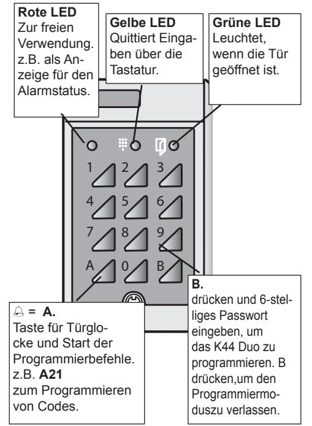

## *Anschluß*

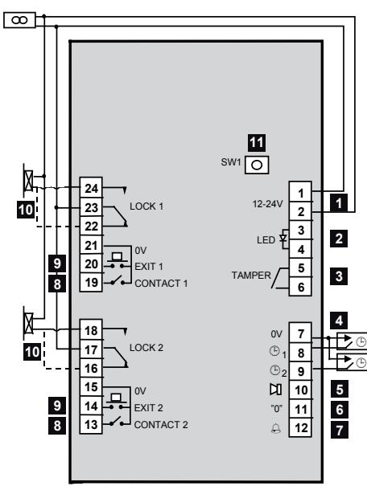

| 1  | Stromversorgung, Klemmen 1(+) und 2. 12-24 V.                                                                                 |
|----|-------------------------------------------------------------------------------------------------------------------------------|
| 2  | Eingang zur Ansteuerung der roten LED , Klem men 3 und 4. 10-35 V Gleichstrom.                                             |
| 3  | Sabotageschalter, Klemmen 5 und 6. Bei ge schlossenem Gehäuse geschlossen.                                                 |
| 4  | Code-Deaktivierung durch externe Schaltuhr. Kanal 1: Klemmen 8 und 7 überbrücken. Kanal 2: Klemmen 9 und 7 überbrücken. |
| 5  | Ausgang bei Alarm oder Überfallcode. Relais E7 verwenden! Anschluss an Klemmen 10 und 1(+).                                |
| 6  | Kontakt für (0) Nullöffnung. Klemmen 11 und 7 überbrücken (z.B. mit Schaltuhr oder Schalter).                              |
| 7  | Türglocke. Summerausgang. Relais E7 verwen den Anschluss an Klemmen 12 und 1(+).                                           |
| 8  | Eingang für Türkontakte. Kontakt geschlossen bei geschlossener Tür. Klemmen 13 und 15 (bzw. 19 und 21).                 |
| 9  | Öffnungstaster. Beim Überbrücken der Klemmen 14 und 15 (bzw. 20 und 21) wird die Tür geöffnet.                             |
| 10 | Relais für Türöffner, potentialfreier Wechsler. Gestrichelte Linie gilt für Ruhestromtüröffner.                            |
| 11 | Taste SW1. Zur Wahl des Passwortes und zum Löschen des Speichers.                                                          |

# *Programmierung*

Notieren Sie sich vor dem Programmieren die gewünschten Codes, deren Zeitsteuerungsgruppe und welche Relaisausgänge durch sie gesteuert werden sollen. Eine Liste dafür finden Sie am Ende des Handbuchs. Nutzen Sie diese Liste beim Programmieren des K44 Duo anhand der nachstehenden Anweisungen.

## *Summer und Leuchtdioden*

Beim Programmieren führen der Summer und die Leuchtdioden den Bediener.

**Im Programmiermodus vor Wahl einer Funkti-**

**on**: Grüne und gelbe Leuchtdiode blinken. **Beim Programmieren:** Gelbe Leuchtdiode erlischt. Grüne Leuchtdiode leuchtet.

**Richtige Eingabe:** Bestätigung durch ansteigendes Signal aus zwei kurzen Tönen.

**Falsche Eingabe**: Bestätigung durch abfallendes Signal aus zwei kurzen Tönen.

*ACHTUNG!* Wenn im Programmiermodus nicht innerhalb von 20 Sekunden eine Taste gedrückt wird, kehrt das Codeschloss in den Normalmodus zurück.

## *Passwort wählen*

Ehe Sie mit der Programmierung beginnen können, muss ein Passwort festgelegt werden.

- 1 Taste SW1 auf der Platine des Codeschlosses drücken und gedrückt halten. Beide Leuchtdioden leuchten auf.
- 2 Sechsstelliges Passwort eingeben.
- 3 Neues Passwort in der Liste am Ende des Handbuchs notieren.

## *Passwort ändern*

- 1 B drücken und aktuelles Passwort eingeben.
- 2 A27 drücken.
- 3 Neues Passwort eingeben. Ein Warnton wird ausgegeben.
- 4 Neues Passwort erneut eingeben.
- 5 Zum Verlassen des Programmiermodus B drücken.
- 6 Neues Passwort in der Liste am Ende des Handbuchs notieren.

# *Programmierung - Befehle*

Immer B drücken und dann das Passwort eingeben, bevor andre Befehle zur Programmierung eingegeben werden. Der Programmiermodus kann durch Drücken von B verlassen werden.

## *Zutrittscodes programmieren*

- 1 B drücken und aktuelles Passwort eingeben.
- 2 A21 drücken.
- 3 Gewünschten Speicherplatz mit zwei Ziffern eingeben (01-30).
- 4 Zutrittscode für diesen Speicherplatz eingeben (4 Ziffern für Speicherplätze 01-20, 6 Ziffern für Speicherplätze 21-30).

ACHTUNG! Die ersten 4 Ziffern eines sechsstelligen Codes dürfen nicht den Ziffern eines vierstelligen Codes entsprechen und umgekehrt.

- 5 Wählen, ob der Code durch eine Schaltuhr gesteuert werden soll.
	- 0 = keine Zeitsteuerung
	- 1 = Code wird durch Schaltuhr 1 gesteuert
	- 2 = Code wird durch Schaltuhr 2 gesteuert
- 6 Den zu steuernden Relaisausgang wählen.
	- 0 = beide Relaisausgänge
	- 1 = Relaisausgang 1
	- 2 = Relaisausgang 2
- 7 Speicherplatz für nächsten zu programmierenden Code eingeben (s. Schritt 3) oder B drücken, um die Codeprogrammierung zu verlassen.

## *Codes löschen*

- 1 B drücken und aktuelles Passwort eingeben.
- 2 A22 drücken.
- 3 Gewünschten Code eingeben. Bei einem vierstelligen Code nach der letzten Ziffer A eingeben.
- 4 Ist der Code vierstellig, 0000 eingeben. Ist der Code sechsstellig, 000000 eingeben.
- 5 Schritt 4 wiederholen.
- 6 0 drücken.
- 7 Nochmals 0 drücken.
- 8 Nächsten zu löschenden Code eingeben (s. Schritt 3) oder B drücken, um die Codeprogrammierung zu verlassen.

## *Codes ändern*

- 1 B drücken und aktuelles Passwort eingeben.
- 2 A22 drücken.
- 3 Gewünschten Code eingeben. Bei vierstelligen Codes nach der letzten Ziffer A eingeben.
- 4 Neuen Code eingeben (4 oder 6 Ziffern).
- 5 Neuen Code nochmals eingeben.
- 6 Wählen, ob der Code durch eine Schaltuhr gesteuert werden soll.
	- 0 = keine Zeitsteuerung
	- 1 = Code wird durch Schaltuhr 1 gesteuert
	- 2 = Code wird durch Schaltuhr 2 gesteuert
- 7 Den zu steuernden Relaisausgang wählen.
	- 0 = beide Relaisausgänge
	- 1 = Relaisausgang 1
	- 2 = Relaisausgang 2
- 8 Speicherplatz für nächsten zu ändernden Code eingeben (s. Schritt 3) oder B drücken, um die Codeprogrammierung zu verlassen.

## *Türöffnungszeit einstellen*

Mit der Türöffnungszeit wird gesteuert, wie lange das Relais nach Eingabe eines richtigen Zutrittscodes anzieht. Bei Lieferung des K44 Duo ist die Türöffnungszeit bei beiden Relais auf 7 Sekunden eingestellt.

- 1 B drücken und aktuelles Passwort eingeben.
- 2 A28 drücken.
- 3 Gewünschte Türöffnungszeit (01-99) mit zwei Ziffern eingeben, z. B. 09 für 9 Sekunden.
- 4 Wählen, für welchen Relaisausgang die neue Türöffnungszeit gelten soll:
	- 0 = beide Relaisausgänge
	- 1 = Relaisausgang 1
	- 2 = Relaisausgang 2

## *Tastaturbeleuchtung Ein/Aus*

Bei Bedarf kann hiermit die Beleuchtung der Tastatur ausgeschaltet werden.

- 1 B drücken und aktuelles Passwort eingeben.
- 2 A60 drücken.
- 3 0 drücken.

Um die Tastaturbeleuchtung wieder einzuschalten, in Schritt 3 die 1 drücken.

## *Summer Ein/Aus*

Hiermit kann der Summer deaktiviert werden, so dass er beim Drücken der Tasten und beim Öffnen der Tür nicht ertönt. Während der Programmierung ist der Summer jedoch immer aktiv.

- 1 B drücken und aktuelles Passwort eingeben.
- 2 A65 drücken.
- 3 0 drücken.

Um den Summer wieder zu aktivieren, in Schritt 3 die 1 drücken.

## *Daueröffnung Ein/Aus*

Damit eine Tür dauerhaft geöffnet werden kann, muss diese Funktion aktiviert werden.

So wird die Funktion aktiviert:

- 1 B drücken und aktuelles Passwort eingeben.
- 2 A81 drücken.
- 3 1 drücken.
- 4 Wählen, für welche Relaisausgänge die Funktion Daueröffnung aktiviert werden soll.
	- 0 = beide Relaisausgänge
	- 1 = Relaisausgang 1
	- 2 = Relaisausgang 2

Zum Deaktivieren der Funktion die genannten Schritte ausführen, dabei aber in Schritt 3 die 0 drücken.

Im Abschnitt Daueröffnung der Tür wird erläutert, wie die Tür dauerhaft geöffnet wird.

## *Überfallcode oder Alarm*

Das K44 Duo gestattet die Vervendung von entweder Überfallcode **oder** Alarm. Hierbei wird der Befehle einer der beiden Funktionen zugeordnet.

## *Überfallskode*

Bei aktivierter Funktion Überfallcode kann ein besonderer Code eingegeben werden, wenn die Tür unter Zwang geöffnet wird. Es ist wichtig, Maßnahmen zu planen, die bei Eingabe des Überfallcodes getroffen werden.

ACHTUNG! Bei aktivierter Funktion Überfallcode dürfen die Codezahlen nicht nacheinander vorkommen. Der Code 1234 darf z. B. nicht zusammen mit den Codes 1235 oder 1233 verwendet werden, und Code 5679 darf nicht zusammen mit den Codes 5670 oder 5678 vorkommen. Im Abschnitt Überfallcode eingeben wird die An-

#### *Alarm*

Bei Lieferung des K44 Duo ist wird der Alarmausgang bei überlanger oder gewaltsamer Öffnung der Tür aktiviert.

wendung des Überfallcodes erklärt.

Beachten Sie, dass hierfür ein Türkontakt angeschlossen und die Funktion Türüberwachung aktiviert sein muss.

Die jeweilige Funktionen wird wie folgt gewählt:

- 1 B drücken und aktuelles Passwort eingeben.
- 2 A69 drücken.
- 3 Eingabe jeweils:
	- 0 = Alarm (standard).
	- 1 = Überfallcode

Um die Funktion wieder zu deaktivieren, in Schritt 3 die 0 drücken. (Dadurch wird die Funktion Alarm erneut aktiviert).

## *Türüberwachung Ein/Aus*

Sofern ein Türkontakt vorhanden und diese Funktion aktiviert ist, ertönt nach der Türöffnungszeit während des als Türwarnzeit eingestellten Zeitraums ein Warnsignal, wenn die Tür nicht innerhalb der Türöffnungszeit geschlossen wurde. Falls die Tür nach Ablauf der Türwarnzeit weiterhin geöffnet ist, wird der Alarmausgang aktiviert (sofern die *Funktion Alarm* aktiviert ist). Dies geschieht ebenfalls, wenn die Tür gewaltsam geöffnet wird.

So wird die Funktion Türüberwachung aktiviert:

- 1 B drücken und aktuelles Passwort eingeben.
- 2 A67 drücken.
- 3 1 drücken.

Um die Funktion Türüberwachung zu deaktivieren, in Schritt 3 die 0 drücken.

#### *Türwarnzeit einstellen*

Wenn die Tür nach Ablauf der Türöffnungszeit weiterhin geöffnet ist, ertönt ein Summer, um Eintretende daran zu erinnern, die Tür umgehend zu schließen. Andernfalls wird der Alarmausgang aktiviert. Der Summer ertönt, bis die Tür geschlossen wird.

Beachten Sie, dass hierfür ein Türkontakt angeschlossen und die Funktion Türüberwachung aktiviert sein muss.

So wird die Türwarnzeit geändert:

- 1 B drücken und aktuelles Passwort eingeben.
- 2 A29 drücken.
- 3 Gewünschte Türwarnzeit (01-99) mit zwei Ziffern eingeben, z. B. 09 für 9 Sekunden.
- 4 Wählen, für welchen Relaisausgang die neue Türwarnzeit gelten soll:
	- 0 = beide Relaisausgänge
	- 1 = Relaisausgang 1
	- 2 = Relaisausgang 2

## *Schleuse Ein/Aus*

Diese Funktion bewirkt folgendes: Wenn ein Code für das Öffnen von zwei Türen festgelegt wurde, wird das Relais 2 erst aktiviert, nachdem Tür 1 geöffnet und wieder geschlossen wurde. Wenn Tür 2 mit dem Öffnungstaster geöffnet wurde, kann Tür 1 erst geöffnet werden, nachdem Tür 2 geöffnet und wieder geschlossen wurde. Beachten Sie, dass hierfür ein 2 Türkontakte angeschlossen sein müssen, und die Funktion Türüberwachung aktiviert sein muss.

So wird die Funktion Schleuse aktiviert:

- 1 B drücken und aktuelles Passwort eingeben.
- 2 A80 drücken.
- 3 1 drücken.

Um die Funktion Schleuse zu deaktivieren, in Schritt 3 die 0 drücken.

## *Speicher löschen*

So werden alle einprogrammierten Informationen einschließlich des Passwortes gelöscht:

- 1 B drücken und Passwort eingeben.
- 2 SW1 auf der Platine des K44 Duo drücken.
- 3 112186 drücken.
- 4 Nochmals 112186 drücken. Der Speicher ist jetzt gelöscht und das K44 Duo auf die Werkseinstellungen zurückgesetzt.
- 5 B drücken.

# *Einsatz des K44 Duo*

## *Zutritt*

Um das Schloss zu entriegeln, muss ein vier- bzw. sechsstelliger Code auf der Tastatur des Codeschlosses eingegeben werden.

## *Manipulationsschutz*

Das K44 Duo wird gesperrt, wenn nacheinander 12 Tasten gedrückt werden, die keinen gültigen Code bilden (also wenn dreimal nacheinander ein falscher 4-stelliger Code eingegeben wurde). Zum Entsperren muss ein richtiger Code zweimal hintereinander eingegeben werden.

## *Daueröffnung der Tür*

So wird die Tür dauerhaft entsperrt:

- 1 B drücken.
- 2 Zutrittscode eingeben.
- 3 1 drücken.

Die Tür ist jetzt geöffnet (grüne Leuchtdiode leuchtet). Zum Schließen der Tür die genannten Schritte ausführen, dabei aber in Schritt 3 die 0 drücken.

## *Überfallcode verwenden*

So wird der Alarmausgang aktiviert, wenn die Tür unter Zwang geöffnet werden muss:

Normalen Zutrittscode eingeben, aber zur letzten Ziffer des Codes eine 1 hinzufügen.

**Beispiel 1**: Lautet der Zutrittscode 1234, statt dessen 1235 eingeben.

**Beispiel 2**: Lautet der Zutrittscode 1239, statt dessen 1230 eingeben.

Bei der Eingabe eines Überfallcodes wird die Tür geöffnet und gleichzeitig der Alarmaus-gang aktiviert. Er bleibt aktiviert, bis er durch Aufruf des Programmiermodus zurückgesetzt wird.

## *Technische Daten*

| Stromversorgung:            | 8-24 V Wechselstrom, 10-35 V Gleichstrom |
|-----------------------------|---------------------------------------------|
| Stromverbrauch:             | 75 mA.                                      |
| Max. Last der               |                                             |
| Relaiskontakte:             | 2 A 28 V Gleichstrom                        |
| Abmessungen (Hx BxT) mm: | 140x80x40                                   |
| Empfohlene Monta gehöhe: | 1200-1400 mm von Boden bis Unterkante    |

Zur Unterputzmontage das Einbaugehäuse BB3 verwenden.

|                                                                       | Programmierübersicht |                                                                                                                                                    |                                                                                                       |                                              |  |
|-----------------------------------------------------------------------|----------------------|----------------------------------------------------------------------------------------------------------------------------------------------------|-------------------------------------------------------------------------------------------------------|----------------------------------------------|--|
|                                                                       | 6 Schritt         | Weiter m- cken (zurück Schritt 2. modus). B drü- Progra ächster ode: de: mier- m mit n zu N C E | Siehe oben                                                                                            | Siehe oben                                   |  |
| B drücken. en: Beend wort eingeben. Pass B drücken und | 5 Schritt         | Relais 1 Relais 2 eingeben e ausgang 0 = beid Relais- 1 = 2 =                                                              | Relais 1 Relais 2 eingeben e ausgang 0 = beid Relais 1 = 2 =                  | 0 drücken                                    |  |
|                                                                       | 4 Schritt         | p- er-gru ppe 1 pe eingeben ppe 2 0 = keine Zeitsteu Gru Gru 1 = 2 =                                                 | p er-gru ppe 1 pe eingeben ppe 2 0 = keine Zeitsteu Gru Gru 1 = 2 =     | 0 drücken                                    |  |
|                                                                       | 3 Schritt         | er 6 e einge- ben(4 od Stellen) Cod                                                                                                    | e Cod eingeben mal) en wei eu (z N                                            | eingeben 0000 (00) mal) wei (z   |  |
|                                                                       | 2 Schritt         | 21-30 = 6-stel- Speicherplatz eplätze es. eingeben (2-stellig). Cod lige Cod                                               | e: Cod 4- e A Cod eingeben. mit en stelliger e beend Alten Cod | e 4/6-stellig Cod eingeben Alten |  |
|                                                                       | 1 Schritt         | drücken A21                                                                                                                                     | drücken A22                                                                                        | drücken A22                               |  |
| Beginn stets Zu                                                    | on Funkti         | Zutritts- er e eu cod N                                                                                                             | ern e Zutritt scod änd                                                                    | öschen e Zutritt scod l          |  |

| on Funkti                        | 1 Schritt | 2 Schritt                                           | 3 Schritt                                                                     | 4 Schritt | 5 Schritt |
|-------------------------------------|--------------|--------------------------------------------------------|----------------------------------------------------------------------------------|--------------|--------------|
| Türöffnungszeit ern änd       | A28 drücken  | en eingeben Sekund (01-99)                       | eingeben (0/1/2) Relaisausgang                                                |              |              |
| ern warnzeit änd Tür          | A29 drücken  | en eingeben Sekund (01-99)                       | eingeben (0/1/2) Relaisausgang                                                |              |              |
| ern wort änd Pass             | A27 drücken  | wort einge Pass- ben (6stellig) es eu N | wort olen Pass Bestäti erh es gung) (zur wied eu N |              |              |
| Tastaturbeleucht-ung Aus Ein/ | A60 drücken  | Aus Ein 0 = 1 =                               |                                                                                  |              |              |
| Aus Ein/ mer m Su       | A65 drücken  | Aus Ein 0 = 1 =                               |                                                                                  |              |              |
|                                     |              |                                                        |                                                                                  |              |              |

**DEU** **74 K44 Duo Bedienungshandbuch**

| D |  |
|---|--|
| E |  |
| U |  |
|   |  |

| Beginn stets Zu                    | Pass B drücken und    | en: Beend wort eingeben.                                                                        | B drücken.                                                          |                                                                      |              |
|---------------------------------------|--------------------------|-------------------------------------------------------------------------------------------------------|---------------------------------------------------------------------|----------------------------------------------------------------------|--------------|
| on Funkti                          | 1 Schritt             | 2 Schritt                                                                                          | 3 Schritt                                                        | 4 Schritt                                                         | Schritt 5 |
| wachung ber Aus Türü Ein/ | drücken A67           | Aus Ein 0 = 1 =                                                                              |                                                                     |                                                                      |              |
| e berfallcod Ü m / Alar   | drücken A69           | e, kein ber Ü m, kein berfallcod e; Alar fallcod m Ü Alar 0 = 1 = |                                                                     |                                                                      |              |
| Aus Ein/ Schleuse               | drücken A80           | Aus Ein 0 = 1 =                                                                              |                                                                     |                                                                      |              |
| Ein/ eröffnung Dau Aus       | drücken A81           | Aus Ein 0 = 1 =                                                                              | eingeben (0/1/2) Relaisausgang                                   |                                                                      |              |
| öschen Speicher l                  | o Du öffnen K44 | eiter er L n cke W1 auf d atte drü pl S                                          | n 6 auf Tastatur ei n 8 e 21 b e 11 g | n 6 e eut b 8 e 21 g ern n 11 ei |              |
|                                       |                          |                                                                                                       |                                                                     |                                                                      |              |

#### Francais

La disponibilité et les spécifications techniques peuvent être modifiées sans préavis.

© Copyright par Siemens AB

.

Nous nous réservons tous les droits sur ce document et sur l'objet dont il traite. En acceptant le document, l'utilisateur reconnaît ces droits et accepte de ne pas publier le document ni de divulguer le sujet dont il traite en tout ou partie, de ne pas le remettre à une tierce partie quelle qu'elle soit sans notre accord au préalable écrit et de ne pas l'utiliser à d'autres fins que celles pour lesquelles il lui a été fourni.

## *Sommaire*

**FRA**

| Présentation du K44 Duo                              | 81     |
|------------------------------------------------------|--------|
| Ouverture de deux portes à l'aide d'un seul code  | 81     |
| Commande des codes temporisée                        | 81     |
| Alarme agression ou alarme                           | 82     |
| Ouverture zéro                                    | 82     |
| Porte déverrouillée en permanence                    | 82     |
| Sonnerie de porte                                 | 82     |
| Le clavier                                           | 83     |
| Câblage                                              | 84     |
| Programmation                                        | 86     |
| Ronfleur et diodes DEL                            | 86     |
| Sélection du mot de passe                            | 87     |
| Modification du mot de passe                      | 87     |
| Commandes de programmation                        | 87     |
| Annulation des codes                                 | 89     |
| Modification des codes                            | 89     |
| Définition du temps d'ouverture                      | 90     |
| Éclairage de fond M/A                                | 91     |
| Ronfleur M/A                                         | 91     |
| Fonction bascule d'option M/A                        | 92     |
| Alarme agression ou Alarme                        | 93     |
| Commande de porte M/A                                | 95     |
| Définition du délai d'avertissement de porte ouverte |  96 |
| Fonction différée M/A                             | 97     |
| Annulation de la mémoire                             | 98     |
| Utilisation de K44 Duo                            | 99     |
| Entrée du code d'alarme agression                 | 100    |
| Caractéristiques techniques                       | 101    |
|                                                      |        |

# *Présentation du K44 Duo*

K44 Duo est une serrure à code compacte comprenant deux sorties relais. Ceci permet au K44 Duo de contrôler deux portes - ou une porte et une fonction en option, par ex. un interrupteur lumineux. L'ensemble de la programmation s'effectue à partir du clavier.

#### *Ouverture de deux portes à l'aide d'un seul code*

L'avantage des deux sorties de relais est que deux fonctions peuvent être activées simultanément au moyen d'un seul code. Le code peut, par exemple, activer la gâche d'ouverture de porte et allumer en même temps l'interrupteur lumineux.

L'autre exemple permet de connecter la serrure à code de deux portes. Un code est programmé pour ouvrir deux portes, tandis que l'autre ne peut déverrouiller qu'une seule des portes.

Si le code est programmé pour ouvrir les deux portes, vous pouvez régler K44 Duo de manière que la seconde ne s'ouvre pas avant que la première ait été ouverte et fermée (voir la section Fonction différée ). Pour chaque code, vous avez la possibilité de choisir d'activer les deux sorties de relais, uniquement l'un ou uniquement l'autre.

#### *Commande des codes temporisée*

Le K44 Duo offre la possibilité d'invalider les codes à certains moments. Par exemple, il est possible de limiter l'accès à l'immeuble du personnel de nettoyage à certaines heures de la journée, pendant que les locataires peuvent y entrer 24 h sur 24.

En connectant deux minuteries au système K44 Duo, vous disposez de trois différentes zones horaires pour la commande temporisée des codes : une zone commandée par la minuterie 1, une autre commandée par la minuterie 2 puis une troisième zone qui s'applique 24 h sur 24, c'est-à-dire sans commande temporisée.

#### *Alarme agression ou alarme*

K44 Duo est doté d'une sortie pouvant être activée pour l'une des raisons suivantes :

- Un utilisateur entre un code d'agression, **ou**
- Le délai d'avertissement de porte ouverte expire ou la porte a été forcée.

**FRA**

Sélectionnez l'une des alternatives. Connectez ensuite un avertisseur d'effraction ou autre unité similaire à la sortie.

#### *Ouverture zéro*

Si vous voulez faciliter le passage de la porte pour les utilisateurs, par ex. pendant les heures de bureau, vous pouvez connecter un contact externe qui vous permet d'activer, ou de désactiver, la possibilité d'ouverture de porte en appuyant simplement sur le zéro du clavier. Notez que ceci est possible uniquement sur la sortie relais 1.

#### *Porte déverrouillée en permanence*

Si la fonction *bascule d'option* est activée, le code peut être utilisé pour déverrouiller la porte. Celle-ci reste ouverte jusqu'à ce qu'un code valide soit de nouveau entré (voir sous *Bascule d'option M/A* ).

#### *Sonnerie de porte*

Le cas échéant, une sonnerie de porte peut être connec-

tée au K44 Duo. Pour activer la sonnerie, le visiteur appuie sur le bouton portant l'icône sonnerie sur le clavier.

# *Le clavier*

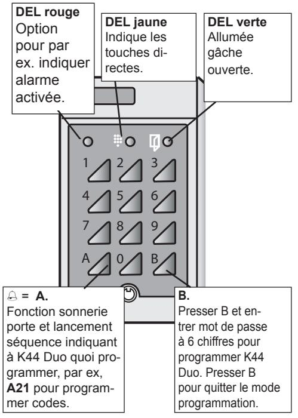

**FRA**

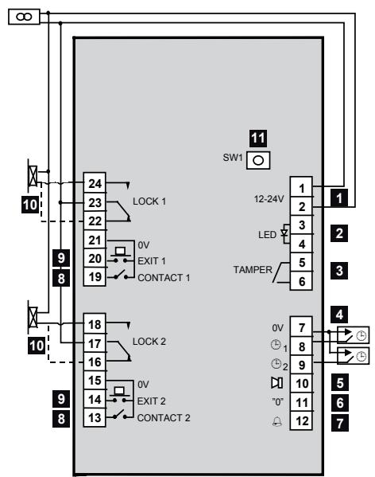

## *Câblage*

**FRA**

| 1  | Alimentation, borniers No 1(+) et 2. 12-24 V.                                                                                        |
|----|--------------------------------------------------------------------------------------------------------------------------------------|
| 2  | Entrée pour DEL (rouge) suppl., borniers No 3 et 4. 10-35 V CC.                                                                   |
| 3  | Interrupteur autoprotection, borniers No 5 et 6. Fermé quand le coffret est fermé.                                                |
| 4  | Code temporisé à partir de minuterie externe. Entrée 1 : ferme borniers No 8 et 7. Entrée 2 : ferme borniers No 9 et 7.        |
| 5  | Sortie pour alarme ou alarme agression. Utilise le relais E7. Connecté entre borniers No 10 et 1(+).                              |
| 6  | Contact pour ouverture zéro (0). Ferme les bor niers No 11 et 7.                                                                  |
| 7  | Sonnerie de porte. Sortie pour activer le ronfleur. Utilise le relais E7. Connecté entre borniers No 12 et 1(+).               |
| 8  | Entrée pour contacts de porte. Le contact est fermé quand la porte est fermée. Borniers No 13 et 15 (19 et 21 respectivement). |
| 9  | Bouton Sortie. La porte s'ouvre fermant les bor niers No 14 et 15 (20 et 21 respectivement).                                      |
| 10 | Gâche électrique. La ligne pointillée concerne la gâche avec fonction sécurité intégrée.                                          |
| 11 | Bouton-poussoir SW1. A utiliser pour définir le mot de passe et effacer la mémoire.                                               |

# *Programmation*

Avant de procéder à la programmation du K44 Duo, nous recommandons d'annoter les codes à programmer et auquel groupe de temporisation ils doivent appartenir. Au dos du manuel, vous trouverez une liste prévue à cet effet. Pendant la programmation, vous pouvez consulter la liste tout en procédant selon les instructions qui suivent.

## *Ronfleur et diodes DEL*

**FRA** Au cours de la programmation, vous êtes guidé(e) par le ronfleur et les diodes DEL.

**En mode programmation avant sélection d'une fonction** : Les DEL jaune et verte clignotent. **Durant la programmation** : La DEL jaune est

éteinte et la DEL verte allumée.

**Instruction correcte** : Confirmation par un signal ascendant de deux bips courts.

**Instruction incorrecte** : Confirmation par un

signal descendant de deux bips courts.

- *Note* : Si, lorsqu'en mode programmation vous n'appuyez sur aucune touche dans les 20 secondes, le K44 Duo retourne en mode normal.
## *Sélection du mot de passe*

La première chose à faire avant de programmer et de définir un mot de passe.

- 1 Appuyez et maintenez le bouton SW1 sur la carte imprimée. Les deux DEL sont allumées.
- 2 Entrez un mot de passe à 6 chiffres.
- 3 Annotez le nouveau mot de passe sur la liste au dos du manuel.

## *Modification du mot de passe*

- 1 Appuyez sur B et entrez le mot de passe actuel.
- 2 Entrez A27.
- 3 Entrez le nouveau mot de passe. Une tonalité d'avertissement retentit.
- 4 Entrez le nouveau mot de passe une nouvelle fois.
- 5 Appuyez sur B pour quitter le mode de programmation.
- 6 Annotez le nouveau mot de passe sur la liste au dos du manuel.

# *Commandes de programmation*

Appuyez toujours sur B et entrez le mot de passe avant l'utilisation d'une commande. Quittez le mode de programmation en appuyant sur B.

## *Programmation des codes d'entrée*

- 1 Appuyez sur B et entrez le mot de passe actuel.
- 2 Entrez A21.

**FRA**

- 3 Entrez la place de code désirée avec deux chiffres (01-30).
- 4 Entrez le code d'accès pour la place de code définie (quatre chiffres pour places de code 01-20 ou six chiffres pour places de code 21-30).

Note : Les quatre premiers chiffres d'un code à six chiffres ne doivent pas correspondre à ceux d'un code à quatre chiffres et vice versa.

- 5 Indiquez si le code doit pouvoir être désactivé pendant certaines périodes à partir d'une minuterie externe.
	- 0 = pas de commande temporisée
	- 1 = code temporisé à partir de minuterie 1
	- 2 = code temporisé à partir de minuterie 2
- 6 Indiquez la sortie relais à commander.
	- 0 = les deux sorties relais
	- 1 = sortie relais 1
	- 2 = sortie relais 2
- 7 Programmez le prochain code en continuant à partir du point 2 ou appuyez sur B pour quitter le mode programmation.

## *Annulation des codes*

- 1 Appuyez sur B et entrez le mot de passe actuel.
- 2 Entrez A22.
- 3 Entrez le code défini. Si c'est un code à 4 chiffres, entrez A après le dernier chiffre.
- 4 Si c'est un code à 4 chiffres, entrez 0000. Si c'est un code à 6 chiffres, entrez 000000.
- 5 Répétez le point 4 une seconde fois.
- 6 Entrez 0.
- 7 Entrez 0 une nouvelle fois.
- 8 Effacez le prochain code en continuant à partir du point 3 ou appuyez sur B pour sortir.

## *Modification des codes*

- 1 Appuyez sur B et entrez le mot de passe actuel.
- 2 Entrez A22.
- 3 Entrez le code d'accès défini. Si c'est un code à 4 chiffres, entrez A après le dernier chiffre.
- 4 Entrez le nouveau code en tapant quatre ou six chiffres.
- 5 Entrez le nouveau code une nouvelle fois.
- 6 Indiquez si le code doit pouvoir être désactivé pendant certaines périodes à partir d'une minuterie externe.
	- 0 = pas de commande temporisée
	- 1 = code temporisé à partir de minuterie 1
	- 2 = code temporisé à partir de minuterie 2
- 7 Indiquez la sortie relais à commander.
	- 0 = les deux sorties relais
	- 1 = sortie relais 1
	- 2 = sortie relais 2
- 8 Modifiez le prochain code en continuant à partir du point 3 ou appuyez sur B pour sortir.

## *Définition du temps d'ouverture*

Le temps d'ouverture règle le temps d'ouverture de la gâche après introduction d'un code d'entrée correct. A la livraison, le temps d'ouverture du K44 Duo est réglé sur 7 secondes pour les deux relais.

- 1 Appuyez sur B et entrez le mot de passe actuel.
- 2 Entrez A28.

**FRA**

- 3 Entrez le temps d'ouverture souhaité (01-99) avec deux chiffres, par ex. 09 pour 9 secondes.
#### 4 Indiquez sur quelle sortie relais sera appliqué le nouveau temps d'ouverture :

- 0 = les deux
- 1 = sortie relais 1
- 2 = sortie relais 2

## *Éclairage de fond M/A*

Procédez comme suit pour désactiver l'éclairage de fond du clavier, si besoin est.

- 1 Appuyez sur B et entrez le mot de passe actuel.
- 2 Entrez A60.
- 3 Entrez 0.

Pour réactiver l'éclairage de fond, appuyez sur 1 au lieu de 0 au point 3 ci-dessus.

## *Ronfleur M/A*

Procédez comme suit pour désactiver le ronfleur si vous ne souhaitez pas que celui-ci retentisse à chaque pression des touches ou à l'ouverture de la porte. Observez que le ronfleur continue à sonner pendant la programmation.

- 1 Entrez A65.
- 2 Entrez 0.

Pour réactiver le ronfleur, appuyez sur 1 au point 2 ci-dessus.

## *Fonction bascule d'option M/A*

Pour qu'il soit possible d'avoir la porte non verrouillée en permanence, la fonction bascule d'option doit être activé.

Procédez comme suit :

- 1 Appuyez sur B et entrez le mot de passe actuel.
- 2 Entrez A81.
- 3 Entrez 1.

**FRA**

- 4 Indiquez sur quelle sortie relais la fonction bascule d'option doit être appliquée.
	- 0 = les deux
	- 1 = sortie relais 1
	- 2 = sortie relais 2

Pour désactiver cette fonction, suivez les points cidessus, entrez 0 au lieu de 1 au point 3. Sous Déverrouiller la porte en permanence, vous trouverez les instructions vous permettant de déverrouiller la porte en permanence.

#### *Alarme agression ou Alarme*

Le K44 Duo permet d'utiliser soit agression ou alarme. La même commande est utilisé pour les deux fonctions.

#### *Alarm agression*

Lorsque la fonction *Alarme agression* est activée, l'utilisateur peut taper un code spécifique si, sous la menace, il/elle serait forcé(e) d'ouvrir la porte. Il est important d'établir un plan pour les actions à prendre en cas d'utilisation du code d'alarme agression.

- *Note* : Si la fonction *Alarme agression* est activée, veillez à ne pas programmer des codes qui se suivent dans l'ordre numérique. Exemple : Le code 1234 ne doit pas exister avec les codes 1235 et 1233. Le code 5679 n'est pas permis avec les codes 5670 et 5678.
La section *Entrée du code d'alarme agression* décrit la manière d'entrer le code d'alarme agression.

#### *Alarme*

A la livraison du K44 Duo, la sortie d'alarme est définie pour être activée si la porte reste trop longtemps ouverte ou si elle est forcée.

Observez que les contacts de porte doivent être connectés et que la fonction Commande de porte doit être activée à cet effet.

Sélectionnez une des fonctions comme suit :

- 1 Appuyez sur B et entrez le mot de passe actuel.
- 

**FRA**

- 2 Entrez A69. 3 Sélectionnez la fonction :
	- 0 = Alarme (valeur par default).
	- 1 = Alarme agression

Pour désactiver la fonction, entrez 0 au lieu de 1 au point 3 ci-dessus. (La fonction *Alarme* est alors réactivée).

#### *Commande de porte M/A*

Si des contacts de porte sont utilisés et si cette fonction est activée, un signal sonore retentit pendant le délai défini d'avertissement de porte ouverte, c.-à-d. lorsque le délai d'avertissement de porte ouverte est expiré et que la porte est toujours ouverte.

Si le délai d'avertissement de porte ouverte est expiré et que la porte est toujours ouverte, la sortie alarme est activée (si la fonction *Alarme* est activée). Cela est valable également lorsque la porte est forcée.

Procédez comme suit pour activer la fonction Commande de porte :

- 1 Appuyez sur B et entrez le mot de passe actuel.
- 2 Entrez A67.
- 3 Entrez 1.

Pour désactiver la fonction Commande de porte, appuyez sur 0 au lieu de 1 au point 3 ci-dessus.

## *Définition du délai d'avertissement de porte ouverte*

Si la porte est toujours ouverte quand le délai d'ouverture a expiré, un ronfleur retentit pour rappeler au visiteur de refermer la porte immédiatement – la sortie d'alarme sera autrement activée. Le ronfleur retentit jusqu'à fermeture de la porte. Observez que les contacts de porte doivent être connectés et que la fonction Commande de porte doit être activée à cet effet.

Procédez comme suit pour modifier le délai d'avertissement de porte ouverte, le cas échéant :

- 1 Appuyez sur B et entrez le mot de passe actuel.
- 2 Entrez A29.

**FRA**

- 3 Entrez le délai d'ouverture souhaité (01-99) avec deux chiffres, par ex. 09 pour 9 secondes.
- 4 Indiquez sur quelle sortie relais sera appliqué le nouveau délai d'avertissement :
	- 0 = les deux
	- 1 = sortie relais 1
	- 2 = sortie relais 2

## *Fonction différée M/A*

Lorsque cette fonction est activée, deux options sont possibles : si un code est programmé pour ouvrir deux portes, le relais de gâche 2 n'est pas activé avant que la porte 1 ait été ouverte et fermée.

Si la porte 2 est ouverte au moyen du bouton Sortie, la porte 2 doit être ouverte et fermée avant que la porte 1 soit ouverte.

Observez que les contacts de porte doivent être connectés et que la fonction Commande de porte doit être activée à cet effet.

Procédez comme suit pour activer le mode Fonction différée :

- 1 Appuyez sur B et entrez le mot de passe actuel.
- 2 Entrez A80.
- 3 Entrez 1.

Pour désactiver le mode Fonction différée, appuyez sur 0 au lieu de 1 au point 3 ci-dessus.

## *Annulation de la mémoire*

Procédez comme suit pour effacer toutes les informations programmées (y compris le mot de passe):

- 1 Appuyez sur B et entrez le mot de passe.
- 2 Appuyez sur SW1 sur la carte imprimée de K44 Duo.
- 3 Entrez 112186.
- 4 Entrez 112186 une nouvelle fois. La mémoire est à présent effacée et K44 Duo reprend les paramètres d'origine.
- 5 Appuyez sur B.

**FRA**

# *Utilisation de K44 Duo*

#### Passage d'entrée

Pour ouvrir la gâche, il faut taper un code à quatre chiffres (ou à six chiffres) sur le clavier du combiné d'entrée.

Après 12 pressions de touche n'aboutissant pas à un code correct, le K44 Duo sera bloqué. Pour annuler ce blocage, il faut taper un code correct deux fois de suite.

Ouverture permanente de la gâche

Procédez comme suit pour ouvrir la gâche afin que la porte reste ouverte en permanence :

- 1 Appuyez sur B.
- 2 Tapez le code d'entrée.
- 3 Entrez 1.

La porte est maintenant déverrouillé (DEL verte allumée). Pour verrouiller la porte, procédez selon les instructions ci-dessus mais entrez 0 au lieu de 1 au point 2.

## *Entrée du code d'alarme agression*

Procédez comme suit pour activer la sortie d'alarme lorsque la porte est forcée sous la menace :

Entrez le code d'accès actuel mais ajoutez le chiffre 1 au dernier chiffre du code.

**Exemple 1**: Si le code d'accès est 1234, entrez 1235 à la place.

**Exemple 2**: Si le code d'accès est 1239, entrez 1230 à la place.

Lorsqu'un code d'alarme agression est entré, la sortie d'alarme agression est activée en même temps que l'ouverture de la porte. Elle reste activée jusqu'à remise à l'état initial par une personne qui entre le mode de programmation.

# *Caractéristiques techniques*

| Alimentation :                          | 8-24 V CA, 10-35 V CC                 |
|-----------------------------------------|------------------------------------------|
| Consommation :                          | 75 mA.                                   |
| Charge maxi aux bornes relais :      | 2 A 28 V CC                              |
| Dimensions (HxlxP) mm :              | 140x80x40                                |
| Hauteur d'installation recommandée : | 1200-1400 mm du sol au bord inférieur |

Peut être complété du coffret encastrable BB3, pour un montage en affleurement.

|                         |              | Synoptique de programmation                                                                                                                                              |                                                                                       |                                        |
|-------------------------|--------------|--------------------------------------------------------------------------------------------------------------------------------------------------------------------------|---------------------------------------------------------------------------------------|----------------------------------------|
| B                       | Étape 6      | on). ode e mencez mod B mati par étape 2. Ap- n c puyez sur (retour à e : m ai progra Proch m orti Co : S | essus Voir ci-d                                                                    | essus Voir ci-d                     |
| Appuyez sur Sortir : | Étape 5      | Entrez sortie eux 1 = relais 1 2 = relais 2 0 = les d relais                                                                                              | Entrez sortie eux 1 = relais 1 2 = relais 2 0 = les d relais           | Entrez 0                               |
| e passe. mot d       | Étape 4      | pe 1 mite pe 2 0 = aucun d'accès 1 = grou 2 = grou Entrez li                                                                                        | pe 1 mite pe 2 0 = aucun d'accès 1 = grou 2 = grou Entrez li     | Entrez 0                               |
| B et par entrer le      | Étape 3      | e(4 ou 6 chiffres) Entrez cod                                                                                                                                   | ou- e eux fois) veau cod Entrez n (d                                   | Entrez 0000 eux (00) (d fois) |
| ours par appuyer sur    | Étape 2      | Places e 21-30 Entrez place es à 6 e (2 chiffres). chiffres du cod du cod = cod                                                               | Entrez e à 4 Entrez ancien Cod chiffres : A e + e. cod cod | essus Voir ci-d                     |
| mencez touj             | Étape 1      | Entrez A21                                                                                                                                                            | Entrez A22                                                                         | Entrez A22                          |
| m Co                 | on Foncti | ouveau d'accès e cod N                                                                                                                                       | odifier accès e cod M                                                     | Annuler accès e cod           |

| mencez touj m Co                                            | ours par appuyer sur | mot d B et par entrer le                 | Sortir : e passe.                                  | B Appuyez sur |         |
|-------------------------------------------------------------------|----------------------|---------------------------------------------|-------------------------------------------------------|------------------|---------|
| on Foncti                                                      | Étape 1              | Étape 2                                     | Étape 3                                               | Étape 4          | Étape 5 |
| mps d'ouverture odifier te M                             | A28 Entrez        | es (01-99) Entrez second                 | relais (0, 1 ou 2) Entrez sortie                   |                  |         |
| élai d'aver ment t porte odifier d ouverte tisse M | A29 Entrez        | es (01-99) Entrez second                 | relais (0, 1 ou 2) Entrez sortie                   |                  |         |
| e mot d odifier passe M                               | A27 Entrez        | e (6 ouveau cod Entrez n chiffres) | ouveau ou e n Entrez n e d veau cod |                  |         |
| e fond Éclairage d A M/                                  | A60 Entrez        | 0 = off 1 = on                           |                                                       |                  |         |
| A M/ Ronfleur                                               | A65 Entrez        | 0 = off 1 = on                           |                                                       |                  |         |
| e porte mand m A Co M/                             | A67 Entrez        | 0 = off 1 = on                           |                                                       |                  |         |

**FRA**

#### *102 K44 Duo Manuel d'installation et utilisation*

**FRA**

| mencez touj m Co | ours par appuyer sur | mot d B et par entrer le      | Sortir : e passe.   | B Appuyez sur  |         |
|------------------------|----------------------|----------------------------------|------------------------|-------------------|---------|
| on Foncti           | Étape 1              | Étape 2                          | Étape 3                | Étape 4           | Étape 5 |
| me Alar Alerte/  | Entrez               | me 0 = alerte on, alar        |                        |                   |         |
| on agressi          | A69                  | on off agressi                |                        |                   |         |
|                        |                      | on on, me agressi 1 = alar |                        |                   |         |
|                        |                      | alerte off                       |                        |                   |         |
| on différée Foncti  | Entrez               | 0 = off                          |                        |                   |         |
| A M/                | A80                  | 1 = on                           |                        |                   |         |
|                        |                      |                                  |                        |                   |         |
| on bascule Foncti   | Entrez               | 0 = off                          | Entrez sortie          |                   |         |
| A M/ on opti  | A81                  | 1 = on                           | relais (0,1 ou 2)      |                   |         |
|                        |                      |                                  |                        |                   |         |
| mory me Erase    | Ouvrir le            | W1 sur carte S Presser le  | 86 21 Presser 11 | Presser           |         |
|                        | o Du K44       | mée mpri i                 | e oc d sur lebl  | 86 en 21 11 |         |
|                        |                      |                                  | touches                | core une fois     |         |

**FRA**

#### Dansk

Data og design kan ændres uden varsel. Leveres så længe lager haves. © Copyright Siemens AB

Vi forbeholder os alle rettigheder i dette dokument og dets indhold. Ved at acceptere modtagelsen af dette dokument anerkender modtageren disse rettigheder og vil undlade at udgive dokumentet eller dets indhold i dele eller i sin helhed eller stille det til rådighed for nogen tredjepart uden forudgående udtrykkelig tilladelse eller benytte det til noget andet formål det, der var tiltænkt ved overdragelsen

.

## *Indhold*

**DAN**

| Generelt om K44 Duo                      | 109     |
|------------------------------------------|---------|
| Åbning af to døre med én kode         | 109     |
| Vælg hvornår koderne skal gælde       | 109     |
| Overfaldskode eller alarm                | 110     |
| 0-åbning                                 | 110     |
| Oplåsning af døren                    | 110     |
| Ringeklokke                              | 110     |
| Tastaturet 111                        |         |
| Tilslutning                           | 112     |
| Programmering                            | 114     |
| Summer og lysdioder                      | 114     |
| Valg af programmeringskode            | 115     |
| Ændring af den valgte programmeringskode |  115 |
| Programmeringskommando                   | 115     |
| Programmering af koder                   | 116     |
| Sletning af koder                        | 117     |
| Ændring af koder                         | 118     |
| Indstilling af åbningstid                | 119     |
| Baggrundsbelysning til/fra            | 119     |
| Summer til/fra                           | 120     |
| Bistabil funktion til/fra                | 120     |
| Dørkontrol til/fra                       | 122     |
| Indstilling af døralarmtid               | 123     |
| Forsinkelse til/fra                   | 124     |
| Sletning af hukommelse                   | 124     |
| Betjening af K44 Duo                  | 125     |
| Adgang                                   | 125     |
| Oplåsning af døren                    | 125     |
| Indtastning af overfaldskode             | 126     |
| Tekniske data                            | 127     |

# *Generelt om K44 Duo*

K44 Duo er en kompakt kodelås med to relæudgange. K44 Duo kan således anvendes til at styre op til to døre – eller én dør og en anden valgfri funktion, f.eks. indendørs-belysning. Al programmering foregår via tastaturet.

## *Åbning af to døre med én kode*

Rent praktisk giver to relæudgange mulighed for med den korrekte kode at aktivere to funktioner på samme tid. Koden kan f.eks. låse døren op og tænde for lyset på samme tid.

En anden mulighed er at koble kodelåsen til to døre. Du kan dermed programmere systemet således, at du åbner begge døre med én kode, mens du med en anden kode kun åbner én dør.

Hvis koden skal åbne to døre, kan du også indstille K44 Duo således, at dør nummer to ikke åbnes, før den første dør er åbnet og låst igen, dvs. at åbningen af dør nummer to sker med forsinkelse.

For hver kode er det muligt at vælge mellem at aktivere begge relæudgange, kun den første eller kun den anden.

## *Vælg hvornår koderne skal gælde*

K44 Duo giver mulighed for – via et eksternt ur – at tidsstyre de koder, du har indprogrammeret. Visse koder, f.eks. postbudets, skal måske kun fungere i bestemte tidsrum af døgnet, mens husets beboere skal kunne komme ind døgnet rundt. Hvis du kobler to ure til K44 Duo, kan du operere med tre forskellige tidszoner til tidsstyring af koderne: én som styres af ur 1, én som

styres af ur 2 og én som gælder hele døgnet, dvs. uden tidsstyring.

## *Overfaldskode eller alarm*

K44 Duo er udstyret med en udgang, som aktiveres i et af følgende tilfælde:

- 1 Når en person indtaster sin overfaldskode. **ELLER**
- 2 Når døralarmtiden udløber eller hvis døren brydes op.

Du vælger selv, hvilket af de to ovennævnte alternativer, du ønsker at anvende. Du kan efterfølgende tilslutte f.eks. en ejendomsalarm til udgangen.

## *0-åbning*

**DAN**

Hvis du vil lette adgangen gennem døren i f.eks. kontortiden, kan du tilslutte en fjernmonteret kontakt, hvormed du kan til- eller frakoble muligheden for at åbne døren ved blot at trykke nul på tastaturet. Bemærk, at dette udelukkende kan ske gennem relæudgang 1.

## *Oplåsning af døren*

Hvis bistabil funktion er aktiveret, kan man med koden låse døren op, som herefter forbliver ulåst, indtil man igen indtaster en gyldig kode (se afsnittet Bistabil funktion til/fra).

## *Ringeklokke*

Det er også muligt at koble en ringeklokke til K44 Duo. Den besøgende skal i så fald trykke på den tast, der er markeret med en ringeklokke på kodelåsens tastatur.

## *Tastaturet*

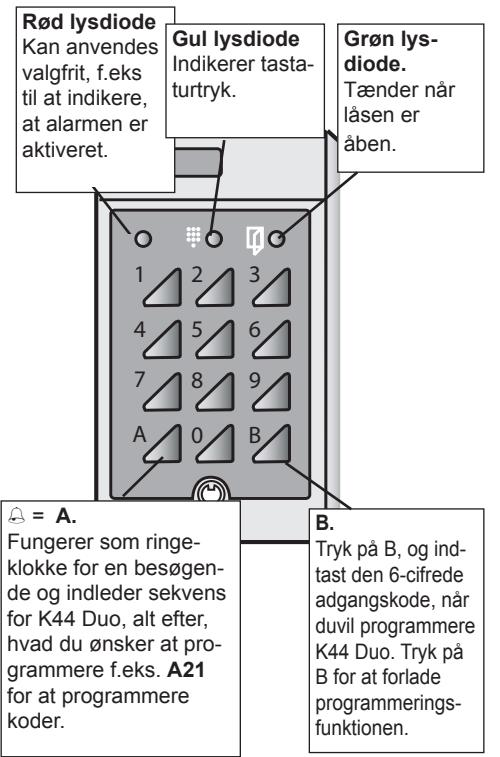

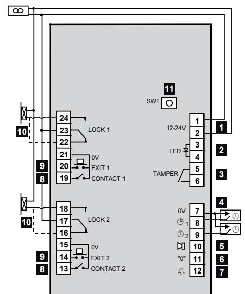

# *Tilslutning*

**DAN**

| 1  | Spændingsforsyning, klemme 1(+) og 2. 12-24 V.                                                                          |
|----|-------------------------------------------------------------------------------------------------------------------------|
| 2  | Indgang til ekstra lysdiode (rød), klemme 3 og 4. 10-35 V DC.                                                        |
| 3  | Sabotageafbryder, klemme 5 og 6. Normalt aktive ret, når kabinettet er lukket.                                       |
| 4  | Tidsstyring fra eksternt ur. Indgang 1: Forbind klemme 8 og 7. Indgang 2: Forbind klemme 9 og 7.                  |
| 5  | Udgang til alarm- eller overfaldskode. Anvend relæ E7. Tilsluttes mellem klemme 10 og 1(+).                          |
| 6  | Kontakt til 0-åbning. Forbind klemme 11 og 7.                                                                           |
| 7  | Ringeklokke. Udgang til aktivering af summer eller lignende. Anvend relæ E7. Tilsluttes mellem klemme 12 og 1(+). |
| 8  | Indgang til dørkontakter. Kontakten er låst, når døren er låst. Klemme 13 og 15 (hhv. 19 og 21).                     |
| 9  | Fjernmonteret døråbningsknap. Døren åbnes ved at forbinde klemme 14 og 15 (hhv. 20 og 21).                           |
| 10 | Elektrisk lås. En stiplet linie gælder lås med om vendt funktion.                                                    |
| 11 | SW1 trykknap. Anvendes ved valg af programme ringskode og ved sletning af hukommelsen.                               |

# *Programmering*

Før du begynder at programmere K44 Duo, kan det være en god idé at notere de koder, du skal programmere, hvilken tidsstyringsgruppe de skal tilhøre samt hvilken relæudgang de skal styre. Bagest i håndbogen finder du en liste, som er beregnet til dette formål. Når du programmerer, kan du benytte listen, samtidig med at du følger nedenstående vejledning.

## *Summer og lysdioder*

**DAN**

Når du programmerer, får du vejledning via summeren og lysdioderne.

#### **I programmeringsfunktion inden valg af funktion:** Grøn og gul lysdiode blinker.

**Under programmering:** Gul lysdiode er slukket. Grøn lysdiode lyser.

**Korrekt indtastning:** Bekræftes med stigende signal bestående af to korte toner.

**Forkert indtastning:** Bekræftes med faldende signal bestående af to korte toner.

- *Bemærk:* Hvis du under programmering ikke trykker på nogen tast i 20 sekunder, vender kodelåsen tilbage til normaltilstand.
## *Valg af programmeringskode*

Det første, du skal gøre, inden du kan programmere K44 Duo, er at vælge en programmeringskode.

- 1 Tryk på tasten SW1 på kodelåsens printkort. Begge lysdioder lyser konstant.
- 2 Indtast en 6-cifret programmeringskode. Du kan nu programmere kodelåsen.
- 3 Notér den nye programmeringskode på listen bag i håndbogen.

## *Ændring af den valgte programmeringskode*

- 1 Tast B, og indtast den nuværende programmeringskode.
- 2 Tast A27.
- 3 Indtast den nye programmeringskode. Der lyder en advarselstone.
- 4 Indtast den nye programmeringskode igen.
- 5 Tast B for at forlade programmeringsfunktionen.
- 6 Notér den nye programmeringskode på listen bag i håndbogen.

# *Programmeringskommando*

Anvend altid B+programmeringskode inden kommandoen angives. Afslut med B.

## *Programmering af koder*

- 1 Tast B, og indtast den nuværende programmeringskode.
- 2 Tast A21.
- 3 Indtast den ønskede kodeplads med to cifre (01-30).
- 4 Indtast brugekoden for den kodeplads, du har valgt (fire cifre for kodeplads 01-20 eller seks cifre for kodeplads 21-30).

**Bemærk:** De første fire cifre i en 6-cifret kode må ikke være identiske med cifrene i en 4-cifret kode og omvendt.

- 5 Angiv, om koden skal kunne kobles fra i visse tidsrum via et ur.
	- 0 = ingen tidsstyring
	- 1 = koden skal tidsstyres via ur 1
	- 2 = koden skal tidsstyres via ur 2
- 6 Angiv, hvilken relæudgang koden skal styre.
	- 0 = begge relæudgange
	- 1 = relæudgang 1
	- 2 = relæudgang 2
- 7 Programmér næste kode ved at fortsætte fra trin 3 eller tryk på B for at slutte.

## *Sletning af koder*

- 1 Tast B, og indtast den nuværende programmeringskode.
- 2 Tast A22.
- 3 Indtast den relevante kode. Hvis det er en 4-cifret kode, skal du afslutte med A.
- 4 Hvis koden er 4-cifret, skal du taste 0000. Hvis koden er 6-cifret, skal du taste 000000
- 5 Tryk 0000 (000000) igen.
- 6 Tast 0.
- 7 Tast 0 igen.

Slet næste kode ved at fortsætte fra trin 3 eller tryk på B for at slutte.

## *Ændring af koder*

- 1 Tast B, og indtast den nuværende programmeringskode.
- 2 Tast A22.
- 3 Indtast den relevante kode. Hvis det er en 4-cifret kode, skal du afslutte med A.
- 4 Indtast den nye kode med fire eller seks cifre.
- 5 Indtast den nye kode igen.
- 6 Angiv, om koden skal kunne kobles fra i visse tidsrum via et ur.
	- 0 = ingen tidsstyring
	- 1 = koden skal tidsstyres via ur 1
	- 2 = koden skal tidsstyres via ur 2
- 7 Angiv hvilket relæ koden skal styre.
	- 0 = begge relæudgange
	- 1 = relæudgang 1
	- 2 = relæudgang 2
- 8 Ændre næste kode ved at fortsætte fra trin 3 eller tryk på B for at afslutte programmering af koder.

## *Indstilling af åbningstid*

Åbningstiden styrer, hvor længe låsen skal stå åben, når der indtastes en korrekt programmeringskode. Ved levering er åbningstiden for K44 Duo 7 sekunder for begge relæer.

- 1 Tast B, og indtast den nuværende programmeringskode.
- 2 Tast A28.
- 3 Indtast den ønskede åbningstid (01-99) med to cifre, f.eks. 09 for 9 sekunder.
- 4 Angiv, hvilken relæudgang åbningstiden gælder for:
	- 0 = begge relæudgange
	- 1 = relæudgang 1
	- 2 = relæudgang 2

## *Baggrundsbelysning til/fra*

Hvis du ønsker det, kan du slukke for baggrundsbelysningen på tastaturet på følgende måde.

- 1 Tast B, og indtast den nuværende programmeringskode.
- 2 Tast A60.
- 3 Tast 0.

Hvis du ønsker at aktivere baggrundsbelysningen igen, skal du taste 1 i trin 3 i stedet for 0.

### *Summer til/fra*

Hvis du ikke ønsker, at summeren skal lyde ved knaptryk eller åbning, kan du slå den fra. Bemærk, at summeren fortsat lyder under programmering.

- 1 Tast B, og indtast den nuværende programmeringskode.
- 2 Tast A65.
- 3 Tast 0.

**DAN**

Hvis du ønsker at aktivere summeren igen, skal du taste 1 i trin 3 i stedet for 0.

#### *Bistabil funktion til/fra*

Hvis du ønsker at låse en dør op, således at den står ulåst gennem længere tid end den programmerede åbningstid, skal du aktivere bistabil funktion.

Følg nedenstående fremgangsmåde:

- 1 Tast B, og indtast den nuværende programmeringskode.
- 2 Tast A81.
- 3 Tast 1.
- 4 Angiv, for hvilket relæ bistabil funktion skal aktiveres.
	- 0 = begge
	- 1 = relæ 1
	- 2 = relæ 2

Hvis du ønsker at deaktivere bistabil funktion, skal du taste 0 i trin 3 i stedet for 1. I afsnittet *Oplås-* *ning af døren* beskrives det, hvordan døren låses op.

#### *Overfaldsalarm eller Alarmudgang*

K44 Duo tillader, at enten overfaldsalarm- eller alarmudgang kan anvendes. Du kan anvende den samme kommando, men vælge forskellig funktion.

#### **Overfaldskode**

Med funktionen *Overfaldsalarm* aktiveret kan indkommende indtaste en bestemt kode, hvis han eller hun tvinges til at åbne døren. Det er vigtigt, at der lægges en plan for, hvilke foranstaltninger der skal træffes ved aktivering af overfaldsalarmen. **Bemærk**: Hvis overfaldsalarmen er aktiveret, kan du ikke benytte koder, som følger efter hinanden i nummerorden. Kode 1234 må f.eks. ikke forekomme sammen med koderne 1235 og 1233. Kode 5679 må ikke forekomme sammen med koderne 5670 og 5678

I afsnittet *Indtast overfaldskode ved overfald* beskrives det, hvorledes en indkommende person benytter denne funktion.

#### **Alarmudgang**

Når K44 Duo leveres, er alarmudgangen indstillet til at aktiveres, hvis døren står åben for længe, eller hvis døren brydes op.

Bemærk, at dørkontakter skal være tilsluttet og at funktionen *Dørkontrol* skal være aktiveret, for at dette kan fungere.

Funktionen aktiveres på følgende måde:

- 1 Tast A69.
**DAN**

- 2 Tast 1. (Derved afbryder du funktionen Alarmudgang).
## *Dørkontrol til/fra*

Hvis der anvendes dørkontakter og denne funktion er aktiveret, lyder der et advarselssignal efter den tid, som er indstillet som døralarmtid, dvs. når åbningstiden udløber, og døren stadig er åben. Hvis døralarmtiden også udløber, og døren stadig er åben, aktiveres alarmudgangen (hvis funktionen *Alarmudgang* er aktiveret). Dette sker også, hvis døren brydes op.

Dørkontrolfunktionen aktiveres på følgende måde:

- 1 Tast B, og indtast den nuværende programmeringskode.
- 2 Tast A67.
- 3 Tast 1.

Hvis du ønsker at deaktivere dørkontrollen igen,

skal du taste 0 i trin 3 i stedet for 1.

## *Indstilling af døralarmtid*

Hvis døren fortsat er åben, når åbningstiden er udløbet, lyder en summer ved døren. Summeren er en påmindelse til den indkommende om at låse døren med det samme. Ellers aktiveres alarmudgangen. Summeren lyder, indtil døren nulstilles. Bemærk, at dørkontakter skal være tilsluttet og at funktionen Dørkontrol skal være aktiveret, for at dette kan fungere.

Om nødvendigt kan du ændre døralarmtiden på følgende måde:

- 1 Tast B, og indtast den nuværende programmeringskode.
- 2 Tast A29.
- 3 Indtast den ønskede døralarmtid (01-99) med to cifre, f.eks. 09 for 9 sekunder.
- 4 Angiv, hvilken relæudgang døralarmtiden gælder for:
	- 0 = begge relæudgange
	- 1 = relæudgang 1
	- 2 = relæudgang 2

## *Forsinkelse til/fra*

Når denne funktion er aktiveret, sker følgende: Hvis en kode er programmeret til at åbne to døre, aktiveres låserelæ 2 først, når dør 1 er åbnet og lukket igen.

Hvis dør 2 åbnes med den fjernmonterede døråbningsknap, skal dør 2 åbnes og lukkes, før dør 1 kan åbnes.

Bemærk, at dørkontakter skal være tilsluttet og at funktionen Dørkontrol skal være aktiveret, for at dette kan fungere.

Forsinkelsesfunktionen aktiveres på følgende måde:

- 1 Tast B, og indtast den nuværende programmeringskode.
	- 2 Tast A80.
	- 3 Tast 1.

**DAN**

Hvis du ønsker at deaktivere forsinkelsesfunktionen igen, skal du taste 0 i trin 3 i stedet for 1.

## *Sletning af hukommelse*

Således sletter du alle programmerede oplysninger (også programmeringskoden):

- 1 Tast B, og indtast den nuværende programmeringskode.
- 2 Tryk på tasten SW1 på K44 Duo's printkort.
- 3 Tast 112186.
- 4 Tast 112186 en gang til. Hukommelsen er nu

slettet, og K44 Duo er nulstillet til de standardværdier, som den havde fra fabrikken.

# *Betjening af K44 Duo*

## *Adgang*

For at åbne låsen indtastes en 4-cifret (eller 6-cifret) kode på kodelåsens tastatur.

K44 Duo blokeres efter 12 tastaturtryk, som ikke udgør en korrekt kode. For at annullere blokeringen skal der indtastes en korrekt kode to gange i træk.

## *Oplåsning af døren*

For at låse døre op permanent skal du gøre følgende:

- 1 Tast B.
- 2 Indtast programmeringskoden.
- 3 Tast 1.

Døren er nu ulåst (grøn lysdiode tænder). Hvis du ønsker at låse døren, skal du følge ovenstående fremgangsmåde, men taste 0 i trin 3 i stedet for 1.

#### *Indtastning af overfaldskode*

Den indkommende kan aktivere en alarm, hvis han eller hun tvinges til at åbne døren:

Indtast den sædvanlige programmeringskode, men **læg 1 til det sidste ciffer** i koden.

**Eksempel 1**: Hvis programmeringskoden er 1234, tastes i stedet 1235.

**Eksempel 2**: Hvis programmeringskoden er 1239, tastes i stedet 1230.

Når du indtaster en overfaldskode, åbnes døren samtidig med, at alarmudgangen aktiveres. Denne forbliver aktiveret, indtil du nulstiller den via programmeringsfunktionen.

# *Tekniske data*

| Strømforsyning:                            | 8-24 V AC, 10-35 V DC                  |
|--------------------------------------------|-------------------------------------------|
| Strømforbrug:                              | 75 mA.                                    |
| Maks. belastning ved relæ kontakterne:  | 2 A 28 V DC                               |
| Dimensioner (HxBxD) mm:                    | 140x80x40                                 |
| Anbefalet monteringshøjde:                 | 1200-1400 mm fra gulv til underkant |
| Ved indbygning anvendes indbygningskabinet |                                           |

Ved indbygning anvendes indbygningskabinet BB3.

| D |  |
|---|--|
| A |  |
| N |  |
|   |  |

| B. Afbryd: Tast | Trin 6       | B æste kode: (tilbage til pro- merings- Tast æt fra onen). ut: trin 2. funkti Forts m Afsl gra N æ- 1 0 = begge 2 Indtast rel æ æ | m ovenfor So æ 1 0 = begge 2 Indtast rel æ æ                      | m ovenfor. So 0          |
|--------------------|--------------|--------------------------------------------------------------------------------------------------------------------------------------------------------------------------------------------------|-------------------------------------------------------------------------------------------|--------------------------------|
| en.                | Trin 5       | udgang 1 = rel 2 = rel                                                                                                                                                                     | udgang 1 = rel 2 = rel                                                              | Tast                           |
| meringskod m    | Trin 4       | Indtast styrings- ppe 1 ppe 2 0 = ingen ppe 1 = gru 2 = gru gru                                                                                                             | Indtast styrings ppe 1 ppe 2 0 = ingen ppe 1 = gru 2 = gru gru       | 0 Tast                      |
| erefter progra     | Trin 3       | e Indtast kod (4 eller 6 cifre)                                                                                                                                                         | Indtast ny e (2 gange) kod                                                       | Tast 0000 (00) (2 gange) |
| B, og indtast d    | Trin 2       | epladserne er. plads (2 cifre) e- e kod 21-30 giver Indtast kod 6-cifred Kod                                                                                             | e: Tast 4- e. en mle kod A cifret kod en + Indtast d kod ga | m ovenfor So                |
| med at taste       | Trin 1       | Tast A21                                                                                                                                                                                      | Tast A22                                                                               | Tast A22                    |
| Begynd altid       | on Funkti | mering af m- Progra er kod                                                                                                                                                           | Ændring er af kod                                                                   | Sletning er af kod       |

| on Funkti                              | Trin 1       | Trin 2                                | Trin 3                                        | Trin 4 | Trin 5 |
|-------------------------------------------|--------------|---------------------------------------|-----------------------------------------------|--------|--------|
| Ændring af åb ningstid                 | A28 Tast  | er Indtast antal sekund (01-99) | udgang (0, 1 æ- Indtast rel eller 2) |        |        |
| mstid örrlar Ändra d                | A29 Tast  | er Indtast antal sekund (01-99) | udgang (0, 1 æ Indtast rel eller 2)  |        |        |
| m Ændring af progra e meringskod | A27 Tast  | e (6 cifre) Indtast ny kod         | e Indtast ny kod igen                   |        |        |
| Baggrundsbelysning til/fra             | A60 Tast  | 0 = fra 1 = til                    |                                               |        |        |
| mer til/fra m Su                    | A65 Tast  | 0 = fra 1 = til                    |                                               |        |        |
| ørkontrol til/fra D                    | A67 Tryck | 0 = fra 1 = til                    |                                               |        |        |

*Programmeringsoversigt*

**DAN**

| D |  |
|---|--|
|   |  |
|   |  |
| A |  |
|   |  |
| N |  |
|   |  |

| med at taste Begynd altid          | B, og indtast d | en. meringskod m erefter progra                                             | B. Afbryd: Tast       |                |        |
|---------------------------------------|-----------------|--------------------------------------------------------------------------------------|--------------------------|----------------|--------|
| on Funkti                          | Trin 1          | Trin 2                                                                               | Trin 3                   | Trin 4         | Trin 5 |
| mudgang/over e faldskod Alar | A69 Tast     | e fra m fra m til, overfaldskod e til, alar 1 = overfaldskod 0 = alar |                          |                |        |
|                                       |                 |                                                                                      |                          |                |        |
| Forsinkelse til/fra                   | A80 Tast     | 0 = fra                                                                              |                          |                |        |
|                                       |                 | 1 = til                                                                              |                          |                |        |
| on Bistabil funkti                 | A81 Tast     | 0 = fra                                                                              | æ Indtast rel         |                |        |
| til/fra                               |                 | 1 = til                                                                              | udgang (0, 1 eller 2) |                |        |
| m Sletning af huko                 | K44 Åbn      | W1 S Tryk på tasten                                                            | 86 21 11 Tast   | Tast           |        |
| melse                                 | o Du         |                                                                                      |                          | 86 21 11 |        |
|                                       |                 |                                                                                      |                          | igen           |        |

#### Suomi

Tiedot ja ulkoasu voivat muuttua ilman erillistä ilmoitusta. Saatavuus voi vaihdella.

© Copyright Siemens AB

Pidätämme itsellämme kaikki oikeudet tätä ohjekirjaa ja itse tuotetta koskeviin muutoksiin. Tuotteisiin ja järjestelmiin sisältyviä ohjelmia ja ohjeita ei saa muuttaa, kopioida tms. ilman lupaa. Tekijänoikeuden loukkauksesta voidaan tuomita sakko- tai vapausrangaistukseen, ja syyllinen voi joutua maksamaan vahingonkorvauksen sekä korvauksia ohjelmiston käytöstä

# *Sisällys*

**FIN**

| Mikä on K44 Duo?                       | 133 |
|-------------------------------------------|-----|
| Kahden oven avaaminen yhdellä koodilla    | 133 |
| Koodien käytön estäminen tarvittaessa  | 133 |
| Aukaisu uhattuna tai hälytys           | 134 |
| Nolla-avaus                               | 134 |
| Lukon avaaminen pysyvästi              | 134 |
| Ovikello                                  | 134 |
| Näppäimistö                               | 135 |
| Asennus                                | 136 |
| Ohjelmointi                               | 138 |
| Summeri ja merkkivalot                    | 138 |
| Ohjelmointikoodin valitseminen            | 139 |
| Ohjelmointikoodin muuttaminen             | 139 |
| Ohjelmointikomentoja                      | 139 |
| Koodien ohjelmointi                    | 140 |
| Koodien poistaminen                    | 141 |
| Koodien muuttaminen                       | 142 |
| Aukiohjausajan asettaminen             | 143 |
| Taustavalo päällä tai pois                | 143 |
| Summeri päällä tai pois                   | 144 |
| Lukko pysyvästi auki on/ei             | 144 |
| Aukaisu uhattuna tai ovihälytyslähtö   | 144 |
| Ovenvalvonta on/ei                        | 146 |
| Oven aukipidon varoitusajan asettaminen   | 147 |
| Sulutus päällä/ei päällä               | 148 |
| Muistin tyhjentäminen                     | 148 |
| K44 Duon käyttäminen                      | 149 |
| Oven avaaminen                         | 149 |
| Lukon avaaminen pysyvästi              | 149 |
| Aukaisu uhattuna –koodin näppäily      | 150 |
| Tekniset tiedot                        | 151 |
|                                           |     |

# *Mikä on K44 Duo?*

K44 Duo on kompakti koodilukko, jossa on kaksi relelähtöä. Näin K44 Duolla voi ohjata kahta ovea - tai yhtä ovea sekä valinnaista toimintoa, esim. valokytkintä. Kytketyt ovet aukeavat joko neli- tai kuusinumeroisella koodilla. Laite ohjelmoidaan näppäimillä.

## *Kahden oven avaaminen yhdellä koodilla*

Kahden relelähdön hyöty on siinä, että kahta toimintoa voidaan käyttää samanaikaisesti. Koodilla voidaan esimerkiksi avata lukko ja sytyttää valot samalla kertaa.

Koodilukko voidaan myös yhdistää kahteen oveen. Yksi koodi on ohjelmoitu avaamaan molemmat ovet ja toinen avaamaan vain toisen oven.

Jos koodi on ohjelmoitu avaamaan molemmat ovet, K44 Duo voidaan asettaa avaamaan toinen ovi vasta, kun ensimmäinen ovi on avattu ja suljettu (ks. Viive-osa).

Valitse kunkin koodin kohdalla, haluatko aktivoida jommankumman tai molemmat relelähdöt.

## *Koodien käytön estäminen tarvittaessa*

On mahdollista estää K44 Duon koodien käyttäminen haluttuina aikoina. Esimerkiksi siivoojien pääsy rakennukseen voidaan rajoittaa tiettyihin aikoihin samalla, kun asukkaat/henkilökunta voivat kulkea ovista 24 h/vrk.

Jos K44 Duoon kytkee kaksi ohjauskelloa, käytössä on kolme eri aikaohjausryhmää koodien ohjaukseen: yhtä ohjaa kello 1, toista kello 2 ja kolmas on voimassa koko vuorokauden.

## *Aukaisu uhattuna tai hälytys*

K44 Duossa on lähtö, joka voidaan aktivoida seuraavista syistä:

- Käyttäjä voi näppäillä aukaisu uhattuna -koodin.
- Oven aukipidon varoitusaika päättyy tai ovi avataan pakkokeinoin.

Valitse haluamasi vaihtoehto. Liitä sitten lähtöön esim. varashälytin tai vastaava.

#### *Nolla-avaus*

Voit helpottaa kulkua esim. toimistoaikana, liittämällä lukkoon ulkoisen koskettimen. Sillä voit aktivoida tai deaktivoida nolla-avauksen eli avata oven painamalla näppäimistön nolla-näppäintä. Tämä toiminto on vain relelähdössä 1.

#### *Lukon avaaminen pysyvästi*

Jos bistabiili-toiminto on aktivoituna, koodilla voidaan avata oven lukko. Lukko pysyy auki siihen asti, kunnes oikea koodi annetaan uudelleen (ks. kohta *Lukko pysyvästi auki on/ei*).

## *Ovikello*

**FIN**

K44 Duoon voidaan tarvittaessa liittää ovikello. Vierailija soittaa kelloa painamalla näppäintä, jossa on kellon kuva.

# *Näppäimistö*

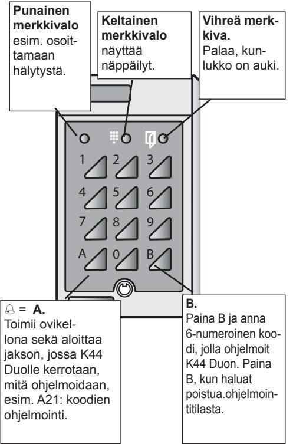

## *Asennus*

| 1  | Jännitteensyöttö, liittimet 1(+) ja 2. 12-24 V AC/ DC.                                                                        |
|----|----------------------------------------------------------------------------------------------------------------------------------|
| 2  | Punaisen merkkivalon ohjaustulo, liittimet 3-4. 10-35 VDC                                                                     |
| 3  | Kansikytkin, liittimet 5 ja 6. Suljettu, kun kotelo suljettu.                                                                 |
| 4  | Koodien aikaohjaus ulkoisella kellolla. Tulo 1: Sulje liittimet 7 ja 8. Tulo 2: Sulje liittimet 7 ja 9.                    |
| 5  | Hälytys ja aukaisu uhattuna -lähtö. Käytä E7- relettä (kytke liittimien 10 ja 1(+) väliin).                                   |
| 6  | Nolla-avaus (0). Sulje liittimet 11 ja 7.                                                                                        |
| 7  | Ovikello. Summerin aktivointilähtö. Käytä E7- relettä (kytke liittimien 12 ja 1(+) väliin).                                   |
| 8  | Ovikosketintulo. Kosketin suljettu, kun ovi on kiinni (N/C). Liittimet 13 ja 15 (ovi 2) sekä vastaavasti 19 ja 21 (ovi 1). |
| 9  | Poistumispainike. Lukko auki, kun väli 14 ja 15 suljettu (ovi 2) sekä vastaavasti 20 ja 21 (ovi 1).                           |
| 10 | Lukon ohjaus, potentiaalivapaa vaihtokosketin. Katkoviiva = käänteistoiminto.                                                 |
| 11 | SW1-painike. Käytetään ohjelmointikoodin valin taan ja muistin tyhjentämiseen.                                                |

**FIN**

# *Ohjelmointi*

Ennen kuin aloitat K44 Duon ohjelmoinnin, merkitse muistiin koodit, koodien aikaohjausryhmät, sekä mitä relelähtöä koodit ohjaavat. Tämän käsikirjan lopussa on tarkoitukseen varattu taulukko. Siitä näet tarvittavat tiedot samalla, kun ohjelmoit K44:ää seuraavien ohjeiden mukaan.

## *Summeri ja merkkivalot*

Summeri ja merkkivalot opastavat ohjelmointia. **Ohjelmointitilassa ennen toiminnon valitsemista**: Vihreä ja keltainen merkkivalo vilkkuvat. **Ohjelmoinnin aikana: Keltainen merkkivalo sammuu**. Vihreä merkkivalo syttyy. **Oikea ohje**: Kahdesta nopeasta piippauksesta koostuva nouseva signaali. **Väärä ohje**: Kahdesta nopeasta piippauksesta

koostuva laskeva signaali. *Huom!:* Jos et ohjelmointitilassa paina näppäintä 20 sekunnin kuluessa, koodilukko palautuu normaalitilaan.

## *Ohjelmointikoodin valitseminen*

Ennen ohjelmoinnin aloittamista on valittava ohjelmointikoodi.

- 1 Paina koodilukon piirikortin painiketta SW1. Molemmat merkkivalot syttyvät.
- 2 Anna kuusinumeroinen ohjelmointikoodi.
- 3 Merkitse ohjelmointikoodi käsikirjan lopussa olevaan taulukkoon.

## *Ohjelmointikoodin muuttaminen*

- 1 Paina B ja näppäile nykyinen ohjelmointikoodi.
- 2 Näppäile A27.
- 3 Näppäile uusi ohjelmointikoodi. Kuulet varoitusäänen.
- 4 Näppäile uusi ohjelmointikoodi uudelleen.
- 5 Poistu ohjelmointitilasta painamalla B.
- 6 Merkitse ohjelmointikoodi käsikirjan lopussa olevaan taulukkoon.

# *Ohjelmointikomentoja*

Paina näppäintä B ja näppäile salasana ennen kuin käytät komentoja.

Voit keskeyttää ohjelmointitilan painamalla näppäintä B.

**FIN**

## *Koodien ohjelmointi*

- 1 Paina B ja näppäile nykyinen ohjelmointikoodi.
- 2 Näppäile A21.
- 3 Anna koodipaikan kaksinumeroinen numero (01-30).
- 4 Anna valitsemasi koodipaikan avauskoodi (paikat 01-20, neljä numeroa tai paikat 21-30, kuusi numeroa).

**Huom.**: Kuusinumeroisen koodin neljä ensimmäistä numeroa eivät saa olla samat kuin nelinumeroisen koodin numerot ja päinvastoin.

- 5 Valitse tarvittaessa aikaohjaus.
	- 0 = ei aikaohjausta
	- 1 = kellotulo 1 ohjaa koodia
	- 2 = kellotulo 2 ohjaa koodia
- 6 Valitse ohjattava relelähtö.
	- 0 = molemmat relelähdöt
	- 1 = relelähtö 1

**FIN**

- 2 = relelähtö 2
- 7 Ohjelmoi seuraava koodi jatkamalla koh-dasta 3 tai lopeta ohjelmointi painamalla B

## *Koodien poistaminen*

- 1 Paina B ja näppäile nykyinen ohjelmointikoodi.
- 2 Näppäile A22.
- 3 Anna nykyinen koodi. Jos koodi on nelinumeroinen, paina A viimeisen numeron jälkeen.
- 4 Jos koodi on nelinumeroinen, paina 0000 kahdesti. Jos koodi on kuusinumeroinen, paina 000000 kahdesti.
- 5 Näppäile 0.
- 6 Näppäile 0 uudelleen.
- 7 Poista seuraava koodi jatkamalla vaiheesta 2 tai lopeta ohjelmointi näppäimellä B.

## *Koodien muuttaminen*

- 1 Paina B ja näppäile nykyinen ohjelmointikoodi.
- 2 Näppäile A22.
- 3 Anna nykyinen koodi. Jos koodi on nelinumeroinen, paina A viimeisen numeron jälkeen.
- 4 Näppäile uusi neli- tai kuusinumeroinen koodi.
- 5 Näppäile uusi koodi uudelleen.
- 6 Valitse tarvittaessa aikaohjaus.
	- 0 = ei aikaohjausta
	- 1 = kellotulo 1 ohjaa koodia
	- 2 = kellotulo 2 ohjaa koodia
- 7 Valitse ohjattava relelähtö.
	- 0 = molemmat relelähdöt
	- 1 = relelähtö 1

**FIN**

- 2 = relelähtö 2
- 8 Muuta seuraava koodi jatkamalla vaiheesta 3 tai lopeta ohjelmointi näppäimellä B.

## *Aukiohjausajan asettaminen*

ukiohjausaika säätä sen, kuinka kauan lukko on auki oikean koodin näppäilemisen jälkeen. Kun K44 Duo toimitetaan, kummankin relelähdön aika on 7 sekuntia.

- 1 Paina B ja näppäile nykyinen ohjelmointikoodi.
- 2 Näppäile A28.
- 3 Valitse aika (01 99) kahdella numerolla, esim. 09 = 9 sekuntia.
- 4 Valitse kumman relelähdön aika on kyseessä:
	- 0 = molemmat
	- 1 = relelähtö 1
	- 2 = relelähtö 2.

## *Taustavalo päällä tai pois*

Näppäimistön taustavalot kytketään tarvittaessa pois päältä seuraavalla tavalla.

- 1 Paina B ja näppäile nykyinen ohjelmointikoodi.
- 2 Näppäile A60.
- 3 Näppäile 0.

Voit ottaa taustavalon uudelleen käyttöön näppäilemällä 1 vaiheessa 3.

## *Summeri päällä tai pois*

Summerin soimisen näppämiä painettaessa tai ovea avattaessa voi estää seuraavalla tavalla. Huomaa, että summeri soi kuitenkin ohjelmoitaessa.

- 1 Paina B ja näppäile nykyinen ohjelmointikoodi.
- 2 Näppäile A65.
- 3 Näppäile 0.

Voit ottaa summerin uudelleen käyttöön näppäilemällä 1 vaiheessa 3.

## *Lukko pysyvästi auki on/ei*

Jos lukon halutaan olevan pysyvästi auki, toiminto on kytkettävä käyttöön.

Toimi seuraavalla tavalla:

- 1 Paina B ja näppäile nykyinen ohjelmointikoodi.
- 2 Näppäile A81.
- 3 Näppäile 1.

**FIN**

- 4 Valitse kumman relelähdön toiminto on kyseessä:
	- 0 = molemmat
	- 1 = relelähtö 1
	- 2 = relelähtö 2

Kun haluat kytkeä toiminnon pois, paina 0 kohdassa 3. Kohdassa *Lukon avaaminen pysyvästi* neuvotaan, miten lukko avataan pysyvästi.

## *Aukaisu uhattuna tai ovihälytyslähtö*

K44 Duon hälytyslähtöä käytetään joko aukaisu

uhattuna -toimintoon tai ovihälytykseen. Hälytyslähdön toimintatapa valitaan samassa ohjelmointikohdassa.

#### **Aukaisu uhattun**

Kun aukaisu uhattuna -toiminto on käytössä, vaaran uhatessa voidaan näppäillä erityinen hätäkoodi. Aukaisu uhattuna –toimintoa käytettäessä käynnistyvät toimet on suunniteltava huolellisesti.

- *Huom.:* Jos aukaisu uhattuna -toiminto on käytössä, numerojärjestyksessä peräkkäisiä koodeja ei saa käyttää. Esimerkiksi koodia 1234 ei saa käyttää yhdessä koodien 1235 ja 1233 kanssa. Koodia 5679 ei saa käyttää yhdessä koodien 5670 ja 5678 kanssa.
Kohdassa *Aukaisu uhattuna –koodin näppäily* neuvotaan aukaisu uhattuna -koodin käyttö. **Ovihälytys**

Kun K44 Duo toimitetaan, hälytys on asetettu aktivoitumaan, jos ovi on auki liian kauan tai jos ovi avataan ilman koodia tai poistumispainiketta. Huomaa, että ovikontaktien on oltava liitettynä ja että *Ovenvalvonnan* on oltava käytössä.

Hälytyslähdön toiminta määritetään seuraavasti:

- 1 Paina B ja näppäile nykyinen ohjelmointikoodi.
- 2 Näppäile A69.
- 3 Valitse jompi kumpi
	- 0 = Ovihälytys (tehdasasetus)

#### *Ovenvalvonta on/ei*

Jos ovikontaktit ovat käytössä ja tämä toiminto on otettu käyttöön, kuuluu varoitussignaali silloin, kun käytetään oven aukipidon varoitusaikaa, eli kun ovi on auki vaikka aukioloaika on päättynyt. Jos oven aukipidon varoitusaika päättyy, mutta ovi on vielä auki, hälytyslähtö aktivoituu (jos *Hälytys*toiminto on valittu käyttöön). Näin tapahtuu myös, jos ovi avataan väkisin. *Ovenvalvonta* otetaan käyttöön seuraavalla tavalla:

- 1 Paina B ja näppäile nykyinen ohjelmointikoodi.
- 2 Näppäile A67.
- 3 Näppäile 1.

**FIN**

Voit ottaa Ovenvalvonnan pois käytöstä näppäilemällä 0 vaiheessa 3

## *Oven aukipidon varoitusajan asettaminen*

Jos ovi on auki, vaikka aukioloaika on päättynyt, summeri muistuttaa oven käyttäjää sulkemaan oven heti - tai hälytyslähtö aktivoituu. Summeri soi kunnes ovi suljetaan.

Huomaa, että ovikontaktien on oltava kytkettynä ja että Ovenvalvonnan on oltava käytössä.

Oven aukipidon varoitusaikaa muutetaan tarvittaessa seuraavalla tavalla.

- 1 Paina B ja näppäile nykyinen ohjelmointikoodi.
- 2 Näppäile A29.
- 3 Valitse aika (01 99) kahdella numerolla, esim. 09 = 9 sekuntia.
- 4 Valitse, kumpaan relelähtöön uusi aika vaikuttaa:
	- 0 = molemmat
	- 1 = relelähtö 1
	- 2 = relelähtö 2.

## *Sulutus päällä/ei päällä*

Kun tämä toiminto otetaan käyttöön, tapahtuu seuraavaa: Jos koodi on ohjelmoitu avaamaan kaksi ovea, lukkorele 2 ei aktivoidu ennen kuin ovi 1 on avattu ja suljettu.

Jos ovi 2 avataan poistumispainikkeella, ovi 2 on avattava ja suljettava ennen kuin ovi 1 voidaan avata.

Huomaa, että ovikontaktien on oltava liitettynä ja että Ovenvalvonnan on oltava käytössä.

Sulutus-toiminto otetaan käyttöön seuraavalla tavalla:

- 1 Paina B ja näppäile nykyinen ohjelmointikoodi.
- 2 Näppäile A80.
- 3 Näppäile 1.

**FIN**

Voit ottaa sulutuksen pois käytöstä näppäilemällä 0 vaiheessa 3.

## *Muistin tyhjentäminen*

Kaiken ohjelmoidun tiedon (myös ohjelmointikoodin) poistaminen:

- 1 Paina B ja näppäile nykyinen ohjelmointikoodi.
- 2 Paina K44 Duon piirikortin painiketta SW1.
- 3 Näppäile 112186.
- 4 Näppäile 112186 uudelleen. Muisti on tyhjä ja K44 Duo on samassa tilassa kuin tehtaalta toimitettaessa.

# *K44 Duon käyttäminen*

## *Oven avaaminen*

Lukko avataan näppäilemällä 4- tai 6-numeroinen koodi lukon näppäimistöllä.

K44 Duo lukkiutuu 12 virheellisen näppäily-yrityksen jälkeen. Lukituksen saa purettua näppäilemällä oikean koodin kaksi kertaa peräkkäin.

#### *Lukon avaaminen pysyvästi*

Lukon saa avattua pysyvästi seuraavalla tavalla:

- 1 Paina B.
- 2 Anna oikea koodi.
- 3 Näppäile 1.

Lukko on auki (vihreä merkkivalo palaa). Kun haluat lukita oven uudelleen, paina 0 kohdassa 3.

## *Aukaisu uhattuna –koodin näppäily*

Hätätilanteessa voi näppäillä koodin, joka laukaisee hälytyksen:

Näppäile tavallinen avauskoodi, mutta lisää viimeiseen numeroon 1.

**Esimerkki 1:** Jos avauskoodi on 1234, näppäile 1235.

**Esimerkki 2:** Jos koodi on 1239, näppäile 1230. Kun näppäilet aukaisu uhattuna -koodin, ovi avautuu ja hälytyslähtö aktivoituu samalla. Se on aktiivinen, kunnes palautat sen siirtymällä ohjelmointitilaan.

# *Tekniset tiedot*

| Jännitesyöttö:                         | 8-24 V AC, 10-35 V DC          |
|----------------------------------------|-----------------------------------|
| Virrankulutus:                         | 75 mA.                            |
| Releen koskettimien enimmäiskuorma: | 2 A 28 V DC                       |
| Mitat (K x L x S) mm:                  | 140x80x40                         |
| Suositeltu asennus korkeus:         | 1200-1400 mm maasta alareunaan |

Seinään upotettaessa tarvitaan lisäksi uppoasennuskotelo BB3.

|                                                                            |              | Ohjelmoinnin tiivistelmä                                                                                                |                                                                                                                        |                                             |
|----------------------------------------------------------------------------|--------------|-------------------------------------------------------------------------------------------------------------------------|------------------------------------------------------------------------------------------------------------------------|---------------------------------------------|
|                                                                            | Vaihe 6      | Paina atka mointiti- vaiheesta 2. B (takaisin Seuraava odi: J oistu: laan). ohjel ko P | Paina atka vaiheesta 2. mointiti B (takaisin Seuraava odi: J oistu: laan). ohjel ko P | Ks. yllä                                    |
| B Paina Poistu: mointikoodi. malla ohjel B ja anta malla | Vaihe 5      | Valitse relelähtö mat m 1 = rele 1 2 = rele 2 mole 0 =                                                | Valitse relelähtö mat m 1 = rele 1 2 = rele 2 mole 0 =                                               | 0 äppäile N                           |
|                                                                            | 4 Vaihe   | Valitse aikaoh- mikään mä 1 mä 2 mä jausryh 1 = ryh 2 = ryh 0 = ei                              | Valitse aikaoh mikään mä 1 mä 2 mä jausryh 1 = ryh 2 = ryh 0 = ei                              | 0 äppäile N                           |
|                                                                            | 3 Vaihe   | koodi (4 tai meroa) äppäile 6 nu N                                                                          | uusi koodi esti). äppäile (kahd N                                                                          | 0000 (00) esti) äppäile (kahd N |
|                                                                            | 2 Vaihe   | me- Valitse koodi- paikka (2 nu- 21-30 = 6-nu Koodipaikat roiset koodit meroa)                        | äppäile vanha äppäile koodi me- roinen koodi: 4-nu koodi. A + N N                           | Ks. yllä                                    |
|                                                                            | 1 Vaihe   | äppäi- A21 le N                                                                                                | äppäi- A22 le N                                                                                               | äppäi A22 le N                     |
| oita aina paina Al                                                      | minto Toi | moi avaus- Ohjel koodi                                                                                         | Muuta avaus koodia                                                                                               | Poista avaus koodi                    |

| med att trycka Börja alltid             |                     | Avbryta: Tryck en. meringskod m B och ange progra | B.                                           |         |         |
|--------------------------------------------|---------------------|---------------------------------------------------------------|----------------------------------------------|---------|---------|
| minto Toi                               | Vaihe 1             | Vaihe 2                                                       | Vaihe 3                                      | Vaihe 4 | Vaihe 5 |
| mis Muuta avautu aikaa               | äppäile A28 N | äppäile sekunnit (01 99) N                                 | relelähtö (0, 1 äppäile tai2) N     |         |         |
| Muuta oven aukipi on varoitusaikaa d | äppäile A29 N | äppäile sekunnit (01 99) N                                 | relelähtö (0, 1 äppäile tai2) N     |         |         |
| mointi Muuta ohjel koodia            | äppäile A27 N | meroa) äppäile uusi koodi (6 nu N                       | äppäile uusi el koodi uud leen N |         |         |
| o on/off Taustaval                      | äppäile A60 N | Off On 0 = 1 =                                       |                                              |         |         |
| meri on/off m Su                     | äppäile A65 N | Off On 0 = 1 =                                       |                                              |         |         |
| Ovenvalvonta on/off                        | äppäile A67 N | Off On 0 = 1 =                                       |                                              |         |         |
|                                            |                     |                                                               |                                              |         |         |

#### *K44 Duo Asennus- ja käyttöohjeet 153*

*152 K44 Duo Asennus- ja käyttöohjeet*

**FIN**

**FIN**

| on Funkti                     | Vaihe 1                | Vaihe 2                                                                                  | Vaihe 3                                            | Vaihe 4                                                                                 | Vaihe 5 |
|----------------------------------|------------------------|------------------------------------------------------------------------------------------|----------------------------------------------------|-----------------------------------------------------------------------------------------|------------|
| älytys/aukaisu uhattuna H  | äppäile A69 N    | 1 = aukaisu uhattuna aukaisu uhattuna ei 0 = hälytys päällä, päällä, hälytys ei |                                                    |                                                                                         |            |
| Viive on/off                     | äppäile A80 N    | Off On 0 = 1 =                                                                  |                                                    |                                                                                         |            |
| Lukko pysyvästi auki – on/off | äppäile A81 N    | Off On 0 = 1 =                                                                  | Syötä rele-lähtö 2) (0,1,                    |                                                                                         |            |
| muisti Tyhjennä               | K44 Avaa o Du | W1 piiri S a a kortill n ai P                                       | e 6 äil 8 p 21 p ä 11 N | e n e 6 äil e 8 ell p 21 p d ä u 11 N u |            |

**FIN**

#### Norsk

Tekniske spesifikasjoner og tilgjengelighet kan endres uten forvarsel. © Copyright Siemens AB

Vi forbeholder oss alle rettigheter i forbindelse med dette dokumentet og det aktuelle emnet. Når mottakeren tar imot dette dokumentet, godtar han/hun disse rettighetene og forplikter seg til å ikke publisere dokumentet eller det aktuelle emnet i sin helhet eller delvis, ikke gjøre det tilgjengelige for noen tredjepart uten uttrykkelig, skriftlig tillatelse innhentet på forhånd, og ikke bruke det til andre formål enn det som var formålet med leveringen.

## *Innhold*

**NOR**

| Generelt om K44 Duo                    | 157     |
|----------------------------------------|---------|
| Åpne to dører med én kode           | 157     |
| Velg selv når kodene skal være gyldige |  157 |
| Overfallskode eller alarm           | 158     |
| Nullåpning                          | 158     |
| Stille døren åpen                      | 158     |
| Ringeklokke                            | 158     |
| Tastaturet                             | 159     |
| Tilkobling                             | 160     |
| Programmering                          | 162     |
| Lyd signal og lysdioder                | 162     |
| Velge programmeringskode               | 163     |
| Endre valgt programmeringskode      | 163     |
| Programmeringskommando                 | 163     |
| Programmere koder                      | 164     |
| Slette koder                        | 165     |
| Endre koder                            | 166     |
| Stille inn åpningstid                  | 167     |
| Bakgrunnsbelysning av/på            | 168     |
| Lyd signal av/på                       | 168     |
| Bistabil funksjon av/på                | 169     |
| Overfallskode eller Alarmutgang        | 170     |
| Dørkontroll av/på                   | 171     |
| Stille inn døralarmtiden               | 172     |
| Forsinkelse (slusefunksjon) av/på   | 172     |
| Slette minnet                       | 173     |
| Daglig bruk av K44 Duo              | 174     |
| Adgang                                 | 174     |
| Stille døren åpen                      | 174     |
| Angi overfallskode                     | 175     |
| Tekniske data                          | 176     |

## *Generelt om K44 Duo*

K44 Duo er en kompakt kodelås med to reléutganger. K44 Duo kan styre inntil to dører, eller én dør og en annen valgfri funksjon, f.eks. skru på lyset. For passering brukes det en fire- eller sekssifret kode, og all programmering skjer fra kodelåsens tastatur.

## *Åpne to dører med én kode*

Rent praktisk medfører to reléutganger muligheten til å aktivere to funksjoner samtidig med én korrekt kode. Koden kan f.eks. låse opp døren, og samtidig skru på lyset.

En annen tilpasning er å koble kodelåsen til to dører. Én kode kan da programmeres slik at den åpner begge dørene, mens en annen bare åpner en av dem.

Dersom koden skal åpne begge dørene, kan man også stille K44 Duo inn slik at den andre døren ikke åpnes før den første er blitt åpnet og lukket, såkalt slusefunksjon.

For hver kode kan man velge om relé 1, 2 eller begge skal aktiveres.

## *Velg selv når kodene skal være gyldige*

K44 Duo gir muligheten til å tidsstyre kodene via et eksternt tidsur. Visse koder, f.eks. postbudets, skal kanskje bare fungere en viss tid av døgnet, mens beboerne skal kunne komme inn døgnet rundt.

Dersom man kobler to tidsur til K44 Duo, kan man arbeide med tre ulike tidssoner for tidsstyring av kodene. En som reguleres av tidsur 1, en annen av tidsur 2 og en som gjelder døgnet rundt (ingen tidsstyring).

#### *Overfallskode eller alarm*

K44 Duo er utstyrt med en utgang som aktiveres i ett av følgende tilfeller:

- Når en passerende angir en såkalt overfallskode ELLER
- Når døralarmtiden går ut, eller om døren brytes opp. Man velger selv hvilket av de to alternativene som benyttes. Senere, hvis man ønsker, kan man koble f.eks. innbruddsalarmen til utgangen.

## *Nullåpning*

Dersom man ønsker å gjøre det enkelt for personer å komme inn døren, f.eks. i kontortiden, kan man koble til en ekstern bryter. Ved hjelp av den kan man slå på/av muligheten til å åpne døren ved kun å trykke null (0) på tastaturet. Merk at dette kun kan gjøres for reléutgang 1.

#### *Stille døren åpen*

Hvis bistabil funksjon er aktivert, låses døren opp med en kode, og døren forblir åpen til en ny kode tastes (se avsnittet Bistabil funksjon av/på).

## *Ringeklokke*

**NOR**

Det er også mulig å koble til en ringeklokke til K44 Duo. Besøkende trykker da på knappen merket med en ringeklokke (%) på kodelåsen.

## *Tastaturet*

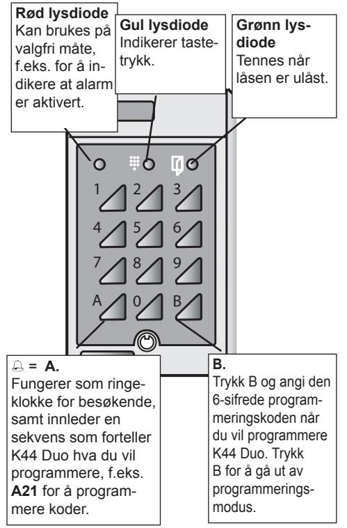

## *Tilkobling*

**NOR**

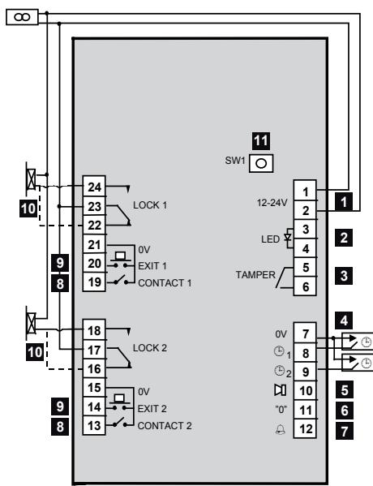

| 1  | Driftsspenning, kobling nr. 1 (+) og 2. 12-24 V.                                                                                |
|----|---------------------------------------------------------------------------------------------------------------------------------|
| 2  | Inngang for ekstra lysdiode (rød), kobling nr. 3 og 4. 10-35 V DC.                                                           |
| 3  | Sabotasjekontakt, kobling nr. 5 og 6. Normalt luk ket ved lukket kapsling.                                                   |
| 4  | Tidsstyring fra eksternt tidsur. Inngang 1: Sluttet kobling nr. 8 og 7. Inngang 2: Sluttet kobling nr. 9 og 7.            |
| 5  | Utgang for alarm eller overfallskode. Bruk E7-relé. Kobles inn mellom kobling nr. 10 og 1(+).                                |
| 6  | Kontakt for (0) null-åpning. Sluttet kontakt nr. 11 og 7.                                                                    |
| 7  | Ringeklokke utgang for aktivering av lyd signaler eller lignende. Bruk E7-relé. Kobles inn mellom kobling nr. 12 og 1(+). |
| 8  | Inngang for dørkontakter. Kontakten sluttes når døren er stengt. Kobling nr. 13 og 15 (henholdsvis 19 og 21).             |
| 9  | Fjernåpningsknapp. Døren åpnes når kobling nr. 14 og 15 sluttes (henholdsvis 20 og 21).                                      |
| 10 | Elektrisk lås. Den stiplede linjen gjelder lås med omvendt funksjon.                                                         |
| 11 | SW1 trykknapp. Brukes ved valg av passord og sletting av minnet.                                                             |

## *Programmering*

Før du begynner å programmere K44 Duo kan du være en god idé å notere hvilke koder du skal legge inn, hvilken tidsstyringsgruppe de skal høre til, samt hvilke reléutgang de skal styre. I slutten av håndboken vil du finne en mal for dette. Når du programmerer, kan du bruke listen samtidig som du følger instruksjonene.

## *Lyd signal og lysdioder*

Når du programmerer, vil du veiledes av lyd signaler og lysdioder.

**I programmeringsmodus før det er valgt funksjon**: Grønn og gul lysdiode blinker.

**Under programmering**: Gul lysdiode slukkes. Grønn lysdiode lyser.

**Korrekt instruksjon:** Bekreftes med et stigende signal som består av to raske tonestøt.

**Gal instruksjon:** Bekreftes med et fallende signal som består av to raske tonestøt.

- *Obs!* Hvis du ikke trykker på en tast innen 20 sekunder når du befinner deg i programmeringsmodus, går kodelåsen tilbake til normalstilling.
#### *Velge programmeringskode*

Det første du bør gjøre før du programmerer K44 Duo, er å velge en programmeringskode.

- 1 Trykk inn knappen SW1 på kodelåsens kretskort. Begge lysdiodene lyser vedvarende.
- 2 Angi en programmeringskode med 6 sifre. Nå kan du programmere kodelåsen.
- 3 Noter den nye programmeringskoden i listen lengst bak i håndboken.

## *Endre valgt programmeringskode*

- 1 Trykk B og angi den nåværende programmeringskoden.
- 2 Trykk A27.
- 3 Angi den nye programmeringskoden. Du vil nå høre en varseltone.
- 4 Angi den nye programmeringskoden en gang til.
- 5 Trykk B for å gå ut av programmeringsmodus.
- 6 Noter den nye programmeringskoden i listen lengst bak i håndboken.

# *Programmeringskommando*

Benytt alltid B + programmeringskode før kommando angis. Avslutt med B.

#### *Programmere koder*

- 1 Trykk B og angi den nåværende programmeringskoden
- 2 Trykk A21.
- 3 Angi ønsket kodeplass med to sifre (01-30).
- 4 Angi passeringskoden for den plassen du har valgt (fire siffer for plass 01-20, eller seks siffer for plass 21-30).

Obs! De fire første sifrene i en sekssifret kode må ikke være lik sifrene i en firesifret kode, og omvendt.

- 5 Angi om koden skal kunne kobles ut på visse tider fra et tidsur.
	- 0 = ingen tidsstyring
	- 1 = koden skal tidsstyres fra tidsur 1
	- 2 = koden skal tidsstyres fra tidsur 2
- 6 Angi hvilken reléutgang koden skal styre.
	- 0 = begge reléutgangene
	- 1 = reléutgang 1
	- 2 = reléutgang 2
- 7 Programmer neste kode ved å gå videre fra trinn 3, eller trykk B for å avslutte.

## *Slette koder*

- 1 Trykk B og angi den nåværende programmeringskoden
- 2 Trykk A22.
- 3 Angi eksisterende kode. Hvis det er en firesifret kode, trykker du A etter det siste sifferet.
- 4 Hvis koden er firesifret, trykker du 0000 og venter på kvitteringslyd. Trykk 0000 en gang til.

Hvis koden er sekssifret, trykker du 000000, to ganger.

- 5 Trykk 0.
- 6 Trykk 0 igjen.
- 7 Slett neste kode ved å gå videre fra trinn 3, eller trykk B for å avslutte.

## *Endre koder*

- 1 Trykk B og angi den nåværende programmeringskoden
- 2 Trykk A22.
- 3 Angi den eksisterende koden. Hvis det er en firesifret kode, trykk A etter siste siffer.
- 4 Angi den nye koden med fire eller seks siffer.
- 5 Angi den nye koden igjen.
- 6 Angi om koden skal kunne kobles ut på visse tider fra et tidsur.
	- 0 = ingen tidsstyring
	- 1 = koden skal tidsstyres fra tidsur 1
	- 2 = koden skal tidsstyres fra tidsur 2
- 7 Angi hvilken reléutgang koden skal styre.
- 8 0 = begge reléutgangene
	- 1 = reléutgang 1
	- 2 = reléutgang 2
- 9 Endre neste kode ved å gå videre fra trinn 3, eller trykk B for å gå ut av kodeprogrammeringen.

## *Stille inn åpningstid*

Åpningstiden regulerer hvor lenge låsen står åpen etter at det er angitt korrekt kode. Når K44 Duo leveres, er fabrikkinnstillingen forhånds programmert til en standard på 7 sekunder for begge reléene.

- 1 Trykk B og angi den nåværende programmeringskoden
- 2 Trykk A28.
- 3 Angi ønsket åpningstid (01-99) med to siffer, f.eks. 09 for 9 sekunder.
- 4 Angi hvilken reléutgang åpningstiden gjelder.
	- 0 = begge reléutgangene
	- 1 = reléutgang 1
	- 2 = reléutgang 2

## *Bakgrunnsbelysning av/på*

Slik slår du av bakgrunnsbelysningen på tastaturet.

- 1 Trykk B og angi den nåværende programmeringskoden
- 2 Trykk A60.
- 3 Trykk 0.

Hvis du vil slå på bakgrunnsbelysningen igjen, trykker du på 1 i trinn 3 i stedet.

## *Lyd signal av/på*

Hvis du ikke vil at kodelåsen skal lage lyd når det trykkes en tast, eller døren åpnes, kan den slås av. Merk at kodelåsen fortsatt vil kvittere ved programmering.

- 1 Trykk B og angi den nåværende programmeringskoden
- 2 Trykk A65.
- 3 Trykk 0.

**NOR**

Hvis du vil slå på summetonen igjen, trykker du på 1 i trinn 3 i stedet.

### *Bistabil funksjon av/på*

Hvis du vil at en dør skal kunne stå ulåst i lengre tid enn åpningstiden, må du aktivere bistabil funksjon.

Du går frem slik:

- 1 Trykk B og angi den nåværende programmeringskoden
- 2 Trykk A81.
- 3 Trykk 1.
- 4 Angi de releene som bistabil funksjon skal aktiveres for.
	- 0 = begge reléutgangene
	- 1 = reléutgang 1
	- 2 = reléutgang 2

Hvis du vil slå av bistabil funksjon, følger du trinnene ovenfor, men trykker på 0 i trinn 3 i stedet. I avsnittet *Stille døren* åpen beskrives det hvordan døren kan stilles slik at den står åpen permanent.

#### *Overfallskode eller Alarmutgang*

En K44 Duo kan enten benytte overfallskode eller døralarm. Du benytter samme kommando, men velger funksjon selv.

#### *Overfallskode*

*Alarmutgang*

Med funksjonen *Overfallskode* aktivert kan en passerende angi en spesiell kode hvis han/hun tvinges til å åpne døren. Det er viktig at det lages en plan for hvilke tiltak som skal treffes når overfallskoden anvendes.

- *Obs!* Hvis overfallskoden er aktivert, kan du ikke ha koder som følger etter hverandre i nummerert rekkefølge. Du må f.eks. ikke ha kode 1234 sammen med kodene 1235 og 1233. Eller koden 5679 sammen med kodene 5670 og 5678 etc.
Se også avsnittet *Angi overfallskode ved overfall*.

Når K44 Duo leveres, er alarmutgangen stilt inn slik at den aktiveres dersom døren står åpen for lenge, eller hvis døren brytes opp.

Merk at dørkontaktene må være tilkoblet, samt at funksjonen *Dørkontroll* må være aktivert for at dette skal fungere.

Slik aktiverer du en av funksjonene:

- 1 Trykk B og angi den nåværende programmeringskoden
- 2 Trykk A69.
- 3 Trykk enten
	- 0 = Alarmutgang (fabrikkinnstilling)
	- 1 = Overfallskode.

Hvis du vil slå av funksjonen, trykker du på 0 i trinn 3 i stedet.

## *Dørkontroll av/på*

Hvis det brukes dørkontakter, og denne funksjonen er aktivert, vil det lyde et varselsignal som tilsvarer døralarmtiden. Det vil si når åpningstiden er gått ut, og døren fortsatt er åpen.

I de tilfellene når også døralarmtiden er gått ut, og døren fortsatt er åpen, aktiveres alarmutgangen (hvis funksjonen *Alarmutgang* er aktivert). Dette skjer også når døren brytes opp. Slik aktiverer du *Dørkontroll*:

- 1 Trykk B og angi den nåværende programmeringskoden
- 2 Trykk A67.
- 3 Trykk 1.

Hvis du vil slå av *Dørkontroll* igjen, trykker du på 0 i trinn 3 i stedet.

## *Stille inn døralarmtiden*

Hvis døren fortsatt er åpen når åpningstiden er gått ut, vil du høre en lyd ved døren. Lyden er en påminnelse til den passerende om å stenge døren umiddelbart – ellers aktiveres alarmutgangen.

Lyden vil høres til døren stenges.

Merk at dørkontaktene må være tilkoblet, samt at funksjonen *Dørkontroll* må være aktivert for at dette skal fungere.

Slik endrer du døralarmtiden hvis det er nødvendig.

- 1 Trykk B og angi den nåværende programmeringskoden
- 2 Trykk A29.

**NOR**

- 3 Angi ønsket døralarmtid (01-99) med to sifre, f.eks. 09 for 9 sekunder.
- 4 Angi hvilken reléutgang døralarmtiden gjelder.
	- 0 = begge reléutgangene
	- 1 = reléutgang 1
	- 2 = reléutgang 2

## *Forsinkelse (slusefunksjon) av/på*

Når denne funksjonen er aktivert, skjer følgende: Hvis en kode er programmert til å åpne to dører, aktiveres låserelé 2 først når dør 1 er blitt åpnet og lukket.

Hvis dør 2 åpnes med fjernåpningsknapp, må dør 2 åpnes og lukkes før dør 1 kan åpnes.

Merk at dørkontaktene må være tilkoblet, samt at funksjonen *Dørkontroll* må være aktivert for at dette skal fungere.

Slik aktiverer du *Forsinkelse*:

- 1 Trykk B og angi den nåværende programmeringskoden
- 2 Trykk A80.
- 3 Trykk 1.

Hvis du vil slå av *Forsinkelse* igjen, trykker du på 0 i trinn 3 i stedet.

## *Slette minnet*

Slik sletter du all informasjon som er programmert i K44 Duo (også programmeringskoden):

- 1 Trykk B og angi programmeringskoden.
- 2 Trykk SW1 på K44 Duo's kretskort.
- 3 Trykk 112186.
- 4 Trykk 112186 en gang til.
- 5 Trykk B.

Minnet er nå slettet, og K44 Duo er stilt tilbake til fabrikkinnstillingen.

# *Daglig bruk av K44 Duo*

## *Adgang*

For å åpne låsen må du angi en firesifret (eller sekssifret) kode på kodelåsens tastatur.

K44 Duo blokkeres etter 12 ukorrekte tastetrykk. For å oppheve blokkeringen må det angis en korrekt kode to ganger etter hverandre.

## *Stille døren åpen*

Dersom du ønsker å sette døren permanent åpen, gjør du slik:

- 1 Trykk B.
- 2 Angi passeringskoden.
- 3 Trykk 1.

Døren er nå ulåst (grønn lysdiode tennes). Hvis du vil låse døren, følger du trinnene ovenfor, men trykker 0 i trinn 3.

## *Angi overfallskode*

Slik aktiverer man overfallskoden, dersom det skulle oppstå en truende situasjon.

Angi den vanlige passeringskoden, men legg til 1 i det siste sifferet i koden.

**Eksempel 1**: Hvis koden din er 1234, trykker du 1235 i stedet.

**Eksempel 2:** Hvis koden er 1239, trykker du 1230 i stedet.

Når du angir en overfallskode, åpnes døren samtidig som alarmutgangen aktiveres. Denne vil være aktivert til du tilbakestiller den ved å gå inn i programmeringsmodus.

# *Tekniske data*

| Strømforsyning:                    | 8-24 V AC, 10-35 V DC                |
|------------------------------------|-----------------------------------------|
| Strømforbruk:                      | 75 mA.                                  |
| Maks. last over relékontaktene: | 2 A 28 V DC                             |
| Mål (H x B x D) mm:                | 140 x 80 x 40                           |
| Anbefalt monterings høyde:      | 1200-1400 mm fra bakke til underkant |

Ved innfelling kan du komplettere med innfellingsboks BB3.

#### *Programmeringsoversikt*

| Begynn alltid                        | med å trykke på |                                                                                              | m B og angi progra             | en. meringskod                                                                    | B. Avbryte: Trykk på                                       |                                                                                                                                     |
|--------------------------------------|-----------------|----------------------------------------------------------------------------------------------|-----------------------------------|--------------------------------------------------------------------------------------|---------------------------------------------------------------|-------------------------------------------------------------------------------------------------------------------------------------|
| on Funksj                         | Trinn 1         | Trinn 2                                                                                      | Trinn 3                           | Trinn 4                                                                              | Trinn 5                                                       | Trinn 6                                                                                                                             |
| serings- Ny pas- e kod      | Trykk på A21 | eplassene 21-30 gir 6-si- plass (2 sifre) er. e- Angi kod frete kod Kod | e(4 eller 6 sifre) Angi kod | Angi tidstyrings- ppe 1 ppe 2 0 = ingen ppe 1 = gru 2 = gru gru | Angi reléut- 0 = begge 1 = relé 1 2 = relé 2 gang | utt: Trykk me- este kode: B (tilbake modus). Fortsett fra m til progra trinn 2. rings Avsl på N |
| serings Endre e pas- kod | Trykk på A22 | mel A 4-sifret e: Trykk en + m Angi ga på kod e. kod kod       | e Angi ny kod (2 ganger)    | Angi tidstyrings- ppe 1 ppe 2 0 = ingen ppe 1 = gru 2 = gru gru | Angi reléut 0 = begge 1 = relé 1 2 = relé 2 gang  | m ovenfor So                                                                                                                     |
| serings Slette e pas kod | Trykk på A22 | m ovenfor So                                                                              | Trykk0000 ganger) (00)(2    | Trykk på 0.                                                                          | Trykk på 0.                                                   | m ovenfor So                                                                                                                     |

**NOR**

| on Funksj                             | Trinn 1         | Trinn 2                             | Trinn 3                           | Trinn 4 | Trinn 5 |
|------------------------------------------|-----------------|-------------------------------------|-----------------------------------|---------|---------|
| Endre åpningstid                         | A28 Trykk på | er Angi antall sekund (01-99) | Angi reléutgang (0, 1 eller 2) |         |         |
| mtid øralar Endre d                | A29 Trykk på | er Angi antall sekund (01-99) | Angi reléutgang (0, 1 eller 2) |         |         |
| me m Endre progra e ringskod | A27 Trykk på | e (6 sifre) Angi ny kod          | e Angi ny kod igjen         |         |         |
| Bakgrunnsbelysning av/på              | A60 Trykk på | Av På 0 = 1 =              |                                   |         |         |
| mer av/på m Su                     | A65 Trykk på | Av 0 =                           |                                   |         |         |

1 = På

**NOR**

| med å trykke på Begynn alltid      |                        | meringskod m B og angi progra                                                      | Avbryte: Trykk på en.             | B                                  |         |
|---------------------------------------|------------------------|------------------------------------------------------------------------------------------|--------------------------------------|------------------------------------|---------|
| on Funksj                          | Trinn 1                | Trinn 2                                                                                  | Trinn 3                              | Trinn 4                            | Trinn 5 |
| ørkontroll av/på D                 | Trykk på A67        | Av På 0 = 1 =                                                                   |                                      |                                    |         |
| mutgang/overfall e skod Alar | Trykk på A69        | m på, overfall- e på, 1 = overfallskod e av m av 0 = alar skod alar |                                      |                                    |         |
| Forsinkelse av/på                     | Trykk på A80        | Av På 0 = 1 =                                                                   |                                      |                                    |         |
| on Bistabil funksj av/på        | Trykk på A81        | Av På 0 = 1 =                                                                   | Ange reläutgång (0,1 eller 2)     |                                    |         |
| minnet Slette                      | K44 Åpne o Du | W1 på S kretskortet Trykk på                                                    | 86 på 21 tastaturet Angi 11 | 86 en gang til 21 Angi 11 |         |

**NOR**

www.siemens.com/securityproducts Document no. Edition A24205-A335-S378 01.2012

Issued by Siemens AB Infrastructure & Cities Sector Security Products International Headquarters Englundavägen 7 SE-171 24 Solna Tel. +46 8 629 0300

Technical specifications and availability subject to change without notice.

© 2012 Siemens AB