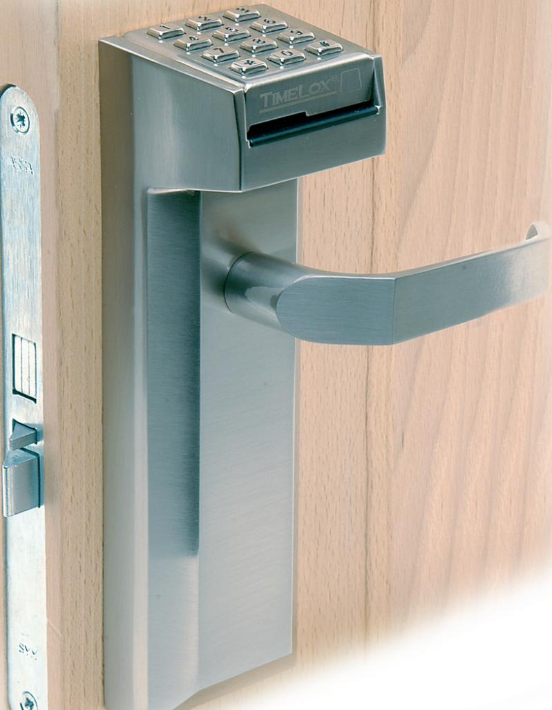
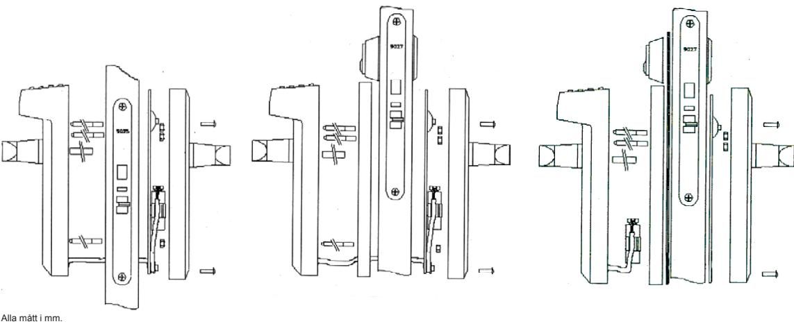

# TimeLox Office spår 2 Stand alone kodlås/kortlås

- • 500 användare med kort, kod eller kort+kod.
- • 10 olika kortgrupper (1-12 siffror).
- • Standard CR80 magnetkort, programmerade på spår 2 med 6-12 siffror.
- • Tidsstyrning med kort+kod kvällar och helger
- • 2-3 års drift med 9 V batteri.
- • Batterivarningssignal.
- • Programmering direkt i kortläsaren med ett Masterkort.
- • Tillfälligt spärra alla kort.
- • Dörren kan ställas i olåst läge.
- • Lagring av senaste 100 inpasseringar.

TimeLox Office spår 2 kortläsare/kodlås monteras direkt på dörren och styr den mekaniska låskistan. Installation sker i standard urtag för modulkista och ersätter cylinder och trycke. Vid installation tillsammans med Timelox låskista kan dörren reglas från utsidan för högre säkerhet. Enheten kan även installeras tillsammans med övergripande nyckelcylinder.

All programmering sker direkt i kortläsaren med ett Masterkort och ingen PC krävs. Kort och koder kan raderas individuellt och påverkar inte annan programmering.

TimeLox Office spår 2 styrs av standard CR80 magnetkort med ISO kodning på magnetremsans spår 2 (se specifikation på andra sidan). Detta innebär att kort till andra passersystem, medlemskort eller liknande kan användas. Den kan även styras med enbart kod eller kombination av kort och kod. Upp till 500 användare kan tilldelas ett personligt kort eller en personlig kod.

Genom att använda kortgrupper (10 st olika), kan alla kort som börjar på samma siffror (1-12 st) få tillträde. Bra funktion på till exempel golfklubbar, butiker eller andra platser som lämnar ut medlemskort.

TimeLox Office spår 2 dörrenhet drivs av ett 9 V alkaliskt batteri och kräver ingen yttre strömförsörjning. En batterivarningssignal berättar 4-5 månader innan batterierna behöver bytas.

TimeLox Office spår 2 finns även som väggenhet med reläfunktion för styrning av t.ex. elslutbleck, hissdörr eller dörrautomatik.

Med tillvalet Read & Write programvara kan backup lagras, parametrar föras över till nya kortläsare eller senaste 100 inpasseringar läsas ut.

# TimeLox Office spår 2 Stand alone kodlås/kortlås

### **Mått:**

- • Utsida : B 70 x H 230 x D 78 mm
- • Insida: B 70 x H 230 x D 25 mm

TimeLox Office spår 2 dörrenhet levereras komplett med monteringsdetaljer för dörrtjocklek 30-85 mm, extra tryckespinne för 40 mm dörr, programmeringskort, 1 st 9 V alkaliskt batteri, monteringsanvisning samt programmeringsmanual.

### **Ytbehandling**

- • Matt eller blank krom
- • Matt eller blank mässing
- • Vit pulverlack

### **Temperaturområde**

- • Inomhus: 0°C +35°C
- • Relativ luftfuktighet: 20-70 %

• 50 000 öppningar eller 2-3 år

# **Internt batteri**

- • 9 V alkaliskt 6LR. Ingår vid leverans
# **Tid**

**Drifttid**

Intern klocka med veckodag. Kan programmeras att kräva kod i kombination med kort under kvällar och helger. Enbart de som tilldelats både kort och kod får då tillträde.

### **Antal användare**

500 med kort, kod eller både kort och kod. Olika platser kan ha olika programmering.

10 olika kortgrupper där alla kort som börjar på samma siffror får tillträde. Vid programmering bestäms hur många siffror som ska läsas (1-12). Kortgrupperna går inte att kombinera med kod och får därför ej tillträde när det krävs både kort och kod.

### **Specifikation magnetkort**

TimeLox Office spår 2 styrs av CR80 magnetkort t. ex. passerkort till andra passersystem, bensinkort, kundkort etc. Kravet är att korten ska ha ISO kodning med 6-12 varierande siffror på magnetremsans spår 2. 12 siffror läses som standard vid leverans men detta kan programmeras om.

# **Låsanpassning**

Låsurtag enligt SIS standard. Montage på övre eller nedre roddare. Inga ingrepp i dörren vid installation tillsammans med ASSA låskista 524.

# **Tillbehör**

Read & Write programvara i Windows för överföring av information, utläsning av senaste 100 inpasseringar, senaste fel och för backup av programmering.

M2168.0808 

www.assa.se

phone +46 (0)16 17 70 00 fax +46 (0)16 17 72 10 Customer support: phone +46 (0)771 640 640 fax +46 (0)16 17 73 72 e-mail: helpdesk@assa.se

ASSA ABLOY, the global leader in door opening solutions, dedicated to satisfying end-user needs for security, safety and

ASSA AB P.O. Box 371 SE-631 05 Eskilstuna Sweden

convenience.