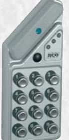
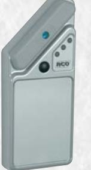
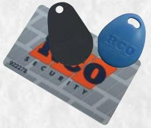

# **PROX-65**

## Nya läsare för anslutning i R-CARD 5000 systemet

Liten trevlig beröringsfri läsare som är lämplig för utomhusmontage. Finns i kombination med eller utan kod. För att uppnå hög säkerhet så bör kod i

kombination med tag alltid användas vid utomhus entréer för att uppnå ett säkert skalskydd. Läsaren klarar till och frånslag av larm.

### FÖRDELAR BERÖRINGSFRI LÄSNING

Den största fördelen med beröringsfri läsning är givetvis att det är bekvämt och smidigt. Man håller bara fram taggen mot läsaren och har men behörighet för passage så öppnar sig dörren. En annan

av fördelarna med beröringsfri läsning är en snabbare läsning samt mindre slitage på tagarna, vilket innebär lägre kostnader i jämförelse med t.ex magnetkort.

### PROX-65KG

Art. nr 20 043 641 E. nr 58 753 03

Grå beröringsfri läsare med knappsats. Ansluts till DB-50. Prox-65 har en fem meter färdig kabel för anslutning i DB-50 delningsbox. För att uppnå hög säkerhet så bör kod i kombination med tag alltid användas vid utomhus entréer för att uppnå ett säkert skalskydd. Läsaren klarar till och frånslag av larm.

#### PROX-65G

Art. nr 20 043 640 E. nr 58 753 02

Grå beröringsfri läsare utan knappsats. Ansluts till DB-50. Prox-65 har en fem meter färdig kabel för anslutning i DB-50 delningsbox.

#### PROX-65G/65KG Teknisk data KORT OCH TAGGAR

| Läsavstånd med ISO kort:            | 2 cm                     |
|-------------------------------------|--------------------------|
| Läsavstånd med nyckelringstag: 2 cm |                          |
| Matning:                            | 10-24V DC                |
| Strömförbrukning:                   | Max 70 mA                |
| Sänd frekvens:                      | 25 Khz                   |
| Temperaturområde:                   | -30ºC till +65ºC         |
| Mått (mm) BxHxD:                    | 60x144x17                |
| Material:                           | Utförd i Zink            |
| Färg:                               | Finns i grått utförande. |
|                                     |                          |

Finns i utförande som vanligt kort eller en praktisk tag, som kan sättas på nyckel knippan.

RCO Security AB Box 705 • 176 27 Järfälla Växel: 08-546 560 00 • Order: 08-546 560 10 • Fax: 08-546 560 99 E-mail: info@rco.se • www.rco.se