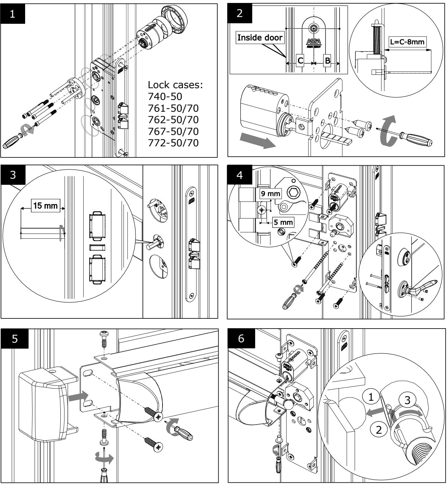
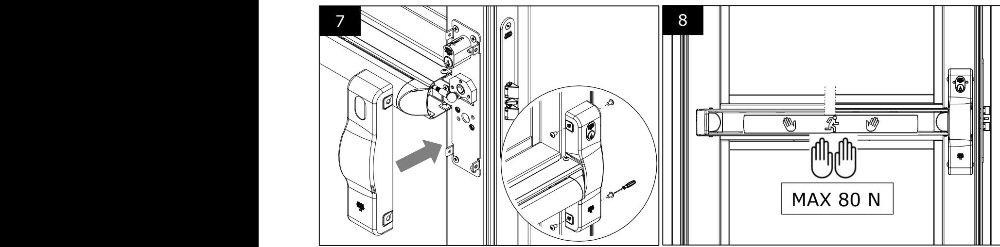
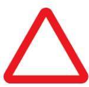

| Revision               | Date       | Document Category     |           |  |
|------------------------|------------|-----------------------|-----------|--|
| 2                      | 2016-05-20 | Assembly instruction  |           |  |
|                        |            | Confidentiality Level |           |  |
|                        |            | PUBLIC                |           |  |
|                        |            | Status                | Page (of) |  |
| Panic exit device 1125 |            |                       | 1 (4)     |  |
|                        |            |                       | Approved  |  |

# Assembly instruction Panic Exit device 1125

d000448564t_paupp2gydcia.docx **Approved 2017-10-19**

7 8

11

| Document ID D000448564       | Revision 2 | Date 2016-05-20 | Document Category Assembly instruction |                    |  |
|---------------------------------|---------------|--------------------|-------------------------------------------|--------------------|--|
| Author NaWi                  |               |                    | Confidentiality Level PUBLIC           |                    |  |
| Title Panic exit device 1125 |               |                    | Status Approved                        | Page (of) 2 (4) |  |

| Document ID D000448564       | Revision 2 | Date Document Category 2016-05-20 Assembly instruction |                                 |                    |  |
|---------------------------------|---------------|-----------------------------------------------------------------|---------------------------------|--------------------|--|
| Author NaWi                  |               |                                                                 | Confidentiality Level PUBLIC |                    |  |
| Title Panic exit device 1125 |               |                                                                 | Status Approved              | Page (of) 3 (4) |  |

## **Panikregel ASSA 1125**

**Säkerhetsfunktionerna för denna produkt är avgörande för dess överensstämmelse med SS-EN 1125. Inga ändringar av något slag, andra än de som beskrivs i dessa instruktioner, är tillåtna.**

### **Installations- och fästanvisningar**

Innan montering av panikregeln bör dörren kontrolleras för att säkerställa korrekt hängning och att inget hindrar dörrbladets fria rörelse.

Innan du installerar en panikregel på en branddörr skall certifieringen av dörren avseende brand kontrolleras för att säkerställa att det är lämpligt att montera en panikregel på denna typ av branddörr. Det är av yttersta vikt att panikregeln inte monteras på en branddörr med högre brandmotstånd än vad den är godkänd för.

Försiktighet bör vidtas för att säkerställa att alla tätningar eller väderskydd monterade på dörren inte hämmar panikregelns funktion. Utrymningsbeslag är inte avsedda för användning på pendeldörrar, om de inte är särskilt anpassade för det av tillverkaren.

Monteringsanvisningar bör följas noggrant under installationen. Dessa instruktioner och eventuella underhållsinstruktioner bör föras vidare av installatören till användaren.

Den horisontella tryckstången bör vanligtvis installeras på en höjd av mellan 900 mm och 1 100 mm från färdigt golv, när dörren är i stängd position. Om det är känt att majoriteten av de personer som vistas i lokalen kommer att vara små barn, bör man överväga att minska höjden på tryckstången.

Panikregeln bör installeras så att tryckstången täcker största möjliga bredd på dörrbladet.

Slutbleck och elslutbleck enligt tabell nedan rekommenderas (X). Dörrspringa 3 ±1 mm.

|        | Slutbleck |      | Elslutbleck             |  |  |  |  |
|--------|-----------|------|-------------------------|--|--|--|--|
| Låshus | 1487      | 2530 | 900, 910, 911, 920, 960 |  |  |  |  |
| 740-50 | X         |      |                         |  |  |  |  |
| 761-50 | X         | X    | X                       |  |  |  |  |
| 761-70 | X         | X    |                         |  |  |  |  |
| 762-50 | X         | X    | X                       |  |  |  |  |
| 762-70 | X         | X    |                         |  |  |  |  |
| 767-50 | X         | X    | X                       |  |  |  |  |
| 767-70 | X         | X    |                         |  |  |  |  |
| 772-50 | X         | X    | X                       |  |  |  |  |
| 772-70 | X         | X    |                         |  |  |  |  |

### **Underhållsinstruktioner**

För att säkerställa prestanda i enlighet med detta dokument, bör följande rutinkontroller och underhåll göras i intervall om högst en månad:

Inspektera och testa panikregeln för att se till att alla komponenter är i ett tillfredsställande skick.

Smörj alla kontaktytor vid montage och därefter minst var 20000:e cykel.

Kontrollera att inga ytterligare låsanordningar har monterats på dörren sedan den ursprungliga installationen.

### **Klassificering enligt SS-EN 1125:2008**

| 1 | 2 | 3 | 4 | 5 | 6 | 7 | 8 | 9 | 10 |
|---|---|---|---|---|---|---|---|---|----|
| 3 | 6 | 6 | B | 1 | 3 | 2 | 2 | B | A  |

- 1) (3) lämplig att användas på högfrekventa dörrar;
- 2) (6) testad till 100 000 cykler;
- 3) (6) för dörrvikt upp till 200 kg,
- dörrbredd ≤1320 mm, dörrhöjd ≤2520 mm;
- 4) (B) lämplig att användas på brand- och rökklassade dörrar;
- 5) (1) säker att använda på dörrar i utrymningsvägar;
- 6) (3) hög korrosionsbeständighet;
- 7) (2) klass 2 säkerhetsnivå 1000 N;
- 8) (2) panikregelns utstick upp till 100 mm från dörrblad;
- 9) (B) "touch-bar" typ B för panikreglar;
- 10) (A) lämplig att användas på enkeldörr och dubbeldörr*: endast aktivt dörrblad. *Gäller ej vid montage av låshus 740-50

| Document ID Revision Date |            |                       |                                         |  |
|---------------------------------|------------|-----------------------|-----------------------------------------|--|
| 2                               | 2016-05-20 | Assembly instruction  |                                         |  |
|                                 |            | Confidentiality Level |                                         |  |
| NaWi                            |            |                       |                                         |  |
|                                 |            | Status                | Page (of)                               |  |
| Panic exit device 1125          |            |                       | 4 (4)                                   |  |
|                                 |            |                       | Document Category PUBLIC Approved |  |

## **Panic bar ASSA 1125**

**The safety features of this product are essential to its compliance with EN 1125. No modification of any kind, other than those described in these instructions, are permitted.**

### **Installation and fixing instructions**

Before fitting an exit device to a door, the door should be checked to ensure correct hanging and freedom from binding.

Before fitting a panic exit device to a fire/smoke resisting door, the fire certification of the fire door assembly on which the exit device has been tested to prove suitability for use on a fire door should be examined. It is of utmost importance that an exit device is not used on a fire door assembly of a greater fire resistance time than approved for.

Care should be taken to ensure that any seals or weather-stripping fitted to the complete door assembly, does not inhibit the correct operations of the panic exit device.

Panic exit devices are not intended for use on double action (double swing) doors unless specifically designed by the producer.

The fixing instructions should be carefully followed during installation. These instructions and any maintenance instructions should be passed on by the installer to the user.

The horizontal bar should normally be installed at a height of between 900 mm and 1 100 mm from the finished floor level, when the door is in the secured position. Where it is known that the majority of the occupants of the premises will be young children, consideration should be given to reducing the height of the bar.

The horizontal bar should be installed so as to provide the maximum effective length.

Strikes and electric strikes according to the table below are recommended (X). Door gap 3 ±1 mm.

|           | Strike |      | Electric strike         |  |  |  |
|-----------|--------|------|-------------------------|--|--|--|
| Lock case | 1487   | 2530 | 900, 910, 911, 920, 960 |  |  |  |
| 740-50    | X      |      |                         |  |  |  |
| 761-50    | X      | X    | X                       |  |  |  |
| 761-70    | X      | X    |                         |  |  |  |
| 762-50    | X      | X    | X                       |  |  |  |
| 762-70    | X      | X    |                         |  |  |  |
| 767-50    | X      | X    | X                       |  |  |  |
| 767-70    | X      | X    |                         |  |  |  |
| 772-50    | X      | X    | X                       |  |  |  |
| 772-70    | X      | X    |                         |  |  |  |

### **Maintenance instructions**

To ensure performance in accordance with this document, the following routine maintenance checks should be undertaken at intervals of not more than one month:

Inspect and operate the panic exit device to ensure that all components are in a satisfactory working condition.

Lubricate all contact surfaces during assembly and then at least every 20000 th cycle.

Check that no additional locking devices have been added to the door since its original installation.

### **Classification according to EN 1125:2008**

| 1 | 2 | 3 | 4 | 5 | 6 | 7 | 8 | 9 | 10 |
|---|---|---|---|---|---|---|---|---|----|
| 3 | 6 | 6 | B | 1 | 3 | 2 | 2 | B | A  |

- 1) (3) suitable for use in high frequency applications;
- 2) (6) tested to 100 000 cycles;
- 3) (6) for a door mass of up to 200 kg, door width ≤1320 mm, door height ≤2520 mm;
- 4) (B) suitable for use on fire/smoke resisting door assemblies;
- 5) (1) safe for use on escape route doors;
- 6) (3) high corrosion resistance;
- 7) (2) grade 2 security level 1000 N;
- 8) (2) horizontal bar projection of up to 100 mm;
- 9) (B) "touch-bar" type B of panic exit device;
- 10) (A) suitable for use on a single door and double door*: active leaf only. *Not approved with lock case 740-50