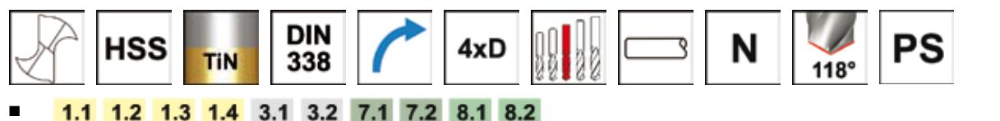

## A002

- Korta Borrar Lyhyet porat Jobber Drill
- Punta serie corta Korte Bor Korte Bor
- 
- 
- 

- 

## A002

Obelagd under 2,0mm, TiN-topp och korsspetsad från och med 2,0mm / Halkaisijat < 2 mm -kirkkaat, 2 mm ja yli TiN ja ristiteroitus / Bright below 2.0mm, TiN Tipped and Split Point 2.0mm and above / Lucida sotto i 2mm, con rivestimento parziale TiN e affilatura split point da 2mm in su / Blank under 2.0mm, TiN belagt i tuppen og kryss sliping fra 2.0mm og over. / Blank under 2,0 mm, TiN spids og special spids fra 2,0 mm og større

## ●

| d1 Øh8 | d1 Øh8 | d1 decimal | l 2 | l 1 |           | d1 Øh8 | d1 Øh8 | d1 decimal | l 2 | l 1 |               |
|-----------|-----------|---------------|--------|--------|-----------|-----------|-----------|---------------|--------|--------|---------------|
| Inch      | mm        | Inch          | mm     |        | mm e-Code | Inch      | mm        | Inch          | mm     |        | mm e-Code     |
|           | 1.00      | 0.0393        | 12     | 34     | A0021.0   |           | 4.10      | 0.1614        | 43     | 75     | A0024.1       |
|           | 1.10      | 0.0433        | 14     | 36     | A0021.1   |           | 4.20      | 0.1653        | 43     | 75     | A0024.2       |
| 3/64      | 1.19      | 0.0468        | 16     | 38     | A0023/64  |           | 4.30      | 0.1692        | 47     | 80     | A0024.3       |
|           | 1.20      | 0.0472        | 16     | 38     | A0021.2   | 11/64     | 4.37      | 0.1725        | 47     | 80     | A00211/64     |
|           | 1.30      | 0.0511        | 16     | 38     | A0021.3   |           | 4.40      | 0.1732        | 47     | 80     | A0024.4       |
|           | 1.40      | 0.0551        | 18     | 40     | A0021.4   |           | 4.50      | 0.1771        | 47     | 80     | A0024.5       |
|           | 1.50      | 0.0590        | 18     | 40     | A0021.5   |           | 4.60      | 0.1811        | 47     | 80     | A0024.6       |
| 1/16      | 1.59      | 0.0625        | 20     | 43     | A0021/16  |           | 4.70      | 0.1850        | 47     | 80     | A0024.7       |
|           | 1.60      | 0.0629        | 20     | 43     | A0021.6   | 3/16      | 4.76      | 0.1874        | 52     | 86     | A0023/16      |
|           | 1.70      | 0.0669        | 20     | 43     | A0021.7   |           | 4.80      | 0.1889        | 52     | 86     | A0024.8       |
|           | 1.80      | 0.0708        | 22     | 46     | A0021.8   |           | 4.90      | 0.1929        | 52     | 86     | A0024.9       |
|           | 1.90      | 0.0748        | 22     | 46     | A0021.9   |           | 5.00      | 0.1968        | 52     | 86     | A0025.0       |
| 5/64      | 1.98      | 0.0779        | 24     | 49     | A0025/64  |           | 5.10      | 0.2007        | 52     | 86     | A0025.1       |
|           | 2.00      | 0.0787        | 24     | 49     | A0022.0   | 13/64     | 5.16      | 0.2031        | 52     | 86     | A00213/64     |
|           | 2.10      | 0.0826        | 24     | 49     | A0022.1   |           | 5.20      | 0.2047        | 52     | 86     | A0025.2       |
|           | 2.20      | 0.0866        | 27     | 53     | A0022.2   |           | 5.30      | 0.2086        | 52     | 86     | A0025.3       |
|           | 2.30      | 0.0905        | 27     | 53     | A0022.3   |           | 5.40      | 0.2125        | 57     | 93     | A0025.4       |
| 3/32      | 2.38      | 0.0937        | 30     | 57     | A0023/32  |           | 5.50      | 0.2165        | 57     | 93     | A0025.5       |
|           | 2.40      | 0.0944        | 30     | 57     | A0022.4   | 7/32      | 5.56      | 0.2188        | 57     | 93     | A0027/32      |
|           | 2.50      | 0.0984        | 30     | 57     | A0022.5   |           | 5.60      | 0.2204        | 57     | 93     | A0025.6       |
|           | 2.60      | 0.1023        | 30     | 57     | A0022.6   |           | 5.70      | 0.2244        | 57     | 93     | A0025.7       |
|           | 2.70      | 0.1062        | 33     | 61     | A0022.7   |           | 5.80      | 0.2283        | 57     | 93     | A0025.8       |
| 7/64      | 2.78      | 0.1094        | 33     | 61     | A0027/64  |           | 5.90      | 0.2322        | 57     | 93     | A0025.9       |
|           | 2.80      | 0.1102        | 33     | 61     | A0022.8   | 15/64     | 5.95      | 0.2342        | 57     | 93     | A00215/64     |
|           | 2.90      | 0.1141        | 33     | 61     | A0022.9   |           | 6.00      | 0.2362        | 57     | 93     | A0026.0       |
|           | 3.00      | 0.1181        | 33     | 61     | A0023.0   |           | 6.10      | 0.2401        | 63     |        | 101 A0026.1   |
|           | 3.10      | 0.1220        | 36     | 65     | A0023.1   |           | 6.20      | 0.2440        | 63     |        | 101 A0026.2   |
| 1/8       | 3.18      | 0.1251        | 36     | 65     | A0021/8   |           | 6.30      | 0.2480        | 63     |        | 101 A0026.3   |
|           | 3.20      | 0.1259        | 36     | 65     | A0023.2   | 1/4       | 6.35      | 0.2500        | 63     |        | 101 A0021/4   |
|           | 3.25      | 0.1280        | 36     | 65     | A0023.25  |           | 6.40      | 0.2519        | 63     |        | 101 A0026.4   |
|           | 3.30      | 0.1299        | 36     | 65     | A0023.3   |           | 6.50      | 0.2559        | 63     |        | 101 A0026.5   |
|           | 3.40      | 0.1338        | 39     | 70     | A0023.4   |           | 6.60      | 0.2598        | 63     |        | 101 A0026.6   |
|           | 3.50      | 0.1377        | 39     | 70     | A0023.5   |           | 6.70      | 0.2637        | 63     |        | 101 A0026.7   |
| 9/64      | 3.57      | 0.1405        | 39     | 70     | A0029/64  | 17/64     | 6.75      | 0.2657        | 69     |        | 109 A00217/64 |
|           | 3.60      | 0.1417        | 39     | 70     | A0023.6   |           | 6.80      | 0.2677        | 69     |        | 109 A0026.8   |
|           | 3.70      | 0.1456        | 39     | 70     | A0023.7   |           | 6.90      | 0.2716        | 69     |        | 109 A0026.9   |
|           | 3.80      | 0.1496        | 43     | 75     | A0023.8   |           | 7.00      | 0.2755        | 69     |        | 109 A0027.0   |
|           | 3.90      | 0.1535        | 43     | 75     | A0023.9   |           | 7.10      | 0.2795        | 69     |        | 109 A0027.1   |
| 5/32      | 3.97      | 0.1562        | 43     | 75     | A0025/32  | 9/32      | 7.14      | 0.2811        | 69     |        | 109 A0029/32  |
|           | 4.00      | 0.1574        | 43     | 75     | A0024.0   |           | 7.20      | 0.2834        | 69     |        | 109 A0027.2   |

## A002

| d1 Øh8 | d1 Øh8 | d1 decimal | l 2 | l 1 |               | d1 Øh8 | d1 Øh8 | d1 decimal | l 2 | l 1 |               |
|-----------|-----------|---------------|--------|--------|---------------|-----------|-----------|---------------|--------|--------|---------------|
| Inch      | mm        | Inch          | mm     |        | mm e-Code     | Inch      | mm        | Inch          | mm     |        | mm e-Code     |
|           | 7.30      | 0.2874        | 69     |        | 109 A0027.3   |           | 11.30     | 0.4448        | 94     |        | 142 A00211.3  |
|           | 7.40      | 0.2913        | 69     |        | 109 A0027.4   |           | 11.40     | 0.4488        | 94     |        | 142 A00211.4  |
|           | 7.50      | 0.2952        | 69     |        | 109 A0027.5   |           | 11.50     | 0.4527        | 94     |        | 142 A00211.5  |
| 19/64     | 7.54      | 0.2968        | 75     | 117    | A00219/64     | 29/64     | 11.51     | 0.4531        | 94     |        | 142 A00229/64 |
|           | 7.60      | 0.2992        | 75     | 117    | A0027.6       |           | 11.60     | 0.4566        | 94     |        | 142 A00211.6  |
|           | 7.70      | 0.3031        | 75     | 117    | A0027.7       |           | 11.70     | 0.4606        | 94     |        | 142 A00211.7  |
|           | 7.80      | 0.3070        | 75     | 117    | A0027.8       |           | 11.80     | 0.4645        | 94     |        | 142 A00211.8  |
|           | 7.90      | 0.3110        | 75     | 117    | A0027.9       |           | 11.90     | 0.4685        | 101    |        | 151 A00211.9  |
| 5/16      | 7.94      | 0.3125        | 75     | 117    | A0025/16      | 15/32     | 11.91     | 0.4688        | 101    |        | 151 A00215/32 |
|           | 8.00      | 0.3149        | 75     | 117    | A0028.0       |           | 12.00     | 0.4724        | 101    |        | 151 A00212.0  |
|           | 8.10      | 0.3188        | 75     | 117    | A0028.1       |           | 12.10     | 0.4763        | 101    |        | 151 A00212.1  |
|           | 8.20      | 0.3228        | 75     | 117    | A0028.2       |           | 12.20     | 0.4803        | 101    |        | 151 A00212.2  |
|           | 8.30      | 0.3267        | 75     | 117    | A0028.3       |           | 12.30     | 0.4842        | 101    |        | 151 A00212.3  |
| 21/64     | 8.33      | 0.3279        | 75     | 117    | A00221/64     | 31/64     | 12.30     | 0.4842        | 101    |        | 151 A00231/64 |
|           | 8.40      | 0.3307        | 75     | 117    | A0028.4       |           | 12.40     | 0.4881        | 101    |        | 151 A00212.4  |
|           | 8.50      | 0.3346        | 75     | 117    | A0028.5       |           | 12.50     | 0.4920        | 101    |        | 151 A00212.5  |
|           | 8.60      | 0.3385        | 81     |        | 125 A0028.6   |           | 12.60     | 0.4960        | 101    |        | 151 A00212.6  |
|           | 8.70      | 0.3425        | 81     |        | 125 A0028.7   |           | 12.70     | 0.5000        | 101    |        | 151 A00212.7  |
| 11/32     | 8.73      | 0.3437        | 81     |        | 125 A00211/32 | 1/2       | 12.70     | 0.5000        | 101    |        | 151 A0021/2   |
|           | 8.80      | 0.3464        | 81     |        | 125 A0028.8   |           | 12.80     | 0.5039        | 101    |        | 151 A00212.8  |
|           | 8.90      | 0.3503        | 81     |        | 125 A0028.9   |           | 12.90     | 0.5078        | 101    |        | 151 A00212.9  |
|           | 9.00      | 0.3543        | 81     |        | 125 A0029.0   |           | 13.00     | 0.5118        | 101    |        | 151 A00213.0  |
|           | 9.10      | 0.3582        | 81     |        | 125 A0029.1   | 33/64     | 13.10     | 0.5157        | 101    |        | 151 A00233/64 |
| 23/64     | 9.13      | 0.3594        | 81     |        | 125 A00223/64 |           | 13.10     | 0.5157        | 101    |        | 151 A00213.1  |
|           | 9.20      | 0.3622        | 81     |        | 125 A0029.2   |           | 13.20     | 0.5196        | 101    |        | 151 A00213.2  |
|           | 9.30      | 0.3661        | 81     |        | 125 A0029.3   |           | 13.25     | 0.5216        | 108    |        | 160 A00213.25 |
|           | 9.40      | 0.3700        | 81     |        | 125 A0029.4   |           | 13.30     | 0.5236        | 108    |        | 160 A00213.3  |
|           | 9.50      | 0.3740        | 81     |        | 125 A0029.5   |           | 13.40     | 0.5275        | 108    |        | 160 A00213.4  |
| 3/8       | 9.53      | 0.3751        | 87     |        | 133 A0023/8   | 17/32     | 13.49     | 0.5295        | 108    |        | 160 A00217/32 |
|           | 9.60      | 0.3779        | 87     |        | 133 A0029.6   |           | 13.50     | 0.5314        | 108    |        | 160 A00213.5  |
|           | 9.70      | 0.3818        | 87     |        | 133 A0029.7   |           | 13.60     | 0.5354        | 108    |        | 160 A00213.6  |
|           | 9.80      | 0.3858        | 87     |        | 133 A0029.8   |           | 13.70     | 0.5393        | 108    |        | 160 A00213.7  |
|           | 9.90      | 0.3897        | 87     |        | 133 A0029.9   |           | 13.75     | 0.5413        | 108    |        | 160 A00213.75 |
| 25/64     | 9.92      | 0.3905        | 87     |        | 133 A00225/64 |           | 13.80     | 0.5433        | 108    |        | 160 A00213.8  |
|           | 10.00     | 0.3937        | 87     |        | 133 A00210.0  | 35/64     | 13.89     | 0.5468        | 108    |        | 160 A00235/64 |
|           | 10.10     | 0.3976        | 87     |        | 133 A00210.1  |           | 13.90     | 0.5472        | 108    |        | 160 A00213.9  |
|           | 10.20     | 0.4015        | 87     |        | 133 A00210.2  |           | 14.00     | 0.5511        | 108    |        | 160 A00214.0  |
|           | 10.30     | 0.4055        | 87     |        | 133 A00210.3  |           | 14.25     | 0.5610        | 114    |        | 169 A00214.25 |
| 13/32     | 10.32     | 0.4062        | 87     |        | 133 A00213/32 | 9/16      | 14.29     | 0.5625        | 114    |        | 169 A0029/16  |
|           | 10.40     | 0.4094        | 87     |        | 133 A00210.4  |           | 14.50     | 0.5708        | 114    |        | 169 A00214.5  |
|           | 10.50     | 0.4133        | 87     |        | 133 A00210.5  | 37/64     | 14.68     | 0.5779        | 114    |        | 169 A00237/64 |
|           | 10.60     | 0.4173        | 87     |        | 133 A00210.6  |           | 14.75     | 0.5807        | 114    |        | 169 A00214.75 |
|           | 10.70     | 0.4212        | 94     |        | 142 A00210.7  |           | 15.00     | 0.5905        | 114    |        | 169 A00215.0  |
| 27/64     | 10.72     | 0.4220        | 94     |        | 142 A00227/64 | 19/32     | 15.08     | 0.5937        | 120    |        | 178 A00219/32 |
|           | 10.80     | 0.4251        | 94     |        | 142 A00210.8  |           | 15.25     | 0.6003        | 120    |        | 178 A00215.25 |
|           | 10.90     | 0.4291        | 94     |        | 142 A00210.9  | 39/64     | 15.48     | 0.6094        | 120    |        | 178 A00239/64 |
|           | 11.00     | 0.4330        | 94     |        | 142 A00211.0  |           | 15.50     | 0.6102        | 120    |        | 178 A00215.5  |
| 7/16      | 11.10     | 0.4370        | 94     |        | 142 A00211.1  | 5/8       | 15.75     | 0.6200        | 120    |        | 178 A00215.75 |
|           | 11.11     | 0.4374        | 94     |        | 142 A0027/16  |           | 15.88     | 0.6251        | 120    |        | 178 A0025/8   |
|           | 11.20     | 0.4409        | 94     |        | 142 A00211.2  |           | 16.00     | 0.6299        | 120    |        | 178 A00216.0  |