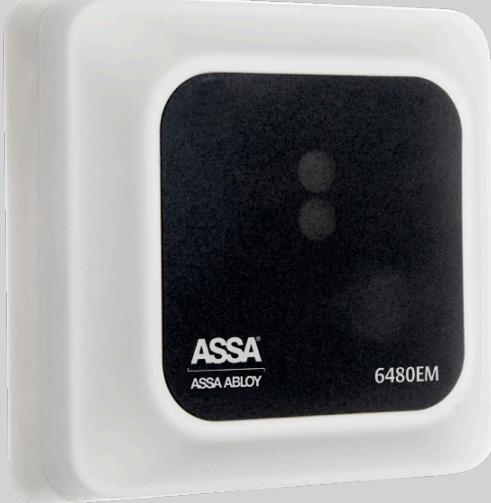
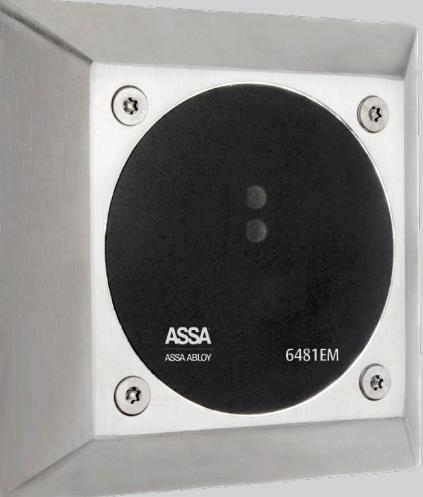
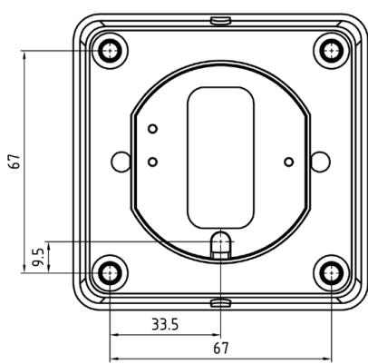
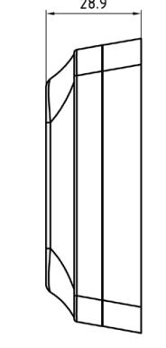
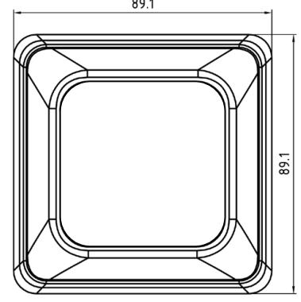
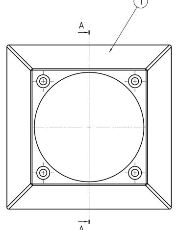
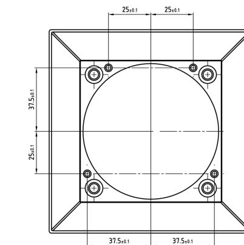

# ASSA 6480EM/6481EM Beröringsfria läsare

6480EM och 6481EM är beröringsfria läsare utan knappsats. Läsavståndet är mellan 5-10 cm. Läsarna har grön indikering för giltig kodbärare samt röd indikering för ogiltig kodbärare. Den gröna indikering lyser även när dörren är olåst.

Läsarna passar både inom- och utomhus, eftersom de uppfyller kraven för IP54 . De används i miljöer som t ex garage och kontor men även i offentliga lokaler. 6481EM har en slagtålig front i metall, vilket gör den lämplig för extra utsatta miljöer.

# ASSA 6480EM/6481EM Beröringsfria läsare

ASSA ABLOY, the global leader in door opening solutions, dedicated to satisfying end-user needs for security, safety and convenience.

ASSA AB P.O. Box 371 SE-631 05 Eskilstuna Sweden

phone +46 (0)16 17 70 00 fax +46 (0)16 17 72 10

Customer support: phone +46 (0)771 640 640 fax +46 (0)16 17 73 72 e-mail: helpdesk@assa.se

### www.assa.se

## **Indikeringar**

- • Dörr olåst
- • Ogiltigt kort

# **Data**

| •	 Matningsspänning: | 12 V DC |
|----------------------|---------|
| •	 Strömförbrukning: | 100 mA  |
| •	 Lästeknologi:     | EM4102  |

## **Material 6480EM**

- • Vit PC plast med svart dekal
- • Halon/Halogenfri
- • Uppfyller kraven för IP54

### **Material 6481EM**

- • Rostfritt stål
- • Uppfyller kraven för IP54

### **Kan anslutas till**

- • ARX och RiTA systemen
### **Övrigt**

- • Inbyggd sabotagekontakt
- • Utanpåliggande samt infällt montage
- • Passar i standard apparatdosa
- • Läsavstånd 5-10 cm
- • Antenntestläge
- • Grön och röd indikering

### **Artikelnummer**

- • Berörningsfri läsare 6480EM S556 480 085
- • Beröringsfri läsare 6481EM S556 481 131 med slagtålig front
- 
- CE-kontrollerad och godkänd

M1782.0702