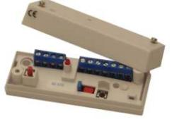
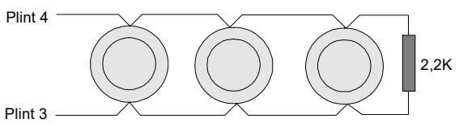
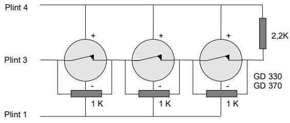
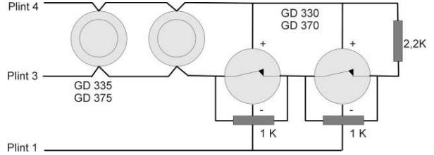

# **Analysator**

# **Installationsmanual IU 370**

# **BESKRIVNING**

IU 370 är en analysatorenhet med ett larm- och ett felrelä för anslutning av glaskrossdetektorerna ur GD 300-serien i inbrottslarmanläggningar. Den har en återställningsknapp. Till en IU 370 kan upp till 10 stycken glaskrossdetektorer GD 330/GD 370 eller upp till 20 st GD 335/GD 375 anslutas.

#### **FUNKTION**

IU 370 övervakar resistansförändringar i en balanserad larmslinga med ändmotståndet 2.2 Kohm. Vid en förändring på > +/- 20 % och en varaktighet på mer än 800 ms kommer larm att ställas ut. Larmreläet som normalt är slutet bryter under 2 - 3 sekunder eller förblir brutet tills återställning gjorts beroende på hur enheten programmerats.

IU 370 övervakar också slingan. Om slingresistansen understiger 300 ohm eller överstiger 20 kohm så signaleras sabotage och lysdioden börjar blinka.

# **INSTALLATION & TEST**

#### **MONTERING**

- 1. Välj en lämplig montageplats på ett jämt underlag. Fäst enheten med de medföljande skruvarna.
- 2. Slingan ligger mellan plint 3 och 4.
- 3. + spänningen till GD 330 och GD 370 ligger på plint 4.
- 4. Följ inkopplingen enligt bilderna nedan.
- 5. Anslut matningsspänningen för IU 370 med till plint 1 och + till plint 2.
- 6. Gör ett provlarm från en detektor i taget för att kontrollera att alla detektorer fungerar. Använd GVT 500 / GVT 5000.

## **INKOPPLING AV GD 335 OCH GD 375**

Detektorerna i GD 335/375-serien är polaritetsoberoende. Alla ledare i detektorn är förtennade och det är kontakt mellan dem parvis. Koppla in detektorerna enligt figuren mellan plint 3 och 4. Max 20 st.

IU 370 är försedd med en sabotagekontakt för skydd mot öppning.

Återställning av detektorerna kan ske på plats med återställningsknappen, styrning via ingång 8 eller genom att bryta spänningen till enheten. Återställningen bryter spänningsmatningen till detektorerna. Återställning kan endast ske om Larm eller Fel råder. Utgående Larm eller Fel kan inte blockeras genom att hålla återställningsknappen intryckt.

IU 370 har ett händelseminne med tidsangivelser som kan avläsas med en PC inkopplad på den röda kontakten via ett USB-modem.

#### **PROGRAMMERING**

IU 370 har en programmeringsbygel för programmering av larmreläet och felreläet samtidigt.

- **S1 Öppen** Larmreläet och Felreläet förblir öppet tills återställning skett. LED tänds vid larm och släcks vid återställning. Vid fel blinkar lysdioden till återställning.
- **S1 Byglad** Larmreläet öppnar i 2 3 sekunder och återställs automatiskt. Felreläet förblir öppet till återställning sker. LED tänds vid larm och släcks vid återställning. Vid fel blinkar LED till återställning.

#### **INKOPPLING AV GD 330 OCH GD 370**

Detektorerna GD 330 och GD 370 spänningsmatas med + från plint 4 och – från plint 1. Detektorernas relä kopplas i serie på slingan som ligger över plint 3 och 4 med ett ändmotstånd på 2,2 kohm. **OBS**. Det är viktigt att reläerna ligger i den del av slingan som utgår från plint 3 och med ett motstånd på 1 kohm parallellt över varje larmrelä. Max 10 st. Se figur nedan.

## **INKOPPLING VID KOMBINATION AV GD 335/375 OCH GD 330/370**

När detektorer med transistorutgång och detektorer med reläutgång skall kombineras till en analysator kopplas de enligt figur nedan.

IU 370

## **INKOPPLING AV IU 370**

- 1. matning 11 15 VDC
- 2. + matning 11 15 VDC
- 3. utgång för balanserad larmslinga

### **FUNKTIONSBESKRIVNING**

#### **LARMSLINGA**

- Balanserad slinga med anslutning på plint 3 och plint 4
- Ändmotstånd 2,2k 1%
- Normalområde 2,2k +/- 20 %
- Larm övre gränser 2,65 kohm till 20 kohm
- Larm undre gränser 1,76 ohm till 300 ohm
- Fel övre gräns >20 kohm
- Fel undre gräns <300 ohm

# **AVBROTT PÅ SLINGAN OCH S1 ÖPPEN**

- Efter ca 2 sek öppnar Felreläet
- Felreläet är öppet tills återställning sker
- Lysdioden blinkar tills återställning sker

## **AVBROTT PÅ SLINGAN OCH S1 BYGLAD**

- Efter ca 2 sek öppnar Felreläet
- Felreläet är öppet tills återställning sker
- Lysdioden blinkar tills återställning sker

# **LARM PÅ SLINGAN OCH S1 ÖPPEN**

- Efter ca 1 sek öppnar Larmreläet
- Larmreläet är öppet tills återställning sker
- Lysdioden lyser fast tills återställning sker

## **LARM PÅ SLINGAN OCH S1 BYGLAD**

- Efter ca 1 sek öppnar Larmreläet
- Larmreläet är öppet i ca 3 sek
- Lysdioden lyser fast tills återställning sker

# **ÅTERSTÄLLNINGSKNAPP**

- Återställning kan endast ske om Larm eller Fel utlösts
- 4. + utgång till balanserad slinga samt + 8 V matning till GD 330, GD 370
- 5. Larmrelä med 30 ohm i serie
- 6. Larmrelä med 30 ohm i serie
- 7. Fri plint
- 8. Återställningsingång för fjärråterställning
- 9. Sabotagekontakt i serie med felrelä med 30 ohm i serie
- 10. Sabotagekontakt i serie med felrelä med 30 ohm i serie
- 11. Fri plint

### **SPÄNNINGSMATNING TILL IU 370**

- 11 15 VDC med på plint 1 och + på plint 2
- Polaritetsskyddad
- Vid 8 V öppnar Felreläet och:
	- o Felreläet är öppet till återställning
	- o Lysdioden blinkar tills återställning
	- o Spänningen på slingan bryts tills återställning

## **SPÄNNINGSMATNING TILL DETEKTORER GD 330 OCH GD 370.**

- Konstant 8 V mellan plint 1 och plint 4
- Spänningen bryts vid återställning ca 3 sek
- Max strömmatning 100 mA
- Konstant nedtryckning av återställningsknappen kan inte blockera utgående larm
- Vid återställning bryts spänningen på slingan i ca 3 sek

# **LYSDIODINDIKERING**

- Lysdioden lyser med fast sken vid Larm
- Lysdioden blinkar vid Fel
- Om först Larm utlösts och sedan Fel lyser den med växlande fast och blinkande sken
- Om först Fel och sedan Larm utlösts lyser den med växlande fast och blinkande sken

# **FJÄRRÅTERSTÄLLNING**

- Anslutning på Plint 8
- Återställning sker vid ändring av polariteten
- Processorn ställer in sig efter ca 5 sek
- Klippt ledning påverkar inte återställningen

## **TEKNISKA DATA**

Matningsspänning: 11 – 15 VDC Strömförbrukning: 16 mA (19 mA vid larm) Larmutgång: Relä, NC Spänningsmatning plint 4: 8 V Max 100 mA Larmrelä / Felrelä: 33 Ω i serie. 100mA/35V Larmslinga: 2,2 kohm, 1% ändresistans – gränsvärde för larm: +/- 20% av 2,2k – gränsvärde för FEL: < 300 ohm / > 20kohm – utlösningstid: 800 ms – återställningstid: 3 sek Arbetstemperatur: -40 till +50o C Mått (L x B x H): 92 x 31 x23 mm

Compliance: