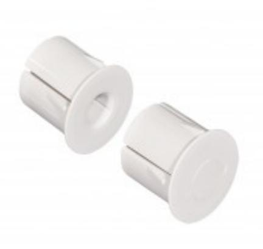
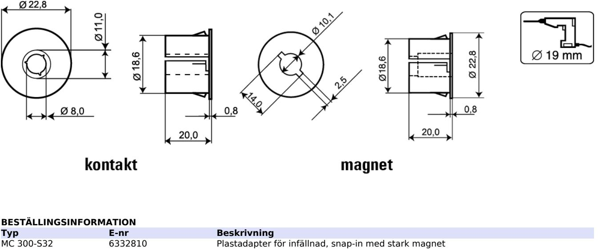

## MC 300-S32

## Plastadapter med stark magnet för MC 340, 346, 347

## **Produktdetajler:**

[Powered by TCPDF (www.tcpdf.org)](http://www.tcpdf.org)

| Monteringssätt        | Infälld   |
|-----------------------|-----------|
| Borrdiameter mm       | 19        |
| Kapsling              | ABS Plast |
| Färg                  | Vit       |
| Dimensions (L x Ø) mm | 20 x 23   |

Plastadapter med extra stark magnet för infällning av magnetkontakter i dörr- och fönsterkarmar av stål eller där ett större arbetsavstånd önskas.

Passar till MC 340, 346 och 347. Kontakten pressas in i adaptern.

Med snap-in funktion för två olika godstjocklekar, 1 mm och 1,5 mm.

