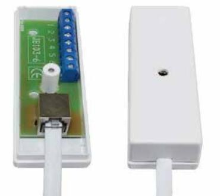
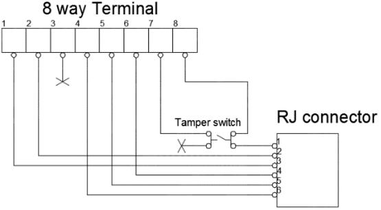

## **Instruction Manual DL-6**

# **Door Loop**

### **DESCRIPTION**

Door Loop DL-6 is a product with 6 way flexi spiral cable and 2 junction boxes included. Terminal connection in each junction box side to simplify installation and signal transmission in alarm applications. Flexible spiral cable connection allow to use it in areas where often opening/closing is required (e.g. tilt and turn windows or sliding door). Door Loop DL-6 is designed for easy and fast one-to-one connection. Each junction box is equipped with an opening protection switch.

#### **MOUNTING INSTRUCTIONS**

- Plastic bottom housing should be attached to the surface by screws.
- Housing construction allows to mount device directly on cable or through casing using attached accessories (housing got special areas to break out plastic).
- During installation (screwing) don't use too much excessive force (PCB of housing can be damaged).
- Device is intended for indoor applications.

#### **CIRCUIT DIAGRAM**

#### **OPERATING PRINCIPLE**

DL-6 is Door Loop connection for simple signal transmission between two devices. Each box has 8 way terminal with wire protection, of which 2 are specified for the tamper switch. Connection between two boxes is manage by flex cable with 6 wire RJ connection.

#### **Ordering data:**

| Type | E-nr    | Description                   |
|------|---------|-------------------------------|
| DL6  | 6332872 | Door Loop with flexi cable |

## **TECHNICAL DATA**

| Tamper protection       | Opening                         |
|-------------------------|---------------------------------|
| Contact rating max.     | 10 W, 48 V DC/AC (for pins 1-6) |
| Tamper contact rating   | 30 VDC / 50 mA (for pins 7-8)   |
| Housing material        | plastic ABS                     |
| Colour                  | White                           |
| Dimensions (L x W x H)  | 91 x 31 x 23                    |
| Flexi extendible length | From 45 to 150 cm               |
| Cable connection type   | RJ; 6 way                       |
| Cable insulation colour | White                           |
| Surface mounting        | SCREWS 3,5x19                   |
| Terminal block type     | 8 way screw terminal            |

We reserve the right to changes without notice.