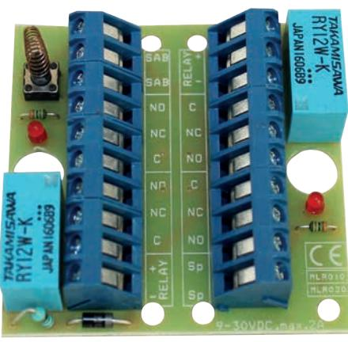
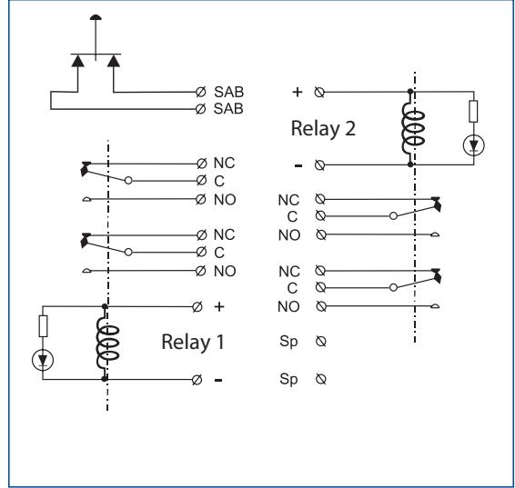

## **RC 020 RELÄKORT**

## **Fördelar**

- Reläkort med två reläer och dubbelt (2x) växlande (NC/NO) reläfunktion
- Inkoppling med skruvplint
- Aktiva reläer indikeras med lysdiod
- Sabotagekontakt

RC 020 är ett reläkort med två reläer och dubbelt (2 x) växlande (NC/NO) funktioner. Inkoppling sker via skruvplint med trådskydd. Aktiva reläer indikeras med lysdioder. På kortet finns också en sabotagekontakt som öppningsskydd om kortet monteras i t.ex. JB 200 box.

| Beställningsinformation |         |                                                                 |       |
|-------------------------|---------|-----------------------------------------------------------------|-------|
| Typ                     | E-nr    | Beskrivning                                                     | Paket |
| RC 020                  | 6332874 | Reläkort 9 – 30 V, två reläer dubbelt växlande, sabotagekontakt | 1 st  |