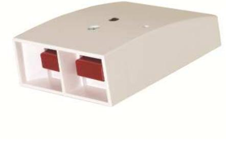
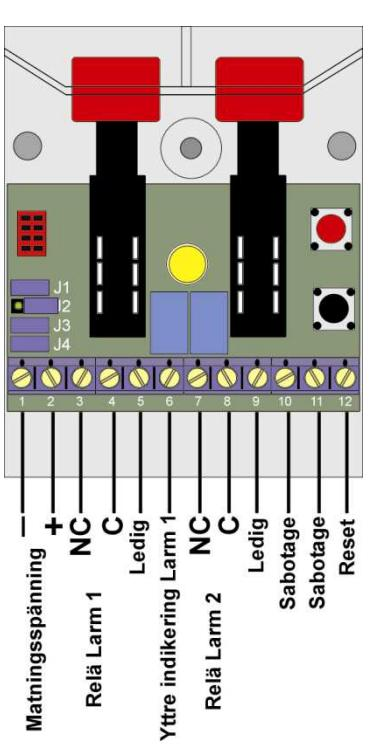

# **Överfallskontakt**

## **Installationsmanual HB 120**

### **BESKRIVNING**

En elektronisk överfallskontakt ger en överlägset säkrare funktion än en mekanisk. Kontaktstuds och osäker kontaktfunktion elimineras och dessutom fås fler logiska funktioner. Elektroniken ger en väl definierad utsignal anpassad till moderna larmsystem.

HB 120 används med fördel i alla tänkbara objekt från banker och andra högriskobjekt till affärer och statliga eller kommunala institutioner där en säker och pålitlig funktion krävs för att påkalla uppmärksamhet i händelse av överfall eller bråk.

#### **INSTALLATION**

HB 120 får endast installeras inomhus. Kontakten monteras på den plats som bäst passar användningsområdet, i de flesta fall dolt. Tänk på att montera kontakten lättåtkomligt under ett bord, en disk eller ett annat ställe där man kan behöva påkalla hjälp.

HB 120 är försedd med sabotageskydd mot öppning. Infästningen av locket är sådant att man med en kraftig spark mot locket kan bryta bort det och kontakten ger då ett sabotagelarm. Det är en funktion som kan vara bra i en eventuell gisslansituation. Kontakten bör då monteras lågt i ett utrymma där det finns risk att gisslan kan låsas in.

Montera kontakten på ett plant underlag med de två medföljande skruvarna.

#### **FUNKTION**

HB 120 har två olika larmfunktioner med separata reläer.

#### **LARM 1**

HB 120 ger Larm 1 när båda knapparna trycks in samtidigt. Vid Larm 1 tänds en röd indikering på den inbyggda lysdioden. Denna indikering kvarstår tills återställning sker. Återställning kan ske med en smal mejsel via hålet i locket eller med 0 V på anslutning 12.

Med bygel J2 kan omkoppling ske så att det bara behövs en knapp intryckt för att ge Larm 1. Vid Larm 1 aktiveras ett relä som kan programmeras att kvarstå i larmläge eller automatiskt återställas efter ca 2 sekunder. Lysdiodindikeringen påverkas inte av denna programmering utan måste alltid återställas. Larm 1 har en drivkrets för yttre indikering. Denna indikering följer lysdioden och kan belastas med 50 mA, minus vid larm.

#### **LARM 2**

HB 120 ger Larm 2 när en knapp, valfritt vilken, trycks in. Vid Larm 2 visas en gul indikering på lysdioden som kan programmeras att kvarstå till återställning eller endast vara aktiv så länge som knappen trycks in. Larm 2 reläet kan programmeras att vara kvarstående eller aktiveras i två sekunder och sedan automatiskt återställas. Larm 2 reläet kan även programmeras att bara följa själva knapptryckningen.

#### **Prioritet**

Larm 1 har prioritet över Larm 2. Om båda knapparna skulle tryckas in under ett Larm 2 kommer ett Larm 1 att aktiveras och även indikeras. Bägge larmreläerna kommer att vara aktiverade.

#### **Strömavbrott**

Vid ett strömavbrott kommer sabotage att aktiveras.

#### **PROGRAMMERING**

Programmeringen av HB 120 sker med de fyra byglarna

J1–J4, se figur nedan.

#### **J1, STYR LARM 1 RELÄET**

- Bygel sluten ger kvarstående relä.
- Bygel öppen ger automatisk reset efter 2 sekunder.

#### **J2, STYR OM EN ELLER TVÅ KNAPPAR SKALL GE LARM 1**

- Bygel sluten ger Larm 1 för en knapp valfritt vilken eller båda intryckta.
- Bygel öppen måste båda knapparna samtidigt intryckas för Larm 1.

*OBS! J2 måste vara öppen för att Larm 2 skall fungera.* 

#### **J3, STYR LARM 2 RELÄET**

- Bygel sluten ger en reläfunktion som följer Larm 2 LED indikering som styrs av J4. Om J4 är sluten kvarstår reläet och om J4 är öppen bryter reläet så länge som ena knappen är intryckt.
- Bygel öppen ger att reläet följer tryckningen till 2 sekunder och återställs därefter.

#### **J4, STYR GUL LED FÖR LARM 2 INDIKERING**

- Bygel sluten ger kvarstående gul indikering vid Larm 2.
- Bygel öppen ger att gul indikering följer knapptryckningen.

#### **INDIKERINGAR**

Lysdioden ger två olika indikeringar, rött för Larm 1 och gult för Larm 2. Om man av någon anledning inte vill ha den röda indikeringen kan det, från plinten sett, vänstra benet klippas av och vill man inte ha den gula indikeringen klipper man det högra benet. Skulle det vara så att ingen indikering önskas klipper man det mittersta benet.

#### **ÅTERSTÄLLNING**

1. Återställning av reläer och lysdioden kan ske genom att ansluta minus till plint nr 12.

2. Lokalt genom att använda en smal mejsel i hålet i locket och trycka in kontakten i ca 2 sekunder.

#### *OBS! Återställ inte genom att bryta spänningen för då utlöses sabotagelarm.*

#### **INKOPPLING**

1 Matningsspänning (-) 2 Matningsspänning (+) 3 NC (Larm 1) 4 C (Larm 1) 5 Ledig 6 Yttre indikering Larm 1 7 NC (Larm 2) 8 C (Larm 2) 9 Ledig 10 Sabotageomkopplare 11 Sabotageomkopplare 12 Återställning

#### **TEKNISKA DATA**

Matningsspänning: 8 – 15 VDC Strömförbrukning I vila: 7 mA I larm 24 mA (vid 12 V) Reläer: 50 VDC / 100 mA Automatisk reset: ca 2 sek Yttre indikering vid Sabotageskydd: Ja, 12 V DC / 50 mA Temperaturområde: -10 - +55o Kapslingsklass: IP 31 Mått (L x B x H): 80 x 65 x 30

Compliance:

Larm 1: Ger minus i serie med 220 ohm, max 50 mA C

