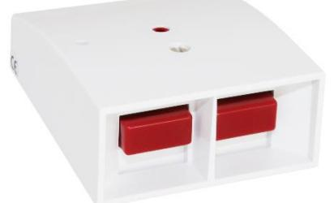
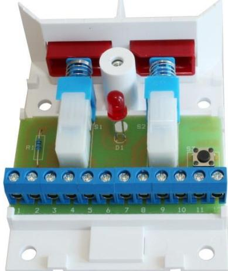
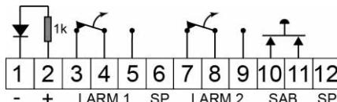
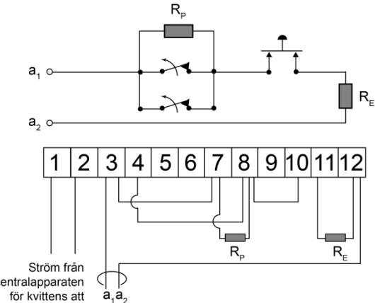
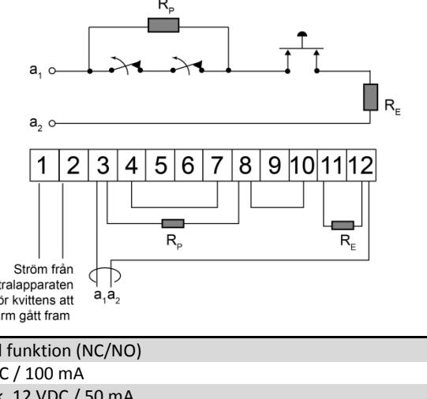

# **Överfallskontakt**

## **Datablad och Installationsmanual HB 105**

### **BESKRIVNING**

HB 105 är en mekanisk överfallskontakt som kan användas för olika applikationer i en larmanläggning. HB 105 har två tryckknappar med växlande (NC/NO) funktion i kopplingsplint. Beroende på in- koppling kan den användas för dubbeltryck eller för separata funktioner på respektive tryckknapp. Det finns också en ingång för att styra den inbyggda lysdioden. Sabotageomkopplare för skydd mot öppning.

HB 105 finns i två versioner:

- HB 105-M med återfjädrande tryckknappar
- HB 105-L med kvarstående tryckknappar

### **INKOPPLING**

Kontakten har 12 skruvplintar med trådskydd. Anslutningar enligt nedan:

- 1 Matningsspänning (-) till lysdiod
- Kvittens från centralapparat att larmet gått fram
- 2 Matningsspänning (+) till lysdiod
- 3 NC (Larm 1)
- 4 C (Larm 1)
- 5 NO (Larm 1)
- 6 Ledig
- 7 NC (Larm 2)
- 8 C (Larm 2)
- 9 NO (Larm 2)
- 10 Sabotageomkopplare
- 11 Sabotageomkopplare
- 12 Ledig

#### **Exempel på inkoppling för dubbeltryckfunktion:**

**Exempel på inkoppling för enkeltryckfunktion:**

| Larmutgång:      | 2 x Vxl funktion (NC/NO)                 |
|------------------|------------------------------------------|
| Kontaktdata      | 30 VDC / 100 mA                          |
| Sabotageskydd:   | Ja lock, 12 VDC / 50 mA                  |
| Matningsspänning |                                          |
| till LED:        | 9-30 VDC                                 |
| LED              | Ja, med inbyggt seriemot- stånd (1 Kohm) |
| Temperaturområde | -10 - + 55 ° C                           |
| Kapslingsklass   | IP31                                     |
| Mått (L x B x H) | 80 x 65 x 30                             |
| I enlighet med   |                                          |

**TEKNISKA DATA** 

