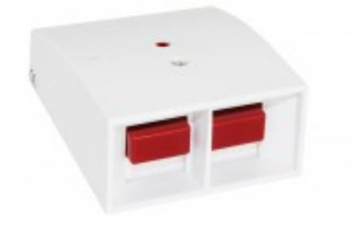
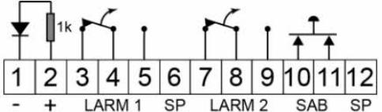
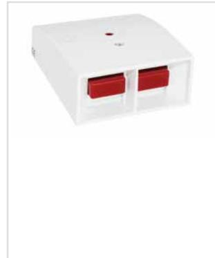
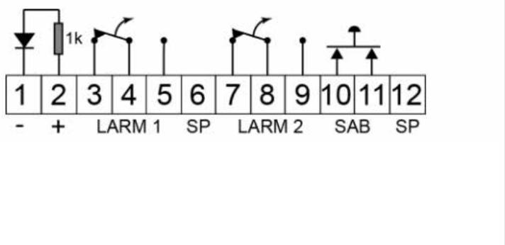

## HB 105-M

### Överfallskontakt med två återfjädrande tryckknappar

#### **Produktdetajler:**

| Larmutgång           | 2 x NC/NO           |
|----------------------|---------------------|
| Kontaktdata          | 48 VDC / 100 mA     |
| Larmindikering       | LED                 |
| Sabotageskydd / data | Ja / 48 VDC / 50 mA |
| Anslutning           | Skruvplint          |
| Kapsling             | ABS Plast           |
| Färg                 | Vit                 |
| Arbetstemperatur     | -10 - +55°C         |
| Kapslingsklass       | IP 31               |
| Mått (L x B x H) mm  | 80 x 65 x 30        |

HB 105-M är en mekanisk överfallskontakt som kan användas för olika applikationer i en larmanläggning.

HB 105-M har två återfjädrande tryckknappar med växlande (NC/NO) funktion i kopplingsplint. Beroende på inkoppling kan den användas för dubbeltryck eller för separata funktioner på respektive tryckknapp. Det finns också en ingång för att styra den inbyggda lysdioden.

Sabotageomkopplare för skydd mot öppning.

| BESTÄLLINGSINFORMATION |         |                                                     |
|------------------------|---------|-----------------------------------------------------|
| Typ                    | E-nr    | Beskrivning                                         |
| HB 105-M               | 6332860 | Överfallskontakt med två återfjädrande tryckknappar |

### **Relaterade produkter och tillbehör:**

Powered by TCPDF (www.tcpdf.org)

# **HB 105-L**

Överfallskontakt med två kvarstående tryckknappar

