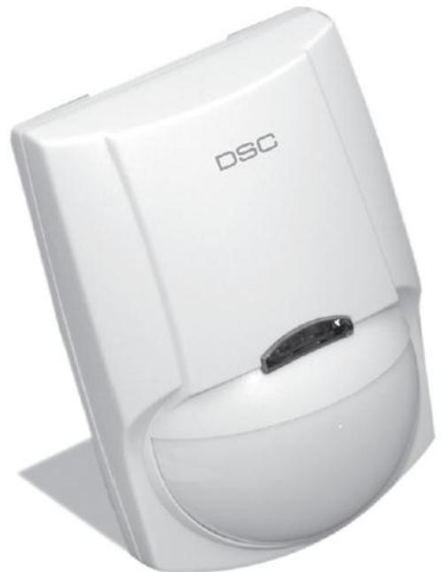
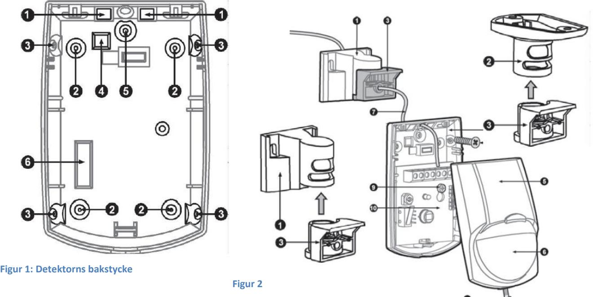
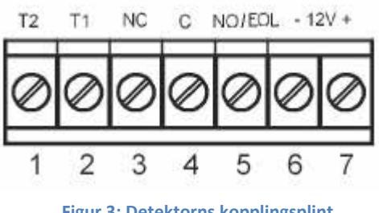
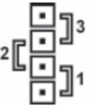
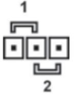
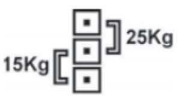
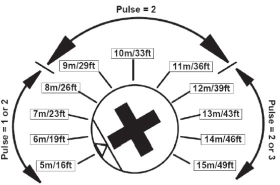
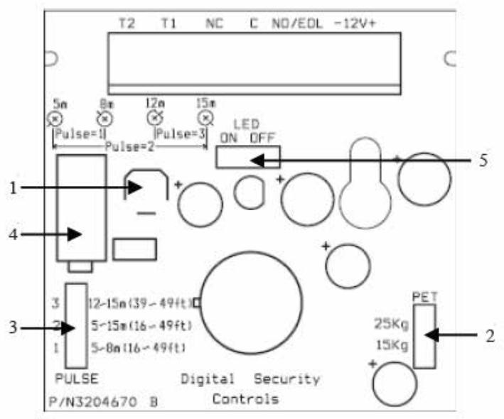
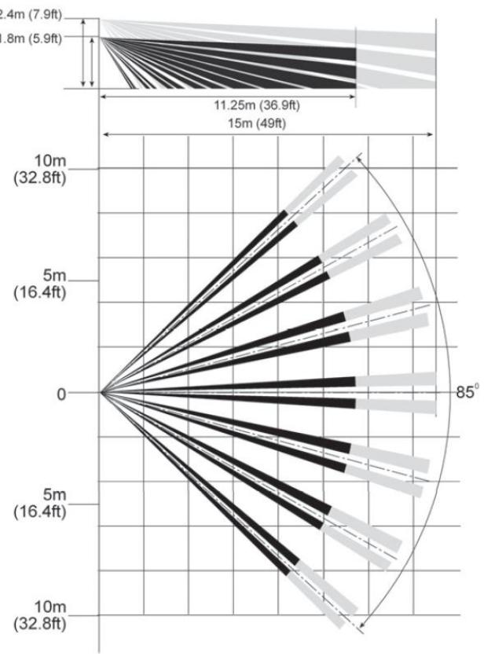

## **Installationsmanual**

# **LC-100PI Husdjursimmun Passiv IR-Detektor**

#### **Produktinformation**

Professionell passiv husdjursimmun IR-detektor från DSC med kompakt design som lätt smälter in i de flesta miljöer. LC-100P använder sig av en avancerad signalprocessor som gör detektorn immun mot husdjur upp till 25 kg. Till skillnad mot många andra detektorer är larmreläet elektroniskt, vilket gör LC-100P helt ljudlös.

#### **Installationstips**

Placera detektorn där det är mest troligt att en inkräktare kommer att passera, referera till detektorns bevakningsområde. Tänk också på att välja en plats så att en eventuell inkräktare med största sannolikhet kommer att korsa igenom IR-detektorns bevakningsområde, rakt framifrån har detektorn som svårast att detektera rörelse. Vid installation i miljöer där husdjur förekommer, undvik att rikta detektorn mot möbler som djuret kan hoppa upp på och undvik också att rikta detektorn mot trappor som djuret har tillgång till.

Undvik följande monteringsplatser:

- Där detektorn är utsatt för infallande solljus
- Med objekt som snabbt kan tänkas ändra temperatur
- I närheten av ventiler eller kraftiga luftströmmar
- Riktade direkt mot ytterdörrar av metall

Denna detektor ska endast monteras inomhus och i en miljö som har föroreningar maximalt enligt grad 2 och som har överspänningar maximalt enligt kategori II, och INTE I EXPLOSIONSSKYDDADE UTRYMMEN. Detektorn är avsedd att endast installeras av kompetent installatör.

#### **Montering av detektorn**

Detektorn monteras normalt direkt på en vägg, med eller utan väggfäste. Det finns dock även fäste för takmontering, om så önskas.

1. För att lossa detektorns front, skruva loss fixeringsskruven och lyft försiktigt bort fronten, se figur 2-11.

2. För att ta bort kretskortet, lossa försiktigt skruven som håller kretskortet på plats, se figur 2-9

3. Peta bort plasten som täcker lämpliga monteringshål, se figur 1-2 (på plan vägg) eller 1-3 (i hörn).

4. De fyrkantiga och runda markeringarna anger bleck som kan brytas bort för att få införingshål för kablar.

5. Montera detektorns bakstycke på en vägg, i hörn eller i taket (för installation med vridfäste, se figur 3) Detektorn måste monteras med minst 2 skruvar; 3 x 30 mm.

6. Sätt tillbaka kretskortet och fixera det genom att dra åt hållskruven ordentligt.

7. Koppla in ledarna i kopplingsplinten (se Figur 5).

8. Sätt tillbaka frontkåpan genom att skjuta in den på införingsstiften och dra sedan åt kåpans hållskruv.

## **Detektorns kopplingsplint**

#### **Inkopplingar i kopplingsplint (se Figur 3)**

**T1, T2** (Sabotagekontakt)

Anslutning för detektorns sabotageskydd. Ansluts i serie med den balanserade larmslingan. Om detektorns frontkåpa öppnas utlöses sektionssabotage i centralapparaten.

**Figur 3: Detektorns kopplingsplint**

**NC, C** (Larmkontakt)

Anslutning för detektorns larmrelä, normalt sluten reläkontakt som utgör PIR-detektorns larmutgång.

#### **EOL**

Använd denna anslutning för inkoppling av ändmotstånd för balanserade slingor. Detektorn har inget inbyggt motstånd men denna skruv förenklar inkoppling av ett lämpligt motstånd anpassat för den centralapparat som används.

**12V -** (negativ) Ansluts till (-)-spänning eller jord i centralapparaten.

**12V +** (positiv) (+12V) Ansluts till (+)-spänning på mellan 8,2 – 16 V DC (normalt i centralapparaten).

#### **Detektorns inställningar**

**Baserat på detektorns bevakningsområde, justera pulsräkning och räckvidd.** 

**PIR-SENSORNS KÄNSLIGHET (PULSE): Se figur 6-3. Bestämmer pulsräkning.** Anpassning av detektorns känslighet till aktuell miljö. Observera att dessa används i kombination med inställning för husdjursimmunitet..

**Position 1 - Hög känslighet** för stabil miljö utan husdjur. **Position 2 - Normal känslighet.** Husdjursimmunupp till 15kg **(fabriksvärde)**. **Position 3 - Låg känslighet** för tuff miljö. Husdjursimmun upp till 25kg.

**LYSDIOD PÅ / AV (LED) : Se figur 6-2.** Bestämmer funktion på detektorns lysdiod.

 **Position 1 –** Lysdioden aktiveras vid detektering **(fabriksvärde)**. **Position 2 –** Lysdioden är alltid släckt.

**IMMUNITET MOT HUSDJUR (PET)**: **Se figur 6-2.** För inställning av immunitet mot husdjur 15 – 25 kg.

**Position 15kg -** Löser inte ut larm för husdjur upp till 15 kg. **Position 25kg -** Löser inte ut larm för husdjur upp till 25 kg.

**RÄCKVIDD - "PIR SENS": Se figur 6-1.** Ställs in efter storleken på det område som ska skyddas. Vrid denna potentiometer (PIR SENS) för att justera känsligheten mellan Minimum och Maximum beroende på gångtester utförda i området (förvald känslighet är medium – mittläge). Vrid potentiometern medurs för ökad räckvidd – moturs för minskad räckvidd. Utför alltid gångtest och justera räckvidden om så behövs.

**ANM!** Potentiometern **"PIR SENS"** måste vridas till maximal känslighet för att maximalt täckningsområde enligt Figur 7 ska uppnås.

### **Översikt av LC100**

#### **Figur 6: Detektorns kretskort**

- **1. Inställning för känslighet**
- **2. Inställning för husdjursimmunitet**
- **3. Inställning för pulsräkning**
- **4. Sabotagekontakt**
- **5. Inställning för lysdioden**

## **Detektorns bevakningsområde**

**Figur 7: Detektorns bevakningsområde** 

*OBSERVERA: SBSC-intyget baserat på bevakningsområdet 9x6m.

## **GÅNGTEST AV DETEKTORN**

#### VIKTIGA RÅD:

Vid installation ska enheten noggrant testas så den fungerar på rätt sätt. Även slutanvändaren bör instrueras att regelbundet gångtesta detektorn.

Ställ in detektorn enligt följande: Puls = 1, Lysdiod = På. Avlägsna alla människor från detektorns täckningsområde. Gå sedan runt i detekteringsområdet och kontrollera att önskad funktion uppnåtts. Skulle detta inte vara fallet, justera PIR-sensorns känslighet eller montera detektorn på annan plats. När räckvidden (känsligheten) är rätt kan lysdioden släckas, om så önskas.

#### **TEKNISK SPECIFIKATION**

| Detekteringsmetod         | Quad (fyrdubbelt pyroelement) för PIR             |
|---------------------------|---------------------------------------------------|
| Matningsspänning          | 9,6 – 16 V DC                                     |
| Strömförbrukning          | 12mA                                              |
| Aktiveringstid larmutgång | 2 sek.                                            |
| Larmutgångar              | N.C. 28 V DC; 0,1 A med skydd av 10 ohms          |
|                           | seriella motstånd                                 |
| Sabotagekontakt           | N.C. 28 V DC; 0,1 A med skydd av 10 ohms seriellt |
|                           | motstånd – när kåpan öppnas                       |
| Uppvärmningstid           | 60 sek.                                           |
| Vitljusskydd              | Reagerar inte för halogenljus på 2,4m eller på    |
|                           | reflekterat ljus.                                 |
| Bevakningsområde          | Upp till 15x12m                                   |
| Lysdiodsindikeringar      | Röd led aktiveras vid detektering                 |
|                           |                                                   |
| RF-immunitet              | 10 V/m plus 80% AM från 80 MHz t.o.m. 1GHz        |
| Statisk immunitet         | 8 kV vid kontakt, 15 kV via luft                  |
| Transientskydd            | 2,4 kV vid 1,2 joule                              |
| Driftstemperatur          | -10º C ~ +50 º C                                  |
| Mått/Vikt                 | 118 x 62,5 x 41 mm / 83 gram                      |

Uppfyller krav enligt SSF1014 - Larmklass 3, Miljöklass 2

