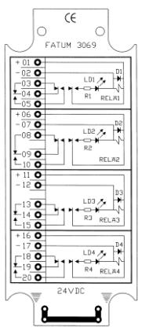
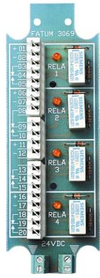
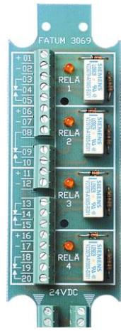

## **Reläplint, 24 VDC, 4 relä**

*Reläplint med 4 st 1-poligt växlande 24V DC reläfunktioner.*

*Lysdiod parallellt med reläspole.* 

*Separat anslutningsplint för skärm*

| Ledaranslutning - skruv                     | Area 0,14 - 1,5 mm2 |
|---------------------------------------------|---------------------|
| Ledaranslutning - slits                     | Diam 0,40 - 0,63 mm |
| Minimum reläspänning                        | 18 V                |
| Rekommenderad max belastning                | 60 V / 2 A          |
| Storlek (HxBxD)                             | 116 x 40 x 13 mm    |
| Strömförbruking/aktiverat relä @24VDC (typ) | 15 mA               |

*50 153 38 50 153 40*

**3069.01 3069.03 Reläplint, 24 VDC, 4 relä, slits Reläplint, 24 VDC, 4 relä, skruv**