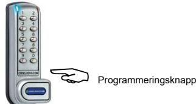
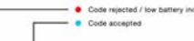
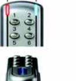

# **PROGRAMMERING**

**A läge**.För att programmera måste låset vara öppet med codelocks.com knappen synlig. Varje programändring måste börja med att trycka på codelocks.com knappen följt av antingen master kod, administratörskod eller användare kod.

**B läge**. ( engångskoder ) Behöver inte programmeringsknappen användas. Programmeringsknappen kan användas för att rensa koden om ett misstag har skett. Exempel:

För att slå in en kod är det 10 sec tillåten tid mellan varje knapptryckning.Överskrids tiden rensar det den påbörjade koden.

#### **MASTER KODINSTÄLLNINGARÄNDRA MASTER KOD**

master kod 01 ny master kod ny master kod

Exempel: 11335577 01 12345678 12345678

Resultat: Master koden har ändrats till 12345678 O.B.S I B läget behövs inte programmeringsknappen användas.

#### **LÄGG TILL ELLER ÄNDRA ANVÄNDARE KOD**

master kod 02 användare kod

Exempel: 11335577 02 1455

Resultat: Ny användare kod 1455 registrerad

#### **RADERA ANVÄNDARE KOD**

**codelocks.com** master kod 03

Exempel:**codelocks.com** 1133557703

Resultat: Användare kod raderad

#### **LÄGG TILL ELLER ÄNDRA SUB-MASTER KOD**

master code 04 Sub-Master kod Sub-Master kod Exempel: 11335577 04 22446688 22446688

Resultat: Sub-Master kod 22556688 aktiv

O.B.S I B läget behövs inte programmeringsknappen användas.

| RA | DE | RA | SU | B-M AS | TE R | KO D |
|----|----|----|----|-----------|---------|---------|
|    |    |    |    |           |         |         |

master code 05 05

Exempel: 11335577 05 05

Resultat: Sub-Master kod raderad O.B.S I B läget behövs inte programmeringsknappen användas.

## **SUB-MASTER INSTÄLLNINGAR**

### **ÄNDRA SUB-MASTER KOD**

sub-master kod 06 ny sub-master kod ny sub-master kod 224466880611335500

 11335500

Resultat: Ny sub-master kod 11335500 nu registrerad O.B.S I B läget behövs inte programmeringsknappen användas.

**LÄGG TILL ELLER ÄNDRA ANVÄNDARE KOD**

sub-master kod 07 ny användare kod11335500

11335500

 07 9999

 08

> ny

> > 3. Öppning med master kod

Resultat:Användarekod 9999nuregistrerad

**RADERA ANVÄNDARE KOD**

Exempel:

Exempel:

Resultat: Användare

1.

2.

sub-master kod 08

 kod

## **ANVÄNDARE INSTÄLLNINGAR**

 raderad

**ÄNDRA ANVÄNDARE KOD A-läge** användare kod ny användare kodanvändarekod

 Exempel:224455415541

Resultat: Användare kod är nu 5541

#### **ENGÅNGS KOD ( omklädningsskåp B-läge )**

Engångs kod 4 siffror (låst) Engångs kod 4 siffrot (öppet) Exempel: 3355 (låst) 3355 (öppet)

Notera. När den angivna koden slagits in nollställs låset och förses i öppet läge tills en ny kod anges. Blinkanderödlampavar5esecindikerarattlåsetärlåstoch

 således upptaget. 3.Displayenäridethärläget endastaktivnärvredetärilåst

possition.

#### **SPECIAL MASTER KOD INSTÄLLNINGAR**

**ÄNDRA FRÅN REPETERANDE KOD TILL ENGÅNGS KOD**

master code 09

Exempel: 11335577 09

Resultat: Låset är nu inställt i omklädningsskåp läge B ( en gångs kod)

O.B.S att displayen är inaktiv när vredet står i öppet läge. Endast Master och Sub-master code kommer att förbli oförändrad.

#### **BEGRÄNSA LÅSTIDEN ( OMKLÄDNINGSSKÅP LÄGE) 02,04,06,08,10,12 TIM LÅSNING**

master code 10 antal timmar som låset ska vara låst

Exempel: 11335577 10 04

Resultat: Låset kommer automatiskt att låsa upp efter 4 tim Notera.

1.Begränsning av lås tiden fungerar endast i läge för engångs koder.

2. Låset kan ställas in på att automatiskt öppna efter följande intervaller 02,04,06,08,10,12 tim se exempel ovanför vid programmering.

**ÄNDRA FRÅN ENGÅNGS KOD TILL REPETERANDE KOD**

Master code 11

Exempel: 11335577 11

 Resultat: Fabriks inställd kod 2244 fungerar tills omprogrammering sker

**SÄTT LÅSET I TEKNIKER LÄGE**

Master kod 12 Tekniker kod Tekniker kod

Exempel:11335577 12 555555 555555

Resultat: Låset är nu i Teknikerläge kod 555555.

O.B.S 1. Tekniker kod är endast tillgänlig när låset är i läge B ( engångs koder ) 2. Teknikerkoden kan öpna låset utan att engångs koden raderas. raderar

 användar kod

### **RADERA TEKNIKER KOD**

Master kod 13 13

Resultat: Tekniker kod raderad

**LÄGG TILL / TA BORT KNAPPLJUD**

Masterkod 14 14

Resultat: Inget ljud vid knapptryckning . För att återställarepeteraovanståendeprogrammering.

-

- **Notera.** Låset måste vara i öppet läge för att kunna återställas Lossa på skruvarna och ta bort låset från dörren
- - Avlägsna ett batteri

- Tryck in knapp 1 och håll kvar, sätt tillbaka batteriet, den blå lampan kommer att blinka 2 ggr, släpp knapp 1, inom 3 secunder tryck 3 ggr på knapp 1. Den blå lampan kommer nu att blinka 2 ggr och låset har nu programmerats om till fabriksinställning Master kod 11335577 och alla tidigare inställningar har raderats.

#### **Påföljd vid felaktig kod**

- Vid tre felaktigt slagna koder kommer låset att stänga av sig i 10 sec.

# **Batteri**

Låset ska fungera i ca50 000 öppningar med 4 sec aktivering. kräver 2 x AAA 1,5v batteri.

#### **Låg batteri nivå**

När batteri nivån är låg kommer den röda lampan att blinka 3 ggr före den blå lampan indikerar godkänd kod. Batteriet ska bytas så fort som möjligt.

Låset kommer att fungera i ca 100 öppningar med låg batteri nivå.

**Batteri slut**

Låset har konstruerats så att ett externt 9 v batteri kan placeras mot de utanpåliggande kontakterna som sitter under lås vredet ( öppnar låset med hjälp av master kod ) så att batteri byte kan utföras.

#### Utföres på följande sätt

-Placera den positiva + polen från batteriet mot låsets + kontakt och den negativa - polen från batteriet mot låsets - kontakt. Se till att bra kontakt erhålles.

 Slå in Master kod

-

-

- Låset kommer nu att dra in lås spärren så att låset kan öppnas. montera
 att

- -Byt ut batterierna genom
- - Återmontera låset.

## **ANVÄNDAR INSTRUKTIONER**

**Notera.** Skåplåset har en 10 knappars display och en **codelocks.com** programmeringsknapp som är gömd bakom lås vredet i låst utförande.

 lös låset.

#### **Låset har följande kod nivåer**

## **Master kod.**

Öppnar låset Ändrar master koden Programmera / ändra / radera sub-master och användare kod Välja mellan repeterande eller engångs kod Programmera / redera tekniker kod Lägga till / ta bort knapp ljud

**tveksamheter**

**programmeras**

**manualen.**

 **se den engelska**

 **i mer än en nivå.**

**Sub-Master kod.** Öppnar låset Ändrar sub-master kod Programmera /ändra /radera användare kod

**Användare kod** Öppnar låset Ändrar användare kod

**O.B.S Vid ev** 

**original** 

**Tekniker kod**

Öppnar låset utan att radera användar kod när det är i läge B (

engångs kod )

**Samma kod kan inte**