## DC200 DC300

## Installation Instructions

## D001155856

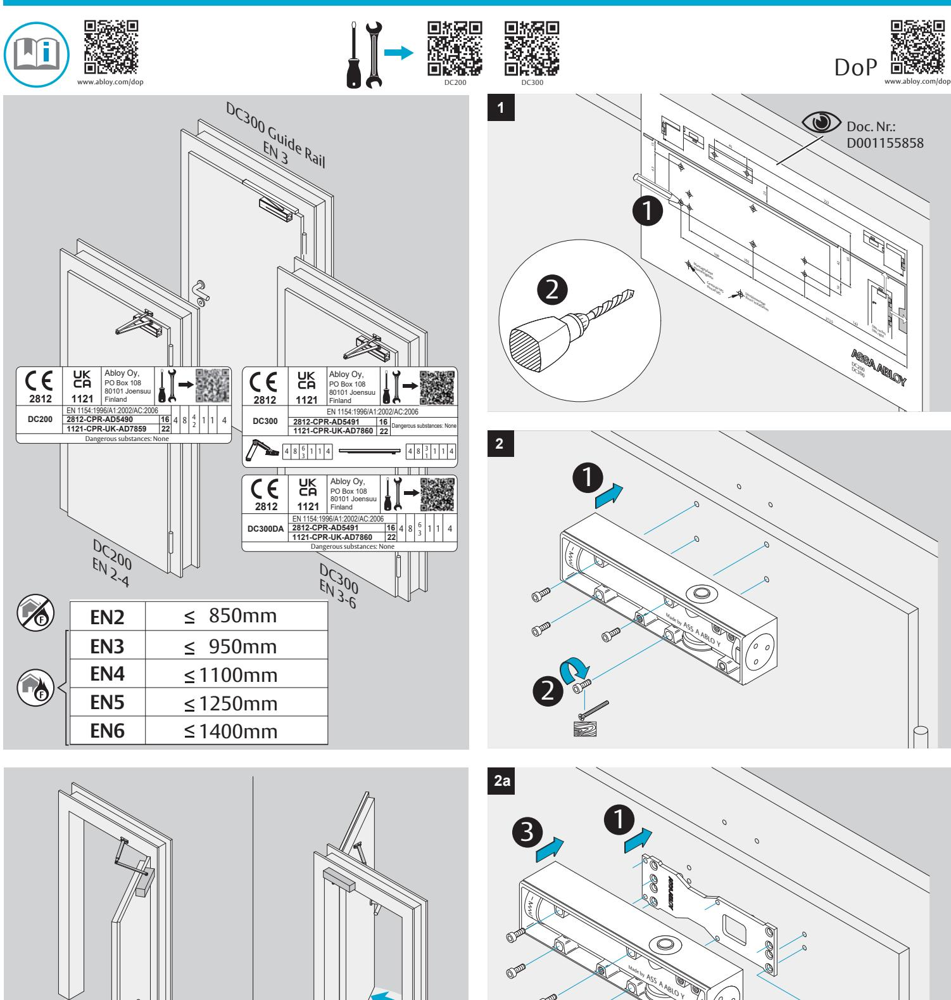

4 2

4 x

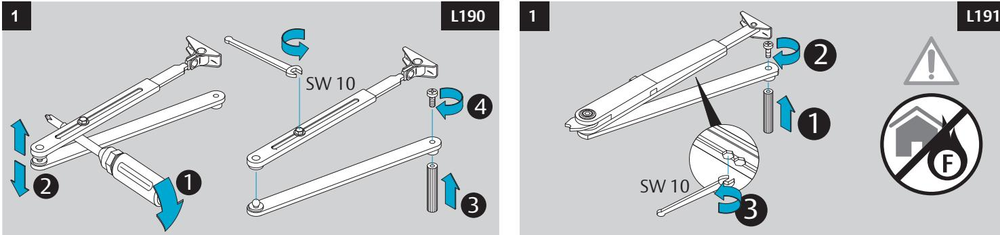

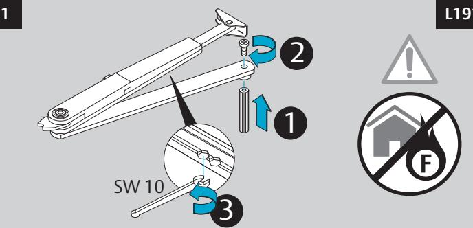

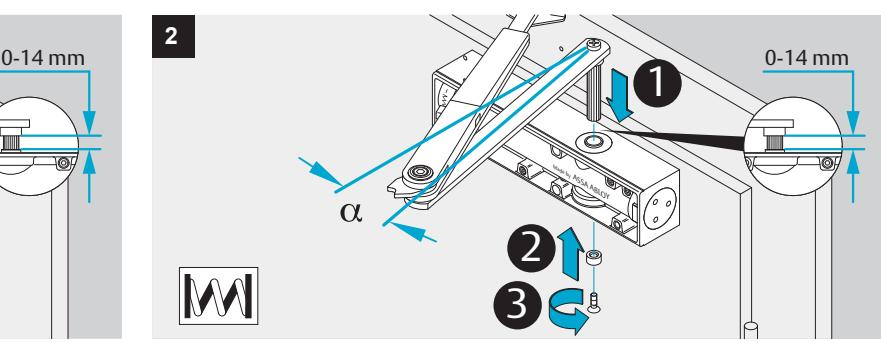

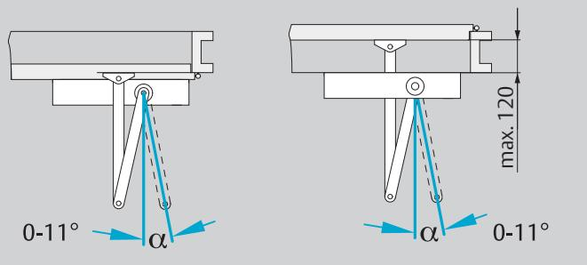

Made by ASSA ABLOY

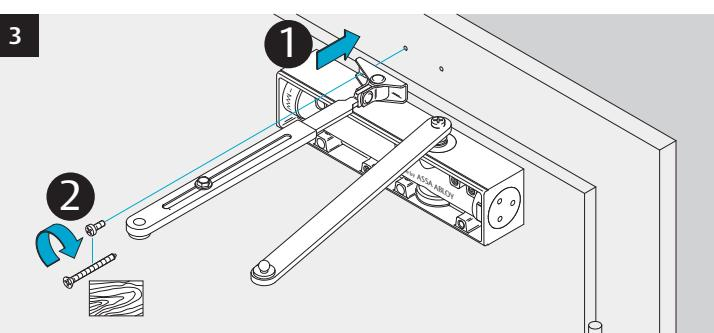

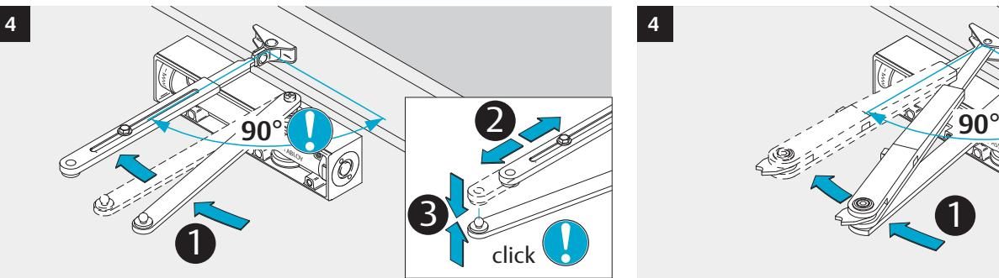

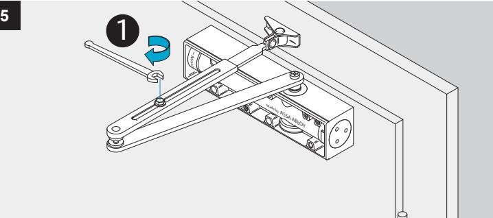

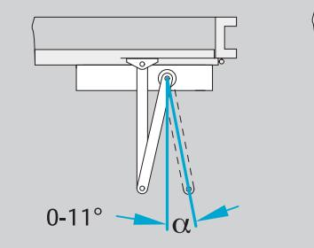

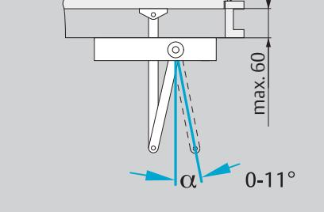

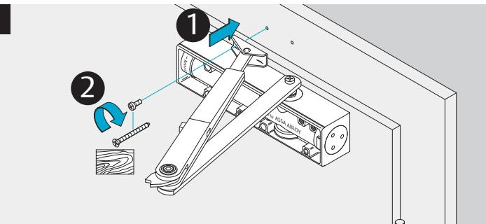

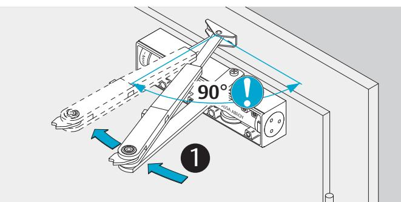

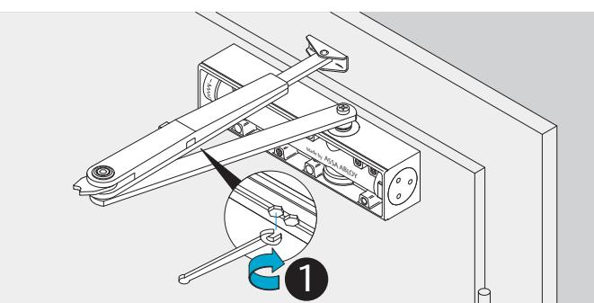

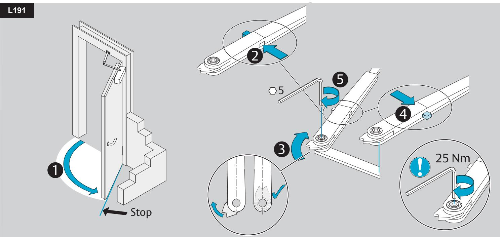

**DC200/DC300**

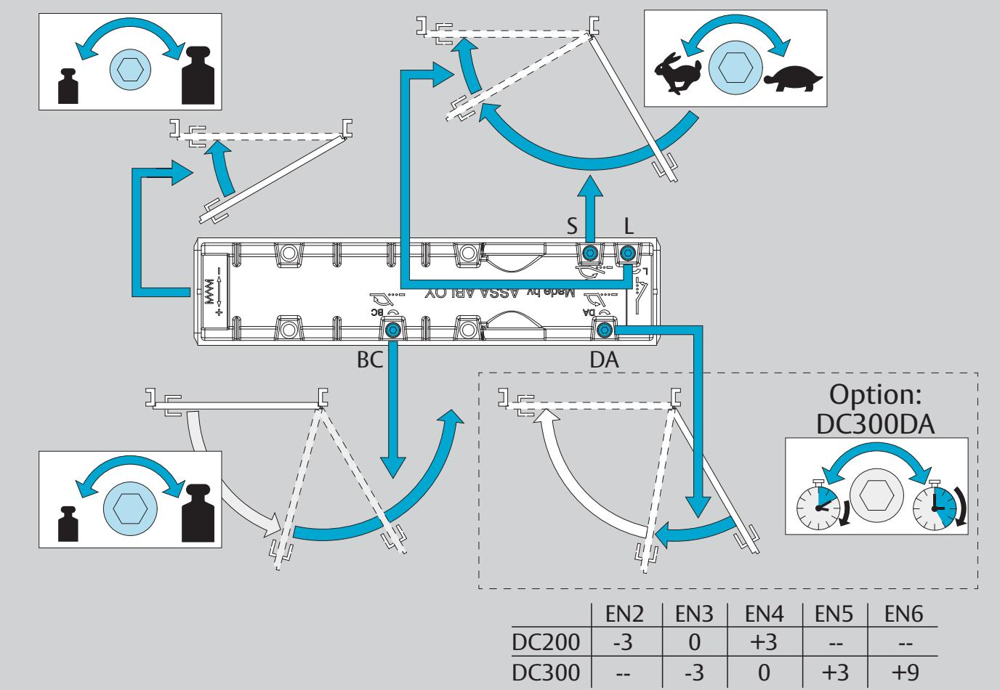

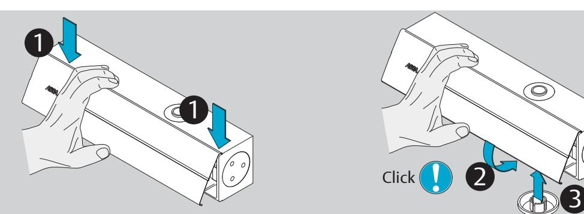

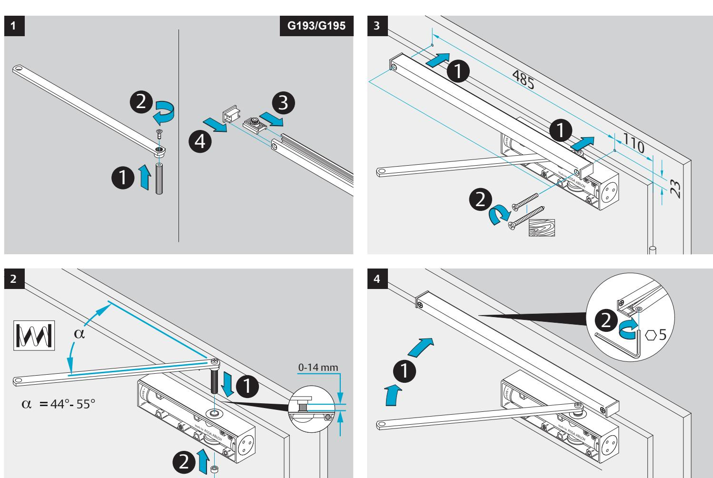

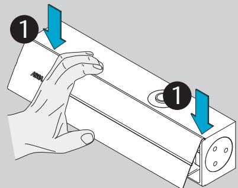

3

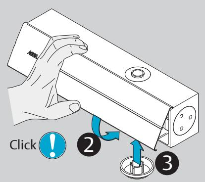

Abloy Oy P.O.Box 108 80101 Joensuu FINLAND Tel.: +358-20 599 2501 Fax: +358-20 599 2209 www.assaabloy.com www.abloy.com/dop

ASSA ABLOY Opening Solutions UK & Ireland Door Hardware & Access Control Group School Street Willenhall West Midlands WV13 3PW +44(0)845 070 6713 customerservices@assaabloy.co.uk www.assaabloyopeningsolutions.co.uk/dhandac