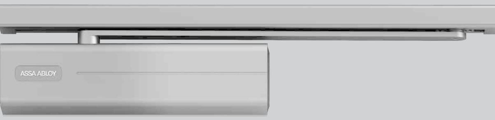
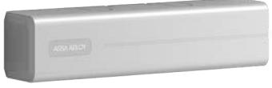
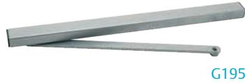
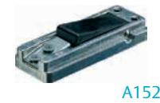
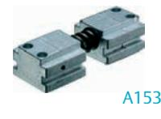
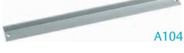
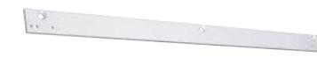

# ASSA ABLOY DC500

## Dörrstängare

### **Användningsområde**

ASSA ABLOY DC500-serien passar för alla typer av inneroch branddörrar där en säker och kontrollerbar stängning erfordras.

#### **Funktion**

Dörrstängarhuset är tillverkat i gjuten aluminium av hög kvalitet. DC500 är en kamskivedörrstängare, där glidskena används men stängningskraften bibehålles. Kamskivetekniken har också fördelen att öppningsmotståndet i förhållande till stängningskraften är lättare än för en normal dörrstängare.

#### **Egenskaper**

- Justerbar fjäderkraft 1-4 EN
- Max dörrbredd 1 100 mm
- Monteras med glidarm
- Kan monteras på dörrblad och karm
- Justerbar stängnings- och tillslagshastighet med ventil.
- Axel justerbar 14 mm i höjdled
- Övertrycksventil för att skydda dörrstängaren
- Temperaturkompenserande ventiler
- Mått: längd 270 mm, höjd 64 mm, djup 57 mm
- Löstagbar kåpa i flera färger: silver, vit, svart och brun. Kan erhållas i NCS och RAL.
- Lätt att montera med justerbar axel
- EN 1154
- CE-kontrollerad och godkänd
- Öppningsbroms justerbar från 70° standard

# ASSA ABLOY DC500

## Dörrstängare

**Justering av stängnings- och tillslagshastighet** 

**Dörrstängarhus DC500** storlek 1-4 EN justerbart Max dörrbredd 1 100 mm Tillslags- och stängningshastighet justerbara med ventiler. Axel justerbar 14 mm i höjdled

**Tillbehör Glidarm** G195 används tillsammans med DC500.

**Uppställningsbeslag** A152 för glidarm G195 (tillval) (Ej för branddörrar)

Dörrstängarhus

**Öppningsdämpare** A153 för glidarm G195 (tillval)

**Vinkelkonsol**

A104 kan användas för glidarm G195 vid montage på anslagssidan och dörrbladsmontage.

### **Montageplatta**

A120 kan användas där smal karm eller överfalsat dörrblad finns.

A120

A113 kan användas där smal karm eller överfalsat dörrblad finns. Passar glidarm A190.

A113

ASSA ABLOY Opening Solutions Sweden P.O. Box 371 SE-631 05 Eskilstuna Sweden Phone +46 (0)16 17 70 00 Fax +46 (0)16 17 70 49

Customer support: Phone intl. +46 (0)16 17 71 00 Phone nat. 0771-640 640 Fax +46 (0)16 17 73 72 e-mail: helpdesk.se.openingsolutions@assaabloy.com www.assaabloyopeningsolutions.se