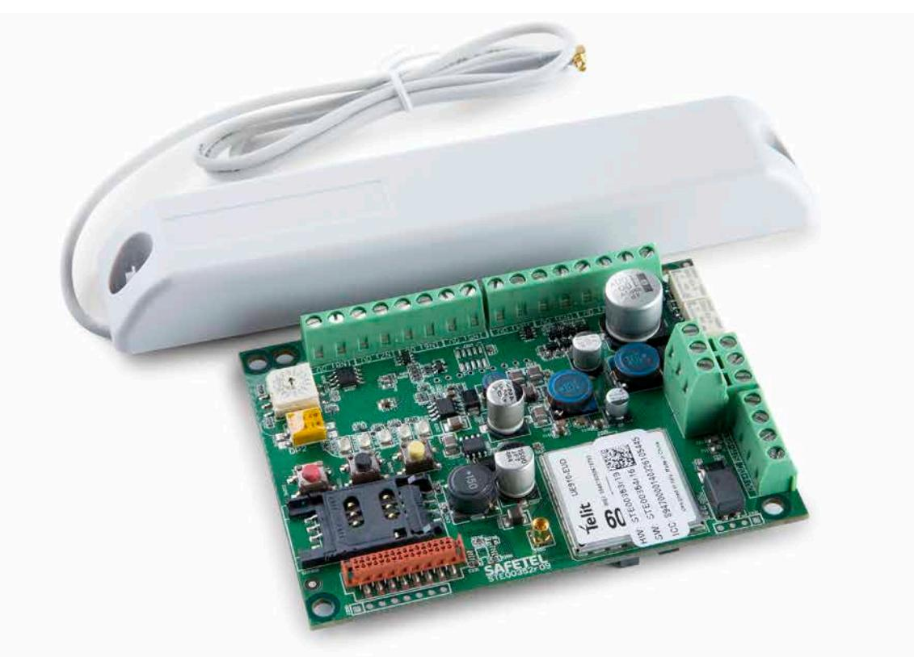

# **AddSecure Airborne DC8**

Larmsändare med 8 ingångar för montering i centralapparat.

Airborne DC 8 kombinerar många larmtyper och överför dessa digitalt via mobilnätet till rätt larmmottagare.

### **Fördelar**

- y Maximal tillgänglighet och säkerhet.
- y Flexibel Sändarens mjukvara uppdateras vid behov av vår support.
- y Ökad säkerhet och övervakning för analog larmöverföring.
- y Snabb och enkel installation med automatisk konfigurering.
- y Sändaren får plats i de flesta centralapparater på marknaden.
- y Kan spänningsmatas via kundens larmutrustning. Flexibel driftspänning mellan 7,2 VDC – 28 VDC.

### **Egenskaper**

- y Kommunikationen kontrolleras kontinuerligt via mobilnätet.
- y Stödjer 3 minuter, 30 minuter och 25 timmars felrapportering.
- y Larm- och driftmeddelanden kan enkelt styras till önskad larmcentral, kundens egen mobiltelefon, e-post eller AddView.
- y Airborne DC väljer det mobilnät som är tillgängligt och ser till att larmet alltid överförs till valda mottagare.
- y Åtta ingångar och två reläutgångar.
- y Dialer Capture.
- y Airborne DC Dual stödjer fjärrprogrammering av mer än 80 olika centralapparater.

## **Specifikationer**

| Användningsområden                                                  | Lämplig för installationer i kommunala och kommersiella anläggningar. Integreras i larmsystemets centralapparat. Sändaren kan anslutas till både serieportar, traditionella larmutgångar och kopplings-tonbaserade larmsystem, vilket gör att enheten med fördel kan användas av flera typer av larmsystem samtidigt. Airborne DC8 används också för överföring av temperatur och fuktlarm. Exempel på användningsområden är datorrum, kylrum eller pumpstationer. Givare kopplas direkt till sändarens ingångar och visas i form av SMS, e-post och/eller i AddView. Airborne DC8 är godkänd för överföring av inbrottslarm upp till Larmklass 2, förutsatt att den använder ett godkänt kabinett och strömförsörjning. |
|---------------------------------------------------------------------|--------------------------------------------------------------------------------------------------------------------------------------------------------------------------------------------------------------------------------------------------------------------------------------------------------------------------------------------------------------------------------------------------------------------------------------------------------------------------------------------------------------------------------------------------------------------------------------------------------------------------------------------------------------------------------------------------------------------------------------------------------------|
| Anslutningar på kretskortet                                         | – Simulerad PSTN (40 V) – 8 ingångar – 2 reläutgångar – Seriellt gränssnitt – Strömförsörjning – Antennkontakt                                                                                                                                                                                                                                                                                                                                                                                                                                                                                                                                                                                                                                |
| Strömförsörjning Normal strömförbrukning Max strömförbrukning | 7,2-28 VDC matas från centralapparat eller egen adapter 80 mA vid 15 VDC 250 mA i korta intervaller (<1 sek.)                                                                                                                                                                                                                                                                                                                                                                                                                                                                                                                                                                                                                                          |
| Miljövariabler Temperaturområde Fukt                          | -10 till + 50 °C 10 -90 % RH                                                                                                                                                                                                                                                                                                                                                                                                                                                                                                                                                                                                                                                                                                                              |
| Storlek BxHxD                                                    | 79x105x25 mm                                                                                                                                                                                                                                                                                                                                                                                                                                                                                                                                                                                                                                                                                                                                                 |
| Antenn                                                              | Extern antenn (2G/4G): 900 MHz/1800 MHz/2100 MHz För montering på vägg, med 75 cm antennkabel.                                                                                                                                                                                                                                                                                                                                                                                                                                                                                                                                                                                                                                                            |
| Tilläggsutrustning                                                  | Kan vid behov kompletteras med antennförlängning, antenner för utomhusbruk, riktantenn mm. Installationsmanual finns att ladda ner på addsecure.se                                                                                                                                                                                                                                                                                                                                                                                                                                                                                                                                                                                                     |
| Produktnummer                                                       | STC-00293SE                                                                                                                                                                                                                                                                                                                                                                                                                                                                                                                                                                                                                                                                                                                                                  |
| E-nummer                                                            | 63 903 31                                                                                                                                                                                                                                                                                                                                                                                                                                                                                                                                                                                                                                                                                                                                                    |

## **Certifiering**

se2544-CPR-F0003

EN54-21:2006 Type 1 EN50136-1-2:2012 ATS: SP4 EN50136-2:2013 EN50131-1:2006/A1:2009 Gr4 ECII UMTS: ATS5 EN50130-4:2011 EN50130-5:2011 SBF 110:8S SSF114 Larmklass 2