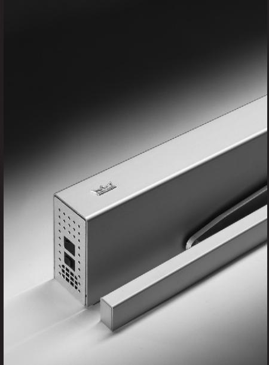
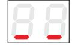
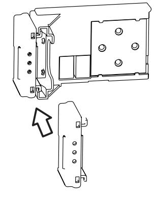
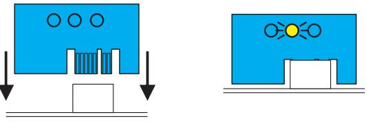
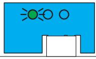

**ED 100/250 Uppgraderingskort FullEnergy**

**Installationsanvisning**

# **Uppgraderingskort**

DORMA Uppgraderingskort är konstruerat för att utvigda funktionaliteten på ED 100 och ED 250.

Under installationen av ett uppgraderingskort så utväxlar styrkortet och uppgraderingskortet information och funktionerna på uppgraderingskortet blir därefter integrerade i styrkortet. Automatiken kan använda funktionerna i uppgraderingskortet så länge det sitter kvar i sockeln på styrkortet.

Om man lyfter bort uppgraderingskortet så kommer också tilläggsfunktionerna på kortet att försvinna efter ett tag. De olika uppgraderingskorten har olika funktioner, och har fått olika färger för att det ska vara enkelt att skilja dem åt.

### **Möjliga kombinationer.**

| Uppgraderingskort | Färg              | ED 100 | ED 250 |
|-------------------|-------------------|--------|--------|
| FullEnergy        | blått             | X      |        |
| FullEnergy        | transparent blått |        | X      |
| Professional      | grönt             | X      | X      |

#### **Uppgraderingskort Full-Energy – blått / transparent blått**

Så fort kortet har blivit aktiverat, så har man tillgång till full justering av öppnings- och stängningshastighet samt öppnings- och stängningskraft.

#### **Installation av uppgraderingskort**

Installera uppgraderingskortet först efter det att automatiken är installerad, externa tillbehör är inkopplad/testade, och en lyckad igångkörning är utförd.

Strömbrytaren sätts "PÅ".

Programväljaren sätts i "AV" för att undgå oönskad aktivering av automatiken.

Displayen på styrkortet indikerar att automatiken är i stand-by läge.

## **Installation av uppgraderingskortet**

Tryck in uppgraderingskortet i sockeln på styrkortet.

Den gula LED'lampan blinker en gång när du sätter in kortet, och den gröna LED'lampan blinkar långsamt detta indikerar att styrkortet och uppgraderingskorte kommunicerar korrekt.

