# **Kodlås 22CL**

## **Felslagsblockering (DIP3)**

Efter 19 felslag blockeras kodlåset i 2 minuter. Blockeringstiden kan avbrytas med giltig kod två gånger i följd. Blockeringen indikeras med en långsam röd blink som kvarstår till första kodöppning.

Önskas felslagsblockering, DIP 3 i ON och avsluta med Master Reset.

## **6-siffrig kod (DIP1)**

22CL levereras med 4-siffriga passerkoder. Önskas 6-siffriga koder. DIP 1 i ON och avsluta med Master Reset

## **Sifferbelysning (DIP5)**

22CL levereras med sifferbelysning. Om detta önskas, sätt DIP 5 = ON

## **Kretskortet med inkopplingsplint och inställningar**

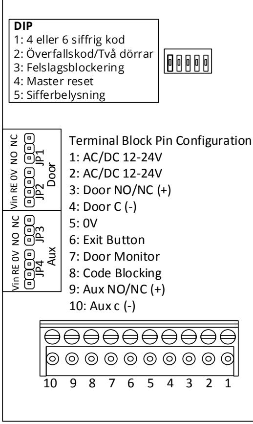

*Teknisk dokumentation och support*

*Vi förbehåller oss rätten att korrigera eventuella tryckfel och uppdatera informationen efter utskrift. På hemsidan finns utförliga manualer tillgängliga.*

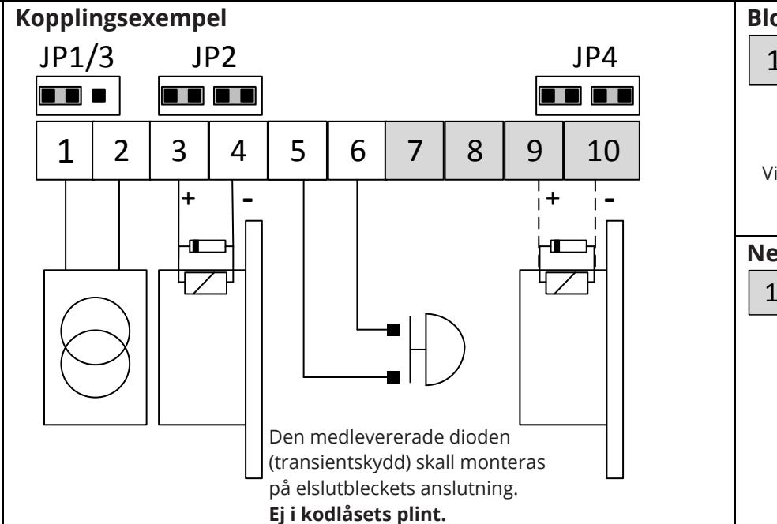

*Om du inte hittar svar på dina frågor i manualen hänvisar vi till ARX tekniska support, de nås på +46 (0)8 775 16 60 alternativt: technical.arx@assaabloy.com*

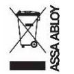

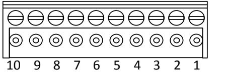

**Master Reset (Nollställning DIP4)** Alla passerkoder raderas, öppningstiden sätts till 6 sekunder och masterkoden sätts till 000000.

1. **DIP4** till **ON**.

2. Bryt matningsspänningen i 5 sekunder.

3. Med påslagen matningsspänning, flytta tillbaka

**DIP4** till **OFF**

**Utgångens funktioner** Rättvänd eller omvänd funktion väljs med **JP1/3**. (Se tabell) Spänning ut eller reläfunktion väljs med **JP2/4**. (Se tabell) Spänning ut, är likriktad matningsspänning JP1/JP3 JP2/JP4 Plint 3,4 & 9,10 NO Vin 0V Spänning ut vid olåst NC Vin 0V Spänning ut vid låst NO RE Reläslutning vid

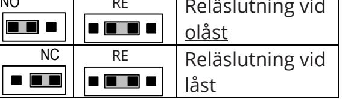

## **Kod 7, tillfällig passerkod**

När koden programmeras anges antal dygn (1–9) innan koden automatiskt kommer att raderas. Tiden räknas från tiden för programmeringen.

## **Överfallskod (DIP2=OFF)**

Larmutgång AUX aktiveras parallellt med öppnautgången

om första siffran i koden höjs med 1. Om första siffran är 9, tryck 0.

## **Två dörrar (DIP2=ON)**

AUX utgång kan aktiveras med en egen kod eller parallellt

med öppna-utgången om DIP2 är i läge On, beroende av programmerings val.

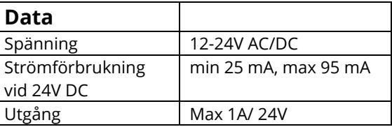

## 1 2 3

# **Programmering**

| Ref. Nr. | Kodtyp                                        |
|----------|-----------------------------------------------|
| 1–4      | Passerkoder                                   |
| 5–6      | Passerkoder blockerbara, t ex med kopplingsur |
| 7        | Tidsbegränsad passerkod, 1 till 9 dagar       |
| 8        | Öppningstid, 1 till 999 sekunder              |
| 0        | Masterkod (ALLTID 6 SIFFROR)                  |

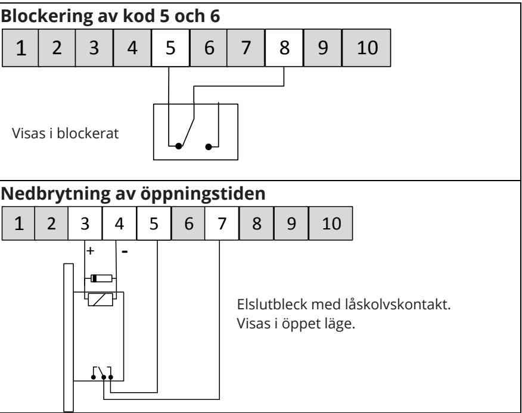

1–999 Sek

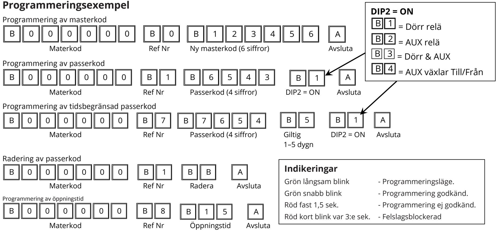

och inleds med Din masterkod.

- All programmering av koder och öppningstider sker från knappsatsen
- Programmeringen utförs i en hel och avslutad sekvens per Ref.nr, där varje sifferkombination; masterkod; Ref. Nr.; mm, börjar med ett B. Avsluta programmeringssekvensen med A.
- Programmeringen avbryts med röd indikering vid felaktig inmatning, t ex redan befintlig passer- eller överfallskod.
- Godkänd programmering indikeras med en grön snabb blink.

| Grön snabb blink                                | - Programmering godkänd.    |
|-------------------------------------------------|-----------------------------|
| Röd fast 1,5 sek.                               | - Programmering ej godkänd. |
| Röd kort blink var 3:e sek. - Felslagsblockerad |                             |

# **Code Lock 22CL**

*At the website (technical.arx@assaabloy.com) technical support can you find detailed manuals available for the ARX access control system. If you cannot find answers to your questions in the manuals, we refer to the ARX technical support in your country*

## **Erroneous Code Block (DIP3)** 19 incorrect key-presses disables the keypad for 2 minutes. If the correct code is entered twice the keypad block is removed and the door unlocked. The blocking is indicated by a slow flashing red light that remains until the first correct code entry. If erroneous code inhibit is required, set DIP3 = ON and perform a MASTER RESET. **6 Digit Code (DIP1)** 22CL is set for 4 digit codes when delivered. To set it to 6 digit codes, DIP1=ON and perform a MASTER RESET **Digit Light (DIP5)** 22CL is delivered with illuminated digits. If this is wanted, setDIP5 = ON. **Circuit board with terminal block and settings** 10 9 8 7 6 5 4 3 2 1 Vin RE 0V NO NC Vin RE 0V NO NC JP4 JP3 JP2 JP1 Door Aux Terminal Block Pin Configuration 1: AC/DC 12-24V 2: AC/DC 12-24V 3: Door NO/NC (+) 4: Door C (-) 5: 0V 6: Exit Button 7: Door Monitor 8: Code Blocking 9: Aux NO/NC (+) 10: Aux c (-) **DIP** 1: 4 or 6 Digit Code 2: Duress or Two doors 3: Erroneous code block 4: Master reset 5: Digit light *Technical documentation and support We reserve the right to correct printing errors and update the information after printing.* **Master Reset (Set default values DIP4)** All access codes are erased, the door unlocked reset to 000000. back to OFF. JP1/3 (See table) (See table) supply voltage days (1-9) programming. in the enter 0. **Data**

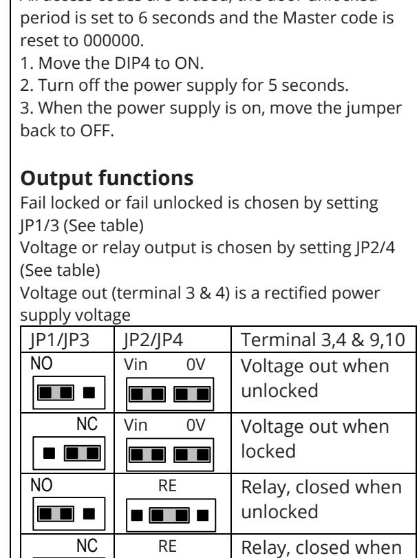

locked

## **Code 7, temporary code**

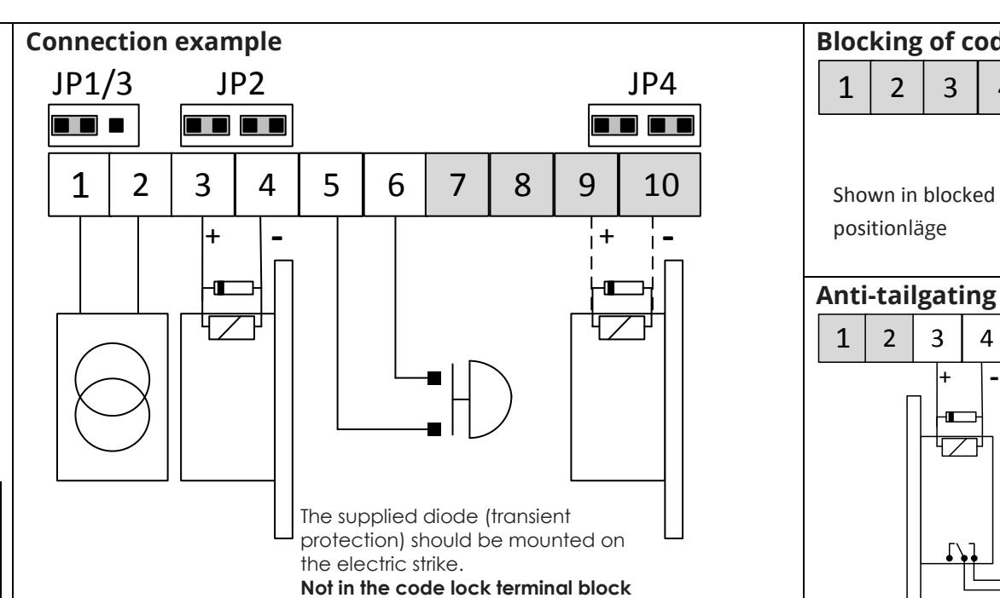

When the code is programmed, the number of until the code automatically expires is entered. This period commences at the time of

## **Duress code (DIP2 = OFF)**

A second AUX relay that is activated parallel with the door unlock output if the first digit access code is raised by 1. If The first digit is 9,

## **Two Doors (DIP2 = ON)**

AUX relay is activated parallel with the door code unlock or own access code. Dependence on programming mode

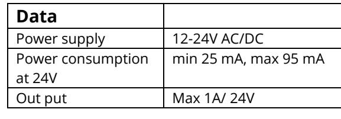

3

+

# **Programming**

| Ref. No. | Type of code                            |
|----------|-----------------------------------------|
| 1–4      | Access codes                            |
| 5–6      | Time block access codes, e.g. Ext timer |
| 7        | Time limited access code, 1 to 9 days   |
| 8        | Door unlocked period, 1 to 999 seconds  |
| 0        | Master code (ALWAYS 6 DIGITS)           |

## **Programming examples**

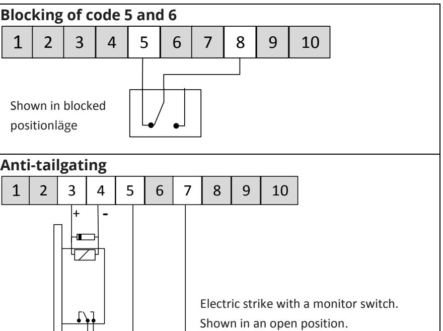

- All programming of access codes and door unlocked periods is done from the key-pad and starts with your Master code.
- The programming is done in a complete sequence for each Ref. No., where every digit combination; master code; Ref. No.; etc. begins with a **B**. Finish the programming sequence with **A**.
- Programming is interrupted by a red indication when an incorrect
- input has been made, e.g. an already existing access or duress code.
- Approved programming is indicated by a green fast flash.