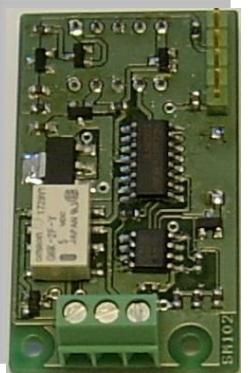
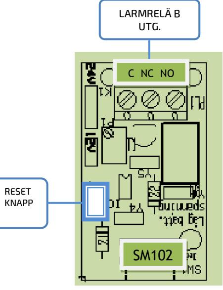

**SM40** 

## BESKRIVNING

Mikroprocessorstyrt larmkort avsedda att fästas på hållare i strömförsörjningsaggregat SM40 och SM3100. Utlösta larm indikeras på fronten och summalarmrelä med potentialfria växlingskontakter (max 1A) för vidaresändning. SM101 – Lågbatterispänningslarm SM102 - Övervakar laddningsspänningen och batterikretsen samt lågbatterispänningslarm. SM103 - Övervakar laddningsspänningen, batterikretsen och nätspänningen som har 30 minuters fördröjning av larmrelä B samt lågbatterispänningslarm

| Egenförbrukning |                  |
|-----------------|------------------|
| Vila            | 0,01mA (24VDC)   |
| Larm            | 7,5mA (24VDC) |

LÅGBATTERISPÄNNING: Övervakar batterispänningen. Larmar när det vid batteridrift är för låg batterispänning. Larmgräns när det finns ca 30% kvar i batterikapaciteten. Röd lysdiod på fronten blinkar sakta (0,5Hz) och larmreläet aktiveras. Larmet återställs automatiskt när batteriet uppladdas.  **Strömförsörjning med plats för batteri**

> LADDSPÄNNINGSLARM: Övervakar laddningsspänningen för att säkerställa att batterierna får rätt laddningsspänning. Larmar när laddningsspänningen är 2% över eller under nominellt värde. Lysdiod på fronten blinkar sakta grönt/rött (0,5Hz) och larmreläet aktiveras.

Laddningsspänningslarmet är fördröjt och börjar inte mäta förrän efter 4 timmars drifttid och larm återställs automatiskt när spänningen är justerad.

BATTERIÖVERVAKNING: Mäter batterispänningen var 15 minut. Faller batterispänningen under larmnivån, aktiveras larmkretsen. Lysdiod på fronten blinkar snabbt grönt/rött (2Hz) och larmreläet aktiveras. Larmet kan återställas när batterierna är kontrollerade eller utbytta.

NÄTAVBROTTSSLARM 30min fördröjning: Övervakar nätspänningen. Vid larm tänds röd lysdiod och larmrelä B har 30 minuters fördröjt tillslag. Automatisk återställning.

*CE-märkt enligt EN61000-1-2 och EN61000-3-4* 

| E-Nummer | Typ | Beskrivning                                                             |
|----------|-----|-------------------------------------------------------------------------|
| 5256990  | 101 | LARMKORT Låg batterispänning                                            |
| 5256993  | 102 | LARMKORT Laddspänningslarm - Låg batterispänning – Batteriövervakning   |
| 99 00 02 | 103 | LARMKORT Laddspänningslarm - Låg batterispänning – Batteriövervakning - |
|          |     | Nätavbrottslarm med 30 minuters fördröjning                             |

Postadress/Postal address Swansons Telemekanik AB Hålstensvägen 4 SE-446 37 Älvängen

Telefon nr/Telephone no +46(0)303-746 320 Hemsida/Webb www.swtm.se e-post info@swtm.se VAT.NO SE556289017701

## INKOPPLINGSANVISNING AV LARMKORT  **SM40**

- Larmkortet monteras på likriktarens huvudkort på plats märkt "larmkort".  **Strömförsörjning med plats för batteri**
	- Tryck dit kortet på stiftlisten och pressa ner kretskortshållarna i hålen.
	- Spänning behöver inte brytas när kortet monteras.
	- Larmkortet ställer automatiskt in sig på den spänning som ska övervakas - 24V system eller 12V system. Detta görs under kortets uppstart.
	- NÄR DETTA ÄR KLART BLINKAR RÖD LYSDIOD. ÅTERSTÄLL MED ATT HÅLLA ÅTERSTÄLLNINGKNAPPEN INTRYCKT I 2 SEKUNDER. KORTET ÄR NU DRIFTSATT.
	- Anslut ledningar från övervakningsenhet till plinten på larmkortet.
	- Larmreläet växlar vid larm och led i locket lyser för aktuellt larm.

## INSTÄLLNINGAR

Larmnivåer ställer automatiskt in sig på standardvärde enligt nedanstående tabell.

För att kontrollera larmnivåer, koppla loss batterier och bryt bort last, om det behövs, för att inte skada utrustning och få rätt funktion.

Därefter ställs likriktaraggregatet in på den spänning som är larmnivå.

Vid larm tänds indikering och larmreläet klickar.

När kontrollen är klar, justeras laddningsspänningen till rätt nivå på likriktaren. Koppla in last och batterier igen.

Systemet är nu i driftläge igen.

LARMRELÄ – B c nc no

## LARMNIVÅER STANDARDVÄRDEN

| LARMTYP-SYSTEMSPÄNNING | 13,7V | 27,4V |
|------------------------|-------|-------|
| LADDSPÄNNINGSFEL       | +/-2% | +/-2% |
| LÅG BATTERISPÄNNING    | 12    | 24    |
| BATTERIKRETSFEL        | 12,2  | 24,5  |

Postadress/Postal address Swansons Telemekanik AB Hålstensvägen 4 SE-446 37 Älvängen

Telefon nr/Telephone no +46(0)303-746 320 Hemsida/Webb www.swtm.se e-post info@swtm.se VAT.NO SE556289017701