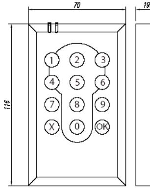
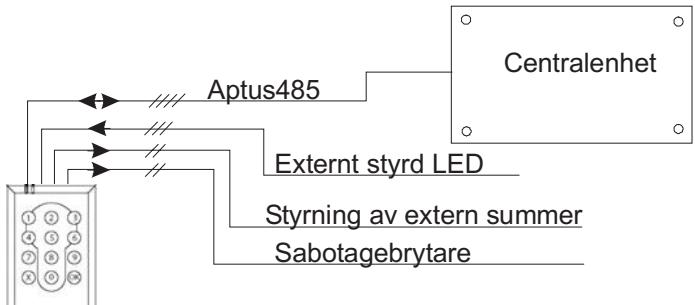
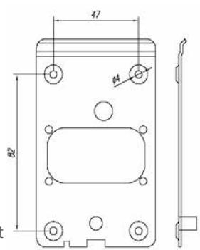
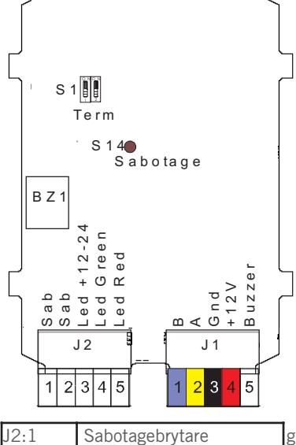

# **ÖPPNA 1505**

### **INSTALLATIONSANVISNING**

**Revision 1**

## **INSTALLATION 2**

### **ALLMÄNT**

Läsaren används tillsammans med någon av våra centralenheter för att få ett komplett låsöppnings- och/eller larmförbikopplingssystem. Obs! 485-kommunikation till centralenhet, (Aptus485-buss).

### **TEKNISKA DATA**

|            | Strömförsörjning: 12 V DC reglerad (10.5 - 14).    |  |
|------------|----------------------------------------------------|--|
|            | Max 70mA, Min 30mA.                                |  |
|            | Matning från centralenheten.                       |  |
| Ingångar:  | 2 för att utifrån kunna styra en i läsaren inbyggd |  |
|            | Led. (Höger Led)                                   |  |
| Utgångar:  | 1 för styrning av extern summer.                   |  |
|            | (12V, max 0.5A)                                    |  |
|            | 1 för Sabotagebrytare.                             |  |
|            |                                                    |  |
| Miljökrav: | -30 till +60 grader Celcius                        |  |
|            | 10 till 100% luftfuktighet                         |  |
| Mått:      | 70x116x20 mm                                       |  |
| Vikt:      | 0.2Kg                                              |  |

### **PACKLISTA**

- 1 st Öppna 1505, Kortläsare med knappsats
- 1 st Installationsanvisning (denna)

### **SYSTEMBESKRIVNING**

### **MONTERING**

Enheten är avsedd för utanpåliggande montage. Dra först fram kablaget till den plats där läsaren skall monteras. För kablaget genom bottenplattan och skruva sedan fast plattan på väggen.

Bottenplattans kragar skall försänkas in i väggen. Anslut kabeln till den jackbara plinten. Kabeln skall föras nedåt och passera till höger om J2 eller till vänster om J1. Skala vid behov kabelns ytterskikt direkt efter genomföringen. Haka på

frontdelen i överkant och fäll in läsaren, fäst med säkerhetskruv i underkant.

### **INKOPPLINGSANVISNING**

Använd partvinnad kabel t.ex. ELLXB 2x2x0.5 för anslutning till centralenhet. Förlägg ett par till 485 (A+B) och spänning (12V+GND) i det andra paret.

Överstiger kabellängden 50 meter bör kabelarean vara minst 0.5mm2 för spänningsmatningen.

Du kan även använda Aptuskabeln som är framtagen för detta ända-

J2:2 Sabotagebrytare

| inte överstiga 200 meter per |
|------------------------------|
| centralenhet.                |
| Se till att signalkabeln är  |
| cirka 10 cm längre än vad    |
| som krävs, för att kunna ta  |
| isär enheten vid behov.      |
|                              |

mål. Den är en 2-pars kabel med grövre area i ena paret: 2x0.15mm2 + 2x1.0mm2. Totalt skall Aptus485-bussen

Vid styrning av extern 12 V-summer ansluts +12V(J1:4) direkt till den externa summern och summerstyrningsutgången (J1:5) till GND på den externa

summern. Läsarens interna sabotagebrytare, S14, finns tillgänglig på J2:1,2. Normalt sluten.

| J2:3 | Gemensam+ för grön och röd lysdiod. (12V - 24V) |      |     |                |
|------|----------------------------------------------------|------|-----|----------------|
|      |                                                    | J1:1 | B   |                |
| J2:4 | Grön Led tänds då denna                            | J1:2 | A   |                |
|      | kopplas till Gnd.                                  | J1:3 | GND |                |
| J2:5 | Röd Led tänds då denna                             | J1:4 | 12V |                |
|      | kopplas till Gnd.                                  | J1:5 |     | Summerstyrning |

### **3**

### **LYSDIODER**

Läsaren har två flerfärgsledar. Den vänstra styrs av läsaren och kan blinka eller lysa i färgerna rött, grönt och gult, beroende på läsares status. Den högra leden styrs externt genom att koppla styrsignaler till J2:3,4,5.

Lysdioderna är placerade till vänster på läsaren överkant.

### **SUMMER**

Öppna 1505 är utrustad med intern summerfunktion. Denna kan t.ex. ljuda vid "Dörr öppen för länge". Funktionen för summer konfigureras i Multiaccess.

Utgång för summerstyrning ,J1:5, följer den interna summerns status.

### **INSTÄLLNINGAR**

| S1:1-2 | Terminering | ON,ON => Terminering inkopplad. Endast    |
|--------|-------------|-------------------------------------------|
|        |             | ändpunkterna av bussen termineras.        |
|        |             | Läsaren levereras oterminerad. För att    |
|        |             | komma åt S1 måste strilskyddet som täcker |
|        |             | kretskortets baksida lossas.              |

#### **SYSTEMKRAV**

MultiAccess från version 7.0. MC 1 från version A0 eller AC 700 från version N0.

### **PROGRAMMERING**

När Öppna 1505 är inkopplad kan du få in den i MultiAccess genom att hämta hårdvara. En ny enhet med namnet "Öppna" skall komma upp. Under denna finns de resurser som hör ihop med denna läsartyp. På resursen "läsare" skall du ange vilken dörr som läsaren används till.

Avsluta programmeringen med att sända data.

### **AVPROVNING**

Kontrollera en extra gång att alla signalledare är rätt inkopplade innan anläggningen spänningssätts.

### **GARANTI**

Aptus Elektronik AB lämnar två års garanti på material och fabrikationsfel på samtliga produkter. Övrigt enligt leveransbestämmelser NL01.

### **SERVICE**

För service hänvisar APTUS Elektronik AB till ansvarig återförsäljare som utöver egen kompetens har kontinuerlig kontakt med APTUS Elektronik AB.