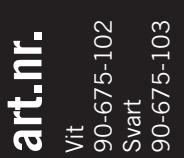
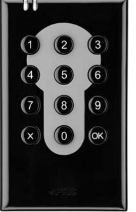
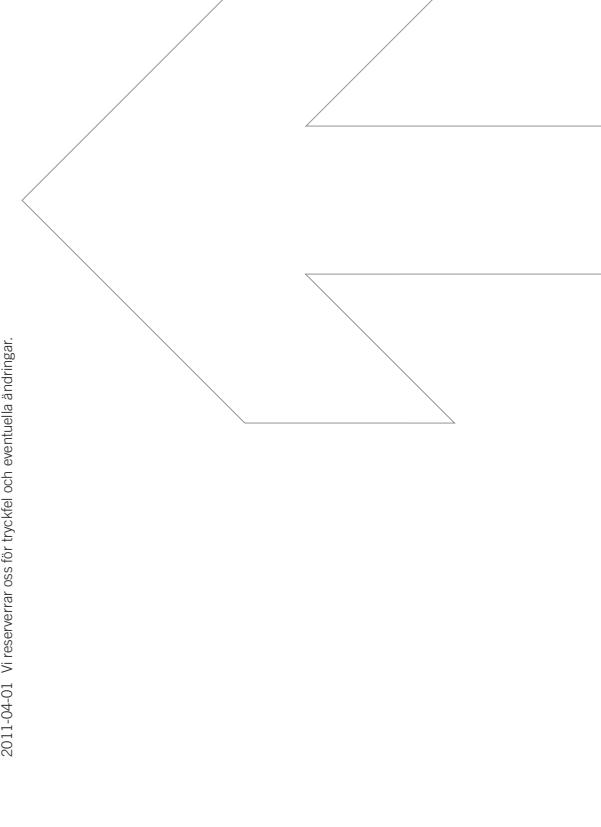

| SPECIFIKATIONER   | Öppna 1505                      |
|-------------------|---------------------------------|
| Korttyp           | APC, APT och Aptusnyckel        |
| Mått mm (hxbxd)   | 116x70x20                       |
| Drivspänning V DC | 12, levereras av centralenheten |
| Nettovikt i kg    | 0,2                             |
|                   |                                 |

## **Öppna 1505 Beröringsfri Läsare med knappsats**

**EGENSKAPER OCH FÖRDELAR**

- Svart. Finns även i vit.
- Tillverkad av komposit.
- Läsare med knappsats för utanpåliggande montage.
- Nyckelhålssymbol.
- Handikappanpassad med markering på siffra nummer fem.
- Läser beröringsfria kort och nycklar.
- Inbyggd summer.
- Inbyggd sabotagekontakt.
- För inom- och utomhusbruk.
- Integrerbar med andra Multiaccess-produkter.
- Kommunikation mellan centralenhet och läsare sker krypterat med 32 bitars nycklar.

| ELEKTRISK ANSLUTNING                    | Öppna 1505                      |
|-----------------------------------------|---------------------------------|
| Strömförsörjning V DC                   | 12, levereras av centralenheten |
| Förbrukning Watt                        | min 0,36 max 0,84               |
| Amp                                     | min 0,03 max 0,07               |
| OMGIVNING                               |                                 |
| Temperatur ˚C                           | -30 till +60                    |
| Luftfuktighet %                         | 10 till 100                     |
| ANSLUTNING TILL CENTRALENHET            |                                 |
| Centralenheter med programmering via PC |                                 |
| 700XX                                   | Ja                              |
| MC1                                     | Ja                              |
| MÅTT I MM                               |                                 |
| Höjd                                    | 116                             |
| Bredd                                   | 70                              |
| Djup                                    | 20                              |
| Nettovikt i kg                          | 0,2                             |
|                                         |                                 |

## **www.aptus.se**

Aptus Elektronik AB . Ekonomivägen 3-5, 436 33 Askim . telefon **växel:** 031 68 97 00 **försäljning:** 031 68 97 10 **fax:** 031 68 97 99

## **PASSAGE**