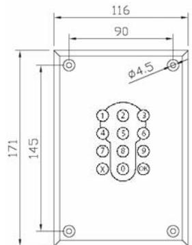
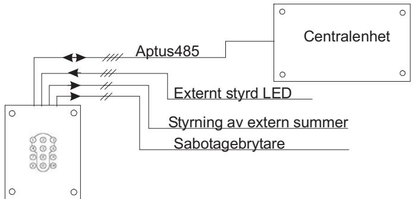

# **ÖPPNA 0510**

### **INSTALLATIONSANVISNING**

**Revision 2**

## **INSTALLATION 2**

### **ALLMÄNT**

Läsaren används tillsammans med någon av våra centralenheter för att få ett komplett låsöppnings- och/eller larmförbikopplingssystem. Obs! 485-kommunikation till centralenhet, (Aptus485-buss).

### **TEKNISKA DATA**

|            | Strömförsörjning: 12 V DC reglerad (10.5 - 14).    |  |  |
|------------|----------------------------------------------------|--|--|
|            | Max 125mA, Min 30mA.                               |  |  |
|            | Matning från centralenheten.                       |  |  |
| Ingångar:  | 2 för att utifrån kunna styra en i läsaren inbyggd |  |  |
|            | LED.                                               |  |  |
| Utgångar:  | 1 för styrning av extern summer.                   |  |  |
|            | (12V, max 0.5A)                                    |  |  |
|            | 1 för Sabotagebrytare.                             |  |  |
|            |                                                    |  |  |
| Miljökrav: | -30 till +60 grader Celcius                        |  |  |
|            | 10 till 100% luftfuktighet                         |  |  |
| Mått:      | 116x171x21mm                                       |  |  |
| Vikt:      | 0.29Kg                                             |  |  |

### **PACKLISTA**

- 1 st Öppna 0510, Kortläsare med knappsats
- 1 st Installationsanvisning (denna)

### **SYSTEMBESKRIVNING**

### **MONTERING**

Enheten är avsedd för infällt montage i en dubbeldosa. Vid montage utan dubbeldosa, ta upp ett rektangulärt hål, 67x110x25 som rymmer infällnaden. Dra sedan fram kablaget till den plats där läsaren skall monteras. Anslut kabeln till den jackbara plinten. Fäll in läsaren och skruva fast den i underlaget.

### **INKOPPLINGSANVISNING**

Använd partvinnad kabel. t.ex. ELLXB 2x2x0.5 för anslutning till centralenhet. Förlägg ett par till 485 (A+B) och spänning (12V+GND) i det andra paret.

Överstiger kabellängden 50 meter bör kabelarean vara minst 0.5mm2 för spänningsmatningen.

Du kan även använda Aptuskabeln som är

framtagen för detta ändamål. Den är en 2-pars kabel med grövre area i ena paret: 2x0.15mm2 + 2x1.0mm2.

Tillse att Aptus485 bussen inte överstiger 200 meter.

Se till att signalkabeln är cirka 10 cm längre än vad som krävs, för

#### S14 S a b o ta g e BZ1 J 2 J 1 Sab Sab Led Gnd Led G re en Led Red B A Gnd +12V Buzzer ON ON ON ON 1 3 2 4 S 1 O N 1234 OFF Led Term J2:1 Sabotagebrytare J2:2 Sabotagebrytare J2:3 Gemensam för grön och röd lysdiod. J2:4 Styrning av grön lysdiod.

Max 12V - 24V. J2:5 Styrning av röd lysdiod. Max 12V -24V.

att kunna ta isär enheten vid behov. Vid styrning av extern 12 V-summer ansluts +12V(J1:4) direkt till den externa summern och sum-

merstyrningsutgången (J1:5) till GND på den externa summern.

Läsarens interna sabotagebrytare finns tillgänglig på J2:1,2. Normalt sluten.

| J1:1                          | B                         |  |
|-------------------------------|---------------------------|--|
| J1:2                          | A                         |  |
| J1:3                          | GND                       |  |
| J1:4                          | 12V                       |  |
| J1:5                          | Summerstyrning            |  |
|                               |                           |  |
|                               |                           |  |
|                               | Obs! Ledstyrningssignaler |  |
| J2:3 - J2:5 är galvaniskt iso |                           |  |
| lerade från läsarens mat      |                           |  |
| ning.                         |                           |  |
|                               |                           |  |
|                               |                           |  |
|                               |                           |  |

### **3**

### **LYSDIODER**

Läsaren har flerfärgsledar som sitter så att de tillsammans bildar ett nyckelhål. De styrs av läsaren och kan blinka eller lysa i färgerna rött, grönt och gult, beroende på läsares status.

Lysdioderna för undre delen av nyckelhålet kan dock reserveras, via S1:1-2, för extern styrning. Styrningen görs genom att koppla styrsignaler till J2:3,4,5.

En bakgrundsbelysning ger en vit upplyst linje runt hela nyckelhålet samt belysning i knappsatsen.

### **SUMMER**

Öppna 0510 är försedd med intern summerfunktion. Denna kan t.ex. ljuda vid "Dörr Öppen för länge". Funktionen för summer konfigureras via Multiaccess.

Utgången för summerstyrning, J1:5, följer den interna summerns status

### **INSTÄLLNINGAR**

| S1:1-2 | Externstyrning av undre delen av nyckelhål. | ON,ON => Hela nyckelhålet används av läsaren. OFF,OFF => Undre delen kan externstyras via J2:3,4,5. Vid leverans: ON,ON. |
|--------|---------------------------------------------------|-----------------------------------------------------------------------------------------------------------------------------------------|
| S1:3-4 | Terminering                                       | ON,ON => Terminering inkopplad. Endast ändpunkterna av bussen termineras. OFF,OFF => Ej terminerad.                               |
|        |                                                   | Vid leverans: OFF,OFF.                                                                                                                  |
|        |                                                   | För att komma åt S1 måste du lossa på strilskyddet som täcker kretskortets baksi da.                                              |

### **SYSTEMKRAV**

MultiAccess från version 7.0. MC 1 från version A0 eller AC 700 från version N0.

### **PROGRAMMERING**

När Öppna 0510 är inkopplad kan du få in den i MultiAccess genom att hämta hårdvara. En ny enhet med namnet "Öppna" skall komma upp. Under denna finns de resurser som hör ihop med denna läsartyp. På resursen "läsare" skall du ange vilken dörr som läsaren används till.

Avsluta programmeringen med att sända data.

### **AVPROVNING**

Kontrollera en extra gång att alla signalledare är rätt inkopplade innan anläggningen spänningssätts.

### **GARANTI**

Aptus Elektronik AB lämnar två års garanti på material och fabrikationsfel på samtliga produkter. Övrigt enligt leveransbestämmelser NL01.

### **SERVICE**

För service hänvisar APTUS Elektronik AB till ansvarig återförsäljare som utöver egen kompetens har kontinuerlig kontakt med APTUS Elektronik AB.