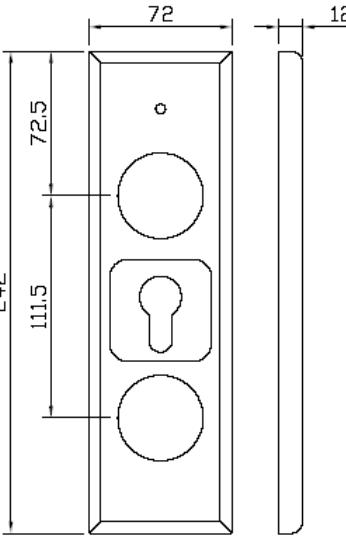
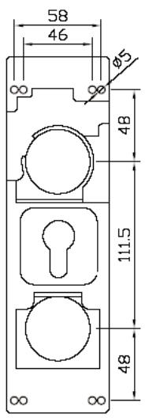
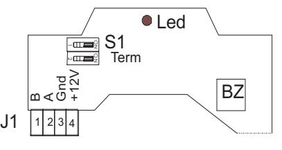
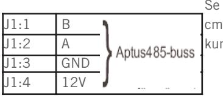

# **ÖPPNA 1122**

# **INSTALLATIONSANVISNING**

**Revision 2**

# **INSTALLATION 2**

#### **ALLMÄNT**

Läsaren används tillsammans med någon av våra centralenheter för att få ett komplett låsöppnings- och/eller larmförbikopplingssystem. Obs! 485 kommunikation till centralenhet, (Aptus485-buss). Läsaren är avsedd för dörr med låscylinder.

#### **TEKNISKA DATA**

|              | Strömförsörjning: 12 V DC reglerad (10.5 - 14).           |  |
|--------------|-----------------------------------------------------------|--|
|              | Max 50mA.                                                 |  |
|              | Matning från centralenheten.                              |  |
| Bestyckning: | Läsare, Summer, Flerfärgsled.                             |  |
| Miljökrav:   | -30 till +60 grader Celcius 10 till 100% luftfuktighet |  |
| Mått:        | 242x72x12 mm                                              |  |
| Vikt:        | 0.3Kg                                                     |  |

### **PACKLISTA**

- 1 st Öppna 1122, Kortläsare för montering på dörr
- 1 st Installationsanvisning (denna)
- 4 st Cylinderskruv
- 4 st Träskruv
- 1 st Cylinderförlängare

#### **SYSTEMBESKRIVNING**

## **MONTERING**

Enheten är avsedd för montering på dörrbladet.Lossa först trycke och vred/cylinder. Dra fram installationskabel för läsaren. Skruva fast läsarens bakstycke på dörren. Bakstycket har fyra dubbla monteringshål för detta ändamål.

Anslut kablaget i läsarens skruvplint. För ut kablaget så att det inte kommer att ligga emot en av vredesskruvarna. Återmontera cylinder med medskickade cylinderförlängaren.Tryck på läsares frontplåt och fäst vred / cylinderring samt trycke.

#### **INKOPPLINGSANVISNING**

Vanlig ELLXB-kabel 2x2x0.5 kan användas för anslutning till centralenhet. Förlägg ett par till 485 (A+B) och spänning (12V+GND) i det andra paret.

Överstiger kabellängden 50 meter bör kabelarean vara minst

0.5mm2 för spänningsmatningen. Du kan även använda Aptuskabeln som är framtagen för detta ändamål. Den är en 2-pars kabel med grövre area i ena paret: 2x0.15mm2 +

2x1.0mm2.

Tillse att Aptus485-bussen inte överstiger 200 meter.

Se till att signalkabeln är cirka 10 cm längre än vad som krävs, för att kunna ta isär enheten vid behov.

**3**

#### **LYSDIODER**

Läsaren har en flerfärgsled. Den kan blinka eller lysa i färgerna rött, grönt och gult, beroende på läsares status.

#### **INSTÄLLNINGAR**

| S1:1-2 | Terminering | ON,ON => Terminering inkopplad. Endast |
|--------|-------------|----------------------------------------|
|        |             | ändpunkterna av bussen termineras.     |
|        |             | Läsaren levereras oterminerad.         |
|        |             |                                        |
|        |             |                                        |

#### **SYSTEMKRAV**

MultiAccess från version 7.0. MC 1 från version A0 eller AC 700 från version N0.

#### **PROGRAMMERING**

När Öppna 1122 är inkopplad kan du få in den i MultiAccess genom att hämta hårdvara. En ny enhet med namnet "Öppna" skall komma upp. Under denna finns de resurser som hör ihop med denna läsartyp. På resursen "läsare" skall du ange vilken dörr som läsaren används till.

Avsluta programmeringen med att sända data.

#### **AVPROVNING**

Kontrollera en extra gång att alla signalledare är rätt inkopplade innan anläggningen spänningssätts.

#### **GARANTI**

Aptus Elektronik AB lämnar två års garanti på material och fabrikationsfel på samtliga produkter. Övrigt enligt leveransbestämmelser NL01.

#### **SERVICE**

För service hänvisar APTUS Elektronik AB till ansvarig återförsäljare som utöver egen kompetens har kontinuerlig kontakt med APTUS Elektronik AB.