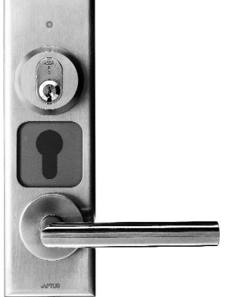

|           | SPECIFIKATIONER | Öppna 1122                             |
|-----------|-----------------|----------------------------------------|
|           | Korttyp         | APC, APT och Aptusnyckel               |
|           | Mått (hxbxd)    | 242x72x12 mm                           |
| 90-670-53 | Drivspänning    | 12 V DC, levereras från centralenheten |
|           | Nettovikt i kg  | 0,3                                    |
|           |                 |                                        |

**EGENSKAPER OCH FÖRDELAR**

- -Tillverkad av rostfritt stål.
- -Avsedd för montage på dörrblad med låscylinder.
- -Läsare avsedd för montering direkt på dörren.
- -Läser beröringsfria kort eller nycklar.
- -Inbyggd summer.
- -För inom- och utomhusbruk.
- -Är fullt integrerbar med andra Multiaccess-produkter.
- - Kommunikation mellan centralenhet och läsare sker krypterat med 32 bitars nycklar.

**are** 

| ELEKTRISK ANSLUTNING Strömförsörjning V DC | Öppna 1122 12, levereras av centralenheten |                                                                     |
|-----------------------------------------------|-----------------------------------------------|---------------------------------------------------------------------|
| Förbrukning Watt                              | max 0,60                                      |                                                                     |
| Amp                                           | max 0,05                                      |                                                                     |
|                                               |                                               |                                                                     |
| OMGIVNING                                     |                                               |                                                                     |
| Temperatur 0 C Luftfuktighet %          | -30 till 60 10 till 100                    |                                                                     |
|                                               |                                               |                                                                     |
| ANSLUTNING TILL CENTRALENHET                  |                                               |                                                                     |
| Centralenheter med programmering via PC       |                                               |                                                                     |
| 700XX                                         | Ja                                            |                                                                     |
| MC1                                           | Ja                                            |                                                                     |
|                                               |                                               |                                                                     |
| MÅTT I MM                                     |                                               |                                                                     |
| Höjd Bredd                                 | 242 72                                     |                                                                     |
| Djup                                          | 12                                            |                                                                     |
| Nettovikt i kg                                | 0,3                                           |                                                                     |
|                                               |                                               | 2010-09-28_Vi reserverar oss för tryckfel och eventuella ändringar. |
|                                               |                                               |                                                                     |

**PASSAGE**

## **www.aptus.se**

Aptus Elektronik AB - Ekonomivägen 3-5, 436 33 Askim telefon **växel:** 031 68 97 00 **försäljning:** 031 68 97 10 **fax:** 031 68 97 99 aptus@aptus.se **www.aptus.se**