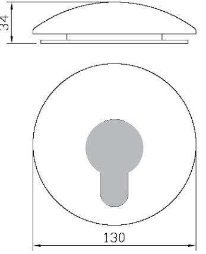
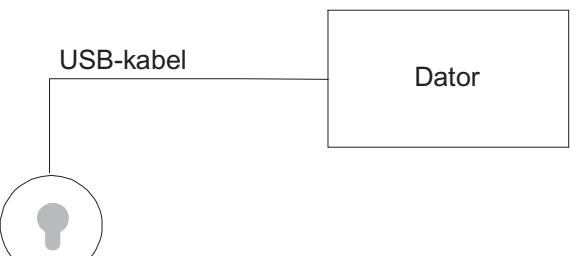

# **REGISTRERA 1105**

# **INSTALLATIONSANVISNING**

**Revision 1**

# **INSTALLATION 2**

# **ALLMÄNT**

Registrera 1105 är en bordsläsare som används när nyckelbrickor läggs in i Aptus passersystem.

# **TEKNISKA DATA**

| Strömförsörjning: 5 V DC. |                                                     |
|---------------------------|-----------------------------------------------------|
|                           | Max 64mA                                            |
|                           | Matning från datorns USB-port.                      |
| Utförande:                | Registrera 1105 finns att få i färgerna svart eller |
|                           | vit.                                                |
| Miljökrav:                | 0 till +40 grader Celcius                           |
|                           | 10 till 90% luftfuktighet                           |
| Mått:                     | Diameter: 130mm                                     |
|                           | Höjd: 34mm                                          |
|                           | Kabellängd: 1700mm                                  |
| Vikt:                     | 0.4 kg                                              |
|                           |                                                     |

# **PACKLISTA**

- 1 st Registrera 1105 inklusive USB-kabel
- 1 st Installationsanvisning (denna)

### **SYSTEMBESKRIVNING**

# **INSTALLATION**

Placera Registrera 1105 på lämplig plats på ditt skrivbord. Veva ut erforderlig mängd kabel och stoppa i USB kontakten i din dator. Datorn kommer att visa en ny USB-enhet: APTUS USB RFID Reader. Registrera 1105 är nu färdig att användas.

# **ANVÄNDNING**

Registrera 1105 läser av nyckelbrickans unika nummer och skickar detta till datorn på samma sätt som om du själv hade slagit in numret via tangentbordet.

Med Caps-Lock aktiverad kommer siffersträngen att avslutas med ett <ENTER>. Utan Caps-Lock avslutas strängen med nedåtpil.

Vid inmatning direkt i MultiAccess skall det sistnämnda alternativet användas.

Registrera 1105 ger ifrån sig ett kort pip när den läst in en korrekt nyckelbricka.

# **INSTÄLLNING**

När Registrera 1105 levereras är den inställd för att läsa den typ av nyckelbrickor som Aptus normalt använder. Dock är Registrera 1105 förberedd för andra format. Är du osäker på vilket läge din Registrera står i, tryck 4ggr på knappen <Scroll Lock>. Läsaren piper och visar sitt läge i klartext, t.ex. "aptus". Om läsaren inte är i önskat läge, tryck 4ggr <Scroll Lock> ytterligare en gång, inom 10 sekunder, och upprepa detta tills läsaren står i önskat läge.

Avläsning av nyckelbricka vid Aptus-läge ger ett enkelpip annars ett dubbelpip.

Caps-Lock får ej vara aktiv då omställning med 4ggr <Scroll Lock> görs.

# **AVPROVNING**

Kontrollera en extra gång att USB kontakten är korrekt ansluten. Prova funktionen genom att läsa en nyckelbricka.

### **GARANTI**

Aptus Elektronik AB lämnar två års garanti på material och fabrikationsfel på samtliga produkter. Övrigt enligt leveransbestämmelser NL01.

### **SERVICE**

För service hänvisar APTUS Elektronik AB till ansvarig återförsäljare som utöver egen kompetens har kontinuerlig kontakt med APTUS Elektronik AB.