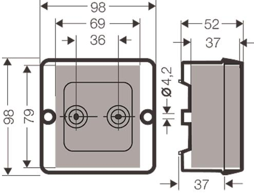
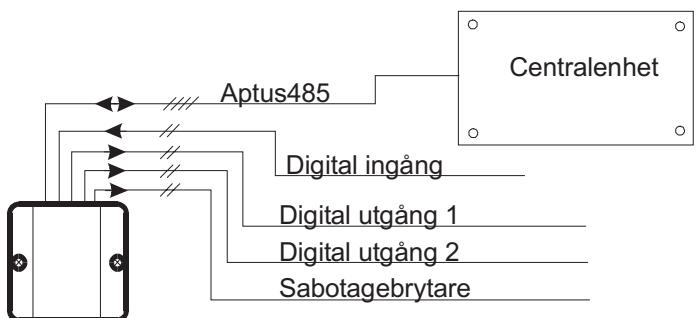
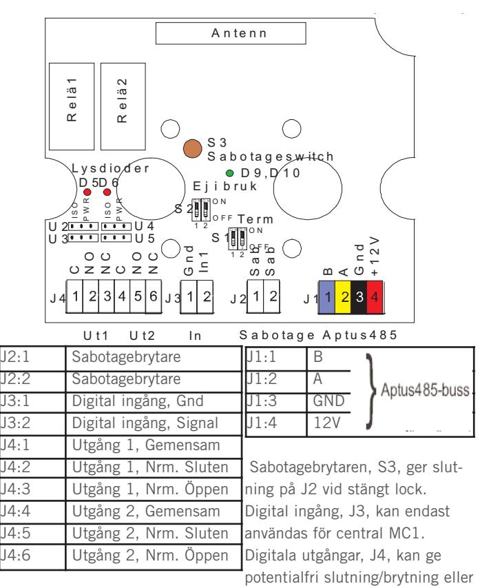

# **ÖPPNA 1805**

### **INSTALLATIONSANVISNING**

**Revision 5**

## **INSTALLATION 2**

### **ALLMÄNT**

Läsare används tillsammans med någon av våra centralenheter för att få ett komplett låsöppnings- och/eller larmförbikopplingssystem. Läsaren är avsedd för radionycklar av typen Sända 0895 eller ART. Obs! 485-kommunikation till centralenhet, (Aptus485-buss).

### **TEKNISKA DATA**

|            | Strömförsörjning: 12V DC reglerad (10.5 - 14).    |  |  |
|------------|---------------------------------------------------|--|--|
|            | Max 75mA, Min 35mA, Avsäkrad 200mA.               |  |  |
|            | Matning från centralenheten.                      |  |  |
| Ingångar:  | 1 med slutande / brytande funktion. Programmera   |  |  |
|            | dess funktion via MultiAccess.                    |  |  |
| Utgångar:  | 2 Reläutgångar för valfri styrning. (28V, max 1A) |  |  |
|            | 1 för Sabotagebrytare.                            |  |  |
| Räckvidd:  | Max 40meter beroende på installationsförhållande. |  |  |
| Frekvens:  | 433.92MHz                                         |  |  |
| Miljökrav: | -30 till +60 grader Celcius.                      |  |  |
|            | 10 till 100% luftfuktighet.                       |  |  |
| Mått:      | 98x98x52 mm                                       |  |  |
| Vikt:      | 0.3Kg                                             |  |  |

### **PACKLISTA**

- 1 st Öppna 1805, Kortläsare för radionycklar
- 2 st Skruv med plugg
- 1 st Installationsanvisning (denna)

### **SYSTEMBESKRIVNING**

### **MONTERING**

Enheten är avsedd för utanpåliggande montage. Lossa locket och skruva sedan fast enheten med bilagda skruv. Montera enheten så att kabelintaget görs i underkant där skruvplintarna sitter. På insidan locket sitter 2st tätningsbrickor som skall tryckas in ovanför monteringsskruvarna. Dra fram kablaget till den plats där läsaren skall monteras och dra in i kapslingen. Anslut kabeln till de jackbara plintarna. Avsluta monteringen genom att skruva på locket.

### **INKOPPLINGSANVISNING**

Använd partvinnad kabel, t.ex. av typ ELLXB 2x2x0.5 eller ELAQBY 2x2x0.6 för anslutning till centralenhet. Förlägg ett par till 485 (A+B) och spänning (12V+GND) i det andra paret.

Överstiger kabellängden 50 meter bör kabelarean vara minst 0.5mm2 för spänningsmatningen.

Du kan även använda Aptuskabeln som är framtagen för detta ändamål. Den är en 2-pars kabel med grövre area i ena paret: 2x0.15mm2 + 2x1.0mm2.

Tillse att Aptus485-bussen inte överstiger 200 meter.

mata ut spänning. Skall styrning ske från AC700 förbrukas även utgång i central.

### **3**

### **LYSDIODER**

Läsaren har lysdioder för att indikera driftstatus samt utgångsstatus.

|        | D9,D10 Grön eller | Fast grön: Normal drift                       |  |
|--------|-------------------|-----------------------------------------------|--|
|        | Röd               | Fast röd: Radiokod mottas                     |  |
| D5, D6 | Röda              | Tänd när tillhörande utgång, Ut1 eller Ut2 är |  |
|        |                   | aktiv. (D5 = Ut1; D6 = Ut2)                   |  |

### **INSTÄLLNINGAR**

| S1:1-2 | Terminering  | ON,ON => Terminering inkopplad. Endast ändpunkterna av bussen termineras. OFF,OFF => Ej terminerad. Vid leverans: OFF,OFF.                                           |
|--------|--------------|-------------------------------------------------------------------------------------------------------------------------------------------------------------------------------|
| S2:1-2 | Ej i bruk    | Switchen är avsedd för framtida funktioner. Skall vara inställd på OFF,OFF.                                                                                                |
| U2, U3 | Funktion Ut1 | ISO: Potentialfri slutning eller brytning på J4: 1,2,3 PWR: Läsarens systemspänning matas ut på utgången. Observera att läsarens mat ning är avsäkrad till 200mA. |
| U4, U5 | Funktion Ut2 | ISO: Potentialfri slutning eller brytning på J4: 4,5,6 PWR: Läsarens systemspänning matas ut på utgången. Observera att läsarens mat ning är avsäkrad till 200mA. |

#### **SYSTEMKRAV**

MultiAccess från version 7.0. MC 1 från version A0 eller AC 700 från version R2. Radionyckel skall vara av typ Sända 0895 eller ART.

### **PROGRAMMERING**

När Öppna 1805 är inkopplad kan du få in den i MultiAccess genom att hämta hårdvara. En ny enhet med namnet "Öppna 1805" skall komma upp. Under denna finns de resurser som hör ihop med denna läsartyp. Resursen "Beröringsfri läsare" skall sättas till används och därefter anger du vilken dörr läsaren skall användas till. Avsluta programmeringen med att sända data.

### **AVPROVNING**

Kontrollera en extra gång att alla signalledare är rätt inkopplade innan anläggningen spänningssätts. Kontrollera att radionyckel når läsaren, röd lysdiod skall tändas. Prova också funktionen för eventuellt inkopplade in eller utgångar.

### **GARANTI**

Aptus Elektronik AB lämnar två års garanti på material och fabrika-

tionsfel på samtliga produkter. Övrigt enligt leveransbestämmelser NL01.

### **SERVICE**

För service hänvisar APTUS Elektronik AB till ansvarig återförsäljare som utöver egen kompetens har kontinuerlig kontakt med APTUS Elektronik AB.