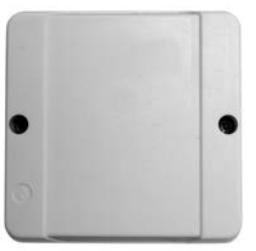

|           | SPECIFIKATIONER                 | Öppna 1805                                      |
|-----------|---------------------------------|-------------------------------------------------|
|           | Korttyp                         | Aktiv radionyckel med 2 unika koder, Sända 0895 |
|           | Kommunikation till centralenhet | RS 485                                          |
|           | Mått (hxbxd)                    | 98x98x52 mm                                     |
|           | Drivspänning                    | 12 volt DC, levereras från centralenheten       |
| 90-679-80 | Nettovikt i kg                  | 0,3                                             |
|           | Läsavstånd                      | Upp till 40 m (beroende på placering)           |

## **Öppna 1805 Radioläsare**

## **EGENSKAPER OCH FÖRDELAR**

- Läser radionyckel för användning ihop med övriga Multiaccess-produkter.
- Läsaren läser radionyckel upp till 40 meter.
- Radionyckeln, Sända 0895, innehåller två knappar som kan program-
- meras individuellt (exempelvis larmtillkoppling, öppning eller stängning av port etc).
- Alla radionycklars koder är unika.
- Radioläsaren är inte riktningskänslig. Det innebär att den kan monteras inomhus på ett centralt ställe, på detta sätt uppnås en stor läsradie.
- En fritt programmerbar ingång, avläses från MC1.
- Två fritt programmerbara reläutgångar. Styrs från 700-central eller MC1.

**art.nr.**

|                                          |                                      | E G A S S A P                                      |
|------------------------------------------|--------------------------------------|----------------------------------------------------------------------|
| ELEKTRISK ANSLUTNING                     | Öppna 1805                           |                                                                      |
| Strömförsörjning V DC                    | 12 spänningen lev. av centralenheten |                                                                      |
| Förbrukning Watt                         | min 0,24                             |                                                                      |
| Amp                                      | min 0,02                             |                                                                      |
| OMGIVNING                                |                                      |                                                                      |
| Temperatur 0C                            | -30 till +60                         |                                                                      |
| Luftfuktighet % Rh                       | 10 till 100                          |                                                                      |
| ANSLUTNING TILL CENTRALENHET             |                                      |                                                                      |
| Centralenheter med manuell programmering |                                      |                                                                      |
| AC 280                                   | Nej                                  |                                                                      |
| AC 360                                   | Nej                                  |                                                                      |
| Centralenheter med programmering via PC  |                                      |                                                                      |
| 500 XX                                   | Nej                                  |                                                                      |
| 600 XX                                   | Nej                                  |                                                                      |
| 700 XX                                   | Ja                                   |                                                                      |
| MC1                                      | Ja                                   |                                                                      |
| MÅTT I MM                                |                                      |                                                                      |
| Höjd                                     | 98                                   |                                                                      |
| Bredd                                    | 98                                   |                                                                      |
| Djup                                     | 52                                   |                                                                      |
| Nettovikt i kg                           | 0,3                                  |                                                                      |
|                                          |                                      | 2011-02-15 Vi reserverrar oss för tryckfel och eventuella ändringar. |

## **www.aptus.se**

Aptus Elektronik AB . Ekonomivägen 3-5, 436 33 Askim . telefon **växel:** 031 68 97 00 **försäljning:** 031 68 97 10 **fax:** 031 68 97 99 aptus@aptus.se . www.aptus.se