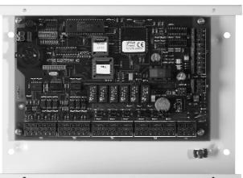

|           |                                                        | SPECIFIKATIONER                     | AC 700S                          |
|-----------|--------------------------------------------------------|-------------------------------------|----------------------------------|
|           |                                                        | Kommunikation mellan centralenheter | RS 485                           |
|           |                                                        | Kommunikation mellan PC och central | RS 232, TCP/IP, modem, GSM-modem |
|           |                                                        | Mått (hxbxd)                        | 190x260x55 mm                    |
| 90-605-20 |                                                        | Strömförsörjning                    | 24 VDC                           |
|           | * Notera att det inte går att maximera alla samtidigt. | Nettovikt i kg                      | 2,2                              |

## **AC 700S Slavcentral för passersystem (fyra dörrar)**

**EGENSKAPER OCH FÖRDELAR**

- - Kommunikation mellan dator och centralenhet sker krypterat med 128 bitars nycklar.
- - Kommunikation mellan centralenhet och läsare sker krypterat med 32 bitars nycklar.
- -Centralenhet med dynamiskt minne.
- -Upp till 30 000 användare.*
- -Registrering av upp till 6 500 händelser.*
- -Upp till 255 tidzoner.*
- -Inbyggd realtidsklocka.
- -Fyra dörrar kan hanteras.
- -Två läsare per dörr kan anslutas (in- och utläsare).
- -Sex fritt programmerbara reläutgångar.
- -Sex fritt programmerbara ingångar.
- - Alla reläer kan ställas att vara potentialfria eller att använda centralen hetens drivspänning.
- -Batteribackup (minnet) och sabotagekontakt.
- -Programmering via Windowsmjukvara (Multiaccess).
- -Centraliserad kommunikation med master via MultiServer-modul.
- - Funktioner: dörrpassage, larmförbikoppling, grupperad larmförbikoppling, larmåterinkoppling, antipassback, slusskoppling, hotkod, möjlighet att lista personer i byggnaden, kvittering av externlarm/överfallslarm.
- -Tidzonsfunktioner: Tid- och ingångsstyrd samt läsarstyrd.
- -Hanterar AD 6X XX läsare, AD 7X XX läsare samt läsare i Öppna-serien.
- - Väljer man AD 7X XX läsare, Låsa 1169, eller Öppna-läsare så kan totalt fyra dörrar anslutas.
- - Väljer man AD 6X XX läsare så kan endast två dörrmiljöer anslutas. För att få ytterligare två dörrmiljöer med AD 6X XX läsare så får man köpa ett påbyggnadskort.

| ELEKTRISK ANSLUTNING Strömförsörjning V DC/AC                                   | AC 700S 12-24 (+/-15%)          |  |
|------------------------------------------------------------------------------------|------------------------------------|--|
| Förbrukning Watt                                                                   | max 10                             |  |
| Amp                                                                                | 0,25 inkl 2xläsare                 |  |
| Amp                                                                                | 0,40 inkl 4xläsare                 |  |
|                                                                                    |                                    |  |
| OMGIVNING Temperatur 0 C                                                     | 0 till 40                          |  |
| Luftfuktighet %                                                                    | 10 till 90                         |  |
|                                                                                    |                                    |  |
| DATA Max antal användare                                                        | max 30 000 *                       |  |
| Registrering av händelser                                                          | max 6 500 *                        |  |
| Antal tidszoner                                                                    | max 255 *                          |  |
| Inbyggd realtidsklocka                                                             | Ja                                 |  |
| UTGÅNGAR                                                                           |                                    |  |
| Antal reläer med växlande kontakt (28V, 1A) 6 reläer med växlande kontakt (28V,1A) |                                    |  |
| Användning av centralenhet drivspänning                                            | Ja                                 |  |
| Relä ger potentialfri slutning/brytning                                            | Ja                                 |  |
|                                                                                    |                                    |  |
| INGÅNGAR Antal ingångar för potentialfria kontakter                             | 6                                  |  |
|                                                                                    |                                    |  |
| KOMMUNIKATION MELLAN                                                               |                                    |  |
| CENTRALENHETER Mellan master och PC                                             | TCP/IP Modem, GSM-modem och RS 232 |  |
| Mellan masterenhet och slavenhet                                                   | RS 485                             |  |
| Centraliserad kommunikation med                                                    |                                    |  |
| mastern via MultiServer modul                                                      | Ja                                 |  |
|                                                                                    |                                    |  |
| MÅTT I MM A höjd                                                                | 190                                |  |
| B bredd                                                                            | 260                                |  |
| C djup                                                                             | 55                                 |  |
| Nettovikt i kg                                                                     | 2,2                                |  |

## **PASSAGE**

## **www.aptus.se**

Aptus Elektronik AB - Ekonomivägen 3-5, 436 33 Askim telefon **växel:** 031 68 97 00 **försäljning:** 031 68 97 10 **fax:** 031 68 97 99 aptus@aptus.se **www.aptus.se**