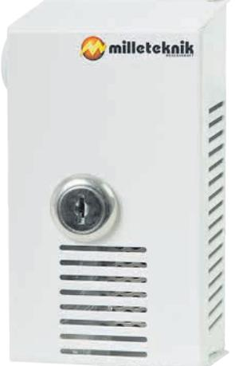
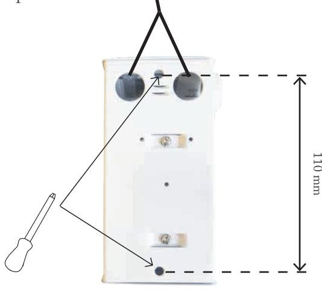
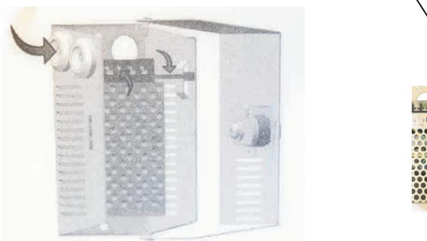
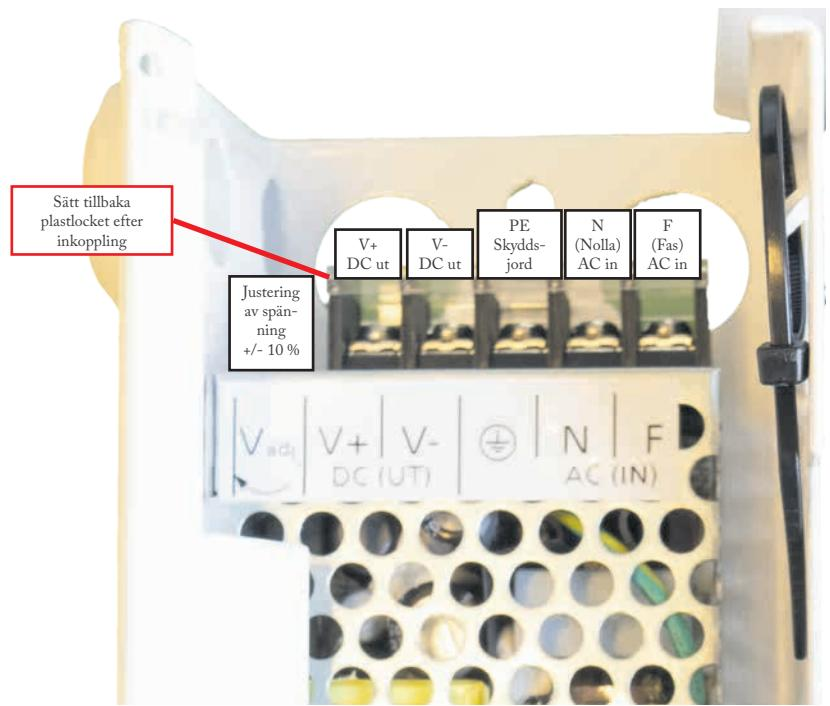

# AGG B2

AGG 12 20-B2 AGG 24 10-B2

Milleteknik ger reservkraft som säkerställer drift. Alla våra produkter är designade för bästa driftsäkerhet och lång livslängd - för såväl elektronik som batterier.

Denna anvisning beskriver installation och driftsättning av AGG i B2 kapsling.

# SÄKERHET - LÄS DET TA FÖRST!

- 100 mm fritt utrymme skall lämnas kring enheten.
- Systemet är avsett för bruk i kontrollerad inomhusmiljö.
- Endast personer med behörighet bör installera och underhålla systemet.
- Det är installatörens ansvar att systemet är lämpat för tänkt bruk.
- Ventilation skall ej övertäckas.
- Nätspänning bör vara bortkopplad under installation.
- Alla uppgifter med reservation för ändringar.

## Montering

100 mm fritt utrymme skall lämnas kring enheten.

Använd två för väggen lämpliga skruvar för att sätta upp skåpet. Det finns två hål för kablar på baksidan, men då måste distans mellan vägg och skåp användas.

• Nycklar till lås.

### Inkoppling

Kablar kan dras in från sidan eller baksidan.

Kablar skall säkras med buntband i öglan på sidan, som bilden på insidan av locket visar.

Systemet är underhållsfritt och skall installeras i inomhusmiljö. Anslut kablar till nätaggregatet.

### Tekniska data

AGG 12 20-B2 AGG 24 10-B2

| Information om rekommenderad omgivning och produktens kapsling |                                                         |              |  |
|----------------------------------------------------------------|---------------------------------------------------------|--------------|--|
| Rekommenderad omgivning:                                       | Miljöklass 1, inomhus , 20 % ~ 90 % relativ fuktighet   |              |  |
| Omgivningstemperatur:                                          | +5 °C till +40 °C                                       |              |  |
| Kapslingsklass:                                                | IP 20                                                   |              |  |
| Rekommenderad montering:                                       | Vägg                                                    |              |  |
| Dimension (HxBxD):                                             | 127 x 71 x 61 mm                                        |              |  |
| Antal kabelgenomföringar:                                      | 2 st                                                    |              |  |
| Kapslingens färg:                                              | Vit                                                     |              |  |
| Nettovikt:                                                     | 0,5 kg                                                  | 0,5 kg       |  |
| El-teknisk information                                         | AGG 12 20-B2                                            | AGG 24 10-B2 |  |
| Nätaggregat                                                    | RS-25-12                                                | RS-25-24     |  |
| Ingående spänning:                                             | 110V - 264 V AC / 47 - 63 Hz                            |              |  |
| Utgående spänning:                                             | 12 V DC                                                 | 24 V DC      |  |
| Maxström:                                                      | 2 A                                                     | 1,0 A        |  |
| Ställbar utspänning + / -:                                     | 10 %                                                    |              |  |
| Rippel:                                                        | 120 mVp-p                                               | 120 mVp-p    |  |
| Verkningsgrad:                                                 | 83,5 %                                                  | 83,5 %       |  |
| Skydd:                                                         | Överlast, överspänning, övertemperatur och kortslutning |              |  |
| Anslutningsarea belastningsutgång                              | 4 mm2                                                   |              |  |
| Övrig information                                              | AGG 12 20-B2                                            | AGG 24 10-B2 |  |
| E-nummer:                                                      | 5269795                                                 | 5269796      |  |
| Miljödata hos SundaHus:                                        |                                                         | Nej          |  |
| Garantitid:                                                    |                                                         | 2 år         |  |

Produkten uppfyller kraven och är testad enligt följande svenska och europeiska regelverk och normer: Europeisk elsäkerhetsnorm. EMC Directive 2014/30/EU. Low Voltage Directive 2014/35/EU. CE-marking 765/2008.

031-340 02 30 info@milleteknik.se www.milleteknik.se

Milleteknik AB Ögärdesvägen 8 B 433 30 Partille