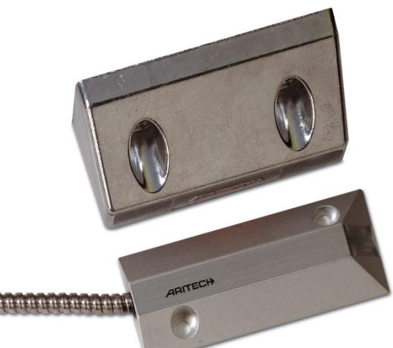
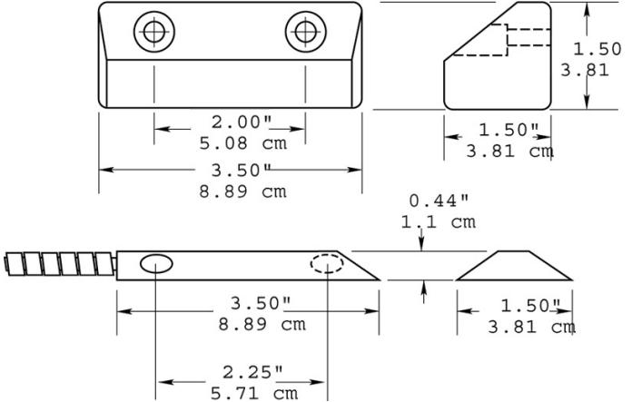

## Produktblad

# DC109

Magnetkontakt för portar - extra korritionsskyddad

### Utanpåliggande magnetkontakt

DC108-serien portkontakter är avsedd för användning i rigorösa miljöer med kommersiella och industriella anläggningar. Golvmonterade enheter är konstruerade med en aluminiumkapsling. Kopplingsenheten är helt innesluten i en exklusiv polyuretan tätningsförening för att förhindra skador på grund av fukt.

#### Enkel installation

En bred arbetsglipa på upp till 7,5 cm gör installationen enkel och hjälper till att förhindra falsklarm orsakade av portens rörelse eller skadade och löst sittande portar.

#### Standardprestanda

- EOmfattande produktserie
- EÖverlägsen kvalitet
- E Enkla att installera
- EExtra korritionsskyddad
- ETvå meters ledarlängd som standard
- EFörsedda med sabotageslinga
- ESBSC-intygad, larmklass 1/2

# DC109

Magnetkontakt för portar - extra korritionsskyddad

### Tekniska data

| Arbetsavstånd (max) | 75 mm                               |
|---------------------|-------------------------------------|
| Anslutningstyp      | 2 m lång, armerad 4- eller 5-ledare |
| Funktion i drift    | Normalt sluten                      |
| Mått (L x B x H)    |                                     |
| Magnet              | 76 x 25 x 12 mm                     |
| Kontaktdel          | 89 x 39 x 10 mm                     |
| Kapsling            | Aluminium                           |

Order data

Artikelnummer Beskrivning DC109

Magnetkontakt för portar - extra korritionsskyddad

Reservationer för produktförändringar. För uppdatering av produktdata, gå in på www. utcfssecurityproducts.se eller kontakta din lokala UTC Fire & Security återförsäljare. DC109-2017-01-20 07:45:32 Released :05-SEP-12