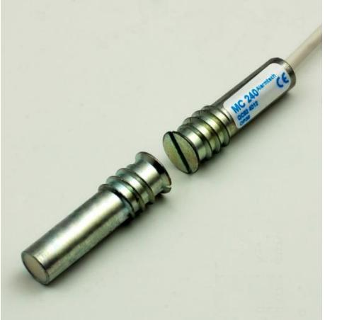
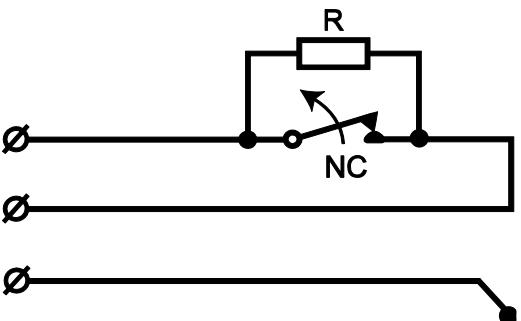
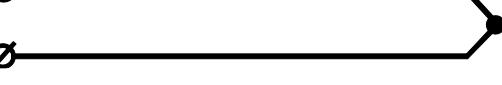
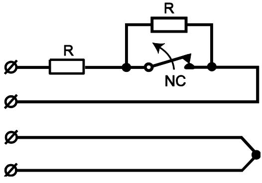

# **Magnetkontakt**  Infällt montage

# **Datablad och Monteringsanvisning MC 240**

**Kontakter** 

MC 240 är en kontakt för infällt montage. Den kan användas i alla typer av säkerhetssystem och i industriella system för övervakning av dörrar och fönster. Fig.1. visar kopplingsschemat med separat larmslinga och sabotageslinga. Ett stort antal tillbehör finns att beställa

### **MC 240 är certifierad för VdS Class B och EN 50131-2-6:2008 Grade 2, Miljöklass IIIA.**

## **MONTERINGSINSTRUKTION**

- Borra ett hål för kontakten med diameter ca 9-10mm och djup ca 40mm för kontaktdelen och ca 20mm för magnetdelen
- Kontaktdel och magnetdel skall monteras centrerat mot varandra
- Den självskärande och självlåsande gängan gör monteringen enkel och snabb när man skruvar in dem i hålet

# **TEKNISKA DATA**

| Material                                | Trä Stål                                         |  |  |  |
|-----------------------------------------|-----------------------------------------------------|--|--|--|
| Slutande                                | typ. 27 mm +/– 2mm see distance table            |  |  |  |
| Brytande                                | typ. 33 mm +/– 2mm see distance table            |  |  |  |
| Kontakttyp                              | form A, SPST                                        |  |  |  |
| Spänning max.                           | 48 V DC/AC                                          |  |  |  |
| Ström max.                              | 500 mA DC/peak AC                                   |  |  |  |
| Max brytande effect (UxI)               | 10 W                                                |  |  |  |
| Livslängd                               | >20 million switching operations at 10 V/4 mA       |  |  |  |
| Kabel                                   | Standard 2m, 6m and 10m längd. ф 3,2 mm, 4x0,14 mm2 |  |  |  |
| Miljöklass enligt EN50130-5:2011        | IIIA                                                |  |  |  |
| Temperaturområde                        | -40°C to +70°C                                      |  |  |  |
| Fuktighet                               | max. 95% r. h.                                      |  |  |  |
| Material                                | aluminum legering                                   |  |  |  |
| Dimensioner                             |                                                     |  |  |  |
| Kontaktdelen                            | ф 11 x 36 mm                                        |  |  |  |
| Magnetdelen                             | ф 11 x 36 mm                                        |  |  |  |
| Testad enligt EN 50131-2-6:2008 av VdS; | Grade 2, class IIIA                                 |  |  |  |
| Godkännanden                            | VdS G 193513, SBSC, F&P, FG, INCERT                 |  |  |  |

### **KRETSSCHEMA**

# **AVSTÅNDSTABELL**

Avstånden är uppmätta med kontaktdel och magnetdel monterade mot varandra längs Y-axeln.

| Avstånd mellan     | Avstånd i mm | Tolerans i mm |
|--------------------|--------------|---------------|
| magnet och kontakt | Typiskt      |               |
| Kontaktslutning    | 27           | +/- 3         |
| Kontaktbrytning    | 33           | +/- 4         |

### **FUNKTION**

MC 240 magnetkontakt har två delar, en kontaktdel med en reedkontakt samt en magnetdel med en ingjuten magnet. Rätt monterad på ett objekt sluter magnetfältet reedkontakten. När avståndet mellan magnetdel och kontaktdel blir för stort bryter reedkontakten. Monteras kontaktdelen eller magnetdelen i stålplåt avleds magnetfältet från kontaktdelen och stålet minskar magnetfältet från magneten och kontaktens olika avstånd påverkas.

**Magnetkontakten får inte monteras I närheten av starka magnetfält.** 

#### **INSTALLATION**

Kontaktdel och magnetdel skall monteras mot varandra. Sidoförskjutningar av magneten i monteringen minskar gapet markant. Magnetdelen skall monteras på den rörliga delen av objektet och kontaktdelen på den fasta delen av objektet. Exempelvis kontaktdelen på dörrkarmen och magneten på dörren.

På objekt där det kan vara svårt att montera kontakten använd gärna tillbehören I form av olika flänsar i plast. Endast omagnetiska skruvar skall användas vid monteringen.

Kontrollera alltid kontaktens funktion och gap efter monteringen med en ohmmeter

**OBS: Utsätt aldrig kontaktdel eller magnetdel för kraftiga slag. Det kan skada reedkontakten eller försvaga magnetens fält och därmed minska gapet..** 

## **KABELLÄNGDER OCH INBYGGDA RESISTANSER PÅ SPECIALORDER**

MC 240 finns som standard med olika längder på kabeln, 2m, 6m, and 10m. Andra längder kan beställas. Dessutom kan de beställas på specialorder med olika resistanser inbyggda.

Om speciella värden på resistanserna skall beställas använd då i beställningen för värdet parallellt med reedkontakten och S för det värde som skall monteras i serie med reedkontakten och öppningskontakten.

Sammanfattning:

- Resistans parallell med reed använd prefix P
- I serie med reedkontakten använd prefix S
- Med samma värde på resistanserna använd 2xR

Minsta orderkvantitet för specialorder är 100st kontakter

#### **MC 240-R**:

**MC 240-2R**:

| Kontakt | Tillbehör  | Avstånd på trä [mm] |          | Avstånd på stål [mm] |          |
|---------|------------|---------------------|----------|----------------------|----------|
|         |            | Slutning            | Brytning | Slutning             | Brytning |
| MC 240  | -          | 27                  | 33       | X                    | X        |
|         | MC 200-S3  | 24                  | 29       | 14                   | 17       |
|         | MC 200-S11 | 27                  | 33       | X                    | X        |
|         | MC 200-S12 | 38                  | 44       | 19                   | 22       |
|         | MC 200-S21 | 27                  | 33       | X                    | X        |
|         | MC 200-S22 | 38                  | 44       | 24                   | 29       |
|         | MC 200-S31 | 27                  | 33       | X                    | X        |
|         | MC 200-S32 | 38                  | 44       | 19                   | 22       |

### **AVSTÅNDSTABELL VID ANVÄNDNING AV OLIKA TILLBEHÖR TYPISKA VÄRDEN**

X – rekommenderas inte