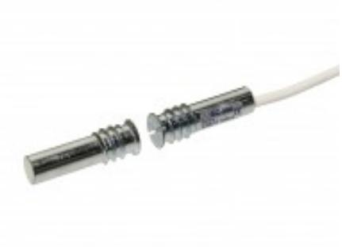
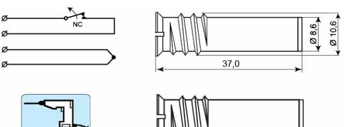
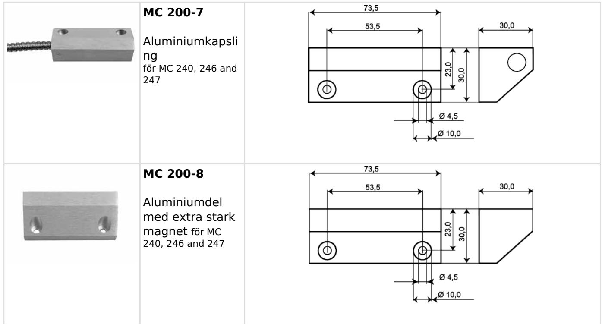

# MC 240

## Magnetkontakt för infällnad, NC

#### **Produktdetajler:**

| Infälld                                                                                                        |
|----------------------------------------------------------------------------------------------------------------|
| NC                                                                                                             |
| EN 50131-2-6 Grade 2, Class IIIA, VdS G 193513 Class B, INCERT B-582-0013, SBSC 9-196, Class 1/2 , FG |
| 48 VDC / 500 mA / 10 VA                                                                                        |
| 9-10                                                                                                           |
| Alnico 5                                                                                                       |
| Endast med tillbehör                                                                                           |
| 27                                                                                                             |
| X                                                                                                              |
| Ja                                                                                                             |
| Kabel                                                                                                          |
| Metall                                                                                                         |
| -40°C – +70°C                                                                                                  |
| IP 67                                                                                                          |
| 37 x 11                                                                                                        |
| 37 x 11                                                                                                        |
|                                                                                                                |

MC 240 är en universell magnetkontakt med NC funktion som kan användas både i larm och passersystem för bevakning av t.ex. dörrar, grindar och fönster mot obehörig öppning. Både kontakt- och magnetdelen är i metall och utformade som en skruv med gängor vilket möjliggör enkel montering i trä eller plast. MC 240 är en helkapslad kontakt enligt kapslingsklass IP 67. Med vårt omfattande utbud av installationstillbehör går det enkelt att montera kontakten både infällt och utanpåliggande även på metall och andra material. Med rätt val av tillbehör kan kontakten även monteras på ståldörrar, kassaskåp, garageportar etc.

| BESTÄLLINGSINFORMATION |         |                                                                   |  |  |  |  |
|------------------------|---------|-------------------------------------------------------------------|--|--|--|--|
| Typ                    | E-nr    | Beskrivning                                                       |  |  |  |  |
| MC 240                 | 6332701 | Magnetkontakt för infällnad, NC, 2 m kabel                        |  |  |  |  |
| MC 240-6               | 6332702 | Magnetkontakt för infällnad, NC, 6 m kabel                        |  |  |  |  |
| MC 240-10              | 6332703 | Magnetkontakt för infällnad, NC, 10 m kabel                       |  |  |  |  |
| MC 240-P1K             | 6332724 | Magnetkontakt för infällnad, NC, 1K parallellmotstånd, 2 m kabel  |  |  |  |  |
| MC 240-P2,2K           | 6332725 | Magnetkontakt för infällnad, NC, 2,2K parallellmotstånd,2 m kabel |  |  |  |  |
| MC 240-C               | 6332704 | Kontaktdel för infällnad utan magnet, NC, 6 m kabel               |  |  |  |  |

### **Relaterade produkter och tillbehör:**

| MC 200-S3 Plastkapsling för MC 240, 246 and 247                          |  |  |
|-----------------------------------------------------------------------------------|--|--|
| MC 200-S11 Plastadapter för MC 240, 246, 247, 250, 255, 270, 272, 275 |  |  |
| MC 200-S12 Plastadapter med stark magnet för MC 240, 246, and 247  |  |  |
| MC 200-S21 Plastadapter för MC 240, 246, 247, 250, 255, 270, 272, 275 |  |  |
| MC 200-S22 Plastadapter med stark magnet för MC 240, 246 and 247   |  |  |

### **Relaterade produkter och tillbehör:**

| MC 200-S31 Plastadapter för MC 240, 246, 247, 250, 255, 270, 272, 275  |  |
|------------------------------------------------------------------------------------|--|
| MC 200-S32 Plastadapter med stark magnet för MC 240, 246, 247          |  |
| MC 200-4 Aluminiumkapsli ng för MC 240, 246 and 247                    |  |
| MC 200-5 Aluminiumdel med extra stark magnet för MC 240, 246 and 247   |  |
| MC 200-6 Aluminiumkapsli ng för golvmontage för MC 240, 246 and 247 |  |

### **ALARMTECH SWEDEN AB**

#### **Relaterade produkter och tillbehör:**

Powered by TCPDF (www.tcpdf.org)