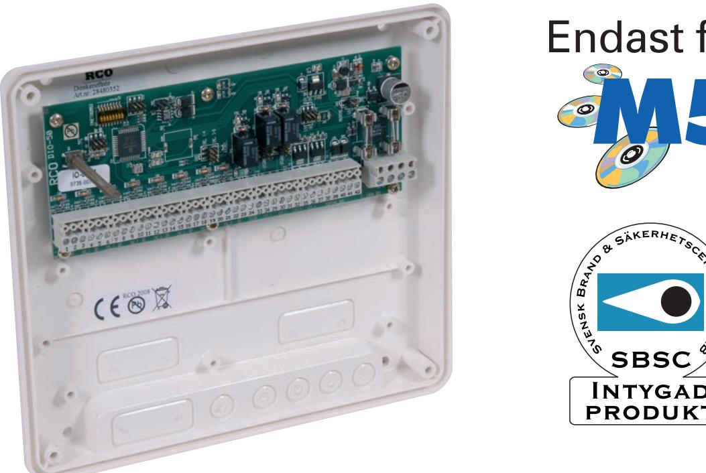
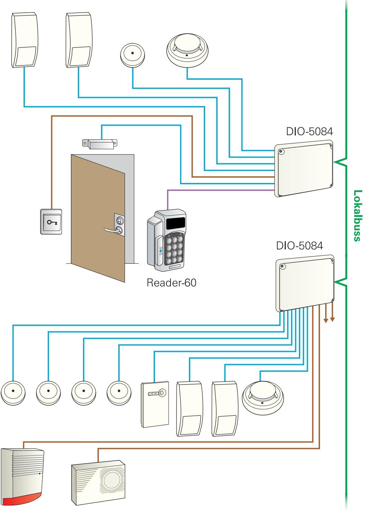

## **R-CARD 5000** DIO box för larm och 50/52/60/62/65/66 läsare

## DIO-5084, **SSF 1014 Klass 2**

Art. nr 20 100 150 E. nr 58 750 33 DIO enhet för larmsektioner, kortläsare. 8 st ingångar, dubbelbalanserade och strömslinga med återställning. 4 st utgångar, relä och transistor. Intern 12V spänningsomvandlare för drivning av IR detektorer.

## DIO-5084, **SSF 1014 Klass 3**

Art. nr 20 100 151 E. nr 58 751 45 DIO enhet för larmsektioner, kortläsare. 7 st ingångar, dubbelbalanserade och strömslinga med återställning. 4 st utgångar, relä och transistor. Intern 12V spänningsomvandlare för drivning av IR detektorer.

*Elektroniska lås för hem och företag*

| Matningspänning:                                            | 10-30 VDC / 8-24 VAC |
|-------------------------------------------------------------|----------------------|
| Strömförbrukning (i vila, ut- och ingångar inaktiva):       | 17 mA @ 24 VDC       |
| Strömförbrukning (utan last, alla ut- och ingångar aktiva): | 109 mA @ 24 VDC      |
| Temperaturområde:                                           | +5ºC till +40ºC      |
| Mått Kapsling BxHxD (mm):                                   | 200x180x49           |
| Material:                                                   | Plast                |
|                                                             |                      |

*Elektroniska lås för hem och företag*