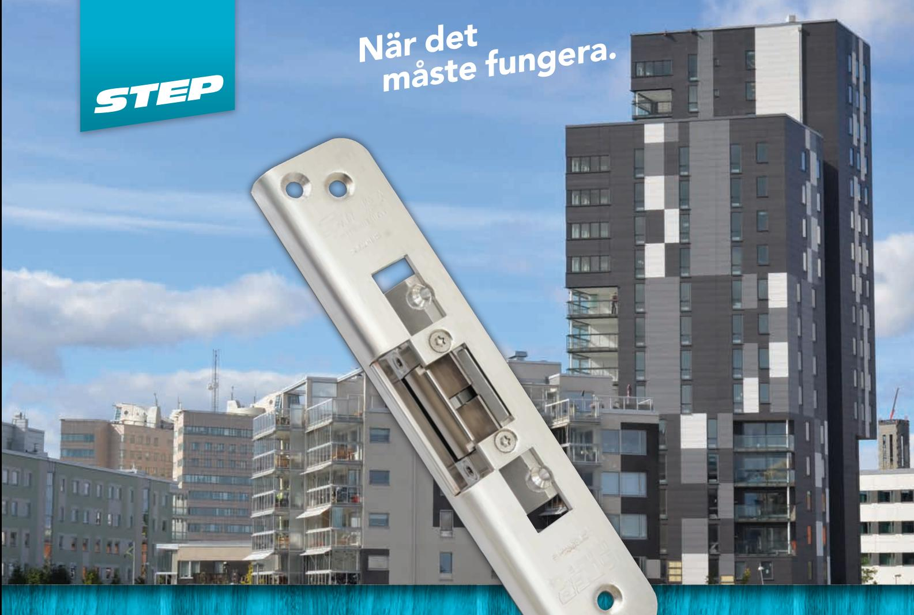
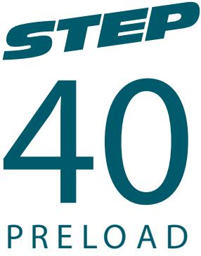
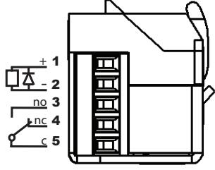
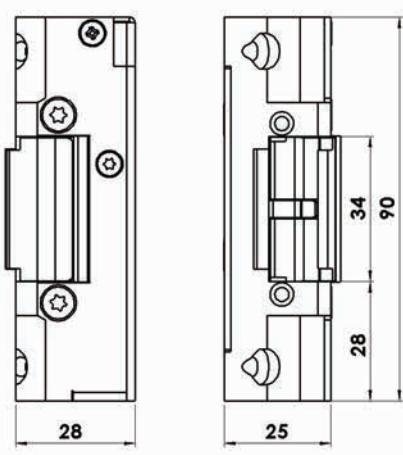
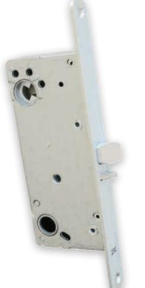
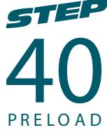

# Standard elslutbleck med listtrycksteknik

STEP 40 Preload sätter en ny och högre standard för daglåsning med normala säkerhetskrav. Den välkända STEP kvaliteten, listtryckstekniken och de små måtten gör STEP 40 Preload till det självklara valet.

# Driftsäkerhet som fungerar i verkligheten

Preload serien kombinerar minimala mått med enastående prestanda för dörrar med normala säkerhetskrav. Elslutblecket har en mycket hög driftsäkerhet och är utprovad för hög öppningsfrekvens.

STEP 40 Preload finns som omställbar så att funktionen på elslutblecket enkelt kan väljas och ändras vid installation. På kort tid kan elslutblecket ändras från rättvänd till omvänd funktion för större flexibilitet och lägre hanteringskostnader.

## Estetiskt montage

Till STEP 40 Preload finns ett stort urval monteringsstolpar i rostfritt stål, som får varje dörr att fungera optimalt. Genom sina små mått passar elslutblecket med liten justering in i urtaget för dörrkarmens standardslutbleck.

Mininimala mått gör att elslutblecket lätt får plats i karmen.

Preload - En unik listtrycksteknik

STEP 40 Preload en listtrycksteknik som ger följande fördelar:

- Tätningslister och tryckskillnader Listtrycksfunktionen medger att dörren alltid kan låsas upp trots att dörrlåset spänner mot elslutblecket.
- Dörrautomatik Listtrycksfunktionen i kombination med den snabba upplåsningen gör att dörren öppnas snabbt och utan risk för att fastna.
- Utrymningsdörr Listtrycksfunktionen säkerställer att brandlarmet kan frilägga låsningen, trots tryck mot dörren av folkmassa, tätningslister, tryckskillnader eller sneda dörrar.

# Tekniska data

### Strömförbrukning

| Rättvänd/Omvänd funktion |                    |  |
|--------------------------|--------------------|--|
| 24V Dc +15% -10%         | 12V Dc +15% -10%   |  |
| 110mAh / max 300mA       | 220mAh / max 600mA |  |

### Artikelnummer

| ST40     | Rättvänd funktion 24V Dc                                     |
|----------|--------------------------------------------------------------|
| ST40-12  | Rättvänd funktion 12 Dc                                      |
| ST400    | Rättvänd funktion 24V Dc inkl. kolvkontakt                   |
| ST400-12 | Rättvänd funktion 12V Dc inkl. kolvkontakt                   |
| ST41     | Omvänd funktion 24V Dc                                       |
| ST41-12  | Omvänd funktion 12V Dc                                       |
| ST401    | Omvänd funktion 24V Dc inkl. kolvkontakt                     |
| ST401-12 | Omvänd funktion 12V Dc inkl. kolvkontakt                     |
| ST45     | Omställbar rättvänd-omvänd funktion 24V Dc                   |
| ST45-12  | Omställbar rättvänd-omvänd funktion 12V Dc                   |
| ST405    | Omställbar rättvänd-omvänd funktion 24V Dc inkl. kolvkontakt |
| ST405-12 | Omställbar rättvänd-omvänd funktion 12V Dc inkl. kolvkontakt |

• Mikrobrytare enpoligt växlande, Max. 30V Dc, 1A

- Skyddsdiod finns inbyggd
- Inbyggd indikering för avkänning att dörren är stängd/öppen(kolv kontakt)
- Brythållfasthet 9kN (900kg)
- Garanterar öppning trots listtryck i rättvänd och omvänd funktion
- Knacksäkrad
- Vändbar för att passa höger och vänsterdörrar

### Passande låshus

- Enkel- och dubbelfall-lås i Connect serien Enkel- och dubbelfall-lås i Modul serien
- Enkel- och dubbelfall-lås i Smalprofil serien

Dörrlåset ska vara enligt skandinavisk standard med enkelfall eller dubbelfall

