GEZE DÖRRTEKNIK

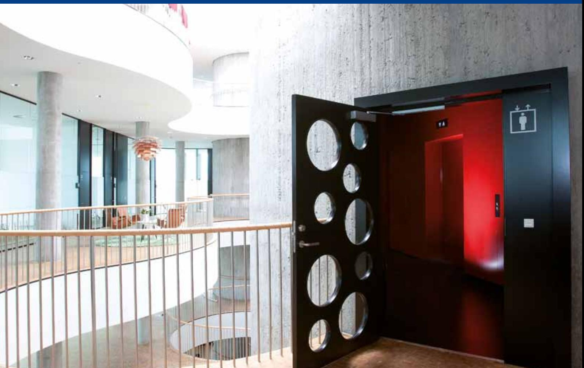

# TILLGÄNGLIGHET FÖR ALLA

# GEZE TS 5000 ECline DÖRRSTÄNGARE MED GLIDSKENA

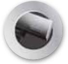

DÖRRTEKNIK

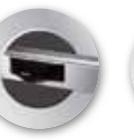

AUTOMATISKA

DÖRRSYSTEM

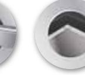

GLASSYSTEM

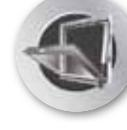

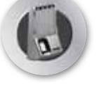

KOMFORT- OCH RÖKVENTILATION

SÄKERHETSTEKNIK

BEWEGUNG MIT SYSTEM

# DörrTEknik GEZE TS 5000 EClinE DÖRRSTÄnGARE MED GliDSKEnA

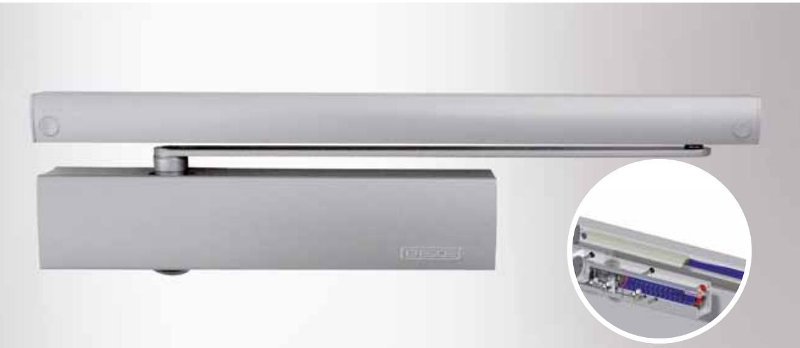

## **GEZE TS 5000 ECline**

TS 5000 ECline uppfyller kraven för handikappanpassning i enlighet med Din 18040. Den har ett mycket lågt öppningsmotstånd vilket gör det enkelt att öppna dörren. Den unika tekniken i dörrstängaren som ger en kraftig minskning av öppningsmotståndet kombinerat med en hjälpmekanism som är inbyggd i glidskenan, underlättar öppning av dörren. Dörrstängaren behåller sin styrka för stängning av dörren mot vindtryck och gummilister. Användaren får en lätt och komfortabel dörr att öppna. Hjälpmekanismen i glidskenan kan slås av eller på.

### **ANVÄNDNINGSOMRÅDE:**

- j För in- och utvändiga anslagsdörrar
- j Kan användas på höger och vänsterhängda dörrar utan omställning
- j Godkänd på branddörrar i enlighet med En 1154 A

## **PRODUKTEGENSKAPER:**

- j Alla funktioner justerbar i fronten
j Stilren design

- j Optisk visning av stängningskraft
- j Termostabila ventilskruvar
- j Justerbar stängkraft storlek 3-5
- j Justerbar stängarhastighet 180-0°
- j Justerbart tillslag 10-0°
- j Justerbar öppningsbroms från 70°
- j 40 % fall i öppningsmotstånd
- j 80 % effektivitet, dvs. nästan all kraft som används till att öppna dörren används som stängkraft.
- j Uppfyller kraven för öppningsmotstånd i enlighet med Din 18040
- j Dörrbredd upp till 1250 mm
- j Standardfärger: Silver, vit RAl 9016
- j RAl färger, rostfri design och mörkbrun på beställning

### **Momentkurva GEZE TS 5000 ECline**

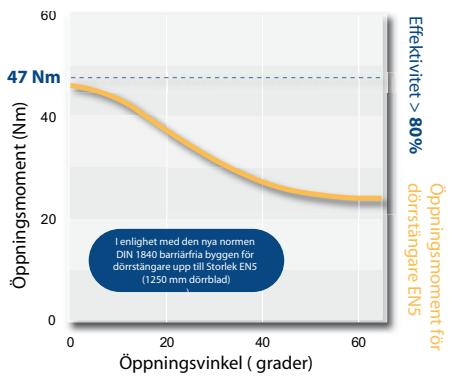

| ART NR. | Beskrivning                          | Beskrivning  | Art nr |
|---------|--------------------------------------|--------------|--------|
|         | GEZE dörrstängarhus TS 5000 ECline   | Silver       | 143640 |
|         | (gångjärnssida)                      | Vit RAl 9016 | 143641 |
|         |                                      | Silver       | 143572 |
|         | Glidskena (gångjärnssida)            | Vit RAl 9016 | 143575 |
|         |                                      | Silver       | 143648 |
|         | GEZE dörrstängarhus TS 5000 l ECline | Vit RAl 9016 | 143649 |
| 2       |                                      | Silver       | 143578 |
|         | Glidskena BG                         | Vit RAl 9016 | 143579 |

Dörrteknik

# DörrTEknik

## **MÅTT TS 5000 ECline**

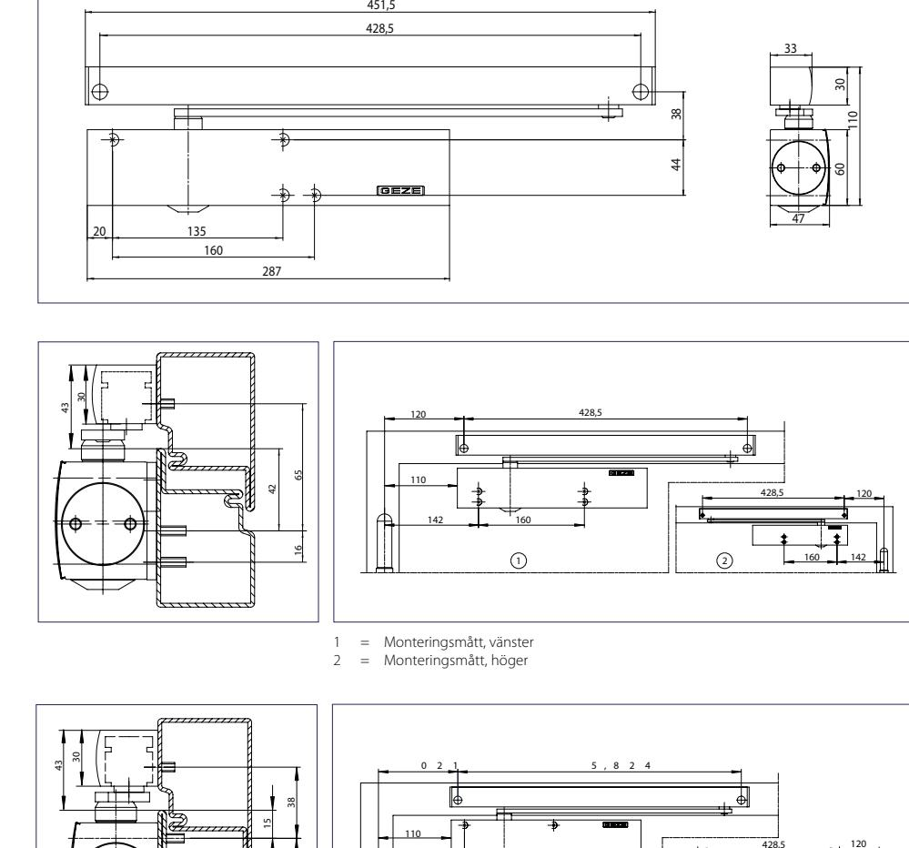

# montageplatta

**MONTAGE** På gångjärnssidan med

På gångjärnssidan utan montageplatta

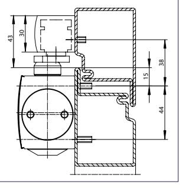

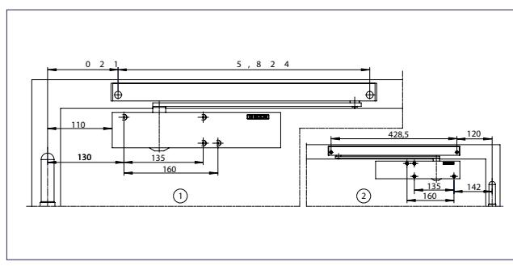

1 = Monteringsmått, vänster 2 = Monteringsmått, höger

Anslagssida med montageplatta max 15 mm karmdjup

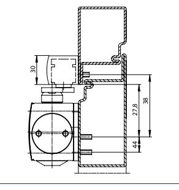

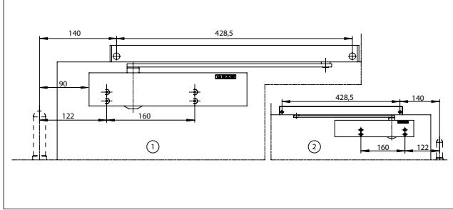

1 = Monteringsmått, vänster 2 = Monteringsmått, höger

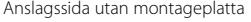

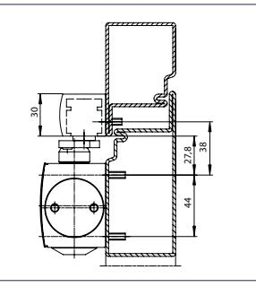

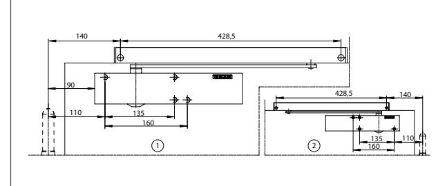

1 = Monteringsmått, vänster

2 = Monteringsmått, höger

| TIllBEhöR:            | j                     | Standard glidskena                                                                      |                   | Montageplatta för glidskena j                                                                                        |  |
|-----------------------|-----------------------|-----------------------------------------------------------------------------------------|-------------------|-------------------------------------------------------------------------------------------------------------------------|--|
|                       | j                     | Vinkelkonsol för glidskena Kåpa för dörrstängare i rostfritt stål/mässing j       |                   |                                                                                                                         |  |
|                       | j                     | Montageplatta för dörrstängare Vinkelkonsol för dörrstängare j                    |                   |                                                                                                                         |  |
|                       | j                     | Glasdörrsko för 10 mm helglas dörrar                                                    |                   |                                                                                                                         |  |
| TS 5000 VARIANTER: | j TS 5000             | Standard montage på                                                                     | j TS 5000 RFS     | Elektrohydraulisk uppställ                                                                                              |  |
|                       |                       | gångjärnssidan                                                                          |                   | ning, frisvingfunktion med integrerad rökdetektor                                                                    |  |
|                       | j TS 5000             | Standard montage på gångjärns sidan med lågt öppningsmotstånd                        | j TS 5000 l-iSM   | Glidskena med koordinator, montage på anslagssida                                                                    |  |
|                       | j TS 5000 S           | Standard montage på gångjärns sidan med stängarfördröjning                           | j TS 5000 E-iSM   | Glidskena med elektromeka                                                                                               |  |
|                       | j TS 5000 l           | Montage på anslagssida                                                                  |                   | nisk uppställning och koordinator, montage på                                                                        |  |
|                       | j TS 5000 l ECline | Standard montage (BG) med lågt öppningsmotstånd                                      | j TS 5000 l-E-iSM | gångjärnssidan Glidskena med elektromeka                                                                             |  |
|                       | j TS 5000 E           | Elektromekanisk uppställning                                                            |                   | nisk uppställning och koordinator, montage på                                                                        |  |
|                       |                       | j TS 5000 l-E Elektromekanisk uppställning montage på anslagssida (BG)               |                   | kanslagssida                                                                                                            |  |
|                       | j TS 5000 R           | Elektromekanisk uppställning med rökdetektor montage på gångjärnssidan            | j TS 5000 R-iSM   | Glidskena med elektromeka nisk uppställning, koordinator och integrerad rökdetektor, montage på gångjärnssidan |  |
|                       |                       | j TS 5000 l-R Elektromekanisk uppställning med rökdetektor montage på anslagssida | j TS 5000 l-R-iSM | Glidskena med elektromeka nisk uppställning, koordinator och integrerad rökdetektor,                              |  |
|                       |                       | j TS 5000 EFS Elektrohydraulisk uppställning och frisvingfunktion                    |                   | montage på anslagssida (BG)                                                                                             |  |
|                       |                       | j TS 5000 iSM Glidskena med koordinator                                                 |                   |                                                                                                                         |  |

GEZE Scandinavia AB är ett helägt dotterbolag till GEZE GmbH. GEZE är en världsledande tillverkare av manuella och automatiska dörr- och fönsterteknologisystem med dotterbolag och produktion runt om i världen. Sedan starten 1863 har design, funktion och innovation varit det centrala i GEZE´s filosofi. För marknaden betyder det den senaste tekniken, kvalitet, funktionalitet och formskön design. Vi arbetar i nära samarbete med marknadens aktörer, tillsammans utvecklar vi lösningar som förvandlar ambitiösa visioner till verklighet.

### **GEZE SCANDINAVIA**

**OM GEZE**

Mallsingan 10 Box 7060 S-187 11 Täby Tel. +46 (0) 8-732 34 00 Fax +46 (0) 8-732 34 99 E-mail: sverige.se@geze.com www.geze.se

**GEZE Sverige**

# **GEZE Danmark**

Mårkærvej 13 J-K DK-2630 Taastrup Tel. +45 46 32 33 24 Fax +45 46 32 33 26 E-mail: danmark.se@geze.com www.geze.dk

# **GEZE Norge**

industrivegen 34B nO-2072 Dal Tel. +47 63 95 72 00 Fax +47 63 95 71 73 E-mail: norge.se@geze.com www.geze.no

Ti LLGÄnG L iGHET

Fö r ALLA

BEwE Gu nG MiT SySTEM