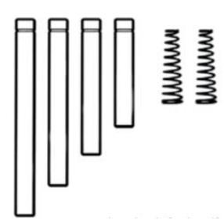
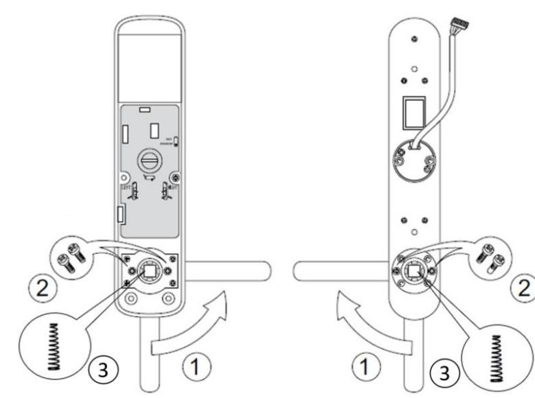
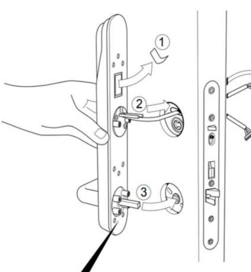
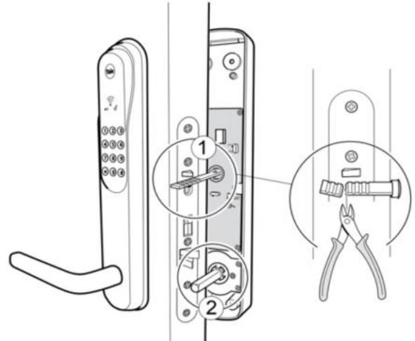

 Er förpackning har uppdaterats med lösa pinnar/pind och fjädrar/fjær till handtagen/vrider/greb för enklare anpassning till din dörr. Följ denna parallellt med sidan 16 till 21 i Installation guide.

Placera en fjäder/fjær i varje handtag/greb/vrider (3)

Insida / Innsiden / Indvendig side / Inside

Utsida / Utsiden / Udvendig side / Outside

Utsidan.

Välj den fyrkantspinne/vriderpinne/grepspinden (3) som når fram till låshuset/låskasse utan att bottna i handtaget/grep/vrider. Fjädern/ fjær håller pinnen på plats.

## Insidan.

Välj den fyrkantspinne/vriderpinne/grepspinden (2), som når fram till låshuset/låskasse utan att bottna i handtaget/grep/vrider. Fjädern/fjær håller pinnen på plats.