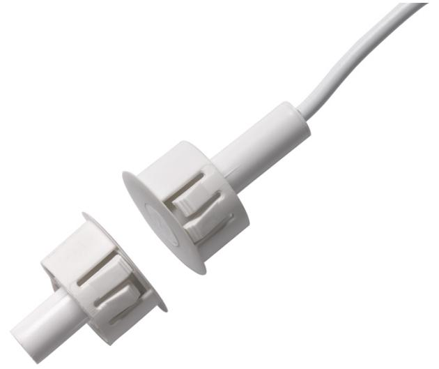

## Produktblad

# DC138S60

Infälld magnetkontakt för metalldörrar, högsäkerhetskontakt

### Högsäkerhetskontakt

DC138S60 är en högsäkerhetskontakt som uppfyller kraven på precision för öppningsavstånd, magnetens polarisation och styrka. Magnetkontakten används för att detektera öppning av till exempel dörrar, fönster eller luckor. Magnetens kapsling isolerar magneten från omgivande metall för maximalt öppningsavstånd.

#### Installation

Kontaktdelen monteras i karmen och magnetdelen i den rörliga delen, borrhål ska vara 20 mm. Vid montage ska man ta hänsyn till eventuella förändringar i olika material så att det maximala kontakavståndet inte överskrids. Anslutning sker med kabel 4- ledare.

## Standardprestanda

- EHögsäkerhetskontakt
- ESpecialdesignad för metalldörrar
- EFörsedd med sabotageslinga
- E6 m kabel

- ESBSC Larmklass 4
# DC138S60

Infälld magnetkontakt för metalldörrar, högsäkerhetskontakt

### Tekniska data

| Kontakttyp             | NC-kontakt                                                                                                                   |
|------------------------|------------------------------------------------------------------------------------------------------------------------------|
| Arbetsavstånd          | 12 mm, +/- 3 mm                                                                                                              |
| Omkopplingsspänning    | max 100 V DC                                                                                                                 |
| Kopplingsström         | max 500 mA                                                                                                                   |
| Märkdata för kontakt   | max 6 W eller 6 VA                                                                                                           |
| Kontaktresistans       | max 0.15 Ohm                                                                                                                 |
| Överslagsspänning      | > 250 V                                                                                                                      |
| Tillåten driftspänning | max. 40 V                                                                                                                    |
| Anslutningskabel       | LIYY 4 x 0.14 mm vit Koppar/tenn-pläterad; Passar för LSA IDC termineringsmetod                                           |
| Intern ledare          | Blå                                                                                                                          |
| Kabeldimensioner       | Ø 3.2 mm x 6 m                                                                                                               |
| Kontaktdimensioner     | Ø 8 x 32 mm med monteringsfläns EF 8/20 (för 20 mm borr)                                                                  |
| Magnetdimensioner      | Ø8 x 25 mm plasttätning med monteringsfläns EF 8/20 (för 20 mm borr), magnet Ø 6 x 19 mm neodymium, axialt polariserad |
| Höljesmaterial         | S-B or A-B-S                                                                                                                 |
| Färg                   | Vit                                                                                                                          |
| Temperaturomfång       | -25° till +70° C                                                                                                             |
| Miljöklass             | III, IP 67                                                                                                                   |
| Larmklass              | 4                                                                                                                            |
| SBSC                   | 10-279                                                                                                                       |

#### Order data

| Artikelnummer | Beskrivning                                                  |
|---------------|--------------------------------------------------------------|
| DC138S60      | Infälld magnetkontakt för metalldörrar, högsäkerhetskontakt  |
| DC138         | Infälld magnetkontakt för metalldörrar, högsäkerhetskontakt. |
| DC138R4.7     | Infälld magnetkontakt för metalldörrar, högsäkerhetskontakt. |
| 1096H-N-3K3   | Infälld magnetkontakt för metalldörrar, högsäkerhetskontakt. |

Reservationer för produktförändringar. För uppdatering av produktdata, gå in på www. utcfssecurityproducts.se eller kontakta din lokala UTC Fire & Security återförsäljare. DC138S60-2017-01-20 07:59:37 Released :09-DEC-15

