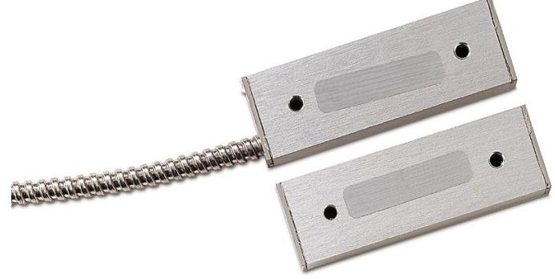

## Produktblad

# DC118

Magnetkontakt för portar – Med aluminiumkapsling, långt arbetsavstånd

### DC118 - Industrikontakt

DC118 är utformade för att monteras i kommersiella och industriella miljöer där en robust sluten enhet behövs. Den är idealiskt för metalldörrar, staket och grindar. Varje modell har en hög hållfasthet aluminiumkapsel och är helt inkapslat i en exklusiv polyuretan massa.

#### Standardprestanda

- EÖverlägsen kvalitet
- EEnkla att installera

- ETvå meters ledarlängd som standard
- EFörsedda med sabotageslinga
- EKan på beställning levereras med önskat inbyggt motstånd
- ESBSC-intygad, larmklass 1/2

# DC118

Magnetkontakt för portar – Med aluminiumkapsling, långt arbetsavstånd

### Tekniska data

| Arbetsavstånd    | 75 mm (max)                |
|------------------|----------------------------|
| Anslutning       | 2 m lång, armerad 4-ledare |
| Funktion i drift | Normalt sluten             |
| Mått             | Magnet 76x12 x 25 mm       |
|                  | Kontakt 76 x 12 x 25mm     |
| Material         | Aluminiumlegering          |
| Miljöklass       | II                         |
| Larmklass        | 3                          |

#### Order data

| Artikelnummer | Beskrivning                                                              |
|---------------|--------------------------------------------------------------------------|
| DC118         | Magnetkontakt för portar – Med aluminiumkapsling, långt arbetsavstånd |
| DC193         | Monteringsvinkel för DC 110, DC115 samt DC 118                           |

