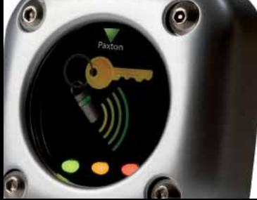
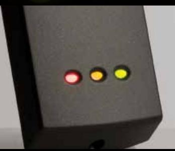
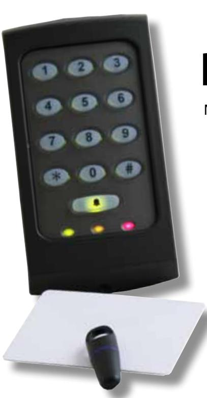

### Net2 Passersystem

# Net2 Passersystem

Net2 är ett användarvänligt och flexibelt, nätverksbaserat passersystem, utvecklat för att göra hanteringen av säkerheten i din fastighet enkel och smidig.

Enkelheten och funktionsrikedomen gör att Net2 ärså mycket mer än bara ett grundläggande passersystem för att hantera flödet av människor i och omkring en byggnad.

Med funktionersomexempelvisfastighetskontroll och systemintegration utgör Net2 en effektiv lösning för företag som vill uppnå hög säkerhet. Net2 kan användas för alla tänkbara objekt som exempelvis mindre kontor, fastigheter, industrier, lager, butiker etc.

#### Enkel hantering av systemet

- • Användarvänligt Net2 är så intuitivt att registrering av användare och utskrifter av olika rapporter kan göras utan förkunskaper.
- • Startsida denna sida kan kundanpassas så den innehåller information om installatören samt hur du som användare enkelt ska komma i kontakt med installationsföretaget.
- • Flera arbetsstationer Net2 har också en kostnadseffektiv programvara. Användare kan utan extra kostnad installera systemet i obegränsat antal PC.
- • Fria uppgraderingar programvaran köps en gång och kan sedan uppgraderas kostnadsfritt.

#### Hög säkerhet

- • Nödlåsning säkra din fastighet med en enda knapptryckning. Nödlåsning är ett effektiv funktion för att skydda känsliga byggnader
- • Tillkoppling av flera larmområden med inbrottslarm Med Net2 kan du på ett enkelt sätt tillkoppla inbrottslarm i valda områden i en byggnad. Genom att skapa områden i din anläggning får du ett system som flexibelt kan kontrolleras separat på önskat sätt.
- • Antipassback förhindrar obehöriga att dela passerkort/tag med behörig användare för att komma in i ett skyddat område. Denna funktion gör att samma kort, tag etc. inte kan användas flera gånger inom valt tidsintervall. .

#### Förenklad administration

- • Tidrapport ett värdefullt verktyg som hjälper dig att hålla reda på personalens arbetstimmar och därmed förenklar löneadministration.
- • Tidslinje ett enkelt sätt att få en snabb överblick på exempelvis flextid, sjuk- och helgdagar under året.
- • Kortdesigner använd denna applikation i programvaran för att skapa egna passerkort med professionellt utseende och design.

#### En enda knapptryckning för fastighetskontroll

- • Områden en riktigt enkel metod för att hantera grupper av dörrar i en fastighet. Uppdelning av anläggningen i valda delar gör det enklare att lägga till användare med olika behörigheter än att programmera varje dörr separat.
- • Energibesparande åtgärder programmera systemet att automatiskt stänga av elektrisk utrustning när fastigheten är tom och på så sätt reducera elräkningen.
- • Fastighetsritningar hämta in ritningar över byggnaden till Net2 för att i realtid få en översiktsbild över passagehändelser. Detta är också ett utmärkt verktyg för att övervaka dörrarna i er anläggning från en enda plats, speciellt användbar för säkerhetspersonal.

#### Mobil passerkontroll

- • Net2 Anywhere mjukvaran Net2 kan köras var som helst från valfri webläsare. Håll ett öga på er anläggning och utför eventuella ändringar från valfri plats.
- • Applikationer för iPhone passerkontroll i fickstorlek med fingertoppskänsla. Dessa mycket smidiga iPhone-applikationer innebär en revolution vad gäller att hantera ett passersystem.

#### Sofistikerad systemintegration

- • Inbrottslarm genom att integrera Net2 med ett inbrottslarm kan du enkelt styra till- och frånslag av larmanläggningen direkt vid dörren. Detta ger hög säkerhet och man kan på så vis minska antalet obefogade larm.
- • Brandlarm integrera Net2 med ert brandlarm och programmera systemet att automatiskt låsa upp nödutrymningsvägar för att få högre säkerhet vid aktiverat brand- eller utrymningslarm.
- • Nödmeddelande och uppsamling efter utrymning programmera systemet så det automatiskt skickar ut ett nödmeddelande via valt media när brandlarmet aktiverats. Det senare underlättar identifikationen av vilka som kommit i säkerhet efter evakuering.
- • CCTV sammankoppla passersystemet med en kameraanläggning för att snabbt och enkelt se vad som sker från en och samma mjukvara. Paxton Net2 passersystem har stöd för bla integrering med Exacqvision.

#### Mjukvaran i Net2 passersystem

Med flera innovativa funktioner, intelligent design och effektiv programmering har Net2 utvecklats för att förenkla det dagliga arbetet för dig som arbetar med säkerhet.

## Net2 Pro

*Den intelligenta och nyare versionen av Net2 Pro erbjuder en mängd funktioner utöver ren passerkontroll.*

Användarvänligt Flera administratörer Fria uppgraderingar Integrering med CCTV (bla Exacqvision) Integrering med inbrottslarm Integrering med brandlarm Fastighetsritningar Villkorsstyrning Kortdesign Tidrapport Tidslinje Antipassback Nödlåsning vid larmhändelse Områdesindelning Kundanpassad startsida Applikationen Net2 Anywhere Web-access iPhone-applikationer

#### **Nyckelfunktioner Net2 passersystem**

PC baserat 200 dörrmiljöer 50 000 användare Kommunikation i systemet, RS485/TCPIP Händelserapportering Skalbar och flexibel systemarkitektur Möjlighet till integrering med andra system Hanterar många olika lästeknologier Anpassat för 24V drift

Distribueras av Gullbergs Strandgata 36D

Ostmästargränd 8 120 40 ÅRSTA Tel. +46-8-602 16 00 Fax +46-8-602 16 01 www.teletec.se

411 06 GÖTEBORG Tel. +46-31-61 70 90 Fax +46-31-61 70 91 www.teletec.se

Enebakkveien 117 b NO-0680 OSLO Tel. +47 22 08 02 20 Fax +47 22 08 02 21 www.teletec.no

Vikeholm 3B DK-3730 HERLEV Tel. +45-70 23 30 50 Fax +45-69 80 45 56 www.teletec.dk

Teknobulevardi 3-5 FI-01530 VANTAA Tel. +359 40 158 5550

www.teletec.