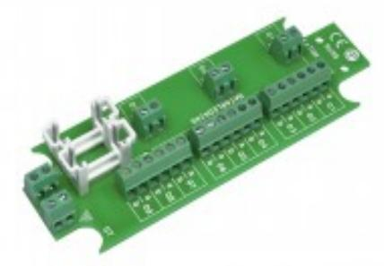
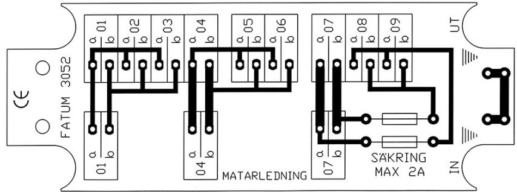

# 3052

## BUSSPLINT 3 x 1 > 3 PAR MED SÄKRINGSHÅLLARE

### **Produktdetajler:**

| Ledaranslutning - SLITS (mm) | Ø 0,4 - 0,7  |
|------------------------------|--------------|
| Ledaranslutning - SKRUV (mm) | 0,14 - 1 mm2 |
| Max. belastning - matning    | 60 V / 2 A   |
| Sabotageskyddad              | Nej          |
| Storlek (L x W)              | 116 x 40     |

#### **Bussplint för 2-trådsloop 3 x 1 > 3 ledarpar.**

Separat anslutningsplint för -

- 2x Inkommande matarkabel, Utgående matarkabel & Internanslutna spridningskablar.
Strömmatning med separat anslutningsplint för -

- Inkommande matarkabel, Utgående matarkabel & Internanslutna avsäkrade spridningskablar.
Separat anlsutningsplint för skärm. Finns i olika alternativ, slits (LSA) eller skruvanslutning med hissfunktion.

| BESTÄLLINGSINFORMATION |         |                        |  |  |  |
|------------------------|---------|------------------------|--|--|--|
| Typ                    | E-nr    | Beskrivning            |  |  |  |
| 3052.01                | 5015318 | Bussplint; Slits/Slits |  |  |  |
| 3052.03                | 5015320 | Bussplint; Skruv/Skruv |  |  |  |

## **Relaterade produkter och tillbehör:**

| 4101                                                                                   |  |
|----------------------------------------------------------------------------------------|--|
| KOPPLINGSBOX I PLAST, IP55                                                          |  |
| 4103 KOPPLINGSBOX I PLAST MED PLATS FÖR UPP TILL 3 KOPPLING SPLINTAR    |  |
| 2591.15 PLINTDISTANSER FÖR FASTSÄTTNING AV MODULPLINTAR I ÖVRIGT     |  |
| 2591.18 PLINTDISTANSER FÖR FASTSÄTTNING AV MODULPLINTAR I ÖVRIGT     |  |
| 2596.04 PLINTDISTANSER SOM KOMPLEMENT TILL ESMI- OCH ERICSSON LINJAL |  |

## **Relaterade produkter och tillbehör:**

| 3131.01 PLINTSIGNERING FÖR ENKEL MÄRKNING AV MODUL-PLINTAR |                                           |
|------------------------------------------------------------------------|-------------------------------------------|
| 0501.01                                                                | SLITSVERKTYG FÖR KRONE LSA PLUS KONTAKTER |

Powered by TCPDF (www.tcpdf.org)