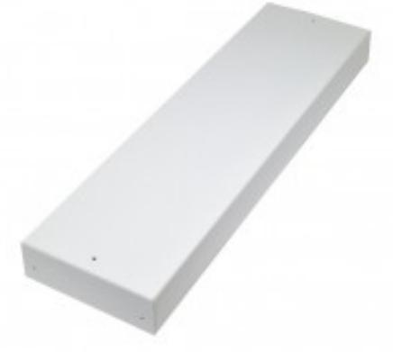
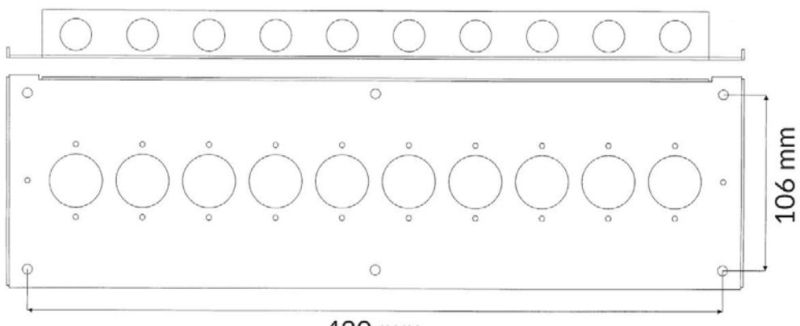

## 3210

## KOPPLINGSBOX I PLÅT MED PLATS FÖR UPP TILL 10 KOPPLINGSPLINTAR

## **Produktdetajler:**

Mått (L x B x H) mm 128 x 488 x 38

Powered by TCPDF (www.tcpdf.org)

**Tom kopplingsbox med heltäckande vitt lock eller med synlig/dold signering.** Anpassad för alla våra kopplingsplintar t.ex.

- 1-10 st Kopplingsplintar med måtten 116x40 mm (upptar 1 plats).
- 1-5 st Större kopplingsplintar med måtten 116x80 mm (upptar 2 platser).

Inkl. Distansförpackning 12,7 mm (4 st distanser, 4 st skruvar och 4 st pluggar.

| BESTÄLLINGSINFORMATION |         |                                                   |
|------------------------|---------|---------------------------------------------------|
| Typ                    | E-nr    | Beskrivning                                       |
| 3210.02                | 5015253 | Kopplingsbox plåt; 10 plint                       |
| 3210.03                | 5015267 | Kopplingsbox plåt med Signeringsöppning; 10 plint |